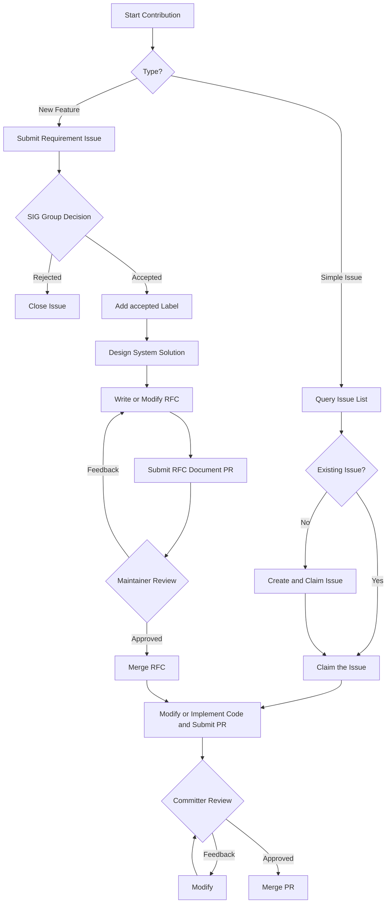

# Contribution Guide

Thank you for your interest in HCCL. We welcome developers to experience and contribute to this project. Before participating in community contributions, see the [cann-community](https://gitcode.com/cann/community) to understand the code of conduct, sign the CLA agreement, and learn about the source repository contribution process.

## Expected Contributions

- Bug fixes: Fix bugs you discover or bugs listed in the Issue list, such as logic errors, memory leaks, or crashes.
- Community tasks: Claim tasks published by the HCCL community.
- Performance optimization: Improve performance for specific operators or architectures.
- New feature support: Add framework features, new operators, or support for new business scenarios.
- Documentation improvements: Improve documentation, comments, or usage examples.

## Prerequisites

### Coding Standards

Follow the [CANN Community Coding Standards](https://gitcode.com/cann/community/tree/master/contributor/coding-standards).

### PR Standards

1. When submitting a PR, fill in the business background, purpose, solution, and other information carefully according to the PR template.
2. **All PRs must be associated with an Issue**. Reference the corresponding Issue number in the PR description.
3. Before committing code with Git, refer to the [pre-commit tool guide](./docs/en/build/pre-commit-guide.md) to maintain consistent code style and compliance.
4. If your modification involves new features, operators, algorithms, interfaces, configuration parameters, or code flow changes (rather than simple issue fixes), discuss the solution through an Issue first to avoid rejection. If you are unsure whether your modification qualifies as a simple issue fix, submit an Issue for discussion.

### Contribution Directory

Community contributions such as new operators, algorithms, or extended features must be submitted to the `experimental/` directory, following these policies:

- In principle, **avoid modifying** any files under `src/` as much as possible to prevent polluting stable code.
- If modifications to `src/` are necessary, explicitly state the reason and impact scope in the PR description and obtain Committer review.
- Code changes in a PR should focus on the `experimental/` directory.
- Provide a runtime switch for quick rollback. For details, see [experimental/README.md](./experimental/README_en.md).

## Contribution Process

Contributions fall into two categories:

- Simple issue fixes: Bug fixes, simple code changes, documentation changes, and so on.
- New features or capabilities: Adding new features, operators, algorithms, interfaces, or supporting new business scenarios.

**Overall Process**

### Simple Issue Fixes

1. Query and claim an Issue

   - Search the Issue list to find whether a corresponding Issue exists.
   - **If a corresponding Issue exists**: Claim the Issue directly.
   - **If no corresponding Issue exists**: Create a new Issue and claim it.

2. Modify code and submit a PR

   - Meet the coding standards and PR standards.
   - Include regression tests that trigger the bug.

3. Code review and merge

   - The Committer responsible for the corresponding module or component reviews the code and provides feedback. Modify the code based on the feedback. After all issues are resolved, add the `/lgtm` and `/approve` labels and merge.

### Adding New Features or Capabilities

1. Submit a Requirement Issue

   - Submit a Requirement-type Issue in the repository.
   - Provide a detailed description including the usage scenario, business value, and technical approach.
   - Start a discussion in the community. The SIG group decides whether to accept the requirement. If accepted, add the `accepted` label.

2. Submit a number-claiming PR

   - After the requirement is accepted, add a placeholder row in the [RFC Number Registry](./docs/en/rfcs/INDEX.md) following the smallest unused number rule, with the status set to `reserved`.
   - Submit a **number-claiming PR** (containing only one line update in INDEX.md). After the number-claiming PR is merged, the number is available for use.

3. System solution design

   - Create a markdown RFC document in the `docs/en/rfcs` directory (the filename must start with the registered number) and write the system solution following the [RFC template](./docs/en/rfcs/0000-template.md).
   - Submit an **RFC document PR**.

4. System solution review

   - Review the detailed design solution through the RFC document PR.
   - Modify the solution based on review feedback.

5. RFC merge

   - After all Maintainers have no objections, the Maintainer adds the `/lgtm` and `/approve` labels to merge.
   - The merged RFC solution serves as the contract for subsequent code implementation. Code implementation must follow the RFC solution.
   - After the RFC document PR is merged, update the corresponding row status in the [RFC Number Registry](./docs/en/rfcs/INDEX.md) from `reserved` to `accepted`.

6. Software implementation

   - Implement the code according to the RFC solution and submit a PR.
   - Include corresponding test code (including unit tests and system tests).

7. Code review and merge

   - The Committer responsible for the corresponding module or component reviews the code and provides feedback. Modify the code based on the feedback. After all issues are resolved, add the `/lgtm` and `/approve` labels and merge.

---

## Dispute Resolution

Disputed Issues, PRs, or RFCs can be submitted as agenda items at the [SIG Working Meeting](https://etherpad-cann.meeting.osinfra.cn/p/sig-hccl) for the SIG group to decide.

*This document is maintained by the community. For change suggestions, submit an Issue.*
