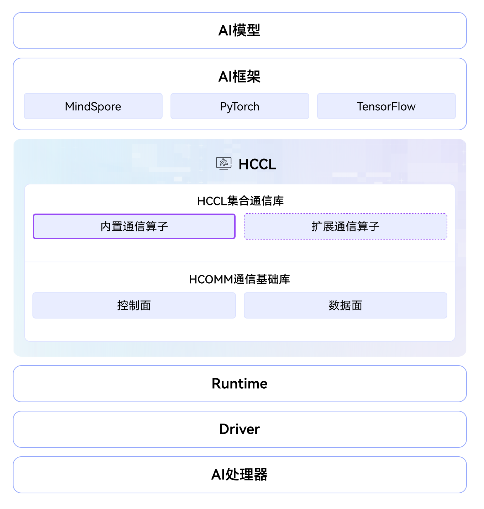

# HCCL

## 🔥Latest News

- [2025/11/30] HCCL项目正式开源。

## 🚀 概述

集合通信库（Huawei Collective Communication Library，简称HCCL）是基于昇腾AI处理器的高性能集合通信库，为计算集群提供高性能、高可靠的通信方案，具备以下核心功能：

- 提供单机、多机环境中的高性能集合通信和点对点通信。
- 支持AllReduce、Broadcast、AllGather、ReduceScatter、AlltoAll等集合通信原语。
- 支持Ring、Mesh、Recursive Halving-Doubling（RHD）等通信算法。
- 支持HCCS、RoCE、PCIe等高速通信链路。
- 支持单算子和图模式两种执行模式。

HCCL是CANN的核心组件，对上支持多种AI框架，对下使能多款昇腾AI处理器之间的通信能力，其软件架构如下图所示：



HCCL包含HCCL集合通信库与HCOMM（Huawei Communication）通信基础库：

- HCCL集合通信库：包含内置通信算子和扩展通信算子，提供对外的通信算子接口。
- [HCOMM通信基础库](https://gitcode.com/cann/hcomm)：采用分层解耦的设计思路，将通信能力划分为控制面和数据面两部分。

## 🔍 目录结构说明

本项目关键目录如下所示：

```
│── src                     # HCCL算子源码目录
|    ├── common             # 通用逻辑，包括类型定义、日志模块等
|    └── ops                # HCCL算子实现
|        ├── aicpu          # 通信算子Aicpu Kernel通用处理流程
|        ├── channel        # 通信通道Channel资源计算
|        ├── inc            # 头文件目录
|        ├── interface      # 通信算子接口
|        ├── registry       # 通信算法注册机制，支持模板化算法注册
|        ├── scatter        # Scatter算子实现
|        └── topo           # 通信域拓扑信息获取和转换
├── include                 # HCCL对外头文件
├── test                    # 测试代码目录
|   ├── ut                  # 单元测试代码目录
|   └── st                  # 系统测试代码目录
├── docs                    # 资料文档目录
├── examples                # 样例代码目录
└── build.sh                # 编译构建脚本
```

## ⚡️ 快速开始

若您希望快速构建并体验本项目，请访问如下简易指南。

- [源码构建](./docs/build.md)：了解如何编译、安装本项目，并进行基础测试验证。
- [样例执行](./examples/README.md)：参照详细的示例代码与操作步骤指引，快速体验。

## 📖 学习教程

HCCL提供了使用指南、通信算子开发指南、技术文章、培训视频，详细可参见 [HCCL 参考资料](./docs/README.md)。

## 📝 相关信息

- [贡献指南](CONTRIBUTING.md)
- [安全声明](SECURITY.md)
- [许可证](LICENSE)
