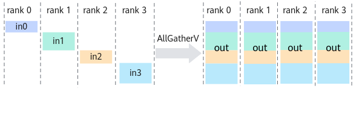

# HcclAllGatherV<a name="ZH-CN_TOPIC_0000002486992304"></a>

## 产品支持情况<a name="zh-cn_topic_0000002139400230_section10594071513"></a>

<a name="zh-cn_topic_0000002139400230_table38301303189"></a>
<table><thead align="left"><tr id="zh-cn_topic_0000002139400230_row20831180131817"><th class="cellrowborder" valign="top" width="57.99999999999999%" id="mcps1.1.3.1.1"><p id="zh-cn_topic_0000002139400230_p1883113061818"><a name="zh-cn_topic_0000002139400230_p1883113061818"></a><a name="zh-cn_topic_0000002139400230_p1883113061818"></a><span id="zh-cn_topic_0000002139400230_ph20833205312295"><a name="zh-cn_topic_0000002139400230_ph20833205312295"></a><a name="zh-cn_topic_0000002139400230_ph20833205312295"></a>产品</span></p>
</th>
<th class="cellrowborder" align="center" valign="top" width="42%" id="mcps1.1.3.1.2"><p id="zh-cn_topic_0000002139400230_p783113012187"><a name="zh-cn_topic_0000002139400230_p783113012187"></a><a name="zh-cn_topic_0000002139400230_p783113012187"></a>是否支持</p>
</th>
</tr>
</thead>
<tbody><tr id="zh-cn_topic_0000002139400230_row220181016240"><td class="cellrowborder" valign="top" width="57.99999999999999%" headers="mcps1.1.3.1.1 "><p id="zh-cn_topic_0000002139400230_p48327011813"><a name="zh-cn_topic_0000002139400230_p48327011813"></a><a name="zh-cn_topic_0000002139400230_p48327011813"></a><span id="zh-cn_topic_0000002139400230_ph583230201815"><a name="zh-cn_topic_0000002139400230_ph583230201815"></a><a name="zh-cn_topic_0000002139400230_ph583230201815"></a><term id="zh-cn_topic_0000002139400230_zh-cn_topic_0000001312391781_term1253731311225"><a name="zh-cn_topic_0000002139400230_zh-cn_topic_0000001312391781_term1253731311225"></a><a name="zh-cn_topic_0000002139400230_zh-cn_topic_0000001312391781_term1253731311225"></a>Atlas A3 训练系列产品/Atlas A3 推理系列产品</term></span></p>
</td>
<td class="cellrowborder" align="center" valign="top" width="42%" headers="mcps1.1.3.1.2 "><p id="zh-cn_topic_0000002139400230_p7948163910184"><a name="zh-cn_topic_0000002139400230_p7948163910184"></a><a name="zh-cn_topic_0000002139400230_p7948163910184"></a>√</p>
</td>
</tr>
<tr id="zh-cn_topic_0000002139400230_row173226882415"><td class="cellrowborder" valign="top" width="57.99999999999999%" headers="mcps1.1.3.1.1 "><p id="zh-cn_topic_0000002139400230_p14832120181815"><a name="zh-cn_topic_0000002139400230_p14832120181815"></a><a name="zh-cn_topic_0000002139400230_p14832120181815"></a><span id="zh-cn_topic_0000002139400230_ph1292674871116"><a name="zh-cn_topic_0000002139400230_ph1292674871116"></a><a name="zh-cn_topic_0000002139400230_ph1292674871116"></a><term id="zh-cn_topic_0000002139400230_zh-cn_topic_0000001312391781_term11962195213215"><a name="zh-cn_topic_0000002139400230_zh-cn_topic_0000001312391781_term11962195213215"></a><a name="zh-cn_topic_0000002139400230_zh-cn_topic_0000001312391781_term11962195213215"></a>Atlas A2 训练系列产品/Atlas A2 推理系列产品</term></span></p>
</td>
<td class="cellrowborder" align="center" valign="top" width="42%" headers="mcps1.1.3.1.2 "><p id="zh-cn_topic_0000002139400230_p19948143911820"><a name="zh-cn_topic_0000002139400230_p19948143911820"></a><a name="zh-cn_topic_0000002139400230_p19948143911820"></a>√</p>
</td>
</tr>
</tbody>
</table>

> [!NOTE]说明 
> 针对Atlas A2 训练系列产品/Atlas A2 推理系列产品，仅支持Atlas 800T A2 训练服务器、Atlas 900 A2 PoD 集群基础单元、Atlas 200T A2 Box16 异构子框。

## 功能说明<a name="zh-cn_topic_0000002139400230_section59721402"></a>

集合通信算子AllGatherV的操作接口，将通信域内所有节点的输入按照rank id重新排序，然后拼接起来，再将结果发送到所有节点的输出。

与AllGather算子不同的是，AllGatherV算子支持通信域内不同节点的输入配置不同大小的数据量。



> [!NOTE]说明
> 针对AllGatherV操作，每个节点都接收按照rank id重新排序后的数据集合，即每个节点的AllGatherV输出都是一样的。

## 函数原型<a name="zh-cn_topic_0000002139400230_section66288034"></a>

```
HcclResult HcclAllGatherV(void *sendBuf, uint64_t sendCount, void *recvBuf, const void *recvCounts, const void *recvDispls, HcclDataType dataType, HcclComm comm, aclrtStream stream)
```

## 参数说明<a name="zh-cn_topic_0000002139400230_section621706"></a>

<a name="zh-cn_topic_0000002139400230_table51170717"></a>
<table><thead align="left"><tr id="zh-cn_topic_0000002139400230_row27848947"><th class="cellrowborder" valign="top" width="20.200000000000003%" id="mcps1.1.4.1.1"><p id="zh-cn_topic_0000002139400230_p41172271"><a name="zh-cn_topic_0000002139400230_p41172271"></a><a name="zh-cn_topic_0000002139400230_p41172271"></a>参数名</p>
</th>
<th class="cellrowborder" valign="top" width="17.169999999999998%" id="mcps1.1.4.1.2"><p id="zh-cn_topic_0000002139400230_p46619622"><a name="zh-cn_topic_0000002139400230_p46619622"></a><a name="zh-cn_topic_0000002139400230_p46619622"></a>输入/输出</p>
</th>
<th class="cellrowborder" valign="top" width="62.629999999999995%" id="mcps1.1.4.1.3"><p id="zh-cn_topic_0000002139400230_p18093058"><a name="zh-cn_topic_0000002139400230_p18093058"></a><a name="zh-cn_topic_0000002139400230_p18093058"></a>描述</p>
</th>
</tr>
</thead>
<tbody><tr id="zh-cn_topic_0000002139400230_row56251627"><td class="cellrowborder" valign="top" width="20.200000000000003%" headers="mcps1.1.4.1.1 "><p id="zh-cn_topic_0000002139400230_p60087944"><a name="zh-cn_topic_0000002139400230_p60087944"></a><a name="zh-cn_topic_0000002139400230_p60087944"></a>sendBuf</p>
</td>
<td class="cellrowborder" valign="top" width="17.169999999999998%" headers="mcps1.1.4.1.2 "><p id="zh-cn_topic_0000002139400230_p35285314"><a name="zh-cn_topic_0000002139400230_p35285314"></a><a name="zh-cn_topic_0000002139400230_p35285314"></a>输入</p>
</td>
<td class="cellrowborder" valign="top" width="62.629999999999995%" headers="mcps1.1.4.1.3 "><p id="zh-cn_topic_0000002139400230_p39538176"><a name="zh-cn_topic_0000002139400230_p39538176"></a><a name="zh-cn_topic_0000002139400230_p39538176"></a>源数据buffer地址。</p>
</td>
</tr>
<tr id="zh-cn_topic_0000002139400230_row17762502"><td class="cellrowborder" valign="top" width="20.200000000000003%" headers="mcps1.1.4.1.1 "><p id="zh-cn_topic_0000002139400230_p29476530"><a name="zh-cn_topic_0000002139400230_p29476530"></a><a name="zh-cn_topic_0000002139400230_p29476530"></a>sendCount</p>
</td>
<td class="cellrowborder" valign="top" width="17.169999999999998%" headers="mcps1.1.4.1.2 "><p id="zh-cn_topic_0000002139400230_p38788755"><a name="zh-cn_topic_0000002139400230_p38788755"></a><a name="zh-cn_topic_0000002139400230_p38788755"></a>输入</p>
</td>
<td class="cellrowborder" valign="top" width="62.629999999999995%" headers="mcps1.1.4.1.3 "><p id="zh-cn_topic_0000002139400230_p4564121932310"><a name="zh-cn_topic_0000002139400230_p4564121932310"></a><a name="zh-cn_topic_0000002139400230_p4564121932310"></a>参与AllGatherV操作的sendBuf的数据size。</p>
</td>
</tr>
<tr id="zh-cn_topic_0000002139400230_row104115316273"><td class="cellrowborder" valign="top" width="20.200000000000003%" headers="mcps1.1.4.1.1 "><p id="zh-cn_topic_0000002139400230_p33628036"><a name="zh-cn_topic_0000002139400230_p33628036"></a><a name="zh-cn_topic_0000002139400230_p33628036"></a>recvBuf</p>
</td>
<td class="cellrowborder" valign="top" width="17.169999999999998%" headers="mcps1.1.4.1.2 "><p id="zh-cn_topic_0000002139400230_p39516413"><a name="zh-cn_topic_0000002139400230_p39516413"></a><a name="zh-cn_topic_0000002139400230_p39516413"></a>输出</p>
</td>
<td class="cellrowborder" valign="top" width="62.629999999999995%" headers="mcps1.1.4.1.3 "><p id="zh-cn_topic_0000002139400230_p46712854"><a name="zh-cn_topic_0000002139400230_p46712854"></a><a name="zh-cn_topic_0000002139400230_p46712854"></a>目的数据buffer地址，集合通信结果输出至此buffer中。</p>
</td>
</tr>
<tr id="zh-cn_topic_0000002139400230_row191691533142715"><td class="cellrowborder" valign="top" width="20.200000000000003%" headers="mcps1.1.4.1.1 "><p id="zh-cn_topic_0000002139400230_p91694339272"><a name="zh-cn_topic_0000002139400230_p91694339272"></a><a name="zh-cn_topic_0000002139400230_p91694339272"></a>recvCounts</p>
</td>
<td class="cellrowborder" valign="top" width="17.169999999999998%" headers="mcps1.1.4.1.2 "><p id="zh-cn_topic_0000002139400230_p151692333273"><a name="zh-cn_topic_0000002139400230_p151692333273"></a><a name="zh-cn_topic_0000002139400230_p151692333273"></a>输出</p>
</td>
<td class="cellrowborder" valign="top" width="62.629999999999995%" headers="mcps1.1.4.1.3 "><p id="zh-cn_topic_0000002139400230_p834451310267"><a name="zh-cn_topic_0000002139400230_p834451310267"></a><a name="zh-cn_topic_0000002139400230_p834451310267"></a>参与AllGatherV操作的每个rank在recvBuf中的数据size，为uint64类型的数组。</p>
<p id="zh-cn_topic_0000002139400230_p201691033122720"><a name="zh-cn_topic_0000002139400230_p201691033122720"></a><a name="zh-cn_topic_0000002139400230_p201691033122720"></a>该数组的第i个元素表示需要从rank i接收的数据量，且该数据量需要与rank i的sendCount值相同。</p>
</td>
</tr>
<tr id="zh-cn_topic_0000002139400230_row1510102214287"><td class="cellrowborder" valign="top" width="20.200000000000003%" headers="mcps1.1.4.1.1 "><p id="zh-cn_topic_0000002139400230_p1951014222284"><a name="zh-cn_topic_0000002139400230_p1951014222284"></a><a name="zh-cn_topic_0000002139400230_p1951014222284"></a>recvDispls</p>
</td>
<td class="cellrowborder" valign="top" width="17.169999999999998%" headers="mcps1.1.4.1.2 "><p id="zh-cn_topic_0000002139400230_p12510162232820"><a name="zh-cn_topic_0000002139400230_p12510162232820"></a><a name="zh-cn_topic_0000002139400230_p12510162232820"></a>输出</p>
</td>
<td class="cellrowborder" valign="top" width="62.629999999999995%" headers="mcps1.1.4.1.3 "><p id="zh-cn_topic_0000002139400230_p1631164584317"><a name="zh-cn_topic_0000002139400230_p1631164584317"></a><a name="zh-cn_topic_0000002139400230_p1631164584317"></a>参与AllGatherV操作的每个rank的数据在recvBuf中的偏移量（单位为dataType），为uint64类型的数组。</p>
<p id="zh-cn_topic_0000002139400230_p136693624615"><a name="zh-cn_topic_0000002139400230_p136693624615"></a><a name="zh-cn_topic_0000002139400230_p136693624615"></a>该数组的第i个元素表示从rank i接收的数据应该放置在recvBuf中的起始偏移量。</p>
</td>
</tr>
<tr id="zh-cn_topic_0000002139400230_row24171358"><td class="cellrowborder" valign="top" width="20.200000000000003%" headers="mcps1.1.4.1.1 "><p id="zh-cn_topic_0000002139400230_p11722994"><a name="zh-cn_topic_0000002139400230_p11722994"></a><a name="zh-cn_topic_0000002139400230_p11722994"></a>dataType</p>
</td>
<td class="cellrowborder" valign="top" width="17.169999999999998%" headers="mcps1.1.4.1.2 "><p id="zh-cn_topic_0000002139400230_p10038421"><a name="zh-cn_topic_0000002139400230_p10038421"></a><a name="zh-cn_topic_0000002139400230_p10038421"></a>输入</p>
</td>
<td class="cellrowborder" valign="top" width="62.629999999999995%" headers="mcps1.1.4.1.3 "><p id="zh-cn_topic_0000002139400230_p51201049151217"><a name="zh-cn_topic_0000002139400230_p51201049151217"></a><a name="zh-cn_topic_0000002139400230_p51201049151217"></a>AllGatherV操作的数据类型，<a href="HcclDataType.md#ZH-CN_TOPIC_0000002486992310">HcclDataType</a>类型。</p>
<p id="zh-cn_topic_0000002139400230_p578154617218"><a name="zh-cn_topic_0000002139400230_p578154617218"></a><a name="zh-cn_topic_0000002139400230_p578154617218"></a> 针对<span id="zh-cn_topic_0000002139400230_ph15590543154217"><a name="zh-cn_topic_0000002139400230_ph15590543154217"></a><a name="zh-cn_topic_0000002139400230_ph15590543154217"></a><term id="zh-cn_topic_0000002139400230_zh-cn_topic_0000001312391781_term1253731311225_1"><a name="zh-cn_topic_0000002139400230_zh-cn_topic_0000001312391781_term1253731311225_1"></a><a name="zh-cn_topic_0000002139400230_zh-cn_topic_0000001312391781_term1253731311225_1"></a>Atlas A3 训练系列产品/Atlas A3 推理系列产品</term></span>，支持数据类型：int8、uint8、int16、uint16、int32、uint32、int64、uint64、float16、float32、float64、bfp16。</p>
<p id="zh-cn_topic_0000002139400230_p94179211177"><a name="zh-cn_topic_0000002139400230_p94179211177"></a><a name="zh-cn_topic_0000002139400230_p94179211177"></a> 针对<span id="zh-cn_topic_0000002139400230_ph14880920154918"><a name="zh-cn_topic_0000002139400230_ph14880920154918"></a><a name="zh-cn_topic_0000002139400230_ph14880920154918"></a><term id="zh-cn_topic_0000002139400230_zh-cn_topic_0000001312391781_term16184138172215"><a name="zh-cn_topic_0000002139400230_zh-cn_topic_0000001312391781_term16184138172215"></a><a name="zh-cn_topic_0000002139400230_zh-cn_topic_0000001312391781_term16184138172215"></a>Atlas A2 训练系列产品/Atlas A2 推理系列产品</term></span>，支持数据类型：int8、uint8、int16、uint16、int32、uint32、int64、uint64、float16、float32、float64、bfp16。</p>
</td>
</tr>
<tr id="zh-cn_topic_0000002139400230_row3143429"><td class="cellrowborder" valign="top" width="20.200000000000003%" headers="mcps1.1.4.1.1 "><p id="zh-cn_topic_0000002139400230_p53291177"><a name="zh-cn_topic_0000002139400230_p53291177"></a><a name="zh-cn_topic_0000002139400230_p53291177"></a>comm</p>
</td>
<td class="cellrowborder" valign="top" width="17.169999999999998%" headers="mcps1.1.4.1.2 "><p id="zh-cn_topic_0000002139400230_p21618074"><a name="zh-cn_topic_0000002139400230_p21618074"></a><a name="zh-cn_topic_0000002139400230_p21618074"></a>输入</p>
</td>
<td class="cellrowborder" valign="top" width="62.629999999999995%" headers="mcps1.1.4.1.3 "><p id="zh-cn_topic_0000002139400230_p6233535"><a name="zh-cn_topic_0000002139400230_p6233535"></a><a name="zh-cn_topic_0000002139400230_p6233535"></a>集合通信操作所在的通信域。</p>
</td>
</tr>
<tr id="zh-cn_topic_0000002139400230_row56101816"><td class="cellrowborder" valign="top" width="20.200000000000003%" headers="mcps1.1.4.1.1 "><p id="zh-cn_topic_0000002139400230_p47953287"><a name="zh-cn_topic_0000002139400230_p47953287"></a><a name="zh-cn_topic_0000002139400230_p47953287"></a>stream</p>
</td>
<td class="cellrowborder" valign="top" width="17.169999999999998%" headers="mcps1.1.4.1.2 "><p id="zh-cn_topic_0000002139400230_p59011071"><a name="zh-cn_topic_0000002139400230_p59011071"></a><a name="zh-cn_topic_0000002139400230_p59011071"></a>输入</p>
</td>
<td class="cellrowborder" valign="top" width="62.629999999999995%" headers="mcps1.1.4.1.3 "><p id="zh-cn_topic_0000002139400230_p15167431"><a name="zh-cn_topic_0000002139400230_p15167431"></a><a name="zh-cn_topic_0000002139400230_p15167431"></a>本rank所使用的stream。</p>
</td>
</tr>
</tbody>
</table>

## 返回值<a name="zh-cn_topic_0000002139400230_section5595356"></a>

[HcclResult](HcclResult.md#ZH-CN_TOPIC_0000002519072193)：接口成功返回HCCL\_SUCCESS，其他失败。

## 约束说明<a name="zh-cn_topic_0000002139400230_section50358210"></a>

-   所有rank的recvCounts、recvDispls、dataType均应相同。
-   针对Atlas A3 训练系列产品/Atlas A3 推理系列产品，仅支持单Server场景。
-   针对Atlas A2 训练系列产品/Atlas A2 推理系列产品，仅支持多机对称分布场景，不支持非对称分布（即卡数非对称）的场景。

