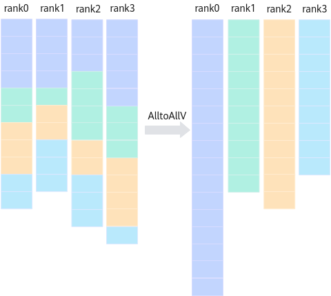

# HcclAlltoAllV<a name="ZH-CN_TOPIC_0000002518992199"></a>

## 产品支持情况<a name="zh-cn_topic_0000001414203165_section10594071513"></a>

<a name="zh-cn_topic_0000001414203165_table38301303189"></a>
<table><thead align="left"><tr id="zh-cn_topic_0000001414203165_row20831180131817"><th class="cellrowborder" valign="top" width="57.99999999999999%" id="mcps1.1.3.1.1"><p id="zh-cn_topic_0000001414203165_p1883113061818"><a name="zh-cn_topic_0000001414203165_p1883113061818"></a><a name="zh-cn_topic_0000001414203165_p1883113061818"></a><span id="zh-cn_topic_0000001414203165_ph20833205312295"><a name="zh-cn_topic_0000001414203165_ph20833205312295"></a><a name="zh-cn_topic_0000001414203165_ph20833205312295"></a>产品</span></p>
</th>
<th class="cellrowborder" align="center" valign="top" width="42%" id="mcps1.1.3.1.2"><p id="zh-cn_topic_0000001414203165_p783113012187"><a name="zh-cn_topic_0000001414203165_p783113012187"></a><a name="zh-cn_topic_0000001414203165_p783113012187"></a>是否支持</p>
</th>
</tr>
</thead>
<tbody><tr id="zh-cn_topic_0000001414203165_row220181016240"><td class="cellrowborder" valign="top" width="57.99999999999999%" headers="mcps1.1.3.1.1 "><p id="zh-cn_topic_0000001414203165_p48327011813"><a name="zh-cn_topic_0000001414203165_p48327011813"></a><a name="zh-cn_topic_0000001414203165_p48327011813"></a><span id="zh-cn_topic_0000001414203165_ph583230201815"><a name="zh-cn_topic_0000001414203165_ph583230201815"></a><a name="zh-cn_topic_0000001414203165_ph583230201815"></a><term id="zh-cn_topic_0000001414203165_zh-cn_topic_0000001312391781_term1253731311225"><a name="zh-cn_topic_0000001414203165_zh-cn_topic_0000001312391781_term1253731311225"></a><a name="zh-cn_topic_0000001414203165_zh-cn_topic_0000001312391781_term1253731311225"></a>Atlas A3 训练系列产品/Atlas A3 推理系列产品</term></span></p>
</td>
<td class="cellrowborder" align="center" valign="top" width="42%" headers="mcps1.1.3.1.2 "><p id="zh-cn_topic_0000001414203165_p7948163910184"><a name="zh-cn_topic_0000001414203165_p7948163910184"></a><a name="zh-cn_topic_0000001414203165_p7948163910184"></a>√</p>
</td>
</tr>
<tr id="zh-cn_topic_0000001414203165_row173226882415"><td class="cellrowborder" valign="top" width="57.99999999999999%" headers="mcps1.1.3.1.1 "><p id="zh-cn_topic_0000001414203165_p14832120181815"><a name="zh-cn_topic_0000001414203165_p14832120181815"></a><a name="zh-cn_topic_0000001414203165_p14832120181815"></a><span id="zh-cn_topic_0000001414203165_ph1292674871116"><a name="zh-cn_topic_0000001414203165_ph1292674871116"></a><a name="zh-cn_topic_0000001414203165_ph1292674871116"></a><term id="zh-cn_topic_0000001414203165_zh-cn_topic_0000001312391781_term11962195213215"><a name="zh-cn_topic_0000001414203165_zh-cn_topic_0000001312391781_term11962195213215"></a><a name="zh-cn_topic_0000001414203165_zh-cn_topic_0000001312391781_term11962195213215"></a>Atlas A2 训练系列产品/Atlas A2 推理系列产品</term></span></p>
</td>
<td class="cellrowborder" align="center" valign="top" width="42%" headers="mcps1.1.3.1.2 "><p id="zh-cn_topic_0000001414203165_p19948143911820"><a name="zh-cn_topic_0000001414203165_p19948143911820"></a><a name="zh-cn_topic_0000001414203165_p19948143911820"></a>√</p>
</td>
</tr>
</tbody>
</table>

> [!NOTE]说明 
> 针对Atlas A2 训练系列产品/Atlas A2 推理系列产品，仅支持Atlas 800T A2 训练服务器、Atlas 900 A2 PoD 集群基础单元、Atlas 200T A2 Box16 异构子框。

## 功能说明<a name="zh-cn_topic_0000001414203165_section37208511199"></a>

集合通信算子AlltoAllV操作接口，向通信域内所有rank发送数据（数据量可以定制），并从所有rank接收数据。



## 函数原型<a name="zh-cn_topic_0000001414203165_section35919731916"></a>

```
HcclResult HcclAlltoAllV(const void *sendBuf, const void *sendCounts, const void *sdispls, HcclDataType sendType, const void *recvBuf, const void *recvCounts, const void *rdispls, HcclDataType recvType, HcclComm comm, aclrtStream stream)
```

## 参数说明<a name="zh-cn_topic_0000001414203165_section2586134311199"></a>

<a name="zh-cn_topic_0000001414203165_table0576473316"></a>
<table><thead align="left"><tr id="zh-cn_topic_0000001414203165_row1060511716320"><th class="cellrowborder" valign="top" width="20.18%" id="mcps1.1.4.1.1"><p id="zh-cn_topic_0000001414203165_p146051071139"><a name="zh-cn_topic_0000001414203165_p146051071139"></a><a name="zh-cn_topic_0000001414203165_p146051071139"></a>参数名</p>
</th>
<th class="cellrowborder" valign="top" width="17.169999999999998%" id="mcps1.1.4.1.2"><p id="zh-cn_topic_0000001414203165_p1160527939"><a name="zh-cn_topic_0000001414203165_p1160527939"></a><a name="zh-cn_topic_0000001414203165_p1160527939"></a>输入/输出</p>
</th>
<th class="cellrowborder" valign="top" width="62.64999999999999%" id="mcps1.1.4.1.3"><p id="zh-cn_topic_0000001414203165_p86058714320"><a name="zh-cn_topic_0000001414203165_p86058714320"></a><a name="zh-cn_topic_0000001414203165_p86058714320"></a>描述</p>
</th>
</tr>
</thead>
<tbody><tr id="zh-cn_topic_0000001414203165_row166054719318"><td class="cellrowborder" valign="top" width="20.18%" headers="mcps1.1.4.1.1 "><p id="zh-cn_topic_0000001414203165_p111231019101719"><a name="zh-cn_topic_0000001414203165_p111231019101719"></a><a name="zh-cn_topic_0000001414203165_p111231019101719"></a>sendBuf</p>
</td>
<td class="cellrowborder" valign="top" width="17.169999999999998%" headers="mcps1.1.4.1.2 "><p id="zh-cn_topic_0000001414203165_p51231519111711"><a name="zh-cn_topic_0000001414203165_p51231519111711"></a><a name="zh-cn_topic_0000001414203165_p51231519111711"></a>输入</p>
</td>
<td class="cellrowborder" valign="top" width="62.64999999999999%" headers="mcps1.1.4.1.3 "><p id="zh-cn_topic_0000001414203165_p612301916172"><a name="zh-cn_topic_0000001414203165_p612301916172"></a><a name="zh-cn_topic_0000001414203165_p612301916172"></a>源数据buffer地址。</p>
</td>
</tr>
<tr id="zh-cn_topic_0000001414203165_row460577337"><td class="cellrowborder" valign="top" width="20.18%" headers="mcps1.1.4.1.1 "><p id="zh-cn_topic_0000001414203165_p412311914178"><a name="zh-cn_topic_0000001414203165_p412311914178"></a><a name="zh-cn_topic_0000001414203165_p412311914178"></a>sendCounts</p>
</td>
<td class="cellrowborder" valign="top" width="17.169999999999998%" headers="mcps1.1.4.1.2 "><p id="zh-cn_topic_0000001414203165_p01231219171717"><a name="zh-cn_topic_0000001414203165_p01231219171717"></a><a name="zh-cn_topic_0000001414203165_p01231219171717"></a>输入</p>
</td>
<td class="cellrowborder" valign="top" width="62.64999999999999%" headers="mcps1.1.4.1.3 "><p id="zh-cn_topic_0000001414203165_p5123171961713"><a name="zh-cn_topic_0000001414203165_p5123171961713"></a><a name="zh-cn_topic_0000001414203165_p5123171961713"></a>表示发送数据量的uint64数组，“sendCounts[i] = n”表示本rank发给rank i的数据量为n。</p>
<p id="zh-cn_topic_0000001414203165_p344615482213"><a name="zh-cn_topic_0000001414203165_p344615482213"></a><a name="zh-cn_topic_0000001414203165_p344615482213"></a>例如，若“sendType”为float32，“sendCounts[i] = n”表示本rank发给rank i n个float32数据。</p>
</td>
</tr>
<tr id="zh-cn_topic_0000001414203165_row156051072036"><td class="cellrowborder" valign="top" width="20.18%" headers="mcps1.1.4.1.1 "><p id="zh-cn_topic_0000001414203165_p141232019171715"><a name="zh-cn_topic_0000001414203165_p141232019171715"></a><a name="zh-cn_topic_0000001414203165_p141232019171715"></a>sdispls</p>
</td>
<td class="cellrowborder" valign="top" width="17.169999999999998%" headers="mcps1.1.4.1.2 "><p id="zh-cn_topic_0000001414203165_p912413193178"><a name="zh-cn_topic_0000001414203165_p912413193178"></a><a name="zh-cn_topic_0000001414203165_p912413193178"></a>输入</p>
</td>
<td class="cellrowborder" valign="top" width="62.64999999999999%" headers="mcps1.1.4.1.3 "><p id="zh-cn_topic_0000001414203165_p11241919151718"><a name="zh-cn_topic_0000001414203165_p11241919151718"></a><a name="zh-cn_topic_0000001414203165_p11241919151718"></a>表示发送偏移量的uint64数组，“sdispls[i] = n”表示本rank发给rank i的数据在sendBuf的起始位置相对sendBuf的偏移量，以sendType为基本单位。</p>
</td>
</tr>
<tr id="zh-cn_topic_0000001414203165_row206057717312"><td class="cellrowborder" valign="top" width="20.18%" headers="mcps1.1.4.1.1 "><p id="zh-cn_topic_0000001414203165_p81241419101717"><a name="zh-cn_topic_0000001414203165_p81241419101717"></a><a name="zh-cn_topic_0000001414203165_p81241419101717"></a>sendType</p>
</td>
<td class="cellrowborder" valign="top" width="17.169999999999998%" headers="mcps1.1.4.1.2 "><p id="zh-cn_topic_0000001414203165_p151241419151715"><a name="zh-cn_topic_0000001414203165_p151241419151715"></a><a name="zh-cn_topic_0000001414203165_p151241419151715"></a>输入</p>
</td>
<td class="cellrowborder" valign="top" width="62.64999999999999%" headers="mcps1.1.4.1.3 "><p id="zh-cn_topic_0000001414203165_p168151331662"><a name="zh-cn_topic_0000001414203165_p168151331662"></a><a name="zh-cn_topic_0000001414203165_p168151331662"></a>发送数据的数据类型，<a href="HcclDataType.md#ZH-CN_TOPIC_0000002486992310">HcclDataType</a>类型。</p>
<p id="zh-cn_topic_0000001414203165_p526014481278"><a name="zh-cn_topic_0000001414203165_p526014481278"></a><a name="zh-cn_topic_0000001414203165_p526014481278"></a> 针对<span id="zh-cn_topic_0000001414203165_ph13754548217"><a name="zh-cn_topic_0000001414203165_ph13754548217"></a><a name="zh-cn_topic_0000001414203165_ph13754548217"></a><term id="zh-cn_topic_0000001414203165_zh-cn_topic_0000001312391781_term1253731311225_1"><a name="zh-cn_topic_0000001414203165_zh-cn_topic_0000001312391781_term1253731311225_1"></a><a name="zh-cn_topic_0000001414203165_zh-cn_topic_0000001312391781_term1253731311225_1"></a>Atlas A3 训练系列产品/Atlas A3 推理系列产品</term></span>，支持数据类型：int8、uint8、int16、uint16、int32、uint32、int64、uint64、float16、float32、float64、bfp16。</p>
<p id="zh-cn_topic_0000001414203165_p12283142716193"><a name="zh-cn_topic_0000001414203165_p12283142716193"></a><a name="zh-cn_topic_0000001414203165_p12283142716193"></a> 针对<span id="zh-cn_topic_0000001414203165_ph14880920154918"><a name="zh-cn_topic_0000001414203165_ph14880920154918"></a><a name="zh-cn_topic_0000001414203165_ph14880920154918"></a><term id="zh-cn_topic_0000001414203165_zh-cn_topic_0000001312391781_term16184138172215"><a name="zh-cn_topic_0000001414203165_zh-cn_topic_0000001312391781_term16184138172215"></a><a name="zh-cn_topic_0000001414203165_zh-cn_topic_0000001312391781_term16184138172215"></a>Atlas A2 训练系列产品/Atlas A2 推理系列产品</term></span>，支持数据类型：int8、uint8、int16、uint16、int32、uint32、int64、uint64、float16、float32、float64、bfp16。</p>
</td>
</tr>
<tr id="zh-cn_topic_0000001414203165_row146051372315"><td class="cellrowborder" valign="top" width="20.18%" headers="mcps1.1.4.1.1 "><p id="zh-cn_topic_0000001414203165_p512431910174"><a name="zh-cn_topic_0000001414203165_p512431910174"></a><a name="zh-cn_topic_0000001414203165_p512431910174"></a>recvBuf</p>
</td>
<td class="cellrowborder" valign="top" width="17.169999999999998%" headers="mcps1.1.4.1.2 "><p id="zh-cn_topic_0000001414203165_p151241419131716"><a name="zh-cn_topic_0000001414203165_p151241419131716"></a><a name="zh-cn_topic_0000001414203165_p151241419131716"></a>输出</p>
</td>
<td class="cellrowborder" valign="top" width="62.64999999999999%" headers="mcps1.1.4.1.3 "><p id="zh-cn_topic_0000001414203165_p161241219201719"><a name="zh-cn_topic_0000001414203165_p161241219201719"></a><a name="zh-cn_topic_0000001414203165_p161241219201719"></a>目的数据buffer地址，集合通信结果输出至此buffer中。</p>
<p id="zh-cn_topic_0000001414203165_p57711733112312"><a name="zh-cn_topic_0000001414203165_p57711733112312"></a><a name="zh-cn_topic_0000001414203165_p57711733112312"></a>recvBuf与sendBuf配置的地址不能相同。</p>
</td>
</tr>
<tr id="zh-cn_topic_0000001414203165_row14605137334"><td class="cellrowborder" valign="top" width="20.18%" headers="mcps1.1.4.1.1 "><p id="zh-cn_topic_0000001414203165_p121254195173"><a name="zh-cn_topic_0000001414203165_p121254195173"></a><a name="zh-cn_topic_0000001414203165_p121254195173"></a>recvCounts</p>
</td>
<td class="cellrowborder" valign="top" width="17.169999999999998%" headers="mcps1.1.4.1.2 "><p id="zh-cn_topic_0000001414203165_p4125181921717"><a name="zh-cn_topic_0000001414203165_p4125181921717"></a><a name="zh-cn_topic_0000001414203165_p4125181921717"></a>输入</p>
</td>
<td class="cellrowborder" valign="top" width="62.64999999999999%" headers="mcps1.1.4.1.3 "><p id="zh-cn_topic_0000001414203165_p612571911172"><a name="zh-cn_topic_0000001414203165_p612571911172"></a><a name="zh-cn_topic_0000001414203165_p612571911172"></a>表示接收数据量的uint64数组，“recvCounts[i] = n”表示本rank从rank i收到的数据量为n。</p>
<p id="zh-cn_topic_0000001414203165_p1250553512212"><a name="zh-cn_topic_0000001414203165_p1250553512212"></a><a name="zh-cn_topic_0000001414203165_p1250553512212"></a>例如，若“recvType”为float32，“recvCounts[i] = n”表示本rank从rank i收到n个float32数据。</p>
</td>
</tr>
<tr id="zh-cn_topic_0000001414203165_row917371118176"><td class="cellrowborder" valign="top" width="20.18%" headers="mcps1.1.4.1.1 "><p id="zh-cn_topic_0000001414203165_p31251197174"><a name="zh-cn_topic_0000001414203165_p31251197174"></a><a name="zh-cn_topic_0000001414203165_p31251197174"></a>rdispls</p>
</td>
<td class="cellrowborder" valign="top" width="17.169999999999998%" headers="mcps1.1.4.1.2 "><p id="zh-cn_topic_0000001414203165_p3125111919171"><a name="zh-cn_topic_0000001414203165_p3125111919171"></a><a name="zh-cn_topic_0000001414203165_p3125111919171"></a>输入</p>
</td>
<td class="cellrowborder" valign="top" width="62.64999999999999%" headers="mcps1.1.4.1.3 "><p id="zh-cn_topic_0000001414203165_p181253190176"><a name="zh-cn_topic_0000001414203165_p181253190176"></a><a name="zh-cn_topic_0000001414203165_p181253190176"></a>表示接收偏移量的uint64数组，“rdispls[i] = n”表示本rank从rank i收到的数据存放在recvBuf的起始位置相对recvBuf的偏移量，以recvType为基本单位。</p>
</td>
</tr>
<tr id="zh-cn_topic_0000001414203165_row6173151115173"><td class="cellrowborder" valign="top" width="20.18%" headers="mcps1.1.4.1.1 "><p id="zh-cn_topic_0000001414203165_p13125319181717"><a name="zh-cn_topic_0000001414203165_p13125319181717"></a><a name="zh-cn_topic_0000001414203165_p13125319181717"></a>recvType</p>
</td>
<td class="cellrowborder" valign="top" width="17.169999999999998%" headers="mcps1.1.4.1.2 "><p id="zh-cn_topic_0000001414203165_p11125141921712"><a name="zh-cn_topic_0000001414203165_p11125141921712"></a><a name="zh-cn_topic_0000001414203165_p11125141921712"></a>输入</p>
</td>
<td class="cellrowborder" valign="top" width="62.64999999999999%" headers="mcps1.1.4.1.3 "><p id="zh-cn_topic_0000001414203165_p85711315720"><a name="zh-cn_topic_0000001414203165_p85711315720"></a><a name="zh-cn_topic_0000001414203165_p85711315720"></a>接收数据的数据类型，<a href="HcclDataType.md#ZH-CN_TOPIC_0000002486992310">HcclDataType</a>类型。</p>
<p id="zh-cn_topic_0000001414203165_p2687413112810"><a name="zh-cn_topic_0000001414203165_p2687413112810"></a><a name="zh-cn_topic_0000001414203165_p2687413112810"></a> 针对<span id="zh-cn_topic_0000001414203165_ph11201161819282"><a name="zh-cn_topic_0000001414203165_ph11201161819282"></a><a name="zh-cn_topic_0000001414203165_ph11201161819282"></a><term id="zh-cn_topic_0000001414203165_zh-cn_topic_0000001312391781_term1253731311225_2"><a name="zh-cn_topic_0000001414203165_zh-cn_topic_0000001312391781_term1253731311225_2"></a><a name="zh-cn_topic_0000001414203165_zh-cn_topic_0000001312391781_term1253731311225_2"></a>Atlas A3 训练系列产品/Atlas A3 推理系列产品</term></span>，支持数据类型：int8、uint8、int16、uint16、int32、uint32、int64、uint64、float16、float32、float64、bfp16。</p>
<p id="zh-cn_topic_0000001414203165_p1075482252214"><a name="zh-cn_topic_0000001414203165_p1075482252214"></a><a name="zh-cn_topic_0000001414203165_p1075482252214"></a> 针对<span id="zh-cn_topic_0000001414203165_ph161710422273"><a name="zh-cn_topic_0000001414203165_ph161710422273"></a><a name="zh-cn_topic_0000001414203165_ph161710422273"></a><term id="zh-cn_topic_0000001414203165_zh-cn_topic_0000001312391781_term16184138172215_1"><a name="zh-cn_topic_0000001414203165_zh-cn_topic_0000001312391781_term16184138172215_1"></a><a name="zh-cn_topic_0000001414203165_zh-cn_topic_0000001312391781_term16184138172215_1"></a>Atlas A2 训练系列产品/Atlas A2 推理系列产品</term></span>，支持数据类型：int8、uint8、int16、uint16、int32、uint32、int64、uint64、float16、float32、float64、bfp16。</p>
</td>
</tr>
<tr id="zh-cn_topic_0000001414203165_row9173121111174"><td class="cellrowborder" valign="top" width="20.18%" headers="mcps1.1.4.1.1 "><p id="zh-cn_topic_0000001414203165_p6125101981716"><a name="zh-cn_topic_0000001414203165_p6125101981716"></a><a name="zh-cn_topic_0000001414203165_p6125101981716"></a>comm</p>
</td>
<td class="cellrowborder" valign="top" width="17.169999999999998%" headers="mcps1.1.4.1.2 "><p id="zh-cn_topic_0000001414203165_p1312561917172"><a name="zh-cn_topic_0000001414203165_p1312561917172"></a><a name="zh-cn_topic_0000001414203165_p1312561917172"></a>输入</p>
</td>
<td class="cellrowborder" valign="top" width="62.64999999999999%" headers="mcps1.1.4.1.3 "><p id="zh-cn_topic_0000001414203165_p512551951715"><a name="zh-cn_topic_0000001414203165_p512551951715"></a><a name="zh-cn_topic_0000001414203165_p512551951715"></a>集合通信操作所在的通信域。</p>
</td>
</tr>
<tr id="zh-cn_topic_0000001414203165_row2017331101714"><td class="cellrowborder" valign="top" width="20.18%" headers="mcps1.1.4.1.1 "><p id="zh-cn_topic_0000001414203165_p712516198177"><a name="zh-cn_topic_0000001414203165_p712516198177"></a><a name="zh-cn_topic_0000001414203165_p712516198177"></a>stream</p>
</td>
<td class="cellrowborder" valign="top" width="17.169999999999998%" headers="mcps1.1.4.1.2 "><p id="zh-cn_topic_0000001414203165_p812551921714"><a name="zh-cn_topic_0000001414203165_p812551921714"></a><a name="zh-cn_topic_0000001414203165_p812551921714"></a>输入</p>
</td>
<td class="cellrowborder" valign="top" width="62.64999999999999%" headers="mcps1.1.4.1.3 "><p id="zh-cn_topic_0000001414203165_p41253199175"><a name="zh-cn_topic_0000001414203165_p41253199175"></a><a name="zh-cn_topic_0000001414203165_p41253199175"></a>本rank所使用的stream。</p>
</td>
</tr>
</tbody>
</table>

## 返回值<a name="zh-cn_topic_0000001414203165_section12554172517195"></a>

[HcclResult](HcclResult.md#ZH-CN_TOPIC_0000002519072193)：接口成功返回HCCL\_SUCCESS，其他失败。

## 约束说明<a name="zh-cn_topic_0000001414203165_section92549325194"></a>

-   AlltoAllV操作的性能与NPU之间共享数据的缓存区大小有关，当通信数据量超过缓存区大小时性能将出现明显下降。若业务中AlltoAllV通信数据量较大，建议通过配置环境变量HCCL\_BUFFSIZE适当增大缓存区大小以提升通信性能。

## 调用示例<a name="zh-cn_topic_0000001414203165_section204039211474"></a>

```c
// 申请集合通信操作的 Device 内存
void *sendBuf = nullptr;
void *recvBuf = nullptr;
uint64_t count = 8;
size_t mallocSize = count * sizeof(float);
aclrtMalloc((void **)&sendBuf, mallocSize, ACL_MEM_MALLOC_HUGE_ONLY);
aclrtMalloc((void **)&recvBuf, mallocSize, ACL_MEM_MALLOC_HUGE_ONLY);

// 初始化通信域
uint32_t rankSize = 8;
HcclComm hcclComm;
HcclCommInitRootInfo(rankSize, &rootInfo, deviceId, &hcclComm);

// 创建任务流
aclrtStream stream;
aclrtCreateStream(&stream);

// 设置收发数据量，收发数据量相同
std::vector&lt;uint64_t> sendCounts(rankSize, 1);
std::vector&lt;uint64_t> recvCounts(rankSize, 1);
std::vector&lt;uint64_t> sdispls(rankSize);
std::vector&lt;uint64_t> rdispls(rankSize);
for (size_t i = 0; i &lt; rankSize; ++i) {
    sdispls[i] = i;
    rdispls[i] = i;
}
// 执行 AlltoAllV，向通信域内所有 rank 发送相同数据量的数据，并从所有 rank 接收相同数据量的数据，可定制数据量
HcclAlltoAllV(sendBuf, sendCounts.data(), sdispls.data(), HCCL_DATA_TYPE_FP32,
              recvBuf, recvCounts.data(), rdispls.data(), HCCL_DATA_TYPE_FP32, hcclComm, stream);
// 阻塞等待任务流中的集合通信任务执行完成
aclrtSynchronizeStream(stream);

// 释放资源
aclrtFree(sendBuf);          // 释放 Device 侧内存
aclrtFree(recvBuf);          // 释放 Device 侧内存
aclrtDestroyStream(stream);  // 销毁任务流
HcclCommDestroy(hcclComm);   // 销毁通信域
```

