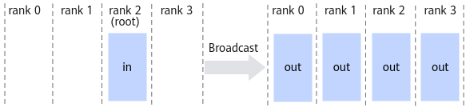

# HcclBroadcast<a name="ZH-CN_TOPIC_0000002519072187"></a>

## AI处理器支持情况<a name="zh-cn_topic_0000001312481237_section10594071513"></a>

<a name="zh-cn_topic_0000001312481237_table38301303189"></a>
<table><thead align="left"><tr id="zh-cn_topic_0000001312481237_row20831180131817"><th class="cellrowborder" valign="top" width="57.99999999999999%" id="mcps1.1.3.1.1"><p id="zh-cn_topic_0000001312481237_p1883113061818"><a name="zh-cn_topic_0000001312481237_p1883113061818"></a><a name="zh-cn_topic_0000001312481237_p1883113061818"></a><span id="zh-cn_topic_0000001312481237_ph20833205312295"><a name="zh-cn_topic_0000001312481237_ph20833205312295"></a><a name="zh-cn_topic_0000001312481237_ph20833205312295"></a>AI处理器类型</span></p>
</th>
<th class="cellrowborder" align="center" valign="top" width="42%" id="mcps1.1.3.1.2"><p id="zh-cn_topic_0000001312481237_p783113012187"><a name="zh-cn_topic_0000001312481237_p783113012187"></a><a name="zh-cn_topic_0000001312481237_p783113012187"></a>是否支持</p>
</th>
</tr>
</thead>
<tbody><tr id="zh-cn_topic_0000001312481237_row220181016240"><td class="cellrowborder" valign="top" width="57.99999999999999%" headers="mcps1.1.3.1.1 "><p id="zh-cn_topic_0000001312481237_p48327011813"><a name="zh-cn_topic_0000001312481237_p48327011813"></a><a name="zh-cn_topic_0000001312481237_p48327011813"></a><span id="zh-cn_topic_0000001312481237_ph583230201815"><a name="zh-cn_topic_0000001312481237_ph583230201815"></a><a name="zh-cn_topic_0000001312481237_ph583230201815"></a><term id="zh-cn_topic_0000001312481237_zh-cn_topic_0000001312391781_term1253731311225"><a name="zh-cn_topic_0000001312481237_zh-cn_topic_0000001312391781_term1253731311225"></a><a name="zh-cn_topic_0000001312481237_zh-cn_topic_0000001312391781_term1253731311225"></a>Ascend 910C</term></span></p>
</td>
<td class="cellrowborder" align="center" valign="top" width="42%" headers="mcps1.1.3.1.2 "><p id="zh-cn_topic_0000001312481237_p7948163910184"><a name="zh-cn_topic_0000001312481237_p7948163910184"></a><a name="zh-cn_topic_0000001312481237_p7948163910184"></a>√</p>
</td>
</tr>
<tr id="zh-cn_topic_0000001312481237_row173226882415"><td class="cellrowborder" valign="top" width="57.99999999999999%" headers="mcps1.1.3.1.1 "><p id="zh-cn_topic_0000001312481237_p14832120181815"><a name="zh-cn_topic_0000001312481237_p14832120181815"></a><a name="zh-cn_topic_0000001312481237_p14832120181815"></a><span id="zh-cn_topic_0000001312481237_ph1292674871116"><a name="zh-cn_topic_0000001312481237_ph1292674871116"></a><a name="zh-cn_topic_0000001312481237_ph1292674871116"></a><term id="zh-cn_topic_0000001312481237_zh-cn_topic_0000001312391781_term11962195213215"><a name="zh-cn_topic_0000001312481237_zh-cn_topic_0000001312391781_term11962195213215"></a><a name="zh-cn_topic_0000001312481237_zh-cn_topic_0000001312391781_term11962195213215"></a>Ascend 910B</term></span></p>
</td>
<td class="cellrowborder" align="center" valign="top" width="42%" headers="mcps1.1.3.1.2 "><p id="zh-cn_topic_0000001312481237_p19948143911820"><a name="zh-cn_topic_0000001312481237_p19948143911820"></a><a name="zh-cn_topic_0000001312481237_p19948143911820"></a>√</p>
</td>
</tr>
<tr id="zh-cn_topic_0000001312481237_row1540218555488"><td class="cellrowborder" colspan="2" valign="top" headers="mcps1.1.3.1.1 mcps1.1.3.1.2 "><p id="zh-cn_topic_0000001312481237_p5133163315209"><a name="zh-cn_topic_0000001312481237_p5133163315209"></a><a name="zh-cn_topic_0000001312481237_p5133163315209"></a><span id="zh-cn_topic_0000001312481237_ph71511010202"><a name="zh-cn_topic_0000001312481237_ph71511010202"></a><a name="zh-cn_topic_0000001312481237_ph71511010202"></a>注：AI处理器与昇腾产品的对应关系，请参见《<a href="https://www.hiascend.com/document/detail/zh/AscendFAQ/ProduTech/productform/hardwaredesc_0001.html" target="_blank" rel="noopener noreferrer">昇腾产品形态说明</a>》。</span></p>
</td>
</tr>
</tbody>
</table>

> [!NOTE]说明 
> 针对Ascend 910B，仅支持Atlas 800T A2 训练服务器、Atlas 900 A2 PoD 集群基础单元、Atlas 200T A2 Box16 异构子框。

## 功能说明<a name="zh-cn_topic_0000001312481237_section10896307"></a>

集合通信算子Broadcast的操作接口，将通信域内root节点的数据广播到其他rank。



## 函数原型<a name="zh-cn_topic_0000001312481237_section1210700"></a>

```
HcclResult HcclBroadcast(void *buf, uint64_t count, HcclDataType dataType, uint32_t root, HcclComm comm, aclrtStream stream)
```

## 参数说明<a name="zh-cn_topic_0000001312481237_section30957904"></a>

<a name="zh-cn_topic_0000001312481237_table59291480"></a>
<table><thead align="left"><tr id="zh-cn_topic_0000001312481237_row30364973"><th class="cellrowborder" valign="top" width="20.200000000000003%" id="mcps1.1.4.1.1"><p id="zh-cn_topic_0000001312481237_p43643771"><a name="zh-cn_topic_0000001312481237_p43643771"></a><a name="zh-cn_topic_0000001312481237_p43643771"></a>参数名</p>
</th>
<th class="cellrowborder" valign="top" width="17.169999999999998%" id="mcps1.1.4.1.2"><p id="zh-cn_topic_0000001312481237_p45484537"><a name="zh-cn_topic_0000001312481237_p45484537"></a><a name="zh-cn_topic_0000001312481237_p45484537"></a>输入/输出</p>
</th>
<th class="cellrowborder" valign="top" width="62.629999999999995%" id="mcps1.1.4.1.3"><p id="zh-cn_topic_0000001312481237_p60368847"><a name="zh-cn_topic_0000001312481237_p60368847"></a><a name="zh-cn_topic_0000001312481237_p60368847"></a>描述</p>
</th>
</tr>
</thead>
<tbody><tr id="zh-cn_topic_0000001312481237_row58038438"><td class="cellrowborder" valign="top" width="20.200000000000003%" headers="mcps1.1.4.1.1 "><p id="zh-cn_topic_0000001312481237_p3493029"><a name="zh-cn_topic_0000001312481237_p3493029"></a><a name="zh-cn_topic_0000001312481237_p3493029"></a>buf</p>
</td>
<td class="cellrowborder" valign="top" width="17.169999999999998%" headers="mcps1.1.4.1.2 "><p id="zh-cn_topic_0000001312481237_p14499957"><a name="zh-cn_topic_0000001312481237_p14499957"></a><a name="zh-cn_topic_0000001312481237_p14499957"></a>输入/输出</p>
</td>
<td class="cellrowborder" valign="top" width="62.629999999999995%" headers="mcps1.1.4.1.3 "><p id="zh-cn_topic_0000001312481237_p33645886"><a name="zh-cn_topic_0000001312481237_p33645886"></a><a name="zh-cn_topic_0000001312481237_p33645886"></a>数据buffer，对于root节点，是数据源；对于非root节点，是数据接收buffer。</p>
</td>
</tr>
<tr id="zh-cn_topic_0000001312481237_row34377519"><td class="cellrowborder" valign="top" width="20.200000000000003%" headers="mcps1.1.4.1.1 "><p id="zh-cn_topic_0000001312481237_p33115615"><a name="zh-cn_topic_0000001312481237_p33115615"></a><a name="zh-cn_topic_0000001312481237_p33115615"></a>count</p>
</td>
<td class="cellrowborder" valign="top" width="17.169999999999998%" headers="mcps1.1.4.1.2 "><p id="zh-cn_topic_0000001312481237_p65119131"><a name="zh-cn_topic_0000001312481237_p65119131"></a><a name="zh-cn_topic_0000001312481237_p65119131"></a>输入</p>
</td>
<td class="cellrowborder" valign="top" width="62.629999999999995%" headers="mcps1.1.4.1.3 "><p id="zh-cn_topic_0000001312481237_p40158284"><a name="zh-cn_topic_0000001312481237_p40158284"></a><a name="zh-cn_topic_0000001312481237_p40158284"></a>参与broadcast操作的数据个数，比如只有一个int32数据参与，则count=1。</p>
</td>
</tr>
<tr id="zh-cn_topic_0000001312481237_row25880244"><td class="cellrowborder" valign="top" width="20.200000000000003%" headers="mcps1.1.4.1.1 "><p id="zh-cn_topic_0000001312481237_p15925039"><a name="zh-cn_topic_0000001312481237_p15925039"></a><a name="zh-cn_topic_0000001312481237_p15925039"></a>dataType</p>
</td>
<td class="cellrowborder" valign="top" width="17.169999999999998%" headers="mcps1.1.4.1.2 "><p id="zh-cn_topic_0000001312481237_p14859795"><a name="zh-cn_topic_0000001312481237_p14859795"></a><a name="zh-cn_topic_0000001312481237_p14859795"></a>输入</p>
</td>
<td class="cellrowborder" valign="top" width="62.629999999999995%" headers="mcps1.1.4.1.3 "><p id="zh-cn_topic_0000001312481237_p7991229191118"><a name="zh-cn_topic_0000001312481237_p7991229191118"></a><a name="zh-cn_topic_0000001312481237_p7991229191118"></a>Broadcast操作的数据类型，<a href="HcclDataType.md#ZH-CN_TOPIC_0000002486992310">HcclDataType</a>类型。</p>
<p id="zh-cn_topic_0000001312481237_p114661218162118"><a name="zh-cn_topic_0000001312481237_p114661218162118"></a><a name="zh-cn_topic_0000001312481237_p114661218162118"></a> 针对<span id="zh-cn_topic_0000001312481237_ph13754548217"><a name="zh-cn_topic_0000001312481237_ph13754548217"></a><a name="zh-cn_topic_0000001312481237_ph13754548217"></a><term id="zh-cn_topic_0000001312481237_zh-cn_topic_0000001312391781_term1253731311225_1"><a name="zh-cn_topic_0000001312481237_zh-cn_topic_0000001312391781_term1253731311225_1"></a><a name="zh-cn_topic_0000001312481237_zh-cn_topic_0000001312391781_term1253731311225_1"></a>Ascend 910C</term></span>，支持数据类型：int8、uint8、int16、uint16、int32、uint32、int64、uint64、float16、float32、float64、bfp16。</p>
<p id="zh-cn_topic_0000001312481237_p94179211177"><a name="zh-cn_topic_0000001312481237_p94179211177"></a><a name="zh-cn_topic_0000001312481237_p94179211177"></a> 针对<span id="zh-cn_topic_0000001312481237_ph14880920154918"><a name="zh-cn_topic_0000001312481237_ph14880920154918"></a><a name="zh-cn_topic_0000001312481237_ph14880920154918"></a><term id="zh-cn_topic_0000001312481237_zh-cn_topic_0000001312391781_term16184138172215"><a name="zh-cn_topic_0000001312481237_zh-cn_topic_0000001312391781_term16184138172215"></a><a name="zh-cn_topic_0000001312481237_zh-cn_topic_0000001312391781_term16184138172215"></a>Ascend 910B</term></span>，支持数据类型：int8、uint8、int16、uint16、int32、uint32、int64、uint64、float16、float32、float64、bfp16。</p>
</td>
</tr>
<tr id="zh-cn_topic_0000001312481237_row28263486"><td class="cellrowborder" valign="top" width="20.200000000000003%" headers="mcps1.1.4.1.1 "><p id="zh-cn_topic_0000001312481237_p7641038"><a name="zh-cn_topic_0000001312481237_p7641038"></a><a name="zh-cn_topic_0000001312481237_p7641038"></a>root</p>
</td>
<td class="cellrowborder" valign="top" width="17.169999999999998%" headers="mcps1.1.4.1.2 "><p id="zh-cn_topic_0000001312481237_p14944322"><a name="zh-cn_topic_0000001312481237_p14944322"></a><a name="zh-cn_topic_0000001312481237_p14944322"></a>输入</p>
</td>
<td class="cellrowborder" valign="top" width="62.629999999999995%" headers="mcps1.1.4.1.3 "><p id="zh-cn_topic_0000001312481237_p2530563"><a name="zh-cn_topic_0000001312481237_p2530563"></a><a name="zh-cn_topic_0000001312481237_p2530563"></a>作为broadcast root的rank id。</p>
</td>
</tr>
<tr id="zh-cn_topic_0000001312481237_row22775067"><td class="cellrowborder" valign="top" width="20.200000000000003%" headers="mcps1.1.4.1.1 "><p id="zh-cn_topic_0000001312481237_p32841145"><a name="zh-cn_topic_0000001312481237_p32841145"></a><a name="zh-cn_topic_0000001312481237_p32841145"></a>comm</p>
</td>
<td class="cellrowborder" valign="top" width="17.169999999999998%" headers="mcps1.1.4.1.2 "><p id="zh-cn_topic_0000001312481237_p42887128"><a name="zh-cn_topic_0000001312481237_p42887128"></a><a name="zh-cn_topic_0000001312481237_p42887128"></a>输入</p>
</td>
<td class="cellrowborder" valign="top" width="62.629999999999995%" headers="mcps1.1.4.1.3 "><p id="zh-cn_topic_0000001312481237_p51305376"><a name="zh-cn_topic_0000001312481237_p51305376"></a><a name="zh-cn_topic_0000001312481237_p51305376"></a>集合通信操作所在的通信域。</p>
</td>
</tr>
<tr id="zh-cn_topic_0000001312481237_row59095202"><td class="cellrowborder" valign="top" width="20.200000000000003%" headers="mcps1.1.4.1.1 "><p id="zh-cn_topic_0000001312481237_p21982073"><a name="zh-cn_topic_0000001312481237_p21982073"></a><a name="zh-cn_topic_0000001312481237_p21982073"></a>stream</p>
</td>
<td class="cellrowborder" valign="top" width="17.169999999999998%" headers="mcps1.1.4.1.2 "><p id="zh-cn_topic_0000001312481237_p35717517"><a name="zh-cn_topic_0000001312481237_p35717517"></a><a name="zh-cn_topic_0000001312481237_p35717517"></a>输入</p>
</td>
<td class="cellrowborder" valign="top" width="62.629999999999995%" headers="mcps1.1.4.1.3 "><p id="zh-cn_topic_0000001312481237_p7437765"><a name="zh-cn_topic_0000001312481237_p7437765"></a><a name="zh-cn_topic_0000001312481237_p7437765"></a>本rank所使用的stream。</p>
</td>
</tr>
</tbody>
</table>

## 返回值<a name="zh-cn_topic_0000001312481237_section10185684"></a>

[HcclResult](HcclResult.md#ZH-CN_TOPIC_0000002519072193)：接口成功返回HCCL\_SUCCESS，其他失败。

## 约束说明<a name="zh-cn_topic_0000001312481237_section24562296"></a>

-   所有rank的count、dataType、root均应相同。
-   全局只能有1个root节点。

## 调用示例<a name="zh-cn_topic_0000001312481237_section204039211474"></a>

```c
// 申请集合通信操作的 Device 内存
void *buf = nullptr;    // 对于root节点，是数据源；对于非root节点，是数据接收buffer
uint64_t count = 8;     // 参与broadcast操作的数据个数
size_t mallocSize = count * sizeof(float);
aclrtMalloc(&buf, mallocSize, ACL_MEM_MALLOC_HUGE_FIRST);

// 在 root 节点构造输入数据
if (deviceId == rootRank) {    
    aclrtMemcpy(buf, mallocSize, hostBuf, mallocSize, ACL_MEMCPY_HOST_TO_DEVICE);
}

// 初始化通信域
uint32_t rankSize = 8;
HcclComm hcclComm;
HcclCommInitRootInfo(rankSize, &rootInfo, deviceId, &hcclComm);

// 创建任务流
aclrtStream stream;
aclrtCreateStream(&stream);

// 执行广播操作，将通信域内 root 节点的数据广播至其他 rank
HcclBroadcast(buf, count, HCCL_DATA_TYPE_FP32, rootRank, hcclComm, stream);
// 阻塞等待任务流中的集合通信任务执行完成
aclrtSynchronizeStream(stream);

// 释放资源
aclrtFree(sendBuf);          // 释放 Device 侧内存
aclrtFree(recvBuf);          // 释放 Device 侧内存
aclrtDestroyStream(stream);  // 销毁任务流
HcclCommDestroy(hcclComm);   // 销毁通信域
```

