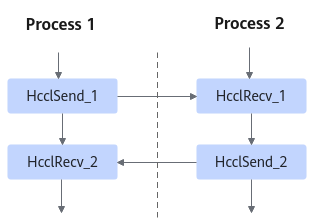

# HcclRecv<a name="ZH-CN_TOPIC_0000002486833322"></a>

## 产品支持情况<a name="zh-cn_topic_0000001264921402_section10594071513"></a>

<a name="zh-cn_topic_0000001264921402_table38301303189"></a>
<table><thead align="left"><tr id="zh-cn_topic_0000001264921402_row20831180131817"><th class="cellrowborder" valign="top" width="57.99999999999999%" id="mcps1.1.3.1.1"><p id="zh-cn_topic_0000001264921402_p1883113061818"><a name="zh-cn_topic_0000001264921402_p1883113061818"></a><a name="zh-cn_topic_0000001264921402_p1883113061818"></a><span id="zh-cn_topic_0000001264921402_ph20833205312295"><a name="zh-cn_topic_0000001264921402_ph20833205312295"></a><a name="zh-cn_topic_0000001264921402_ph20833205312295"></a>产品</span></p>
</th>
<th class="cellrowborder" align="center" valign="top" width="42%" id="mcps1.1.3.1.2"><p id="zh-cn_topic_0000001264921402_p783113012187"><a name="zh-cn_topic_0000001264921402_p783113012187"></a><a name="zh-cn_topic_0000001264921402_p783113012187"></a>是否支持</p>
</th>
</tr>
</thead>
<tbody><tr id="zh-cn_topic_0000001264921402_row220181016240"><td class="cellrowborder" valign="top" width="57.99999999999999%" headers="mcps1.1.3.1.1 "><p id="zh-cn_topic_0000001264921402_p48327011813"><a name="zh-cn_topic_0000001264921402_p48327011813"></a><a name="zh-cn_topic_0000001264921402_p48327011813"></a><span id="zh-cn_topic_0000001264921402_ph583230201815"><a name="zh-cn_topic_0000001264921402_ph583230201815"></a><a name="zh-cn_topic_0000001264921402_ph583230201815"></a><term id="zh-cn_topic_0000001264921402_zh-cn_topic_0000001312391781_term1253731311225"><a name="zh-cn_topic_0000001264921402_zh-cn_topic_0000001312391781_term1253731311225"></a><a name="zh-cn_topic_0000001264921402_zh-cn_topic_0000001312391781_term1253731311225"></a>Atlas A3 训练系列产品/Atlas A3 推理系列产品</term></span></p>
</td>
<td class="cellrowborder" align="center" valign="top" width="42%" headers="mcps1.1.3.1.2 "><p id="zh-cn_topic_0000001264921402_p7948163910184"><a name="zh-cn_topic_0000001264921402_p7948163910184"></a><a name="zh-cn_topic_0000001264921402_p7948163910184"></a>√</p>
</td>
</tr>
<tr id="zh-cn_topic_0000001264921402_row173226882415"><td class="cellrowborder" valign="top" width="57.99999999999999%" headers="mcps1.1.3.1.1 "><p id="zh-cn_topic_0000001264921402_p14832120181815"><a name="zh-cn_topic_0000001264921402_p14832120181815"></a><a name="zh-cn_topic_0000001264921402_p14832120181815"></a><span id="zh-cn_topic_0000001264921402_ph1292674871116"><a name="zh-cn_topic_0000001264921402_ph1292674871116"></a><a name="zh-cn_topic_0000001264921402_ph1292674871116"></a><term id="zh-cn_topic_0000001264921402_zh-cn_topic_0000001312391781_term11962195213215"><a name="zh-cn_topic_0000001264921402_zh-cn_topic_0000001312391781_term11962195213215"></a><a name="zh-cn_topic_0000001264921402_zh-cn_topic_0000001312391781_term11962195213215"></a>Atlas A2 训练系列产品/Atlas A2 推理系列产品</term></span></p>
</td>
<td class="cellrowborder" align="center" valign="top" width="42%" headers="mcps1.1.3.1.2 "><p id="zh-cn_topic_0000001264921402_p19948143911820"><a name="zh-cn_topic_0000001264921402_p19948143911820"></a><a name="zh-cn_topic_0000001264921402_p19948143911820"></a>√</p>
</td>
</tr>
</tbody>
</table>

> [!NOTE]说明 
> 针对Atlas A2 训练系列产品/Atlas A2 推理系列产品，仅支持Atlas 800T A2 训练服务器、Atlas 900 A2 PoD 集群基础单元、Atlas 200T A2 Box16 异构子框。

## 功能说明<a name="zh-cn_topic_0000001264921402_section115673714311"></a>

点对点通信Receive操作接口，从源节点接收数据到当前节点的指定位置上。

## 函数原型<a name="zh-cn_topic_0000001264921402_section165671571131"></a>

```
HcclResult HcclRecv(void* recvBuf, uint64_t count, HcclDataType dataType, uint32_t srcRank,HcclComm comm, aclrtStream stream)
```

## 参数说明<a name="zh-cn_topic_0000001264921402_section145681471310"></a>

<a name="zh-cn_topic_0000001264921402_table0576473316"></a>
<table><thead align="left"><tr id="zh-cn_topic_0000001264921402_row1060511716320"><th class="cellrowborder" valign="top" width="20.200000000000003%" id="mcps1.1.4.1.1"><p id="zh-cn_topic_0000001264921402_p146051071139"><a name="zh-cn_topic_0000001264921402_p146051071139"></a><a name="zh-cn_topic_0000001264921402_p146051071139"></a>参数名</p>
</th>
<th class="cellrowborder" valign="top" width="17.169999999999998%" id="mcps1.1.4.1.2"><p id="zh-cn_topic_0000001264921402_p1160527939"><a name="zh-cn_topic_0000001264921402_p1160527939"></a><a name="zh-cn_topic_0000001264921402_p1160527939"></a>输入/输出</p>
</th>
<th class="cellrowborder" valign="top" width="62.629999999999995%" id="mcps1.1.4.1.3"><p id="zh-cn_topic_0000001264921402_p86058714320"><a name="zh-cn_topic_0000001264921402_p86058714320"></a><a name="zh-cn_topic_0000001264921402_p86058714320"></a>描述</p>
</th>
</tr>
</thead>
<tbody><tr id="zh-cn_topic_0000001264921402_row166054719318"><td class="cellrowborder" valign="top" width="20.200000000000003%" headers="mcps1.1.4.1.1 "><p id="zh-cn_topic_0000001264921402_p106051976316"><a name="zh-cn_topic_0000001264921402_p106051976316"></a><a name="zh-cn_topic_0000001264921402_p106051976316"></a>recvBuf</p>
</td>
<td class="cellrowborder" valign="top" width="17.169999999999998%" headers="mcps1.1.4.1.2 "><p id="zh-cn_topic_0000001264921402_p560511719312"><a name="zh-cn_topic_0000001264921402_p560511719312"></a><a name="zh-cn_topic_0000001264921402_p560511719312"></a>输入</p>
</td>
<td class="cellrowborder" valign="top" width="62.629999999999995%" headers="mcps1.1.4.1.3 "><p id="zh-cn_topic_0000001264921402_p1760577138"><a name="zh-cn_topic_0000001264921402_p1760577138"></a><a name="zh-cn_topic_0000001264921402_p1760577138"></a>数据接收buffer地址。</p>
</td>
</tr>
<tr id="zh-cn_topic_0000001264921402_row460577337"><td class="cellrowborder" valign="top" width="20.200000000000003%" headers="mcps1.1.4.1.1 "><p id="zh-cn_topic_0000001264921402_p26051971534"><a name="zh-cn_topic_0000001264921402_p26051971534"></a><a name="zh-cn_topic_0000001264921402_p26051971534"></a>count</p>
</td>
<td class="cellrowborder" valign="top" width="17.169999999999998%" headers="mcps1.1.4.1.2 "><p id="zh-cn_topic_0000001264921402_p2605973319"><a name="zh-cn_topic_0000001264921402_p2605973319"></a><a name="zh-cn_topic_0000001264921402_p2605973319"></a>输入</p>
</td>
<td class="cellrowborder" valign="top" width="62.629999999999995%" headers="mcps1.1.4.1.3 "><p id="zh-cn_topic_0000001264921402_p1160510719318"><a name="zh-cn_topic_0000001264921402_p1160510719318"></a><a name="zh-cn_topic_0000001264921402_p1160510719318"></a>接收数据的个数。</p>
</td>
</tr>
<tr id="zh-cn_topic_0000001264921402_row156051072036"><td class="cellrowborder" valign="top" width="20.200000000000003%" headers="mcps1.1.4.1.1 "><p id="zh-cn_topic_0000001264921402_p460557831"><a name="zh-cn_topic_0000001264921402_p460557831"></a><a name="zh-cn_topic_0000001264921402_p460557831"></a>dataType</p>
</td>
<td class="cellrowborder" valign="top" width="17.169999999999998%" headers="mcps1.1.4.1.2 "><p id="zh-cn_topic_0000001264921402_p2605187530"><a name="zh-cn_topic_0000001264921402_p2605187530"></a><a name="zh-cn_topic_0000001264921402_p2605187530"></a>输入</p>
</td>
<td class="cellrowborder" valign="top" width="62.629999999999995%" headers="mcps1.1.4.1.3 "><p id="zh-cn_topic_0000001264921402_p15650182941610"><a name="zh-cn_topic_0000001264921402_p15650182941610"></a><a name="zh-cn_topic_0000001264921402_p15650182941610"></a>接收数据的数据类型，<a href="HcclDataType.md#ZH-CN_TOPIC_0000002486992310">HcclDataType</a>类型。</p>
<p id="zh-cn_topic_0000001264921402_p39291313119"><a name="zh-cn_topic_0000001264921402_p39291313119"></a><a name="zh-cn_topic_0000001264921402_p39291313119"></a> 针对<span id="zh-cn_topic_0000001264921402_zh-cn_topic_0000001265081266_ph13754548217"><a name="zh-cn_topic_0000001264921402_zh-cn_topic_0000001265081266_ph13754548217"></a><a name="zh-cn_topic_0000001264921402_zh-cn_topic_0000001265081266_ph13754548217"></a><term id="zh-cn_topic_0000001264921402_zh-cn_topic_0000001265081266_zh-cn_topic_0000001312391781_term1253731311225"><a name="zh-cn_topic_0000001264921402_zh-cn_topic_0000001265081266_zh-cn_topic_0000001312391781_term1253731311225"></a><a name="zh-cn_topic_0000001264921402_zh-cn_topic_0000001265081266_zh-cn_topic_0000001312391781_term1253731311225"></a>Atlas A3 训练系列产品/Atlas A3 推理系列产品</term></span>，支持数据类型：int8、uint8、int16、uint16、int32、uint32、int64、uint64、float16、float32、float64、bfp16。</p>
<p id="zh-cn_topic_0000001264921402_p12283142716193"><a name="zh-cn_topic_0000001264921402_p12283142716193"></a><a name="zh-cn_topic_0000001264921402_p12283142716193"></a> 针对<span id="zh-cn_topic_0000001264921402_zh-cn_topic_0000001265081266_ph14880920154918"><a name="zh-cn_topic_0000001264921402_zh-cn_topic_0000001265081266_ph14880920154918"></a><a name="zh-cn_topic_0000001264921402_zh-cn_topic_0000001265081266_ph14880920154918"></a><term id="zh-cn_topic_0000001264921402_zh-cn_topic_0000001265081266_zh-cn_topic_0000001312391781_term16184138172215"><a name="zh-cn_topic_0000001264921402_zh-cn_topic_0000001265081266_zh-cn_topic_0000001312391781_term16184138172215"></a><a name="zh-cn_topic_0000001264921402_zh-cn_topic_0000001265081266_zh-cn_topic_0000001312391781_term16184138172215"></a>Atlas A2 训练系列产品/Atlas A2 推理系列产品</term></span>，支持数据类型：int8、uint8、int16、uint16、int32、uint32、int64、uint64、float16、float32、float64，bfp16。</p>
</td>
</tr>
<tr id="zh-cn_topic_0000001264921402_row206057717312"><td class="cellrowborder" valign="top" width="20.200000000000003%" headers="mcps1.1.4.1.1 "><p id="zh-cn_topic_0000001264921402_p1605673319"><a name="zh-cn_topic_0000001264921402_p1605673319"></a><a name="zh-cn_topic_0000001264921402_p1605673319"></a>srcRank</p>
</td>
<td class="cellrowborder" valign="top" width="17.169999999999998%" headers="mcps1.1.4.1.2 "><p id="zh-cn_topic_0000001264921402_p7605177635"><a name="zh-cn_topic_0000001264921402_p7605177635"></a><a name="zh-cn_topic_0000001264921402_p7605177635"></a>输入</p>
</td>
<td class="cellrowborder" valign="top" width="62.629999999999995%" headers="mcps1.1.4.1.3 "><p id="zh-cn_topic_0000001264921402_p7605571034"><a name="zh-cn_topic_0000001264921402_p7605571034"></a><a name="zh-cn_topic_0000001264921402_p7605571034"></a>通信域内数据发送端的rank编号。</p>
</td>
</tr>
<tr id="zh-cn_topic_0000001264921402_row146051372315"><td class="cellrowborder" valign="top" width="20.200000000000003%" headers="mcps1.1.4.1.1 "><p id="zh-cn_topic_0000001264921402_p126053714319"><a name="zh-cn_topic_0000001264921402_p126053714319"></a><a name="zh-cn_topic_0000001264921402_p126053714319"></a>comm</p>
</td>
<td class="cellrowborder" valign="top" width="17.169999999999998%" headers="mcps1.1.4.1.2 "><p id="zh-cn_topic_0000001264921402_p26051871637"><a name="zh-cn_topic_0000001264921402_p26051871637"></a><a name="zh-cn_topic_0000001264921402_p26051871637"></a>输入</p>
</td>
<td class="cellrowborder" valign="top" width="62.629999999999995%" headers="mcps1.1.4.1.3 "><p id="zh-cn_topic_0000001264921402_p17605774316"><a name="zh-cn_topic_0000001264921402_p17605774316"></a><a name="zh-cn_topic_0000001264921402_p17605774316"></a>集合通信操作所在的通信域。</p>
</td>
</tr>
<tr id="zh-cn_topic_0000001264921402_row14605137334"><td class="cellrowborder" valign="top" width="20.200000000000003%" headers="mcps1.1.4.1.1 "><p id="zh-cn_topic_0000001264921402_p196051071736"><a name="zh-cn_topic_0000001264921402_p196051071736"></a><a name="zh-cn_topic_0000001264921402_p196051071736"></a>stream</p>
</td>
<td class="cellrowborder" valign="top" width="17.169999999999998%" headers="mcps1.1.4.1.2 "><p id="zh-cn_topic_0000001264921402_p1605107937"><a name="zh-cn_topic_0000001264921402_p1605107937"></a><a name="zh-cn_topic_0000001264921402_p1605107937"></a>输入</p>
</td>
<td class="cellrowborder" valign="top" width="62.629999999999995%" headers="mcps1.1.4.1.3 "><p id="zh-cn_topic_0000001264921402_p0605274311"><a name="zh-cn_topic_0000001264921402_p0605274311"></a><a name="zh-cn_topic_0000001264921402_p0605274311"></a>本rank所使用的stream。</p>
</td>
</tr>
</tbody>
</table>

## 返回值<a name="zh-cn_topic_0000001264921402_section14576971837"></a>

[HcclResult](HcclResult.md#ZH-CN_TOPIC_0000002519072193)：接口成功返回HCCL\_SUCCESS，其他失败。

## 约束说明<a name="zh-cn_topic_0000001264921402_section5471426246"></a>

HcclSend与HcclRecv接口采用同步调用方式，且必须配对使用。即一个进程调用HcclSend接口后，需要等到与之配对的HcclRecv接口接收数据后，才可以进行下一个接口调用，如下图所示。



## 调用示例<a name="zh-cn_topic_0000001264921402_section204039211474"></a>

```c
void *sendBuf = nullptr;
void *recvBuf = nullptr;
uint64_t count = 8;
size_t mallocSize = count * sizeof(float);

// 初始化通信域
uint32_t rankSize = 8;
HcclComm hcclComm;
HcclCommInitRootInfo(rankSize, &rootInfo, deviceId, &hcclComm);

// 创建任务流
aclrtStream stream;
aclrtCreateStream(&stream);

// 执行 Send/Recv 操作，0/2/4/6卡发送数据，1/3/5/7接收数据
// HcclSend 与 HcclRecv 接口采用同步调用方式，且必须配对使用
if (deviceId % 2 == 0) {
    // 申请 Device 内存用于存放输入数据
    aclrtMalloc(&sendBuf, mallocSize, ACL_MEM_MALLOC_HUGE_FIRST);
    // 初始化输入数据
    aclrtMemcpy(sendBuf, mallocSize, hostBuf, mallocSize, ACL_MEMCPY_HOST_TO_DEVICE);
    // 执行 Send 操作
    HcclSend(sendBuf, count, HCCL_DATA_TYPE_FP32, deviceId + 1, hcclComm, stream);
} else {
    // 申请 Device 内存用于接收数据
    aclrtMalloc(&recvBuf, mallocSize, ACL_MEM_MALLOC_HUGE_FIRST);
    // 执行 Recv 操作
    HcclRecv(recvBuf, count, HCCL_DATA_TYPE_FP32, deviceId - 1, hcclComm, stream);
}

// 阻塞等待任务流中的集合通信任务执行完成
aclrtSynchronizeStream(stream);

// 释放资源
aclrtFree(sendBuf);          // 释放 Device 侧内存
aclrtFree(recvBuf);          // 释放 Device 侧内存
aclrtDestroyStream(stream);  // 销毁任务流
HcclCommDestroy(hcclComm);   // 销毁通信域
```

