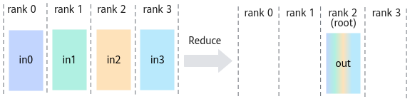

# HcclReduce<a name="ZH-CN_TOPIC_0000002486832342"></a>

## 产品支持情况<a name="zh-cn_topic_0000001316510814_section10594071513"></a>

<a name="zh-cn_topic_0000001316510814_table38301303189"></a>
<table><thead align="left"><tr id="zh-cn_topic_0000001316510814_row20831180131817"><th class="cellrowborder" valign="top" width="57.99999999999999%" id="mcps1.1.3.1.1"><p id="zh-cn_topic_0000001316510814_p1883113061818"><a name="zh-cn_topic_0000001316510814_p1883113061818"></a><a name="zh-cn_topic_0000001316510814_p1883113061818"></a><span id="zh-cn_topic_0000001316510814_ph20833205312295"><a name="zh-cn_topic_0000001316510814_ph20833205312295"></a><a name="zh-cn_topic_0000001316510814_ph20833205312295"></a>产品</span></p>
</th>
<th class="cellrowborder" align="center" valign="top" width="42%" id="mcps1.1.3.1.2"><p id="zh-cn_topic_0000001316510814_p783113012187"><a name="zh-cn_topic_0000001316510814_p783113012187"></a><a name="zh-cn_topic_0000001316510814_p783113012187"></a>是否支持</p>
</th>
</tr>
</thead>
<tbody><tr id="zh-cn_topic_0000001316510814_row220181016240"><td class="cellrowborder" valign="top" width="57.99999999999999%" headers="mcps1.1.3.1.1 "><p id="zh-cn_topic_0000001316510814_p48327011813"><a name="zh-cn_topic_0000001316510814_p48327011813"></a><a name="zh-cn_topic_0000001316510814_p48327011813"></a><span id="zh-cn_topic_0000001316510814_ph583230201815"><a name="zh-cn_topic_0000001316510814_ph583230201815"></a><a name="zh-cn_topic_0000001316510814_ph583230201815"></a><term id="zh-cn_topic_0000001316510814_zh-cn_topic_0000001312391781_term1253731311225"><a name="zh-cn_topic_0000001316510814_zh-cn_topic_0000001312391781_term1253731311225"></a><a name="zh-cn_topic_0000001316510814_zh-cn_topic_0000001312391781_term1253731311225"></a>Atlas A3 训练系列产品/Atlas A3 推理系列产品</term></span></p>
</td>
<td class="cellrowborder" align="center" valign="top" width="42%" headers="mcps1.1.3.1.2 "><p id="zh-cn_topic_0000001316510814_p7948163910184"><a name="zh-cn_topic_0000001316510814_p7948163910184"></a><a name="zh-cn_topic_0000001316510814_p7948163910184"></a>√</p>
</td>
</tr>
<tr id="zh-cn_topic_0000001316510814_row173226882415"><td class="cellrowborder" valign="top" width="57.99999999999999%" headers="mcps1.1.3.1.1 "><p id="zh-cn_topic_0000001316510814_p14832120181815"><a name="zh-cn_topic_0000001316510814_p14832120181815"></a><a name="zh-cn_topic_0000001316510814_p14832120181815"></a><span id="zh-cn_topic_0000001316510814_ph1292674871116"><a name="zh-cn_topic_0000001316510814_ph1292674871116"></a><a name="zh-cn_topic_0000001316510814_ph1292674871116"></a><term id="zh-cn_topic_0000001316510814_zh-cn_topic_0000001312391781_term11962195213215"><a name="zh-cn_topic_0000001316510814_zh-cn_topic_0000001312391781_term11962195213215"></a><a name="zh-cn_topic_0000001316510814_zh-cn_topic_0000001312391781_term11962195213215"></a>Atlas A2 训练系列产品/Atlas A2 推理系列产品</term></span></p>
</td>
<td class="cellrowborder" align="center" valign="top" width="42%" headers="mcps1.1.3.1.2 "><p id="zh-cn_topic_0000001316510814_p19948143911820"><a name="zh-cn_topic_0000001316510814_p19948143911820"></a><a name="zh-cn_topic_0000001316510814_p19948143911820"></a>√</p>
</td>
</tr>
</tbody>
</table>

## 功能说明<a name="zh-cn_topic_0000001316510814_section48254661"></a>

集合通信算子Reduce的操作接口，将所有rank的数据相加（或其他归约操作）后，再把结果发送到root节点的指定位置上。



## 函数原型<a name="zh-cn_topic_0000001316510814_section57557412"></a>

```
HcclResult HcclReduce(void *sendBuf, void *recvBuf, uint64_t count, HcclDataType dataType, HcclReduceOp op, uint32_t root, HcclComm comm, aclrtStream stream)
```

## 参数说明<a name="zh-cn_topic_0000001316510814_section31638772"></a>

<a name="zh-cn_topic_0000001316510814_table66592127"></a>
<table><thead align="left"><tr id="zh-cn_topic_0000001316510814_row61502840"><th class="cellrowborder" valign="top" width="20.200000000000003%" id="mcps1.1.4.1.1"><p id="zh-cn_topic_0000001316510814_p15674164"><a name="zh-cn_topic_0000001316510814_p15674164"></a><a name="zh-cn_topic_0000001316510814_p15674164"></a>参数名</p>
</th>
<th class="cellrowborder" valign="top" width="17.169999999999998%" id="mcps1.1.4.1.2"><p id="zh-cn_topic_0000001316510814_p61647805"><a name="zh-cn_topic_0000001316510814_p61647805"></a><a name="zh-cn_topic_0000001316510814_p61647805"></a>输入/输出</p>
</th>
<th class="cellrowborder" valign="top" width="62.629999999999995%" id="mcps1.1.4.1.3"><p id="zh-cn_topic_0000001316510814_p27416314"><a name="zh-cn_topic_0000001316510814_p27416314"></a><a name="zh-cn_topic_0000001316510814_p27416314"></a>描述</p>
</th>
</tr>
</thead>
<tbody><tr id="zh-cn_topic_0000001316510814_row6128980"><td class="cellrowborder" valign="top" width="20.200000000000003%" headers="mcps1.1.4.1.1 "><p id="zh-cn_topic_0000001316510814_p26685362"><a name="zh-cn_topic_0000001316510814_p26685362"></a><a name="zh-cn_topic_0000001316510814_p26685362"></a>sendBuf</p>
</td>
<td class="cellrowborder" valign="top" width="17.169999999999998%" headers="mcps1.1.4.1.2 "><p id="zh-cn_topic_0000001316510814_p14030717"><a name="zh-cn_topic_0000001316510814_p14030717"></a><a name="zh-cn_topic_0000001316510814_p14030717"></a>输入</p>
</td>
<td class="cellrowborder" valign="top" width="62.629999999999995%" headers="mcps1.1.4.1.3 "><p id="zh-cn_topic_0000001316510814_p62746268"><a name="zh-cn_topic_0000001316510814_p62746268"></a><a name="zh-cn_topic_0000001316510814_p62746268"></a>源数据buffer地址。</p>
</td>
</tr>
<tr id="zh-cn_topic_0000001316510814_row27845503"><td class="cellrowborder" valign="top" width="20.200000000000003%" headers="mcps1.1.4.1.1 "><p id="zh-cn_topic_0000001316510814_p40893240"><a name="zh-cn_topic_0000001316510814_p40893240"></a><a name="zh-cn_topic_0000001316510814_p40893240"></a>recvBuf</p>
</td>
<td class="cellrowborder" valign="top" width="17.169999999999998%" headers="mcps1.1.4.1.2 "><p id="zh-cn_topic_0000001316510814_p24018105"><a name="zh-cn_topic_0000001316510814_p24018105"></a><a name="zh-cn_topic_0000001316510814_p24018105"></a>输出</p>
</td>
<td class="cellrowborder" valign="top" width="62.629999999999995%" headers="mcps1.1.4.1.3 "><p id="zh-cn_topic_0000001316510814_p66418347"><a name="zh-cn_topic_0000001316510814_p66418347"></a><a name="zh-cn_topic_0000001316510814_p66418347"></a>目的数据buffer地址，集合通信结果输出至此buffer中。</p>
</td>
</tr>
<tr id="zh-cn_topic_0000001316510814_row60894213"><td class="cellrowborder" valign="top" width="20.200000000000003%" headers="mcps1.1.4.1.1 "><p id="zh-cn_topic_0000001316510814_p33484259"><a name="zh-cn_topic_0000001316510814_p33484259"></a><a name="zh-cn_topic_0000001316510814_p33484259"></a>count</p>
</td>
<td class="cellrowborder" valign="top" width="17.169999999999998%" headers="mcps1.1.4.1.2 "><p id="zh-cn_topic_0000001316510814_p27870469"><a name="zh-cn_topic_0000001316510814_p27870469"></a><a name="zh-cn_topic_0000001316510814_p27870469"></a>输入</p>
</td>
<td class="cellrowborder" valign="top" width="62.629999999999995%" headers="mcps1.1.4.1.3 "><p id="zh-cn_topic_0000001316510814_p42915540"><a name="zh-cn_topic_0000001316510814_p42915540"></a><a name="zh-cn_topic_0000001316510814_p42915540"></a>参与reduce操作的数据个数，比如只有一个int32数据参与，则count=1。</p>
</td>
</tr>
<tr id="zh-cn_topic_0000001316510814_row50695543"><td class="cellrowborder" valign="top" width="20.200000000000003%" headers="mcps1.1.4.1.1 "><p id="zh-cn_topic_0000001316510814_p12698356"><a name="zh-cn_topic_0000001316510814_p12698356"></a><a name="zh-cn_topic_0000001316510814_p12698356"></a>dataType</p>
</td>
<td class="cellrowborder" valign="top" width="17.169999999999998%" headers="mcps1.1.4.1.2 "><p id="zh-cn_topic_0000001316510814_p21933905"><a name="zh-cn_topic_0000001316510814_p21933905"></a><a name="zh-cn_topic_0000001316510814_p21933905"></a>输入</p>
</td>
<td class="cellrowborder" valign="top" width="62.629999999999995%" headers="mcps1.1.4.1.3 "><p id="zh-cn_topic_0000001316510814_p97875916336"><a name="zh-cn_topic_0000001316510814_p97875916336"></a><a name="zh-cn_topic_0000001316510814_p97875916336"></a>reduce操作的数据类型，<a href="HcclDataType.md#ZH-CN_TOPIC_0000002486992310">HcclDataType</a>类型。</p>
<p id="zh-cn_topic_0000001316510814_p143239448228"><a name="zh-cn_topic_0000001316510814_p143239448228"></a><a name="zh-cn_topic_0000001316510814_p143239448228"></a> 针对<span id="zh-cn_topic_0000001316510814_ph13754548217"><a name="zh-cn_topic_0000001316510814_ph13754548217"></a><a name="zh-cn_topic_0000001316510814_ph13754548217"></a><term id="zh-cn_topic_0000001316510814_zh-cn_topic_0000001312391781_term1253731311225_1"><a name="zh-cn_topic_0000001316510814_zh-cn_topic_0000001312391781_term1253731311225_1"></a><a name="zh-cn_topic_0000001316510814_zh-cn_topic_0000001312391781_term1253731311225_1"></a>Atlas A3 训练系列产品/Atlas A3 推理系列产品</term></span>，支持数据类型：int8、int16、int32、int64、float16、float32、bfp16。</p>
<p id="zh-cn_topic_0000001316510814_p6332172033414"><a name="zh-cn_topic_0000001316510814_p6332172033414"></a><a name="zh-cn_topic_0000001316510814_p6332172033414"></a> 针对<span id="zh-cn_topic_0000001316510814_ph14880920154918"><a name="zh-cn_topic_0000001316510814_ph14880920154918"></a><a name="zh-cn_topic_0000001316510814_ph14880920154918"></a><term id="zh-cn_topic_0000001316510814_zh-cn_topic_0000001312391781_term16184138172215"><a name="zh-cn_topic_0000001316510814_zh-cn_topic_0000001312391781_term16184138172215"></a><a name="zh-cn_topic_0000001316510814_zh-cn_topic_0000001312391781_term16184138172215"></a>Atlas A2 训练系列产品/Atlas A2 推理系列产品</term></span>，支持数据类型：int8、int16、int32、int64、float16、float32、bfp16。需要注意，针对int64数据类型，性能会有一定的劣化。</p>
</td>
</tr>
<tr id="zh-cn_topic_0000001316510814_row17907308"><td class="cellrowborder" valign="top" width="20.200000000000003%" headers="mcps1.1.4.1.1 "><p id="zh-cn_topic_0000001316510814_p41205809"><a name="zh-cn_topic_0000001316510814_p41205809"></a><a name="zh-cn_topic_0000001316510814_p41205809"></a>op</p>
</td>
<td class="cellrowborder" valign="top" width="17.169999999999998%" headers="mcps1.1.4.1.2 "><p id="zh-cn_topic_0000001316510814_p49336210"><a name="zh-cn_topic_0000001316510814_p49336210"></a><a name="zh-cn_topic_0000001316510814_p49336210"></a>输入</p>
</td>
<td class="cellrowborder" valign="top" width="62.629999999999995%" headers="mcps1.1.4.1.3 "><p id="zh-cn_topic_0000001316510814_p36810105"><a name="zh-cn_topic_0000001316510814_p36810105"></a><a name="zh-cn_topic_0000001316510814_p36810105"></a>reduce的操作类型，目前支持操作类型为sum、prod、max、min。</p>
<div class="note" id="zh-cn_topic_0000001316510814_note4427520124313"><a name="zh-cn_topic_0000001316510814_note4427520124313"></a><a name="zh-cn_topic_0000001316510814_note4427520124313"></a><span class="notetitle"> 说明： </span><div class="notebody"><p id="zh-cn_topic_0000001316510814_p9984151202012"><a name="zh-cn_topic_0000001316510814_p9984151202012"></a><a name="zh-cn_topic_0000001316510814_p9984151202012"></a> 针对<span id="zh-cn_topic_0000001316510814_ph79242619219"><a name="zh-cn_topic_0000001316510814_ph79242619219"></a><a name="zh-cn_topic_0000001316510814_ph79242619219"></a><term id="zh-cn_topic_0000001316510814_zh-cn_topic_0000001312391781_term1253731311225_2"><a name="zh-cn_topic_0000001316510814_zh-cn_topic_0000001312391781_term1253731311225_2"></a><a name="zh-cn_topic_0000001316510814_zh-cn_topic_0000001312391781_term1253731311225_2"></a>Atlas A3 训练系列产品/Atlas A3 推理系列产品</term></span>，当前版本“prod”操作不支持int16、bfp16数据类型。</p>
<p id="zh-cn_topic_0000001316510814_p10731124313342"><a name="zh-cn_topic_0000001316510814_p10731124313342"></a><a name="zh-cn_topic_0000001316510814_p10731124313342"></a> 针对<span id="zh-cn_topic_0000001316510814_ph49172713419"><a name="zh-cn_topic_0000001316510814_ph49172713419"></a><a name="zh-cn_topic_0000001316510814_ph49172713419"></a><term id="zh-cn_topic_0000001316510814_zh-cn_topic_0000001312391781_term16184138172215_1"><a name="zh-cn_topic_0000001316510814_zh-cn_topic_0000001312391781_term16184138172215_1"></a><a name="zh-cn_topic_0000001316510814_zh-cn_topic_0000001312391781_term16184138172215_1"></a>Atlas A2 训练系列产品/Atlas A2 推理系列产品</term></span>，当前版本“prod”操作不支持int16、bfp16数据类型。</p>
</div></div>
</td>
</tr>
<tr id="zh-cn_topic_0000001316510814_row532453124917"><td class="cellrowborder" valign="top" width="20.200000000000003%" headers="mcps1.1.4.1.1 "><p id="zh-cn_topic_0000001316510814_p3324183174914"><a name="zh-cn_topic_0000001316510814_p3324183174914"></a><a name="zh-cn_topic_0000001316510814_p3324183174914"></a>root</p>
</td>
<td class="cellrowborder" valign="top" width="17.169999999999998%" headers="mcps1.1.4.1.2 "><p id="zh-cn_topic_0000001316510814_p7324133134913"><a name="zh-cn_topic_0000001316510814_p7324133134913"></a><a name="zh-cn_topic_0000001316510814_p7324133134913"></a>输入</p>
</td>
<td class="cellrowborder" valign="top" width="62.629999999999995%" headers="mcps1.1.4.1.3 "><p id="zh-cn_topic_0000001316510814_p932418344915"><a name="zh-cn_topic_0000001316510814_p932418344915"></a><a name="zh-cn_topic_0000001316510814_p932418344915"></a>作为reduce root的rank id。</p>
</td>
</tr>
<tr id="zh-cn_topic_0000001316510814_row62855489"><td class="cellrowborder" valign="top" width="20.200000000000003%" headers="mcps1.1.4.1.1 "><p id="zh-cn_topic_0000001316510814_p58129833"><a name="zh-cn_topic_0000001316510814_p58129833"></a><a name="zh-cn_topic_0000001316510814_p58129833"></a>comm</p>
</td>
<td class="cellrowborder" valign="top" width="17.169999999999998%" headers="mcps1.1.4.1.2 "><p id="zh-cn_topic_0000001316510814_p10896009"><a name="zh-cn_topic_0000001316510814_p10896009"></a><a name="zh-cn_topic_0000001316510814_p10896009"></a>输入</p>
</td>
<td class="cellrowborder" valign="top" width="62.629999999999995%" headers="mcps1.1.4.1.3 "><p id="zh-cn_topic_0000001316510814_p10161546"><a name="zh-cn_topic_0000001316510814_p10161546"></a><a name="zh-cn_topic_0000001316510814_p10161546"></a>集合通信操作所在的通信域。</p>
</td>
</tr>
<tr id="zh-cn_topic_0000001316510814_row24345054"><td class="cellrowborder" valign="top" width="20.200000000000003%" headers="mcps1.1.4.1.1 "><p id="zh-cn_topic_0000001316510814_p25792371"><a name="zh-cn_topic_0000001316510814_p25792371"></a><a name="zh-cn_topic_0000001316510814_p25792371"></a>stream</p>
</td>
<td class="cellrowborder" valign="top" width="17.169999999999998%" headers="mcps1.1.4.1.2 "><p id="zh-cn_topic_0000001316510814_p8807292"><a name="zh-cn_topic_0000001316510814_p8807292"></a><a name="zh-cn_topic_0000001316510814_p8807292"></a>输入</p>
</td>
<td class="cellrowborder" valign="top" width="62.629999999999995%" headers="mcps1.1.4.1.3 "><p id="zh-cn_topic_0000001316510814_p42302050"><a name="zh-cn_topic_0000001316510814_p42302050"></a><a name="zh-cn_topic_0000001316510814_p42302050"></a>本rank所使用的stream。</p>
</td>
</tr>
</tbody>
</table>

## 返回值<a name="zh-cn_topic_0000001316510814_section16313497"></a>

[HcclResult](HcclResult.md#ZH-CN_TOPIC_0000002519072193)：接口成功返回HCCL\_SUCCESS，其他失败。

## 约束说明<a name="zh-cn_topic_0000001316510814_section12603749"></a>

所有rank的count、dataType、op均应相同。

## 调用示例<a name="zh-cn_topic_0000001316510814_section204039211474"></a>

```c
// 申请集合通信操作的 Device 内存
void *sendBuf = nullptr;
void *recvBuf = nullptr;
uint64_t count = 8;
size_t mallocSize = count * sizeof(float);
aclrtMalloc((void **)&sendBuf, mallocSize, ACL_MEM_MALLOC_HUGE_FIRST);
aclrtMalloc((void **)&recvBuf, mallocSize, ACL_MEM_MALLOC_HUGE_FIRST);

// 初始化通信域
uint32_t rankSize = 8;
HcclComm hcclComm;
HcclCommInitRootInfo(rankSize, &rootInfo, deviceId, &hcclComm);

// 创建任务流
aclrtStream stream;
aclrtCreateStream(&stream);

// 执行 Reduce，将所有 rank 对应位置的 sendBuf 相加后，再把结果发送到 root 节点的 recvBuf
HcclReduce(sendBuf, recvBuf, count, HCCL_DATA_TYPE_FP32, HCCL_REDUCE_SUM, rootRank, hcclComm, stream);
// 阻塞等待任务流中的集合通信任务执行完成
aclrtSynchronizeStream(stream);

// 释放资源
aclrtFree(sendBuf);          // 释放 Device 侧内存
aclrtFree(recvBuf);          // 释放 Device 侧内存
aclrtDestroyStream(stream);  // 销毁任务流
HcclCommDestroy(hcclComm);   // 销毁通信域
```

