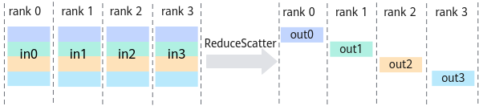

# HcclReduceScatter<a name="ZH-CN_TOPIC_0000002518992197"></a>

## AI处理器支持情况<a name="zh-cn_topic_0000001265400114_section10594071513"></a>

<a name="zh-cn_topic_0000001265400114_table38301303189"></a>
<table><thead align="left"><tr id="zh-cn_topic_0000001265400114_row20831180131817"><th class="cellrowborder" valign="top" width="57.99999999999999%" id="mcps1.1.3.1.1"><p id="zh-cn_topic_0000001265400114_p1883113061818"><a name="zh-cn_topic_0000001265400114_p1883113061818"></a><a name="zh-cn_topic_0000001265400114_p1883113061818"></a><span id="zh-cn_topic_0000001265400114_ph20833205312295"><a name="zh-cn_topic_0000001265400114_ph20833205312295"></a><a name="zh-cn_topic_0000001265400114_ph20833205312295"></a>AI处理器类型</span></p>
</th>
<th class="cellrowborder" align="center" valign="top" width="42%" id="mcps1.1.3.1.2"><p id="zh-cn_topic_0000001265400114_p783113012187"><a name="zh-cn_topic_0000001265400114_p783113012187"></a><a name="zh-cn_topic_0000001265400114_p783113012187"></a>是否支持</p>
</th>
</tr>
</thead>
<tbody><tr id="zh-cn_topic_0000001265400114_row220181016240"><td class="cellrowborder" valign="top" width="57.99999999999999%" headers="mcps1.1.3.1.1 "><p id="zh-cn_topic_0000001265400114_p48327011813"><a name="zh-cn_topic_0000001265400114_p48327011813"></a><a name="zh-cn_topic_0000001265400114_p48327011813"></a><span id="zh-cn_topic_0000001265400114_ph583230201815"><a name="zh-cn_topic_0000001265400114_ph583230201815"></a><a name="zh-cn_topic_0000001265400114_ph583230201815"></a><term id="zh-cn_topic_0000001265400114_zh-cn_topic_0000001312391781_term1253731311225"><a name="zh-cn_topic_0000001265400114_zh-cn_topic_0000001312391781_term1253731311225"></a><a name="zh-cn_topic_0000001265400114_zh-cn_topic_0000001312391781_term1253731311225"></a>Ascend 910C</term></span></p>
</td>
<td class="cellrowborder" align="center" valign="top" width="42%" headers="mcps1.1.3.1.2 "><p id="zh-cn_topic_0000001265400114_p7948163910184"><a name="zh-cn_topic_0000001265400114_p7948163910184"></a><a name="zh-cn_topic_0000001265400114_p7948163910184"></a>√</p>
</td>
</tr>
<tr id="zh-cn_topic_0000001265400114_row173226882415"><td class="cellrowborder" valign="top" width="57.99999999999999%" headers="mcps1.1.3.1.1 "><p id="zh-cn_topic_0000001265400114_p14832120181815"><a name="zh-cn_topic_0000001265400114_p14832120181815"></a><a name="zh-cn_topic_0000001265400114_p14832120181815"></a><span id="zh-cn_topic_0000001265400114_ph1292674871116"><a name="zh-cn_topic_0000001265400114_ph1292674871116"></a><a name="zh-cn_topic_0000001265400114_ph1292674871116"></a><term id="zh-cn_topic_0000001265400114_zh-cn_topic_0000001312391781_term11962195213215"><a name="zh-cn_topic_0000001265400114_zh-cn_topic_0000001312391781_term11962195213215"></a><a name="zh-cn_topic_0000001265400114_zh-cn_topic_0000001312391781_term11962195213215"></a>Ascend 910B</term></span></p>
</td>
<td class="cellrowborder" align="center" valign="top" width="42%" headers="mcps1.1.3.1.2 "><p id="zh-cn_topic_0000001265400114_p19948143911820"><a name="zh-cn_topic_0000001265400114_p19948143911820"></a><a name="zh-cn_topic_0000001265400114_p19948143911820"></a>√</p>
</td>
</tr>
<tr id="zh-cn_topic_0000001265400114_row7263518124916"><td class="cellrowborder" colspan="2" valign="top" headers="mcps1.1.3.1.1 mcps1.1.3.1.2 "><p id="zh-cn_topic_0000001265400114_p5133163315209"><a name="zh-cn_topic_0000001265400114_p5133163315209"></a><a name="zh-cn_topic_0000001265400114_p5133163315209"></a><span id="zh-cn_topic_0000001265400114_ph71511010202"><a name="zh-cn_topic_0000001265400114_ph71511010202"></a><a name="zh-cn_topic_0000001265400114_ph71511010202"></a>注：AI处理器与昇腾产品的对应关系，请参见《<a href="https://www.hiascend.com/document/detail/zh/AscendFAQ/ProduTech/productform/hardwaredesc_0001.html" target="_blank" rel="noopener noreferrer">昇腾产品形态说明</a>》。</span></p>
</td>
</tr>
</tbody>
</table>

> [!NOTE]说明 
> 针对Ascend 910B，仅支持Atlas 800T A2 训练服务器、Atlas 900 A2 PoD 集群基础单元、Atlas 200T A2 Box16 异构子框。

## 功能说明<a name="zh-cn_topic_0000001265400114_section31291646"></a>

集合通信算子ReduceScatter的操作接口，将所有rank的输入相加（或其他归约操作）后，再把结果按照rank编号均匀分散到各个rank的输出buffer，每个进程拿到其他进程1/rank\_size份的数据进行归约操作。

如下图所示，有rank0、rank1、rank2、rank3四个rank，每个rank的输入数据切分成4份，每个进程分别取每个rank的1/4份数据进行sum操作（或其他操作），将结果发送到输出buffer。



## 函数原型<a name="zh-cn_topic_0000001265400114_section18389930"></a>

```
HcclResult HcclReduceScatter(void *sendBuf, void *recvBuf, uint64_t recvCount, HcclDataType dataType, HcclReduceOp op, HcclComm comm, aclrtStream stream)
```

## 参数说明<a name="zh-cn_topic_0000001265400114_section13189358"></a>

<a name="zh-cn_topic_0000001265400114_table24749807"></a>
<table><thead align="left"><tr id="zh-cn_topic_0000001265400114_row60665573"><th class="cellrowborder" valign="top" width="20.200000000000003%" id="mcps1.1.4.1.1"><p id="zh-cn_topic_0000001265400114_p14964341"><a name="zh-cn_topic_0000001265400114_p14964341"></a><a name="zh-cn_topic_0000001265400114_p14964341"></a>参数名</p>
</th>
<th class="cellrowborder" valign="top" width="17.169999999999998%" id="mcps1.1.4.1.2"><p id="zh-cn_topic_0000001265400114_p4152081"><a name="zh-cn_topic_0000001265400114_p4152081"></a><a name="zh-cn_topic_0000001265400114_p4152081"></a>输入/输出</p>
</th>
<th class="cellrowborder" valign="top" width="62.629999999999995%" id="mcps1.1.4.1.3"><p id="zh-cn_topic_0000001265400114_p774306"><a name="zh-cn_topic_0000001265400114_p774306"></a><a name="zh-cn_topic_0000001265400114_p774306"></a>描述</p>
</th>
</tr>
</thead>
<tbody><tr id="zh-cn_topic_0000001265400114_row62718864"><td class="cellrowborder" valign="top" width="20.200000000000003%" headers="mcps1.1.4.1.1 "><p id="zh-cn_topic_0000001265400114_p47063234"><a name="zh-cn_topic_0000001265400114_p47063234"></a><a name="zh-cn_topic_0000001265400114_p47063234"></a>sendBuf</p>
</td>
<td class="cellrowborder" valign="top" width="17.169999999999998%" headers="mcps1.1.4.1.2 "><p id="zh-cn_topic_0000001265400114_p54025633"><a name="zh-cn_topic_0000001265400114_p54025633"></a><a name="zh-cn_topic_0000001265400114_p54025633"></a>输入</p>
</td>
<td class="cellrowborder" valign="top" width="62.629999999999995%" headers="mcps1.1.4.1.3 "><p id="zh-cn_topic_0000001265400114_p14000148"><a name="zh-cn_topic_0000001265400114_p14000148"></a><a name="zh-cn_topic_0000001265400114_p14000148"></a>源数据buffer地址。</p>
</td>
</tr>
<tr id="zh-cn_topic_0000001265400114_row58892473"><td class="cellrowborder" valign="top" width="20.200000000000003%" headers="mcps1.1.4.1.1 "><p id="zh-cn_topic_0000001265400114_p5560998"><a name="zh-cn_topic_0000001265400114_p5560998"></a><a name="zh-cn_topic_0000001265400114_p5560998"></a>recvBuf</p>
</td>
<td class="cellrowborder" valign="top" width="17.169999999999998%" headers="mcps1.1.4.1.2 "><p id="zh-cn_topic_0000001265400114_p47787675"><a name="zh-cn_topic_0000001265400114_p47787675"></a><a name="zh-cn_topic_0000001265400114_p47787675"></a>输出</p>
</td>
<td class="cellrowborder" valign="top" width="62.629999999999995%" headers="mcps1.1.4.1.3 "><p id="zh-cn_topic_0000001265400114_p45596481"><a name="zh-cn_topic_0000001265400114_p45596481"></a><a name="zh-cn_topic_0000001265400114_p45596481"></a>目的数据buffer地址，集合通信结果输出至此buffer中。</p>
</td>
</tr>
<tr id="zh-cn_topic_0000001265400114_row7715150"><td class="cellrowborder" valign="top" width="20.200000000000003%" headers="mcps1.1.4.1.1 "><p id="zh-cn_topic_0000001265400114_p20947391"><a name="zh-cn_topic_0000001265400114_p20947391"></a><a name="zh-cn_topic_0000001265400114_p20947391"></a>recvCount</p>
</td>
<td class="cellrowborder" valign="top" width="17.169999999999998%" headers="mcps1.1.4.1.2 "><p id="zh-cn_topic_0000001265400114_p19017142"><a name="zh-cn_topic_0000001265400114_p19017142"></a><a name="zh-cn_topic_0000001265400114_p19017142"></a>输入</p>
</td>
<td class="cellrowborder" valign="top" width="62.629999999999995%" headers="mcps1.1.4.1.3 "><p id="zh-cn_topic_0000001265400114_p63993496"><a name="zh-cn_topic_0000001265400114_p63993496"></a><a name="zh-cn_topic_0000001265400114_p63993496"></a>参与ReduceScatter操作的recvBuf的数据size，sendBuf的数据size则等于recvCount * rank size。</p>
</td>
</tr>
<tr id="zh-cn_topic_0000001265400114_row39070558"><td class="cellrowborder" valign="top" width="20.200000000000003%" headers="mcps1.1.4.1.1 "><p id="zh-cn_topic_0000001265400114_p10598606"><a name="zh-cn_topic_0000001265400114_p10598606"></a><a name="zh-cn_topic_0000001265400114_p10598606"></a>dataType</p>
</td>
<td class="cellrowborder" valign="top" width="17.169999999999998%" headers="mcps1.1.4.1.2 "><p id="zh-cn_topic_0000001265400114_p53180767"><a name="zh-cn_topic_0000001265400114_p53180767"></a><a name="zh-cn_topic_0000001265400114_p53180767"></a>输入</p>
</td>
<td class="cellrowborder" valign="top" width="62.629999999999995%" headers="mcps1.1.4.1.3 "><p id="zh-cn_topic_0000001265400114_p1114114215138"><a name="zh-cn_topic_0000001265400114_p1114114215138"></a><a name="zh-cn_topic_0000001265400114_p1114114215138"></a>ReduceScatter操作的数据类型，<a href="HcclDataType.md#ZH-CN_TOPIC_0000002486992310">HcclDataType</a>类型。</p>
<p id="zh-cn_topic_0000001265400114_p261131302211"><a name="zh-cn_topic_0000001265400114_p261131302211"></a><a name="zh-cn_topic_0000001265400114_p261131302211"></a> 针对<span id="zh-cn_topic_0000001265400114_ph13754548217"><a name="zh-cn_topic_0000001265400114_ph13754548217"></a><a name="zh-cn_topic_0000001265400114_ph13754548217"></a><term id="zh-cn_topic_0000001265400114_zh-cn_topic_0000001312391781_term1253731311225_1"><a name="zh-cn_topic_0000001265400114_zh-cn_topic_0000001312391781_term1253731311225_1"></a><a name="zh-cn_topic_0000001265400114_zh-cn_topic_0000001312391781_term1253731311225_1"></a>Ascend 910C</term></span>，支持数据类型：int8、int16、int32、int64、float16、float32、bfp16。</p>
<p id="zh-cn_topic_0000001265400114_p16921716151418"><a name="zh-cn_topic_0000001265400114_p16921716151418"></a><a name="zh-cn_topic_0000001265400114_p16921716151418"></a> 针对<span id="zh-cn_topic_0000001265400114_ph14880920154918"><a name="zh-cn_topic_0000001265400114_ph14880920154918"></a><a name="zh-cn_topic_0000001265400114_ph14880920154918"></a><term id="zh-cn_topic_0000001265400114_zh-cn_topic_0000001312391781_term16184138172215"><a name="zh-cn_topic_0000001265400114_zh-cn_topic_0000001312391781_term16184138172215"></a><a name="zh-cn_topic_0000001265400114_zh-cn_topic_0000001312391781_term16184138172215"></a>Ascend 910B</term></span>，支持数据类型：int8、int16、int32、int64、float16、float32、bfp16。需要注意，针对int64数据类型，性能会有一定的劣化。</p>
</td>
</tr>
<tr id="zh-cn_topic_0000001265400114_row46964992"><td class="cellrowborder" valign="top" width="20.200000000000003%" headers="mcps1.1.4.1.1 "><p id="zh-cn_topic_0000001265400114_p46067993"><a name="zh-cn_topic_0000001265400114_p46067993"></a><a name="zh-cn_topic_0000001265400114_p46067993"></a>op</p>
</td>
<td class="cellrowborder" valign="top" width="17.169999999999998%" headers="mcps1.1.4.1.2 "><p id="zh-cn_topic_0000001265400114_p40519951"><a name="zh-cn_topic_0000001265400114_p40519951"></a><a name="zh-cn_topic_0000001265400114_p40519951"></a>输入</p>
</td>
<td class="cellrowborder" valign="top" width="62.629999999999995%" headers="mcps1.1.4.1.3 "><p id="zh-cn_topic_0000001265400114_p60890569"><a name="zh-cn_topic_0000001265400114_p60890569"></a><a name="zh-cn_topic_0000001265400114_p60890569"></a>Reduce的操作类型，目前支持操作类型为sum、prod、max、min。</p>
<div class="note" id="zh-cn_topic_0000001265400114_note4427520124313"><a name="zh-cn_topic_0000001265400114_note4427520124313"></a><a name="zh-cn_topic_0000001265400114_note4427520124313"></a><span class="notetitle"> 说明： </span><div class="notebody"><p id="zh-cn_topic_0000001265400114_p9984151202012"><a name="zh-cn_topic_0000001265400114_p9984151202012"></a><a name="zh-cn_topic_0000001265400114_p9984151202012"></a> 针对<span id="zh-cn_topic_0000001265400114_ph79242619219"><a name="zh-cn_topic_0000001265400114_ph79242619219"></a><a name="zh-cn_topic_0000001265400114_ph79242619219"></a><term id="zh-cn_topic_0000001265400114_zh-cn_topic_0000001312391781_term1253731311225_2"><a name="zh-cn_topic_0000001265400114_zh-cn_topic_0000001312391781_term1253731311225_2"></a><a name="zh-cn_topic_0000001265400114_zh-cn_topic_0000001312391781_term1253731311225_2"></a>Ascend 910C</term></span>，当前版本“prod”操作不支持int16、bfp16数据类型。</p>
<p id="zh-cn_topic_0000001265400114_p10731124313342"><a name="zh-cn_topic_0000001265400114_p10731124313342"></a><a name="zh-cn_topic_0000001265400114_p10731124313342"></a> 针对<span id="zh-cn_topic_0000001265400114_ph49172713419"><a name="zh-cn_topic_0000001265400114_ph49172713419"></a><a name="zh-cn_topic_0000001265400114_ph49172713419"></a><term id="zh-cn_topic_0000001265400114_zh-cn_topic_0000001312391781_term16184138172215_1"><a name="zh-cn_topic_0000001265400114_zh-cn_topic_0000001312391781_term16184138172215_1"></a><a name="zh-cn_topic_0000001265400114_zh-cn_topic_0000001312391781_term16184138172215_1"></a>Ascend 910B</term></span>，当前版本“prod”操作不支持int16、bfp16数据类型。</p>
</div></div>
</td>
</tr>
<tr id="zh-cn_topic_0000001265400114_row11144211"><td class="cellrowborder" valign="top" width="20.200000000000003%" headers="mcps1.1.4.1.1 "><p id="zh-cn_topic_0000001265400114_p30265903"><a name="zh-cn_topic_0000001265400114_p30265903"></a><a name="zh-cn_topic_0000001265400114_p30265903"></a>comm</p>
</td>
<td class="cellrowborder" valign="top" width="17.169999999999998%" headers="mcps1.1.4.1.2 "><p id="zh-cn_topic_0000001265400114_p35619075"><a name="zh-cn_topic_0000001265400114_p35619075"></a><a name="zh-cn_topic_0000001265400114_p35619075"></a>输入</p>
</td>
<td class="cellrowborder" valign="top" width="62.629999999999995%" headers="mcps1.1.4.1.3 "><p id="zh-cn_topic_0000001265400114_p66572856"><a name="zh-cn_topic_0000001265400114_p66572856"></a><a name="zh-cn_topic_0000001265400114_p66572856"></a>集合通信操作所在的通信域。</p>
</td>
</tr>
<tr id="zh-cn_topic_0000001265400114_row62284798"><td class="cellrowborder" valign="top" width="20.200000000000003%" headers="mcps1.1.4.1.1 "><p id="zh-cn_topic_0000001265400114_p11903911"><a name="zh-cn_topic_0000001265400114_p11903911"></a><a name="zh-cn_topic_0000001265400114_p11903911"></a>stream</p>
</td>
<td class="cellrowborder" valign="top" width="17.169999999999998%" headers="mcps1.1.4.1.2 "><p id="zh-cn_topic_0000001265400114_p24692740"><a name="zh-cn_topic_0000001265400114_p24692740"></a><a name="zh-cn_topic_0000001265400114_p24692740"></a>输入</p>
</td>
<td class="cellrowborder" valign="top" width="62.629999999999995%" headers="mcps1.1.4.1.3 "><p id="zh-cn_topic_0000001265400114_p53954942"><a name="zh-cn_topic_0000001265400114_p53954942"></a><a name="zh-cn_topic_0000001265400114_p53954942"></a>本rank所使用的stream。</p>
</td>
</tr>
</tbody>
</table>

## 返回值<a name="zh-cn_topic_0000001265400114_section51595365"></a>

[HcclResult](HcclResult.md#ZH-CN_TOPIC_0000002519072193)：接口成功返回HCCL\_SUCCESS，其他失败。

## 约束说明<a name="zh-cn_topic_0000001265400114_section61705107"></a>

-   所有rank的recvCount、dataType、op均应相同。

## 调用示例<a name="zh-cn_topic_0000001265400114_section204039211474"></a>

```c
uint32_t rankSize = 8;
uint64_t recvCount = 1;  // 每个节点接收的数据数量
uint64_t sendSize = rankSize * recvCount * sizeof(float);
uint64_t recvSize = recvCount * sizeof(float);

// 申请集合通信操作的 Device 内存
void *sendBuf = nullptr, *recvBuf = nullptr;
aclrtMalloc(&sendBuf, sendSize, ACL_MEM_MALLOC_HUGE_FIRST);
aclrtMalloc(&recvBuf, recvSize, ACL_MEM_MALLOC_HUGE_FIRST);

// 初始化通信域和流
HcclComm hcclComm;
HcclCommInitRootInfo(rankSize, &rootInfo, deviceId, &hcclComm);

// 执行 ReduceScatter，将所有 rank 的 sendBuf 相加后，再把结果按照 rank_id 顺序均匀分散到各个 rank 的 recvBuf
HcclReduceScatter(sendBuf, recvBuf, recvCount, HCCL_DATA_TYPE_FP32, HCCL_REDUCE_SUM, hcclComm, stream);
// 阻塞等待任务流中的集合通信任务执行完成
aclrtSynchronizeStream(stream);

// 释放资源
aclrtFree(sendBuf);          // 释放 Device 侧内存
aclrtFree(recvBuf);          // 释放 Device 侧内存
aclrtDestroyStream(stream);  // 销毁任务流
HcclCommDestroy(hcclComm);   // 销毁通信域
```

