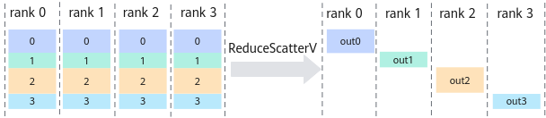

# HcclReduceScatterV<a name="ZH-CN_TOPIC_0000002519072189"></a>

## AI处理器支持情况<a name="zh-cn_topic_0000002174837853_section10594071513"></a>

<a name="zh-cn_topic_0000002174837853_table38301303189"></a>
<table><thead align="left"><tr id="zh-cn_topic_0000002174837853_row20831180131817"><th class="cellrowborder" valign="top" width="57.99999999999999%" id="mcps1.1.3.1.1"><p id="zh-cn_topic_0000002174837853_p1883113061818"><a name="zh-cn_topic_0000002174837853_p1883113061818"></a><a name="zh-cn_topic_0000002174837853_p1883113061818"></a><span id="zh-cn_topic_0000002174837853_ph20833205312295"><a name="zh-cn_topic_0000002174837853_ph20833205312295"></a><a name="zh-cn_topic_0000002174837853_ph20833205312295"></a>AI处理器类型</span></p>
</th>
<th class="cellrowborder" align="center" valign="top" width="42%" id="mcps1.1.3.1.2"><p id="zh-cn_topic_0000002174837853_p783113012187"><a name="zh-cn_topic_0000002174837853_p783113012187"></a><a name="zh-cn_topic_0000002174837853_p783113012187"></a>是否支持</p>
</th>
</tr>
</thead>
<tbody><tr id="zh-cn_topic_0000002174837853_row220181016240"><td class="cellrowborder" valign="top" width="57.99999999999999%" headers="mcps1.1.3.1.1 "><p id="zh-cn_topic_0000002174837853_p48327011813"><a name="zh-cn_topic_0000002174837853_p48327011813"></a><a name="zh-cn_topic_0000002174837853_p48327011813"></a><span id="zh-cn_topic_0000002174837853_ph583230201815"><a name="zh-cn_topic_0000002174837853_ph583230201815"></a><a name="zh-cn_topic_0000002174837853_ph583230201815"></a><term id="zh-cn_topic_0000002174837853_zh-cn_topic_0000001312391781_term1253731311225"><a name="zh-cn_topic_0000002174837853_zh-cn_topic_0000001312391781_term1253731311225"></a><a name="zh-cn_topic_0000002174837853_zh-cn_topic_0000001312391781_term1253731311225"></a>Ascend 910C</term></span></p>
</td>
<td class="cellrowborder" align="center" valign="top" width="42%" headers="mcps1.1.3.1.2 "><p id="zh-cn_topic_0000002174837853_p1827411542492"><a name="zh-cn_topic_0000002174837853_p1827411542492"></a><a name="zh-cn_topic_0000002174837853_p1827411542492"></a>√</p>
</td>
</tr>
<tr id="zh-cn_topic_0000002174837853_row173226882415"><td class="cellrowborder" valign="top" width="57.99999999999999%" headers="mcps1.1.3.1.1 "><p id="zh-cn_topic_0000002174837853_p14832120181815"><a name="zh-cn_topic_0000002174837853_p14832120181815"></a><a name="zh-cn_topic_0000002174837853_p14832120181815"></a><span id="zh-cn_topic_0000002174837853_ph1292674871116"><a name="zh-cn_topic_0000002174837853_ph1292674871116"></a><a name="zh-cn_topic_0000002174837853_ph1292674871116"></a><term id="zh-cn_topic_0000002174837853_zh-cn_topic_0000001312391781_term11962195213215"><a name="zh-cn_topic_0000002174837853_zh-cn_topic_0000001312391781_term11962195213215"></a><a name="zh-cn_topic_0000002174837853_zh-cn_topic_0000001312391781_term11962195213215"></a>Ascend 910B</term></span></p>
</td>
<td class="cellrowborder" align="center" valign="top" width="42%" headers="mcps1.1.3.1.2 "><p id="zh-cn_topic_0000002174837853_p19948143911820"><a name="zh-cn_topic_0000002174837853_p19948143911820"></a><a name="zh-cn_topic_0000002174837853_p19948143911820"></a>√</p>
</td>
</tr>
<tr id="zh-cn_topic_0000002174837853_row18310132614918"><td class="cellrowborder" colspan="2" valign="top" headers="mcps1.1.3.1.1 mcps1.1.3.1.2 "><p id="zh-cn_topic_0000002174837853_p5133163315209"><a name="zh-cn_topic_0000002174837853_p5133163315209"></a><a name="zh-cn_topic_0000002174837853_p5133163315209"></a><span id="zh-cn_topic_0000002174837853_ph71511010202"><a name="zh-cn_topic_0000002174837853_ph71511010202"></a><a name="zh-cn_topic_0000002174837853_ph71511010202"></a>注：AI处理器与昇腾产品的对应关系，请参见《<a href="https://www.hiascend.com/document/detail/zh/AscendFAQ/ProduTech/productform/hardwaredesc_0001.html" target="_blank" rel="noopener noreferrer">昇腾产品形态说明</a>》。</span></p>
</td>
</tr>
</tbody>
</table>

> [!NOTE]说明 
> 针对Ascend 910B，仅支持Atlas 800T A2 训练服务器、Atlas 900 A2 PoD 集群基础单元、Atlas 200T A2 Box16 异构子框。

## 功能说明<a name="zh-cn_topic_0000002174837853_section31291646"></a>

集合通信算子ReduceScatterV的操作接口，将所有rank的输入相加（或其他归约操作）后，再把结果按照rank编号分散到各个rank的输出buffer，每个进程拿到其他进程对应rank编号的数据进行归约操作。

与ReduceScatter算子不同的是，ReduceScatterV算子支持为通信域内不同的节点配置不同大小的数据量。

如下图所示，有rank0、rank1、rank2、rank3四个rank，每个进程分别取其他进程对应rank编号的数据进行sum操作（或其他操作），将结果发送到输出buffer。



## 函数原型<a name="zh-cn_topic_0000002174837853_section18389930"></a>

```
HcclResult HcclReduceScatterV(void *sendBuf, const void *sendCounts, const void *sendDispls, void *recvBuf, uint64_t recvCount, HcclDataType dataType, HcclReduceOp op, HcclComm comm, aclrtStream stream)
```

## 参数说明<a name="zh-cn_topic_0000002174837853_section13189358"></a>

<a name="zh-cn_topic_0000002174837853_table24749807"></a>
<table><thead align="left"><tr id="zh-cn_topic_0000002174837853_row60665573"><th class="cellrowborder" valign="top" width="20.200000000000003%" id="mcps1.1.4.1.1"><p id="zh-cn_topic_0000002174837853_p14964341"><a name="zh-cn_topic_0000002174837853_p14964341"></a><a name="zh-cn_topic_0000002174837853_p14964341"></a>参数名</p>
</th>
<th class="cellrowborder" valign="top" width="17.150000000000002%" id="mcps1.1.4.1.2"><p id="zh-cn_topic_0000002174837853_p4152081"><a name="zh-cn_topic_0000002174837853_p4152081"></a><a name="zh-cn_topic_0000002174837853_p4152081"></a>输入/输出</p>
</th>
<th class="cellrowborder" valign="top" width="62.64999999999999%" id="mcps1.1.4.1.3"><p id="zh-cn_topic_0000002174837853_p774306"><a name="zh-cn_topic_0000002174837853_p774306"></a><a name="zh-cn_topic_0000002174837853_p774306"></a>描述</p>
</th>
</tr>
</thead>
<tbody><tr id="zh-cn_topic_0000002174837853_row62718864"><td class="cellrowborder" valign="top" width="20.200000000000003%" headers="mcps1.1.4.1.1 "><p id="zh-cn_topic_0000002174837853_p47063234"><a name="zh-cn_topic_0000002174837853_p47063234"></a><a name="zh-cn_topic_0000002174837853_p47063234"></a>sendBuf</p>
</td>
<td class="cellrowborder" valign="top" width="17.150000000000002%" headers="mcps1.1.4.1.2 "><p id="zh-cn_topic_0000002174837853_p54025633"><a name="zh-cn_topic_0000002174837853_p54025633"></a><a name="zh-cn_topic_0000002174837853_p54025633"></a>输入</p>
</td>
<td class="cellrowborder" valign="top" width="62.64999999999999%" headers="mcps1.1.4.1.3 "><p id="zh-cn_topic_0000002174837853_p14000148"><a name="zh-cn_topic_0000002174837853_p14000148"></a><a name="zh-cn_topic_0000002174837853_p14000148"></a>源数据buffer地址。</p>
</td>
</tr>
<tr id="zh-cn_topic_0000002174837853_row885675512302"><td class="cellrowborder" valign="top" width="20.200000000000003%" headers="mcps1.1.4.1.1 "><p id="zh-cn_topic_0000002174837853_p3857115511308"><a name="zh-cn_topic_0000002174837853_p3857115511308"></a><a name="zh-cn_topic_0000002174837853_p3857115511308"></a>sendCounts</p>
</td>
<td class="cellrowborder" valign="top" width="17.150000000000002%" headers="mcps1.1.4.1.2 "><p id="zh-cn_topic_0000002174837853_p885716551303"><a name="zh-cn_topic_0000002174837853_p885716551303"></a><a name="zh-cn_topic_0000002174837853_p885716551303"></a>输入</p>
</td>
<td class="cellrowborder" valign="top" width="62.64999999999999%" headers="mcps1.1.4.1.3 "><p id="zh-cn_topic_0000002174837853_p719219557431"><a name="zh-cn_topic_0000002174837853_p719219557431"></a><a name="zh-cn_topic_0000002174837853_p719219557431"></a>参与ReduceScatterV操作的每个rank在sendBuf中的数据size，为uint64类型的数组。</p>
<p id="zh-cn_topic_0000002174837853_p201691033122720"><a name="zh-cn_topic_0000002174837853_p201691033122720"></a><a name="zh-cn_topic_0000002174837853_p201691033122720"></a>该数组的第i个元素表示需要向rank i发送的数据量。</p>
</td>
</tr>
<tr id="zh-cn_topic_0000002174837853_row3606563311"><td class="cellrowborder" valign="top" width="20.200000000000003%" headers="mcps1.1.4.1.1 "><p id="zh-cn_topic_0000002174837853_p136063673112"><a name="zh-cn_topic_0000002174837853_p136063673112"></a><a name="zh-cn_topic_0000002174837853_p136063673112"></a>sendDispls</p>
</td>
<td class="cellrowborder" valign="top" width="17.150000000000002%" headers="mcps1.1.4.1.2 "><p id="zh-cn_topic_0000002174837853_p260614610316"><a name="zh-cn_topic_0000002174837853_p260614610316"></a><a name="zh-cn_topic_0000002174837853_p260614610316"></a>输入</p>
</td>
<td class="cellrowborder" valign="top" width="62.64999999999999%" headers="mcps1.1.4.1.3 "><p id="zh-cn_topic_0000002174837853_p123091053114318"><a name="zh-cn_topic_0000002174837853_p123091053114318"></a><a name="zh-cn_topic_0000002174837853_p123091053114318"></a>参与ReduceScatterV操作的每个rank的数据在sendBuf中的偏移量（单位为dataType），为uint64类型的数组。</p>
<p id="zh-cn_topic_0000002174837853_p136693624615"><a name="zh-cn_topic_0000002174837853_p136693624615"></a><a name="zh-cn_topic_0000002174837853_p136693624615"></a>该数组的第i个元素表示向rank i发送的数据在sendBuf中的偏移量。</p>
</td>
</tr>
<tr id="zh-cn_topic_0000002174837853_row58892473"><td class="cellrowborder" valign="top" width="20.200000000000003%" headers="mcps1.1.4.1.1 "><p id="zh-cn_topic_0000002174837853_p5560998"><a name="zh-cn_topic_0000002174837853_p5560998"></a><a name="zh-cn_topic_0000002174837853_p5560998"></a>recvBuf</p>
</td>
<td class="cellrowborder" valign="top" width="17.150000000000002%" headers="mcps1.1.4.1.2 "><p id="zh-cn_topic_0000002174837853_p47787675"><a name="zh-cn_topic_0000002174837853_p47787675"></a><a name="zh-cn_topic_0000002174837853_p47787675"></a>输出</p>
</td>
<td class="cellrowborder" valign="top" width="62.64999999999999%" headers="mcps1.1.4.1.3 "><p id="zh-cn_topic_0000002174837853_p45596481"><a name="zh-cn_topic_0000002174837853_p45596481"></a><a name="zh-cn_topic_0000002174837853_p45596481"></a>目的数据buffer地址，集合通信结果输出至此buffer中。</p>
</td>
</tr>
<tr id="zh-cn_topic_0000002174837853_row7715150"><td class="cellrowborder" valign="top" width="20.200000000000003%" headers="mcps1.1.4.1.1 "><p id="zh-cn_topic_0000002174837853_p20947391"><a name="zh-cn_topic_0000002174837853_p20947391"></a><a name="zh-cn_topic_0000002174837853_p20947391"></a>recvCount</p>
</td>
<td class="cellrowborder" valign="top" width="17.150000000000002%" headers="mcps1.1.4.1.2 "><p id="zh-cn_topic_0000002174837853_p19017142"><a name="zh-cn_topic_0000002174837853_p19017142"></a><a name="zh-cn_topic_0000002174837853_p19017142"></a>输入</p>
</td>
<td class="cellrowborder" valign="top" width="62.64999999999999%" headers="mcps1.1.4.1.3 "><p id="zh-cn_topic_0000002174837853_p2198183114317"><a name="zh-cn_topic_0000002174837853_p2198183114317"></a><a name="zh-cn_topic_0000002174837853_p2198183114317"></a>参与ReduceScatterV操作的rank对应recvBuf的数据size。</p>
<p id="zh-cn_topic_0000002174837853_p20599122510436"><a name="zh-cn_topic_0000002174837853_p20599122510436"></a><a name="zh-cn_topic_0000002174837853_p20599122510436"></a>假设当前rank的编号为i，则recvCount的值需要与sendCounts数组中下标为i的元素值相同。</p>
</td>
</tr>
<tr id="zh-cn_topic_0000002174837853_row39070558"><td class="cellrowborder" valign="top" width="20.200000000000003%" headers="mcps1.1.4.1.1 "><p id="zh-cn_topic_0000002174837853_p10598606"><a name="zh-cn_topic_0000002174837853_p10598606"></a><a name="zh-cn_topic_0000002174837853_p10598606"></a>dataType</p>
</td>
<td class="cellrowborder" valign="top" width="17.150000000000002%" headers="mcps1.1.4.1.2 "><p id="zh-cn_topic_0000002174837853_p53180767"><a name="zh-cn_topic_0000002174837853_p53180767"></a><a name="zh-cn_topic_0000002174837853_p53180767"></a>输入</p>
</td>
<td class="cellrowborder" valign="top" width="62.64999999999999%" headers="mcps1.1.4.1.3 "><p id="zh-cn_topic_0000002174837853_p1114114215138"><a name="zh-cn_topic_0000002174837853_p1114114215138"></a><a name="zh-cn_topic_0000002174837853_p1114114215138"></a>ReduceScatterV操作的数据类型，<a href="HcclDataType.md#ZH-CN_TOPIC_0000002486992310">HcclDataType</a>类型。</p>
<p id="zh-cn_topic_0000002174837853_p261131302211"><a name="zh-cn_topic_0000002174837853_p261131302211"></a><a name="zh-cn_topic_0000002174837853_p261131302211"></a> 针对<span id="zh-cn_topic_0000002174837853_ph13754548217"><a name="zh-cn_topic_0000002174837853_ph13754548217"></a><a name="zh-cn_topic_0000002174837853_ph13754548217"></a><term id="zh-cn_topic_0000002174837853_zh-cn_topic_0000001312391781_term1253731311225_1"><a name="zh-cn_topic_0000002174837853_zh-cn_topic_0000001312391781_term1253731311225_1"></a><a name="zh-cn_topic_0000002174837853_zh-cn_topic_0000001312391781_term1253731311225_1"></a>Ascend 910C</term></span>，支持数据类型：int8、int16、int32、float16、float32、bfp16。</p>
<p id="zh-cn_topic_0000002174837853_p16921716151418"><a name="zh-cn_topic_0000002174837853_p16921716151418"></a><a name="zh-cn_topic_0000002174837853_p16921716151418"></a> 针对<span id="zh-cn_topic_0000002174837853_ph14880920154918"><a name="zh-cn_topic_0000002174837853_ph14880920154918"></a><a name="zh-cn_topic_0000002174837853_ph14880920154918"></a><term id="zh-cn_topic_0000002174837853_zh-cn_topic_0000001312391781_term16184138172215"><a name="zh-cn_topic_0000002174837853_zh-cn_topic_0000001312391781_term16184138172215"></a><a name="zh-cn_topic_0000002174837853_zh-cn_topic_0000001312391781_term16184138172215"></a>Ascend 910B</term></span>，支持数据类型：int8、int16、int32、float16、float32、bfp16。</p>
</td>
</tr>
<tr id="zh-cn_topic_0000002174837853_row46964992"><td class="cellrowborder" valign="top" width="20.200000000000003%" headers="mcps1.1.4.1.1 "><p id="zh-cn_topic_0000002174837853_p46067993"><a name="zh-cn_topic_0000002174837853_p46067993"></a><a name="zh-cn_topic_0000002174837853_p46067993"></a>op</p>
</td>
<td class="cellrowborder" valign="top" width="17.150000000000002%" headers="mcps1.1.4.1.2 "><p id="zh-cn_topic_0000002174837853_p40519951"><a name="zh-cn_topic_0000002174837853_p40519951"></a><a name="zh-cn_topic_0000002174837853_p40519951"></a>输入</p>
</td>
<td class="cellrowborder" valign="top" width="62.64999999999999%" headers="mcps1.1.4.1.3 "><p id="zh-cn_topic_0000002174837853_p135519418474"><a name="zh-cn_topic_0000002174837853_p135519418474"></a><a name="zh-cn_topic_0000002174837853_p135519418474"></a>Reduce的操作类型。</p>
<p id="zh-cn_topic_0000002174837853_p2077910161390"><a name="zh-cn_topic_0000002174837853_p2077910161390"></a><a name="zh-cn_topic_0000002174837853_p2077910161390"></a> 针对<span id="zh-cn_topic_0000002174837853_ph164912228399"><a name="zh-cn_topic_0000002174837853_ph164912228399"></a><a name="zh-cn_topic_0000002174837853_ph164912228399"></a><term id="zh-cn_topic_0000002174837853_zh-cn_topic_0000001312391781_term1253731311225_2"><a name="zh-cn_topic_0000002174837853_zh-cn_topic_0000001312391781_term1253731311225_2"></a><a name="zh-cn_topic_0000002174837853_zh-cn_topic_0000001312391781_term1253731311225_2"></a>Ascend 910C</term></span>，支持的操作类型为sum、max、min。</p>
<p id="zh-cn_topic_0000002174837853_p60890569"><a name="zh-cn_topic_0000002174837853_p60890569"></a><a name="zh-cn_topic_0000002174837853_p60890569"></a> 针对<span id="zh-cn_topic_0000002174837853_ph149551118476"><a name="zh-cn_topic_0000002174837853_ph149551118476"></a><a name="zh-cn_topic_0000002174837853_ph149551118476"></a><term id="zh-cn_topic_0000002174837853_zh-cn_topic_0000001312391781_term16184138172215_1"><a name="zh-cn_topic_0000002174837853_zh-cn_topic_0000001312391781_term16184138172215_1"></a><a name="zh-cn_topic_0000002174837853_zh-cn_topic_0000001312391781_term16184138172215_1"></a>Ascend 910B</term></span>，支持的操作类型为sum、max、min。</p>
</td>
</tr>
<tr id="zh-cn_topic_0000002174837853_row11144211"><td class="cellrowborder" valign="top" width="20.200000000000003%" headers="mcps1.1.4.1.1 "><p id="zh-cn_topic_0000002174837853_p30265903"><a name="zh-cn_topic_0000002174837853_p30265903"></a><a name="zh-cn_topic_0000002174837853_p30265903"></a>comm</p>
</td>
<td class="cellrowborder" valign="top" width="17.150000000000002%" headers="mcps1.1.4.1.2 "><p id="zh-cn_topic_0000002174837853_p35619075"><a name="zh-cn_topic_0000002174837853_p35619075"></a><a name="zh-cn_topic_0000002174837853_p35619075"></a>输入</p>
</td>
<td class="cellrowborder" valign="top" width="62.64999999999999%" headers="mcps1.1.4.1.3 "><p id="zh-cn_topic_0000002174837853_p66572856"><a name="zh-cn_topic_0000002174837853_p66572856"></a><a name="zh-cn_topic_0000002174837853_p66572856"></a>集合通信操作所在的通信域。</p>
</td>
</tr>
<tr id="zh-cn_topic_0000002174837853_row62284798"><td class="cellrowborder" valign="top" width="20.200000000000003%" headers="mcps1.1.4.1.1 "><p id="zh-cn_topic_0000002174837853_p11903911"><a name="zh-cn_topic_0000002174837853_p11903911"></a><a name="zh-cn_topic_0000002174837853_p11903911"></a>stream</p>
</td>
<td class="cellrowborder" valign="top" width="17.150000000000002%" headers="mcps1.1.4.1.2 "><p id="zh-cn_topic_0000002174837853_p24692740"><a name="zh-cn_topic_0000002174837853_p24692740"></a><a name="zh-cn_topic_0000002174837853_p24692740"></a>输入</p>
</td>
<td class="cellrowborder" valign="top" width="62.64999999999999%" headers="mcps1.1.4.1.3 "><p id="zh-cn_topic_0000002174837853_p53954942"><a name="zh-cn_topic_0000002174837853_p53954942"></a><a name="zh-cn_topic_0000002174837853_p53954942"></a>本rank所使用的stream。</p>
</td>
</tr>
</tbody>
</table>

## 返回值<a name="zh-cn_topic_0000002174837853_section51595365"></a>

[HcclResult](HcclResult.md#ZH-CN_TOPIC_0000002519072193)：接口成功返回HCCL\_SUCCESS，其他失败。

## 约束说明<a name="zh-cn_topic_0000002174837853_section61705107"></a>

-   所有rank的sendCounts、sendDispls、dataType、op均应相同。
-   针对Ascend 910C，仅支持单Server场景。
-   针对Ascend 910B，仅支持多机对称分布场景，不支持非对称分布（即卡数非对称）的场景。

