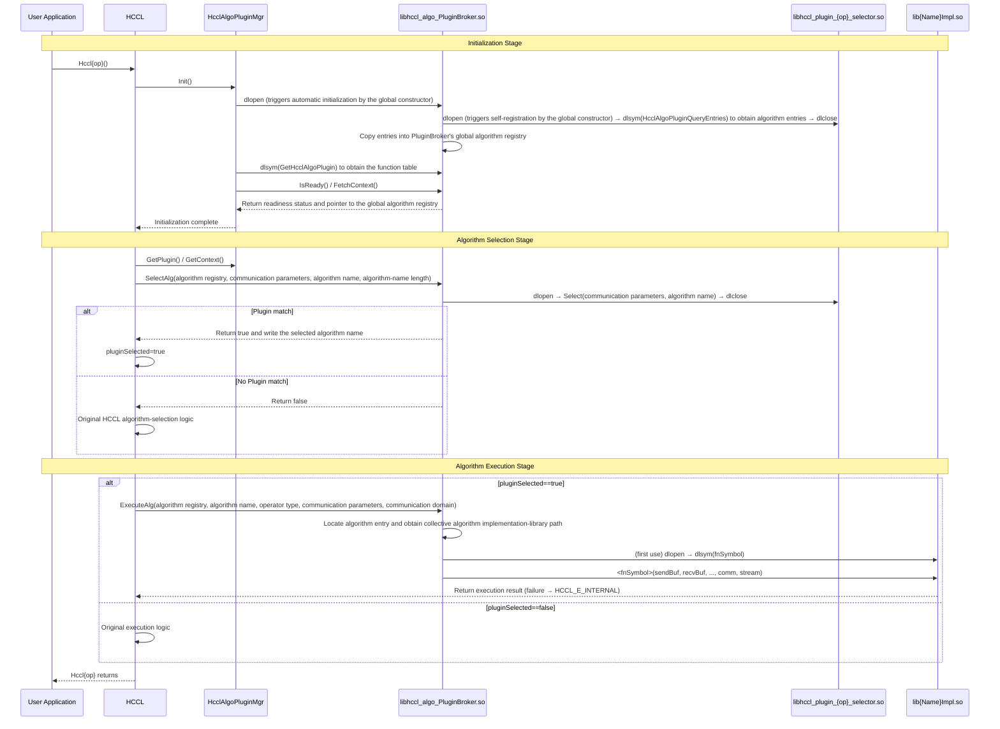

# RFC: HCCL-ALGO-Plugin — HCCL Custom Algorithm Extension Framework

- Start Date: 2026-05-29
- RFC PR: 1285
- Related Issue: 126

---

## 1. Summary

HCCL-ALGO-Plugin is designed to provide HCCL with a custom algorithm extension framework. Its goal is to allow users to add custom algorithms for existing operators (such as AllReduce and AllGather) in the form of dynamic libraries without modifying HCCL core code, so that custom algorithms can be seamlessly integrated into the existing algorithm selection and execution flow.

---

## 2. Background and Motivation

### 2.1 Background

The HCCL operator repository contains multiple operators (AllReduce, AllGather, Broadcast, Reduce, etc.), and each operator can contain multiple algorithm implementations. Algorithms are currently selected in the following ways:

- **Topology-aware selection**: Automatically selects the most suitable algorithm according to the cluster topology (1D Mesh, 2D Mesh, CLOS, etc.).
- **Data-size thresholds**: Selects different algorithms according to the amount of transferred data (for example, OneShot for small data and TwoShot/NHR for large data).
- **Hardware-form adaptation**: Different hardware forms (such as 950) require different algorithm implementations.

Adding a new algorithm currently has the following limitations:

- **Code intrusion**: HCCL source code must be modified to add registration code.
- **Build coupling**: New algorithms must be compiled together with the HCCL source code.
- **Release dependency**: Algorithm updates require recompiling and releasing the entire HCCL package.
- **Closed selection logic**: New algorithms are difficult to integrate into the existing algorithm selection flow.

The HCCL-ALGO-Plugin design addresses these limitations one by one:

- **Addressing code intrusion**: To develop a new algorithm, users only need to implement the standard interfaces and package the implementation as a dynamic library, with **no need to modify any HCCL source code**.
- **Addressing build coupling**: Custom algorithms are delivered as independent dynamic libraries (`.so`) and loaded at runtime through `dlopen`, so they are **fully decoupled from the HCCL main library at build time**. Users can compile algorithm packages independently with separate build scripts.
- **Addressing release dependency**: The PluginBroker dynamic library and custom algorithm dynamic libraries can both be installed independently in specified directories. **Updating an algorithm only requires replacing the corresponding `.so` file**, without recompiling or releasing the entire HCCL package.
- **Addressing closed selection logic**: HCCL-ALGO-Plugin inserts a higher-priority matching path at the entry of HCCL's original algorithm selection flow. **Custom algorithms can seamlessly participate in the existing selection process**; if no custom algorithm matches, selection automatically falls back to the original logic, and the two mechanisms do not interfere with each other.

### 2.2 Supported Scenarios

HCCL-ALGO-Plugin supports the following custom algorithm extension scenarios:
- **New algorithm implementations**: Users want to add newly designed algorithms, such as optimized Ring or Tree variants.
- **New hardware support**: New hardware forms or topology structures require corresponding algorithm implementations.
- **Customized optimization**: Algorithms are customized for specific service scenarios, such as specific network environments or data patterns.
- **Experimental algorithms**: New algorithm performance is validated outside production environments.

---

## 3. HCCL Communication Library Code Structure and Operator Execution Flow

### 3.1 HCCL Communication Library Code Structure

The key directories of the HCCL communication library are shown below:
```
│── src                          # HCCL operator source directory
|    ├── common                  # Common logic, including type definitions, logging modules, etc.
|    └── ops                     # HCCL operator implementations
|        ├── all_gather          # AllGather operator implementation
|        ├── all_reduce          # AllReduce operator implementation
|        ├── broadcast           # Broadcast operator implementation
|        |   ├── executor        # Broadcast operator executor
|        |   ├── selector        # Broadcast algorithm selector
|        |   ├── template        # Broadcast algorithm template
|        |   └── broadcast_op.cc # External API implementation of the Broadcast operator
|        ├── ......              # Other operator implementations
|        └──  op_common          # Common operator components
|            ├── executor        # Executors
|            ├── selector        # Algorithm selectors
|            ├── template        # Algorithm templates
|            ├── topo            # Communication-domain topology acquisition and conversion
|            └── op_common.cc    # Common operator functions
├── include                      # HCCL public headers
├── test                         # Test code directory
├── examples                     # Example code directory
├── build.sh                     # Build script
└── .......                      # Other directories

```
The `/ops` directory defines HCCL operator implementations, including common collective communication operators such as `all_gather` and `all_reduce`. Each operator implements its executor (`executor`), algorithm selector (`selector`), algorithm template (`template`), and public API file (`XX_op.cc`).

The `/op_common` directory under `/ops` defines common operator components, including executor base classes, shared algorithm-selection logic, algorithm-template base classes, communication-domain topology processing, and other infrastructure shared by operators.

### 3.2 HCCL Communication Library Operator Execution Flow

Take the execution flow of the `Broadcast` operator as an example. After an application calls `HcclBroadcast()`, HCCL first checks whether the device is a 910_95 or 950 device. If it is not a 910_95 or 950 device, execution falls back to the legacy logic by calling `HcclBroadcastInner()` to implement the `Broadcast` operation, and the flow below is not executed.
Otherwise, the `Broadcast` operation is mainly completed in two steps: **algorithm selection** and **algorithm execution**. The detailed flow is as follows:

(1) Call `Selector()` to select an algorithm:

1) `Selector()` is located in `src/ops/op_common/op_common.cc`. Its main logic is:
Create the algorithm-selection executor instance `collAlgSelector` (the `ExecuteSelector` class) and call `collAlgSelector->Run()`.

2) `Run()` is located in `src/ops/op_common/selector/execute_selector.cc`. Its main logic is:
① Obtain all registered selectors from the global selector registry;
② If the operator is in Mc2 mode (Multi-Channel v2), set its selector set to only the selector with priority 18. If the operator is not in Mc2 mode, obtain the selector set according to the operation type;
③ Traverse the selector set from high priority to low priority and invoke each selector's `Select()` method to check whether it matches;
④ If `Select()` returns `SelectorStatus::MATCH`, the execution algorithm has been selected and traversal stops; otherwise, continue with the next selector.

3) `Select()` is located in `src/ops/op_common/selector/auto_selector_base.cc`. Its main logic is:
Call the corresponding selection function according to the running mode (DPU, CCU_MS, AIV, AICPU, etc.). For example, in AICPU mode, call `SelectAicpuAlgo()` for algorithm selection.

4) The `SelectAicpuAlgo()` function of the `Broadcast` operator is located in `src/ops/broadcast/selector/broadcast_auto_selector.cc`. Its main logic is:
Select the algorithm name according to topology information, such as the exact shape of `Level0Topo` and the number of hierarchy levels. For example, in a multi-level topology, if `Level0Topo` is a Mesh, select the `ParallelMesh1DNHR` algorithm.

(2) Call `HcclExecOp()` to execute the algorithm selected by `Selector()`.

1) `HcclExecOp()` is located in `src/ops/op_common/op_common.cc`. Its main logic is:
① Obtain the corresponding `executor` instance according to the operation type and selected algorithm name (the following description assumes that `ParallelMesh1DNHR` is selected);
② Create threads and calculate the resources required for communication;
③ Execute the algorithm by invoking the algorithm orchestration of the `executor`, namely `executor->Orchestrate()`.

2) The `Orchestrate()` function of the `executor` is located in `src/ops/broadcast/executor/ins_v2_broadcast_sole_executor.cc`. Its main logic is:
① Further calculate resources, perform data slicing, and complete other preparation steps;
② Invoke the `KernelRun` function of the `ParallelMesh1DNHR` algorithm template to complete the communication operation, namely `algTemplate->KernelRun()`.

3) The `KernelRun` function of the `ParallelMesh1DNHR` algorithm is located in `src/ops/broadcast/template/aicpu/ins_temp_broadcast_nhr.cc`. Its main logic is:
Execute remote reads, remote writes, local thread synchronization, local data copies, and other operations according to the NHR algorithm logic to complete the communication.

---

## 4. Overall Design

### 4.1 Overall Architecture

#### 4.1.1 Plugin System Components

The overall architecture of HCCL-ALGO-Plugin is shown in Figure 1:
<div style="text-align: center;">
  
  <p><b>Figure 1 Overall Architecture</b></p>
</div>

The HCCL-ALGO-Plugin system consists of three parts:

**(1) Plugin Manager**

The Plugin Manager (`HcclAlgoPluginMgr`) is embedded in the HCCL repository. It loads the PluginBroker dynamic library through `dlopen`, stores its handle and function-table pointer, and invokes custom algorithm selection and execution from within the HCCL repository.

**(2) PluginBroker Dynamic Library**

The PluginBroker dynamic library (`libhccl_algo_PluginBroker.so`) is a module independent of HCCL and acts as the bridge between HCCL and custom algorithms. When the PluginBroker dynamic library is loaded by `HcclAlgoPluginMgr`, the constructor of its internal global static object automatically scans operator root directories and builds the global algorithm registry, without requiring an explicit initialization interface. The PluginBroker dynamic library defines and implements all interfaces in the `HcclAlgoPlugin_t` function table:

- **`IsReady()` interface**: Returns whether automatic initialization succeeded.

- **`FetchContext()` interface**: Returns a pointer to the automatically constructed global algorithm registry.

- **`SelectAlg()` interface**: Loads the custom algorithm-selection dynamic library (`libhccl_plugin_{op}_selector.so`) for the corresponding operator and performs the selection decision.

- **`ExecuteAlg()` interface**: Locates the collective algorithm implementation dynamic library (`lib{Name}Impl.so`) according to the custom algorithm name, lazily loads it, and calls the corresponding algorithm execution function to complete communication.

- **`QueryAlgs()` interface**: Queries the list of registered custom algorithms.

**(3) Custom Algorithm Implementation Dynamic Libraries**

- **Custom algorithm-selection dynamic library (`libhccl_plugin_{op}_selector.so`)**: Each operator has one independent algorithm-selection library. A custom algorithm developer declares each custom algorithm as a global static object using the `REGISTER_HCCL_ALGO(algName, soPath, fnSymbol)` macro provided by the SDK. When the `.so` is loaded with `dlopen`, its constructor automatically writes the entry into the private registry inside that `.so` (registries in different `libhccl_plugin_{op}_selector.so` libraries are mutually invisible). `libhccl_plugin_{op}_selector.so` must export two standard C interfaces:

  - `HcclAlgoPluginQueryEntries()`: Uniformly implemented by the SDK header, so users do not need to write it manually. It returns a pointer to all algorithm entries automatically registered in the `.so` and the number of entries, for use during PluginBroker initialization.

  - `Select()`: Dynamically selects an algorithm according to the parameters of the current communication operation together with internal policy logic such as topology information, data size, and Rank scale, and returns the selected algorithm name.

- **Custom collective algorithm implementation dynamic library (`lib{Name}Impl.so`)**: The number of collective algorithm implementation `.so` files under each operator directory is determined by the user. All algorithms for one operator can be packaged into one `.so`; the algorithms can also be divided into groups with each group packaged into one `.so`; or each algorithm can have its own `.so`. Each algorithm must export an algorithm execution function from its containing `.so`. The function symbol name is customized by the user and communicated to PluginBroker through the `fnSymbol` field declared by the `REGISTER_HCCL_ALGO` macro. The execution function signature must strictly match the standard signature corresponding to that operator (the parameter list and return type are fixed; see Section 4.2.3).

#### 4.1.2 Custom Algorithm Invocation Sequence

As shown in Figure 2, custom algorithm invocation is divided into three stages:

- **Initialization stage**: When HCCL initializes the collective communication execution environment, it triggers `HcclAlgoPluginMgr::Init()` to load the PluginBroker dynamic library through `dlopen`. The loading action itself triggers the global constructor of the PluginBroker dynamic library to automatically scan operator directories under `HCCL_PLUGIN_ALG_DIR`. For each operator directory, PluginBroker performs `dlopen` on `libhccl_plugin_{op}_selector.so`, which triggers that selector library's own constructor to complete algorithm self-registration. The PluginBroker dynamic library obtains the registered algorithm entries through `dlsym(HcclAlgoPluginQueryEntries)` and copies them into PluginBroker's global algorithm registry.

- **Algorithm selection stage**: On each collective communication call, HCCL first calls `plugin->SelectAlg()` for algorithm selection. PluginBroker loads the algorithm-selection dynamic library for the corresponding operator using `dlopen(RTLD_NOW | RTLD_LOCAL)`, obtains the `Select()` interface through `dlsym`, and immediately calls `dlclose` after the selection completes. If a custom algorithm matches, its algorithm name is returned and `pluginSelected=true` is set. If no custom algorithm matches, selection falls back to HCCL's original algorithm-selection logic.

The current version does not cache `dlopen` handles for `libhccl_plugin_{op}_selector.so` at process scope. Instead, it keeps the short-lived `dlopen → Select → dlclose` pattern described above to reduce the long-term residency of selector dynamic libraries and their internal state, and to simplify plugin lifecycle and isolation management. This approach introduces repeated dynamic-loading overhead, which can be more noticeable in high-frequency, small-data collective communication scenarios; the current version accepts this performance trade-off. If later performance tests show that dynamic loading becomes a bottleneck, a selector-handle caching mechanism can be introduced without changing the existing Plugin ABI.

- **Algorithm execution stage**: If a Plugin algorithm is selected, HCCL calls `plugin->ExecuteAlg()` to execute the custom collective algorithm. PluginBroker locates the collective algorithm implementation dynamic library according to the algorithm registry, lazily loads the dynamic library on first execution, resolves the algorithm execution function pointer using `dlsym`, and then calls the corresponding algorithm execution function to complete communication. If PluginBroker or the custom algorithm returns a value other than `HCCL_SUCCESS`, HCCL first records the original error code returned by the Plugin for diagnostics and then uniformly maps the result to `HCCL_E_INTERNAL` at the Plugin boundary before propagating it upward. After such a failure, HCCL does not fall back to its original algorithm execution logic. If no Plugin algorithm is selected, HCCL executes the original logic.


<div style="text-align: center;">
  <b>Figure 2 Custom Algorithm Invocation Sequence</b>
</div>

#### 4.1.3 Directory Organization

The three parts of the HCCL-ALGO-Plugin system are organized in different directory locations:

**(1) HcclAlgoPluginMgr (inside the HCCL repository)**

`HcclAlgoPluginMgr` is a component embedded in the HCCL repository. Its source code can be located under the `src/` directory of the HCCL repository and compiled and released together with the HCCL main library `libhccl.so`.

**(2) PluginBroker dynamic library (`libhccl_algo_PluginBroker.so`)**

The PluginBroker dynamic library is a module independent of the HCCL main library. The path to the PluginBroker dynamic library is specified through the `HCCL_ALGO_PLUGIN_PATH` environment variable. During initialization, HCCL loads it dynamically through `dlopen`; if the variable is not configured, it is not loaded and HCCL behavior remains completely unchanged. It can be deployed under the CANN installation directory:
```
${ASCEND_HOME}/
└── opp/
    └── vendors/
        └── cust/
            └── lib64/
                └── libhccl_algo_PluginBroker.so   ← PluginBroker dynamic library
```

**(3) Custom algorithm implementation dynamic libraries**

Custom algorithm implementation dynamic libraries are compiled and installed independently by users and deployed under the root directory specified by the `HCCL_PLUGIN_ALG_DIR` environment variable. Each operator has its own directory. Within an operator directory, users decide the number and grouping of algorithm `.so` files: multiple algorithms can be packaged into one `.so`, or each algorithm can have its own `.so`. PluginBroker obtains each algorithm's `.so` path and corresponding execution-function symbol name through `HcclAlgoPluginQueryEntries()` exported by the algorithm-selection dynamic library, so it does not need to know how algorithms are packaged:

```
${HCCL_PLUGIN_ALG_DIR}/                               ← Root directory
├── AllReduce/                                        ← Operator subdirectory (named by operator type)
│   ├── libhccl_plugin_allreduce_selector.so          ← AllReduce custom algorithm-selection dynamic library
│   ├── libRingAndTreeAlgsImpl.so                     ← Custom collective algorithm implementation library; multiple algorithms can share one .so
│   └── libMeshAlgImpl.so                             ← Custom collective algorithm implementation library; an algorithm may also have its own .so
├── AllGather/
│   ├── libhccl_plugin_allgather_selector.so
│   └── libGatherAlgsImpl.so
└── Broadcast/
    ├── libhccl_plugin_broadcast_selector.so
    └── libBroadcastAlgsImpl.so
```

Each operator directory contains exactly one algorithm-selection dynamic library (`libhccl_plugin_{op}_selector.so`). It stores the names of all custom algorithms for that operator, the paths to their collective algorithm implementation dynamic libraries, and their execution-function symbol names, and it is responsible for selecting among all custom algorithms for that operator. There is no mandatory constraint on the algorithm `.so` files or directory layout. PluginBroker locates and invokes each algorithm using the `soPath` and `fnSymbol` returned by `HcclAlgoPluginQueryEntries()`; users only need to ensure that each `.so` file is accessible at the returned path.

Using AICPU algorithm development as an example, the source directory structure of an algorithm implementation can be organized as follows:

```
MyRingAlg/
├── CMakeLists.txt
├── op_host/
│   └── my_ring_alg.cc          ← Host-side algorithm orchestration; must export an algorithm execution function, e.g. HcclAlgoPluginMyRingAllReduce()
├── op_kernel_aicpu/
│   ├── my_ring_alg_kernel.cc   ← Device-side kernel
│   └── libmy_ring_alg.json     ← AICPU kernel operator description file
└── inc/
    └── my_ring_alg.h
```
`op_host/my_ring_alg.cc` implements host-side algorithm orchestration and is responsible for task submission and resource scheduling. `op_kernel_aicpu/my_ring_alg_kernel.cc` implements the device-side kernel and performs the actual data communication. `op_host/my_ring_alg.cc` must export an algorithm execution function whose symbol name matches the one stored in the selection dynamic library, for example `HcclAlgoPluginMyRingAllReduce()`.

### 4.2 Interface Design

A small number of helper functions in common interface headers and SDK headers, such as `HcclAlgoPluginCopyString()`, `HcclAlgoPluginParamInit()`, and `HcclAlgoPluginAlgEntryInit()`, are small utility functions that do not maintain shared state across translation units. Therefore, they are implemented as `static inline` functions in their respective headers. Modules can use these helpers simply by including the corresponding header, without linking an additional SDK runtime library or common `.cc` target. Different translation units may each generate a local implementation, but the functions are small and the duplication overhead is acceptable, so the current version keeps the header-only implementation approach.

#### 4.2.1 HcclAlgoPluginMgr (Integrated Inside HCCL)

`HcclAlgoPluginMgr` is implemented as a singleton and is responsible for loading the PluginBroker dynamic library and retaining its function-table pointer. In HCCL's algorithm-selection and execution paths, `HcclAlgoPluginMgr` is used to obtain the `HcclAlgoPlugin_t` function table, whose `SelectAlg()`, `ExecuteAlg()`, and other interfaces are then called directly to interact with the PluginBroker dynamic library. `HcclAlgoPluginMgr` mainly contains the following interfaces:
- `Init()`: Loads the PluginBroker dynamic library using `dlopen` (the loading action itself triggers PluginBroker automatic initialization), obtains the `HcclAlgoPlugin_t` function-table pointer, and is safe to call multiple times.
- `GetPlugin()`: Returns the `HcclAlgoPlugin_t` function-table pointer for HCCL to invoke interfaces provided by the PluginBroker dynamic library.
- `GetContext()`: Returns the pointer to the global algorithm registry cached during `Init()` (that is, a cached pointer to the PluginBroker dynamic library's global algorithm registry).
- `IsLoaded()`: Checks whether the PluginBroker dynamic library has been loaded successfully.

```cpp
class HcclAlgoPluginMgr {
public:
    static HcclAlgoPluginMgr& Instance();

    /** Called during initialization; safe to call multiple times. */
    HcclResult Init();
    
    /** Obtain the HcclAlgoPlugin_t function-table pointer. */
    HcclAlgoPlugin_t* GetPlugin();

    /** Obtain the global algorithm registry of the PluginBroker dynamic library. */
    void* GetContext();
    
    /** Check whether the Plugin has been loaded successfully; must be checked before GetPlugin(). */
    bool IsLoaded() const;

    ~HcclAlgoPluginMgr();
};
```

#### 4.2.2 PluginBroker Dynamic Library Interface (`HcclAlgoPlugin_t`)

The PluginBroker dynamic library exposes C interfaces through the `HcclAlgoPlugin_t` function table. `HcclAlgoPluginMgr::GetPlugin()` obtains the table and invokes it directly. The PluginBroker dynamic library contains the following interfaces:
- `IsReady()`: Returns whether automatic initialization succeeded.
- `FetchContext()`: Returns a pointer to the automatically constructed algorithm registry.
- `SelectAlg()`: Calls the selection dynamic library for the corresponding operator, writes the algorithm name and returns `true` when a custom algorithm matches, and returns `false` when none matches.
- `ExecuteAlg()`: Locates the registered entry by algorithm name, lazily loads the collective algorithm implementation dynamic library, and calls its algorithm execution function to execute the custom algorithm.
- `QueryAlgs()`: Queries the list of registered algorithms.

```cpp
/* PluginBroker version expected by HCCL, used to validate the loaded PluginBroker. */
#define HCCL_PLUGIN_API_VERSION 1U

/*
 * HcclAlgoPluginParam is an ABI data structure shared by HCCL, PluginBroker, and the custom algorithm SDK.
 * This type is defined independently in hccl_algo_plugin_common.h instead of being nested in HcclAlgoPlugin_t,
 * so that PluginBroker and the custom algorithm SDK can reference it without depending on HCCL's internal OpParam definition.
 * The meaning of `HcclAlgoPluginParam::count` is determined by the standard interface of the specific operator.
 * For fixed-size operators such as AllReduce and Broadcast, this field represents the number of elements in the current communication operation.
 * For Scatter, this field explicitly represents the number of elements received by a single Rank, `recvCount`, rather than the total number of elements
 * in the Root-side send buffer. HCCL has already set `DataDes.count` to `recvCount` when constructing Scatter's `OpParam`, so PluginBroker passes
 * `param->count` directly to the standard Scatter execution function without dividing it by `rankNum`.
 */
typedef struct {
    uint32_t version;    /* Structure version. */
    uint32_t magic;      /* Structure magic number. */
    uint32_t structSize; /* sizeof(HcclAlgoPluginParam). */

    int opType; /* Operator type, retained only for logging/debugging. */
    char opName[HCCL_ALGO_PLUGIN_OP_NAME_LEN]; /* Operator name, e.g. "AllReduce". */

    uint64_t count; /* Number of operator elements; exact semantics are defined by the operator. */
    uint32_t root;  /* Root Rank; valid only for operators such as Broadcast/Reduce/Scatter. */

    int topoType; /* Topology type, retained only for logging/debugging. */
    char topoName[HCCL_ALGO_PLUGIN_TOPO_NAME_LEN]; /* Topology name, e.g. "CLOS"/"MESH_1D". */

    uint32_t rankNum;   /* Total number of Ranks in the communication domain. */
    uint32_t serverNum; /* Number of servers. */

    void* sendBuf;      /* Send buffer. */
    void* recvBuf;      /* Receive buffer. */
    aclrtStream stream; /* Execution stream. */

    HcclDataType dataType; /* Data type. */
    HcclReduceOp reduceOp; /* Reduction operation type. */

    uint32_t remoteRank;           /* Peer Rank for Send/Recv. */
    uint32_t deviceNumPerModule;   /* Number of devices per module. */
    uint32_t moduleNum;            /* Number of modules. */
    uint32_t superPodNum;          /* Number of SuperPods. */
    uint32_t serverNumPerSuperPod; /* Number of servers per SuperPod. */
    bool isAsymmetricTopo;         /* Whether an asymmetric topology exists. */

    uint32_t reserved[7]; /* Reserved fields for future ABI-compatible extensions. */
} HcclAlgoPluginParam;

struct HcclAlgoPlugin_t {
    uint32_t version; /* PluginBroker version. */

    /* Query whether PluginBroker automatic initialization succeeded. */
    bool (*IsReady)(void);

    /* Obtain the automatically constructed global algorithm registry. */
    void* (*FetchContext)(void);

    /* Algorithm selection. */
    bool (*SelectAlg)(
        void* ctx,
        const HcclAlgoPluginParam* param,
        char* algName,
        size_t algNameLen);

    /*
     * Algorithm execution.
     * A value other than HCCL_SUCCESS indicates a Plugin-side execution failure.
     * HCCL records the original return value for diagnostics, then uniformly maps it to HCCL_E_INTERNAL
     * at the Plugin boundary, and does not fall back to the original HCCL algorithm.
     */
    int (*ExecuteAlg)(
        void* ctx,
        const char* algName,
        const char* opName,
        const HcclAlgoPluginParam* param,
        void* comm);

    /* Query the list of registered algorithms. */
    int (*QueryAlgs)(
        void* ctx,
        const char* opName,
        char* buf,
        size_t bufLen);
};

/* libhccl_algo_PluginBroker.so must export this symbol. */
extern "C" HcclAlgoPlugin_t* GetHcclAlgoPlugin(void);

```

#### 4.2.3 Custom Algorithm Implementation Dynamic Library Interfaces

Each operator has one independent algorithm-selection dynamic library (`libhccl_plugin_{op}_selector.so`) containing two interfaces.

**Interface that must be implemented and exported by the algorithm developer:**

```cpp
/*
 * Algorithm-selection entry: select an appropriate algorithm name according to the communication parameters and topology information in param.
 * Return true when an algorithm matches and write the selected algorithm name to algName.
 */
extern "C" bool Select(const HcclAlgoPluginParam* param,
                       char*                      algName,
                       size_t                     algNameLen);

```

**Types and interfaces uniformly provided by the SDK header and not requiring custom algorithm developers to implement them:** The following `HcclAlgoPluginAlgEntry` type definition and `HcclAlgoPluginQueryEntries()` are both uniformly implemented by the SDK header. Developers only need to `#include` this header and compile `libhccl_plugin_{op}_selector.so` normally; the corresponding symbols are automatically compiled into the `.so` and exported, without any manually written code:

```cpp
/*
 * Algorithm entry: describes the .so path and execution-function symbol name of a custom algorithm.
 * This is the element type of the array returned by HcclAlgoPluginQueryEntries() below.
 * - soPath: path to the collective algorithm implementation dynamic library
 * - fnSymbol: symbol name of the execution function exported by the .so referenced by soPath
 * - algName: algorithm name, written into algName when SelectAlg() matches and also used by ExecuteAlg() to locate the entry
 *
 */
typedef struct {
    uint32_t version;
    uint32_t magic;
    uint32_t structSize;
    char algName[128];
    char soPath[512];
    char fnSymbol[128];
} HcclAlgoPluginAlgEntry;

/*
 * Query all algorithm entries automatically registered in this .so.
 * PluginBroker resolves and invokes this function through dlsym, and must copy the algorithm entries before dlclose on this .so.
 */
extern "C" const HcclAlgoPluginAlgEntry* HcclAlgoPluginQueryEntries(int* count);

```

Each collective algorithm implementation must export the **algorithm execution function** corresponding to the `fnSymbol` field, and use the `REGISTER_HCCL_ALGO` macro to register the algorithm name, collective algorithm implementation dynamic-library path, and execution-function symbol name into the private registry of this algorithm-selection dynamic library. The macro implementation is uniformly provided by the SDK header; algorithm developers only need to include the header and declare the macro invocation, without writing registration logic manually:

```cpp

/*
 * Custom algorithm registration macro: the algorithm developer declares it as a global static object.
 * After declaration, when the algorithm-selection dynamic library is loaded through dlopen, its constructor automatically writes
 * the algorithm information into this .so's private registry, without requiring a centralized registration function to be written manually.
 *
 * REGISTER_HCCL_ALGO(algorithm name, collective algorithm implementation dynamic-library path, execution-function symbol name)
 *
 * Note: The registry container used by this macro is a singleton implemented inline in the SDK header. When each algorithm-selection dynamic library
 * is compiled, its symbols must use hidden visibility (for example, -fvisibility=hidden together with an export map/version script), and only
 * Select() and HcclAlgoPluginQueryEntries() should be explicitly exported. This avoids symbol interposition when multiple algorithm-selection
 * dynamic libraries are dlopen'ed into the same process, which could otherwise cause their registries to be unintentionally shared and break
 * the isolation described in Section 4.1.1, where registries in different algorithm-selection dynamic libraries are mutually invisible.
 */
#define HCCL_ALGO_PLUGIN_EXPORT extern "C" __attribute__((visibility("default")))
#define HCCL_ALGO_PLUGIN_CONCAT_(a, b) a##b
#define HCCL_ALGO_PLUGIN_CONCAT(a, b) HCCL_ALGO_PLUGIN_CONCAT_(a, b)
#define REGISTER_HCCL_ALGO(algName, soPath, fnSymbol) \
    static HcclAlgoPluginAutoRegister HCCL_ALGO_PLUGIN_CONCAT(_hccl_algo_reg_, __LINE__)(algName, soPath, fnSymbol)

```

**The execution-function symbol name (that is, `fnSymbol`) is user-defined, but the execution-function signature (parameter list and return type) must strictly match the standard signature of the corresponding operator.** PluginBroker resolves it through `dlsym(handle, fnSymbol)` and invokes it using the standard signature. One `.so` can export the **algorithm execution functions** of multiple algorithms; each custom algorithm simply registers itself with the `REGISTER_HCCL_ALGO` macro using a different `fnSymbol` and `algName`.

The standard signatures for operators are defined below. This document lists only the standard signatures for AllReduce, AllGather, Broadcast, and Reduce; other operators follow the same pattern, and implementations need to provide standard signature definitions for all operators:

```cpp
/* AllReduce */
extern "C" HcclResult <fnSymbol>(void*        sendBuf,
                                 void*        recvBuf,
                                 uint64_t     count,
                                 HcclDataType dataType,
                                 HcclReduceOp op,
                                 HcclComm     comm,
                                 aclrtStream  stream);

/* AllGather */
extern "C" HcclResult <fnSymbol>(void*        sendBuf,
                                 void*        recvBuf,
                                 uint64_t     sendCount,
                                 HcclDataType dataType,
                                 HcclComm     comm,
                                 aclrtStream  stream);

/* Broadcast */
extern "C" HcclResult <fnSymbol>(void*        buf,
                                 uint64_t     count,
                                 HcclDataType dataType,
                                 uint32_t     root,
                                 HcclComm     comm,
                                 aclrtStream  stream);

/* Reduce */
extern "C" HcclResult <fnSymbol>(void*        sendBuf,
                                 void*        recvBuf,
                                 uint64_t     count,
                                 HcclDataType dataType,
                                 HcclReduceOp op,
                                 uint32_t     root,
                                 HcclComm     comm,
                                 aclrtStream  stream);

/* Standard signatures for other operators are similar; implementations need to define standard signatures for all operators. */
```
---


## 5. Compatibility Considerations

- **Compile-time switch**: HCCL-ALGO-Plugin is controlled uniformly by the CMake option `ENABLE_HCCL_ALGO_PLUGIN`, whose default value is `OFF`. Only when `-DENABLE_HCCL_ALGO_PLUGIN=ON` is explicitly set does `src/algo_plugin` participate in the HCCL build, and only then is the `HCCL_ALGO_PLUGIN_ENABLE` macro defined for the `libhccl.so` target so that Plugin branches in files such as `op_common.cc` are compiled. With the default `OFF` setting, the Plugin Manager and related Plugin branches are not compiled, and HCCL continues to use the original algorithm-selection and execution paths.

- **Backward compatibility**: This design only adds optional branches to HCCL's original algorithm-selection and execution flow. When `HCCL_ALGO_PLUGIN_PATH` is not configured, all newly added branches are skipped directly and HCCL behavior remains completely unchanged.

- **Interface version management**: The `HcclAlgoPlugin_t` function table contains a `version` field for HCCL to validate whether the loaded PluginBroker is valid. If loading is rejected, execution falls back to the original selection logic, preventing an invalid or corrupted PluginBroker dynamic library from being loaded.

- **Data-structure compatibility**: HCCL extracts and fills the communication parameters for the current operation from the internal `OpParam` and `TopoInfoWithNetLayerDetails` structures. HCCL-ALGO-Plugin does not directly depend on HCCL internal structures.

- **Lifecycle assumption**: The registries and loaded handles of the PluginBroker dynamic library and custom algorithm implementation dynamic libraries are process-level resources. They may be shared by multiple communication domains, are not bound to the lifecycle of any individual communication domain, and do not provide an explicit destruction interface. These resources are naturally released when the process exits.

- **Plugin error-code boundary**: Original error codes returned by PluginBroker and custom algorithm implementations are used for Plugin-internal diagnostics and HCCL logging. At the Plugin execution boundary, HCCL uniformly maps all results other than `HCCL_SUCCESS` to `HCCL_E_INTERNAL` before returning them to the upper layer, and does not fall back to executing the original HCCL algorithm. This strategy prevents third-party Plugin-defined or unknown error codes from being propagated directly to HCCL upper-layer interfaces, while also preventing the native algorithm from being executed again after the Plugin may already have produced partial execution side effects.

## 6. Test Scenarios

**(1) Unit Tests**:
- Idempotency test of `HcclAlgoPluginMgr::Init()` (multiple calls do not repeat `dlopen`, including concurrent scenarios)
- Fallback behavior tests when PluginBroker automatic initialization fails (`HCCL_PLUGIN_ALG_DIR` not configured, directory does not exist, version mismatch, etc.)
- Self-registration correctness tests for `libhccl_plugin_{op}_selector.so`: duplicate algorithm-name registration with `REGISTER_HCCL_ALGO`, and correctness of `HcclAlgoPluginQueryEntries()` when parsing valid/invalid entries
- Correctness tests for matched and unmatched selection-library paths in `PluginSelectAlg()`
- Correctness tests for the lazy-loading path in `PluginExecuteAlg()` (including retry blocking by the `loadFailed` flag)

**(2) Integration Tests**:
- Normal scenario: after configuring the Plugin, `Hccl{Op}()` can select and execute a custom algorithm
- Fallback scenario: when no Plugin algorithm matches, execution falls back to the original HCCL algorithm and produces the same result as the original HCCL execution
- Disabled scenario: when `HCCL_ALGO_PLUGIN_PATH` is not set, HCCL behavior is exactly the same as before
- Plugin execution failure test: when `ExecuteAlg` returns an error, verify that HCCL returns `HCCL_E_INTERNAL`, does not fall back to the original execution logic, and exits execution

**(3) End-to-End Validation**:
- Algorithm execution correctness: compile an example custom algorithm (such as MyRingAlg), install and execute it through the complete workflow, and verify that the communication result is correct
- Algorithm selection logic: verify selection behavior when multiple custom algorithms coexist
- Algorithm security validation: when `HCCL_PLUGIN_ALG_DIR` points to a symbolic link or an untrusted directory, verify that PluginBroker securely refuses to load it
