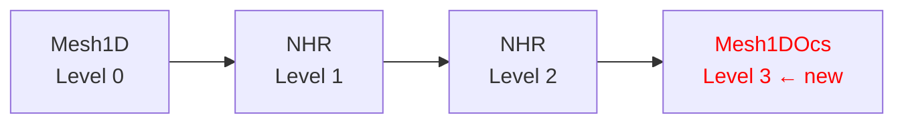
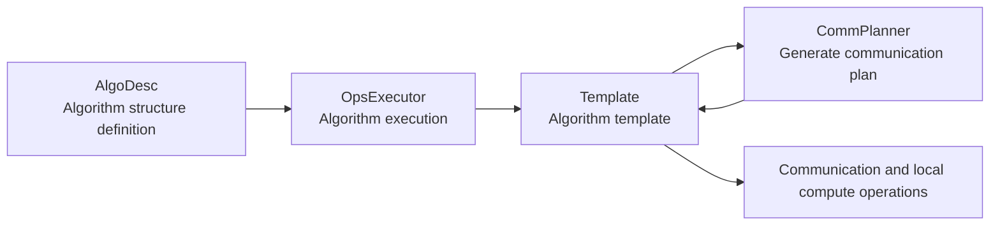
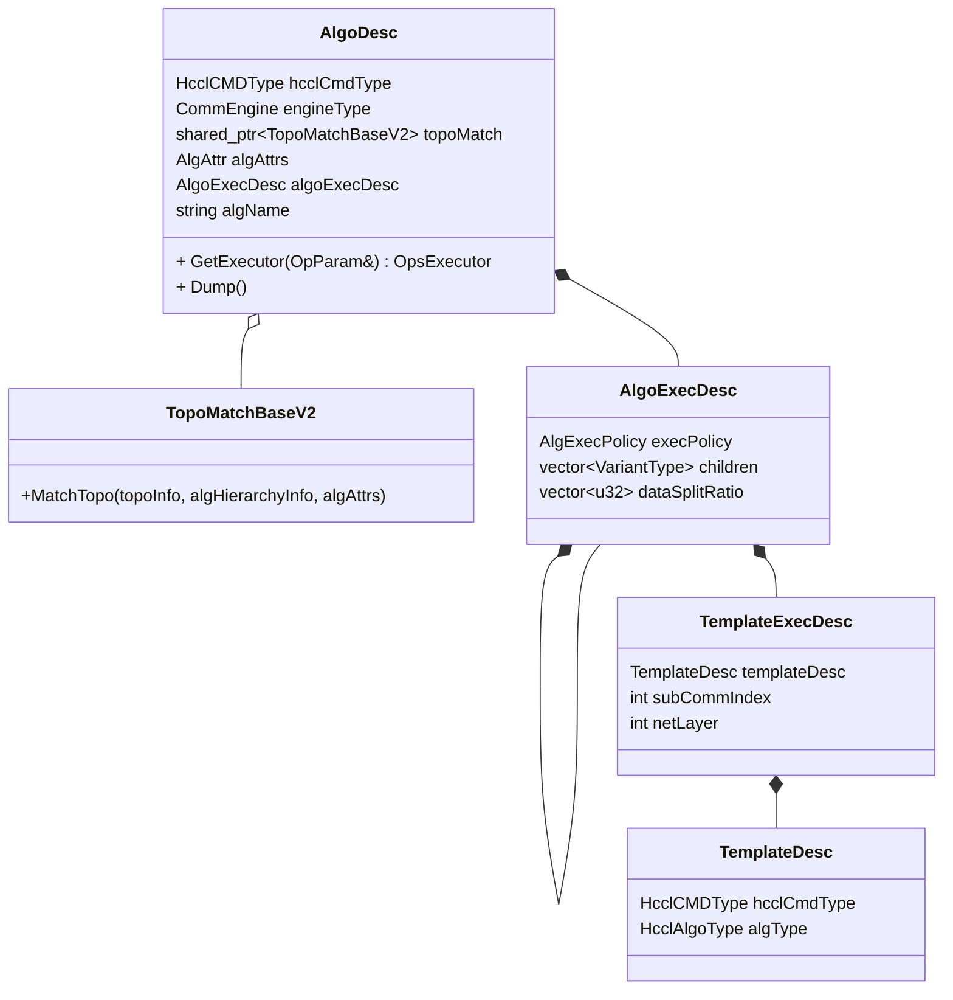
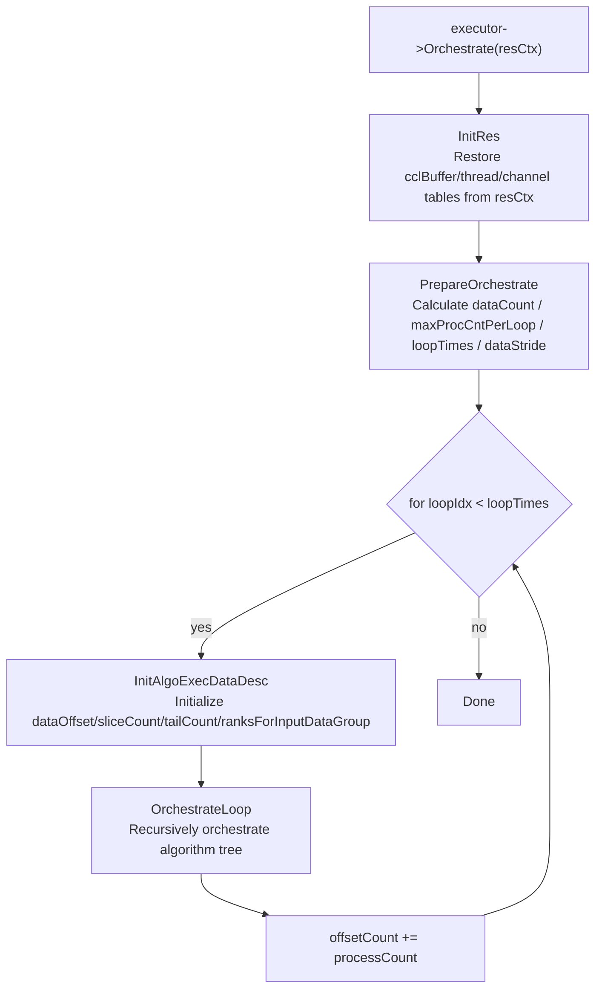
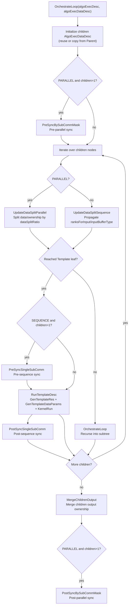
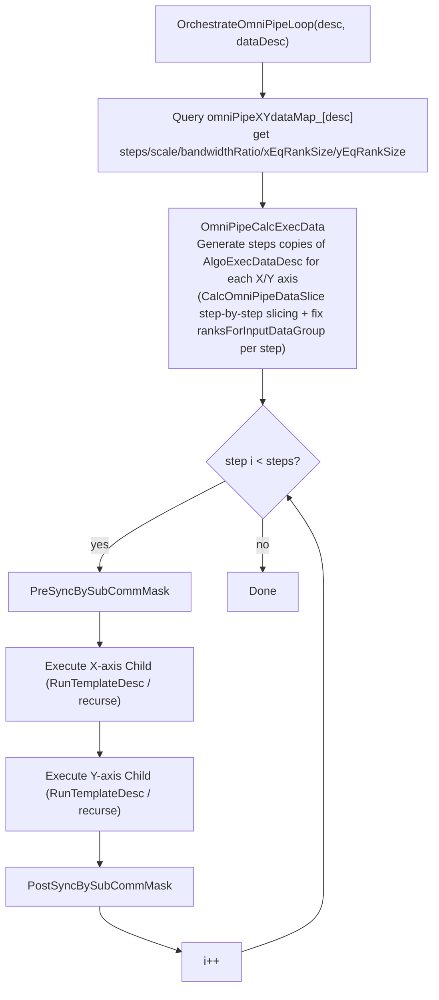
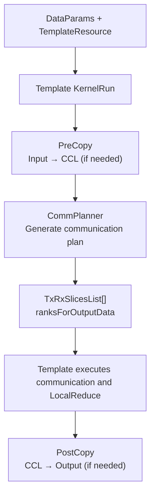
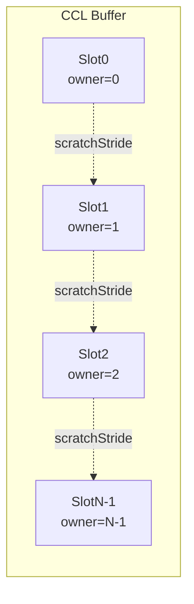
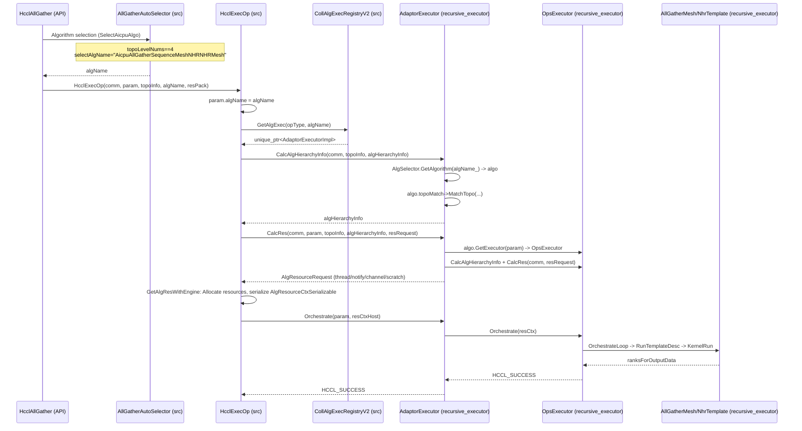

# RFC: Unified Algorithm Structure for Collective Communication Executor

- Start Date: 2026-08-12
- RFC PR: cann/hccl#2572
- Related Issue: cann/hccl#607

---

## Summary

This RFC proposes an HCCL refactoring scheme with `AlgoDesc` as the static algorithm description, `OpsExecutor` as the universal interpreter, Template as the single-layer execution unit, and CommPlanner as the communication plan generator. The scheme describes combinations such as Sequence, Parallel, and OmniPipe through a recursive algorithm tree, passes logical data ownership via `ranksForInputData`/`ranksForOutputData`, and establishes a unified memory and data flow model of `Input → CCL Buffer → ... → CCL Buffer → Output`.

This refactoring lands in `experimental/ops/op_common/recursive_executor/` and adopts a **plug-in zero-intrusion integration** approach to connect to the existing src workflow: the recursive_executor code is compiled into `libhccl.so` as an OBJECT library, and `AdaptorExecutor` (inheriting src's `InsCollAlgBase`) is registered into src's `CollAlgExecRegistryV2` via `REGISTER_ADAPTOR_EXECUTOR`; after src's Selector selects the recursive_executor algorithm name for 4-level topology, the existing workflow `Selector → HcclExecOp → GetAlgExec → CalcAlgHierarchyInfo/CalcRes → Orchestrate` naturally dispatches to the recursive_executor executor, with zero changes to src except for the Selector's 4-level topology branch.

## Background and Motivation

### Current Problems

As HCCL's code architecture grows with multi-layer topologies, parallel slicing, and composite operators, the same Mesh or NHR communication process appears duplicated across multiple algorithm classes, leading to the following problems:

1. Algorithms are named by strings, making it impossible to directly see from a unified structure which stages an algorithm consists of and the sequential/parallel relationships between stages.
2. Executor types simultaneously express algorithm structure and execution mechanism; each new combination requires a new class (50+ executor classes repository-wide; see Section 1.2 for the counting methodology).
3. Template simultaneously handles local copy, communication plan generation, and execution, making Mesh/NHR communication logic difficult to reuse.
4. In multi-layer Sequence, there is no explicit contract for which Rank data the previous stage produced and which data the next stage should read; this can only be inferred through repeatNum and repeatStride.
5. User Input/Output and CCL Buffer layout descriptions require multiple fields such as inputSliceStride, outputSliceStride, inputRepeatStride, and outputRepeatStride, which is complex and error-prone.
6. Composite algorithms like AllReduce TwoShot manifest as specialized large Templates in the old code, making it difficult to reuse existing ReduceScatter and AllGather implementations.

### Direct Trigger: Four-Level Network Topology Adaptation

The direct trigger that exacerbated the above problems is the new requirement for **four-level network topology**.

HCCL currently supports 2–3 levels of network topology:

```text
2 levels: intra-server Mesh (layer0) + cross-server NHR (layer1)
3 levels: intra-server Mesh (layer0) + cross-server NHR (layer1) + cross-super-pod NHR (layer2)
```

Each topology level combination requires a corresponding Executor + Template implementation for every operator (AllGather/AllReduce/Broadcast/ReduceScatter/Scatter). The four-level network topology adds a 4th layer (cross-super-pod OCS layer) on top of this:

```text
4 levels: intra-server Mesh (layer0) + cross-server NHR (layer1) + cross-super-pod NHR (layer2) + **cross-super-pod OCS (layer3) ← new**
```

Under the old architecture, adapting to four-level topology means adding 4-level orchestration executors for each operator, with massive code duplication relative to the 3-level code (the first three stages of 4-level are identical to 3-level, with only the 4th layer added), causing linear workload growth: 6 operators × (Sequence + Parallel + possible OmniPipe variants) ≈ 12–18 new executor classes, each 300–500 lines.

This is the core driving force of the refactoring: **a unified data structure is needed that can abstractly describe arbitrary level combinations, so that adding a new topology level only requires registering an algorithm execution strategy in the algorithm table rather than copying an entire set of executor code, thereby implementing new algorithms**.

In the refactored architecture, the 4-level AllGather algorithm simply appends one `AllGather_Mesh1DOcs` layer on top of the 3-level algorithm:



### Code Volume Comparison

The current Executor has 6 command types (AllGather, AllReduce, Broadcast, Reduce, ReduceScatter, Scatter), each potentially having 5 common orchestration modes (Solo, Sequence, Concurrent, Parallel, OmniPipe). As custom machine types and communication dimensions expand, operator orchestration modes will see multiplicative growth. Taking the `broadcast_parallel` executor as an example, the algorithm requires 4 Templates executing in parallel across inter and intra dimensions; due to the lack of data abstraction, the `OrchestrateLoop` function exceeds 150 lines and generates a `TemplateDataParams` object for each template. The initial design can merge all Executors into 1 universal executor (~800 lines), drastically reducing maintenance costs.

| Scenario | Old Architecture New Code | Refactored New Code |
| --- | --- | --- |
| 3-level → 4-level topology (per operator) | 2–3 new executor classes + corresponding Templates (~1000 lines) | Append 1 leaf node to the algorithm table (~10 lines) |
| New Parallel variant (per operator) | 1 new executor class (~300–500 lines) | Modify `execPolicy` and `dataSplitRatio` in the algorithm tree (~5 lines) |

### Refactoring Goals and Non-Goals

**Goals**:

1. Describe algorithm structure using `AlgoDesc + AlgoExecDesc + TemplateExecDesc`.
2. Use a universal Executor to interpret Sequence, Parallel, and nested combinations, replacing 50+ specialized executors.
3. Connect preceding and succeeding execution stages with an explicit Rank ownership table.
4. Extract reusable Mesh/NHR communication plans from Template into CommPlanner.
5. Enable algorithms like AllReduce TwoShot to be quickly constructed by composing existing algorithm templates.
6. Integrate into the existing src workflow as a plug-in, with zero changes to src except for the Selector 4-level branch.

**Constraints**:

- Do not modify algorithm selection strategy or selection thresholds (only add one algorithm name branch for 4-level topology scenarios).
- Do not modify HCCL public API.
- Do not violate layered dependencies: recursive_executor only includes src (HCCL same-layer) headers; cross-repository calls to HCOMM still go through `src/common/hcomm_dlsym/` symbol table + dlsym.

## Glossary

| Term | Meaning |
| --- | --- |
| AlgoDesc | Algorithm description structure, containing the algorithm tree, topology matcher, and algorithm name; the minimal unit registered into the algorithm table |
| OpsExecutor | Universal executor, recursively interprets the algorithm tree, replacing 50+ specialized executors |
| Template | Single-layer execution unit, responsible for data preparation, communication execution, and result assembly |
| CommPlanner | Communication plan generator, computes communication peers, data slices, and ownership; does not execute communication |
| AlgSelector | Algorithm registry, queries AlgoDesc by algorithm name, achieving Selector/Executor/Template decoupling |
| AdaptorExecutor | Bridge layer, inherits src's InsCollAlgBase, forwards three interfaces to OpsExecutor |
| InsCollAlgBase | Unified abstract base class for all V2 executors in src |
| CollAlgExecRegistryV2 | src executor registry, looks up executors by operator type and algorithm name |
| TopoMatchBaseV2 | Topology matcher base class, splits communicator topology into per-level sub-communicators |
| SEQUENCE / PARALLEL / OMNIPIPE | Three execution policies: sequential dependency, data parallel, pipeline interleaving |
| ranksForInputData / ranksForOutputData | Per-rank ownership sequence of each logical Slot in the local Buffer (per-rank perspective, different ranks have different content); indicates which valid Slots exist and their Owners, not which Peers to communicate with; preceding and succeeding stages are connected via output = next input ownership contract |

## Architecture and Interface Contracts

### Overall Architecture

The refactored core pipeline has only four layers:



The four layers answer different questions:

| Layer | Core Question |
| --- | --- |
| `AlgoDesc` | Which algorithm templates make up the algorithm, and how are they combined |
| `OpsExecutor` | How data is sliced, in what order templates execute, and how data is passed |
| Template | How a single algorithm template prepares data, executes communication, and assembles results |
| CommPlanner | For the current Rank and sub-communicator, whom to communicate with and which slices to transfer |

The core design philosophy is the separation of **static algorithm structure** and **dynamic data state**: `AlgoDesc` remains unchanged after algorithm selection; `AlgoExecDataDesc` changes dynamically with Loop, Sequence stage, and Parallel sub-slice. When the Executor recursively interprets the algorithm tree, it does not modify `AlgoDesc`; it only derives a `AlgoExecDataDesc` for each Child.

### Public Interfaces

This refactoring provides the following interfaces for **operator developers**. Based on these interfaces, developers can add new algorithms without writing executor classes (detailed workflow in Section 4. New Algorithm Guide):

#### 1. REGISTER_ALG — One-Step Algorithm and Executor Registration

```cpp
#define REGISTER_ALG(cmdType, algName, algoDesc)
```

Completes algorithm registration into `AlgSelector` and executor registration into `CollAlgExecRegistryV2` in one step; the two tables are associated by the same algorithm name.

| Parameter | Type | Description |
| --- | --- | --- |
| `cmdType` | `HcclCMDType` | Operator type (e.g., `HCCL_CMD_ALLGATHER`), determines the classification slot of the executor in the src registry |
| `algName` | `std::string` | Algorithm unique identifier (e.g., `"AicpuAllGatherSequenceXxxMesh"`), Selector returns this name, Executor looks up the algorithm tree by it |
| `algoDesc` | `AlgoDesc` | Pre-constructed algorithm tree, containing topology matcher, execution policy, child node list, and engine type (assembly method in Section 1.1) |

#### 2. AlgoDesc / AlgoExecDesc / TemplateExecDesc — Algorithm Tree Description Structures

```cpp
struct TemplateExecDesc {
    TemplateDesc templateDesc;   // Operator type + algorithm type
    int subCommIndex;             // Sub-communicator index
    int netLayer = -1;            // Network layer index, -1 = iterate all layers and take the first match
};

struct AlgoExecDesc {
    HcclAlgExecPolicy execPolicy;           // Execution policy: SEQUENCE / PARALLEL / OMNIPIPE
    std::vector<VariantType> children;      // Child nodes (leaf = TemplateExecDesc, non-leaf = nested AlgoExecDesc)
    std::vector<u32> dataSplitRatio;       // Parallel data split ratio, element count must match children
};

// AlgoDesc is HcclAlgorithm, describing the complete algorithm entry
class HcclAlgorithm {
    HcclCMDType hcclCmdType;                       // Operator type
    HcclAlgEngineType engineType;                  // Engine type
    std::shared_ptr<TopoMatchBase> topoMatch;       // Topology matcher
    AlgoExecDesc algoExecDesc;                      // Execution tree
    std::string algName;                            // Algorithm name
};
```

Developers use these three layers of data structures to assemble the algorithm tree: `TemplateExecDesc` describes a single-layer Template, `AlgoExecDesc` describes the execution policy and child node list, and `AlgoDesc` describes the complete algorithm entry.

#### 3. AicpuBaseTemplate — Template Base Class

Developers inherit `AicpuBaseTemplate` and override the following methods according to operator semantics. `KernelRun` is fixed by the base class to orchestrate `PreCopy → RunAlgorithm → SendAll → PostCopy`; developers do not need to override it.

##### Must Implement

```cpp
// [pure virtual] Call CommPlanner to generate tx/rx description list, executed by base class SendAll
virtual HcclResult RunAlgorithm(std::vector<TxRxSlicesList> &txRxSlicesLists,
                                std::vector<u32> &ranksForOutputData) = 0;
```

| Parameter | Direction | Description |
| --- | --- | --- |
| `txRxSlicesLists` | Output | Send/receive description list; the base class calls `SendAll` to execute communication based on this |
| `ranksForOutputData` | Output | Data ownership rank list held by this rank after communication |

##### Override as Needed

```cpp
// Local pre-processing before communication (input → output / ccl buffer)
// Default: copy this rank's input to output and ccl buffer[myRank]
virtual HcclResult PreCopy(const std::vector<ThreadHandle> &threads);

// Unified SendRecv execution
// Default: WRITE direction (write to remote ccl buffer)
virtual HcclResult SendAll(const std::vector<TxRxSlicesList> &txRxSlicesLists,
                           TemplateResource &templateResource,
                           const std::vector<ThreadHandle> &threads);

// Local post-processing after communication (ccl buffer → output)
// Default: move data from other ranks in ccl buffer back to output
virtual HcclResult PostCopy(const std::vector<ThreadHandle> &threads);

// Calculate required thread count and notify count
// Default: Mesh threadNum=rankSize-1, NHR threadNum=channelsPerRank, notifyPerThread=1
virtual HcclResult GetRes(AlgResourceRequest &res) const;
```


#### 4. REGISTER_TEMPLATE — Template Factory Registration

```cpp
#define REGISTER_TEMPLATE(cmdType, algType, TemplateClass)
```

Registers the Template class into the global factory table; the framework internally creates instances via `GetTemplate()` by looking up `TemplateDesc`. When adding a new Template, simply call this macro—no need to modify `GetTemplate` itself.

| Parameter | Type | Description |
| --- | --- | --- |
| `cmdType` | `HcclCMDType` | Operator type (e.g., `HCCL_CMD_ALLGATHER`) |
| `algType` | `HcclAlgoType` | Algorithm type (e.g., `HCCL_ALGO_TYPE_FULLMESH`) |
| `TemplateClass` | Class name | Subclass name inheriting `AicpuBaseTemplate`; the factory instantiates based on this |

<br />

### Dependency Interfaces

This refactoring depends on the following src / HCOMM interfaces and introduces no new external dependencies:

| Dependency | Source | Usage |
| --- | --- | --- |
| `InsCollAlgBase` | `src/ops/op_common/executor/executor_v2_base.h` | `AdaptorExecutor` inherits this class, implements three pure virtual interfaces (`Prepare`/`GetRes`/`KernelRun`), bridging the src execution framework |
| `OpParam` / `AlgResourceRequest` / `AlgResourceCtxSerializable` | `src/ops/op_common/...` | recursive_executor and src share the same set of types, naturally type-consistent, no wrapper layer needed |
| `CollAlgExecRegistryV2` | `src/ops/op_common/executor/registry/coll_alg_v2_exec_registry.h` | Executor registry; `REGISTER_ALG` registers `AdaptorExecutor` into src through this table |
| `hcomm_dlsym` symbol table | `src/common/hcomm_dlsym/` | Cross-repository calls to HCOMM go through dlsym, introducing no compile-time hard dependency on `cann/hcomm` |
| `param.algName` routing mechanism | src Selector | src Selector returns algorithm name string; executor looks up by name, reusing the original routing |

<br />

## Impact Analysis

- **Performance impact**: The recursive orchestration of the universal executor `OpsExecutor` introduces additional overhead compared to inline calls of specialized executors, which is sensitive in small-message scenarios; the unified Slot layout may increase CCL Buffer usage for the Scatter operator. After the design stabilizes, benchmarks are needed for comparison.
- **Scope of impact on existing functionality**: 53 specialized executors are merged into 1 universal executor; src only adds a Selector 4-level topology branch, with zero changes to the rest of the execution framework, resource management, and build/release pipeline.
- **Impact on build, dependencies, and release**: No new external dependencies; recursive_executor is subsequently registered into production code through the operator registration mechanism (`REGISTER_ALG`), without changing the existing build and release process.

## Compatibility Considerations

This refactoring does not change the algorithm selection strategy, does not change the public API, and does not change the src execution framework. Migration only occurs after an algorithm is selected: selected algorithm name → `GetAlgExec` returns the recursive_executor executor → `AlgoDesc` tree → universal Executor interprets → new Template/CommPlanner executes.

### 1. Code Landing Path: experimental/ops/op_common/recursive_executor/

Per the `experimental/README.md` specification, the refactored code lands in `experimental/ops/op_common/recursive_executor/` (under `experimental/ops/op_common/`, with structure consistent with `src`, containing `executor/`, `template/`, `topo/`, `inc/`; the `algorithm/` directory is created when Phase 1 algorithm registration is completed).

- **No impact on mainline**: recursive_executor is subsequently integrated into production code through the operator registration mechanism, with zero changes to the src original workflow structure (only the Selector adds one 4-level topology branch), keeping the impact on existing build and release controllable.

### 2. Progressive Integration

Gradual integration is divided into three phases:

1. **Phase 1**: AllGather operator, 4-level topology Sequence (Mesh+NHR×2+Mesh), single engine (Aicpu). The skeleton has been set up in `experimental/ops/op_common/recursive_executor/` (`TopoMatchFourLevel` + `AdaptorExecutor` + `OpsExecutor` skeleton + `AllGatherMesh/NhrTemplate` + `Mesh/NhrCommPlanner`); algorithm registration (`algorithm/all_gather.cc`) is to be completed.
2. **Phase 2**: AllGather single-layer Mesh/NHR, multi-layer Sequence/Parallel/Concurrent, plus ReduceScatter/AllReduce/Broadcast/Scatter operators, multi-engine.
3. **Phase 3**: Full operator coverage, OmniPipe pipeline.

## Detailed Design

### 1. Data Structures

#### 1.1 AlgoDesc Three-Layer Description Structure

`AlgoDesc` consists of three layers:



- `AlgoDesc`: Describes a complete collective communication algorithm, carrying `topoMatch` (topology matcher) and the algorithm tree, creating the universal executor via `GetExecutor()`. **This is the minimal unit registered into the algorithm table**.
- `TopoMatchBaseV2`: Topology matcher, responsible for splitting the communicator topology into per-level sub-communicators (`AlgHierarchyInfoForAllLevel`), shared by Selector/Executor.
- `AlgoExecDesc`: Composition node, describing which execution policy (SEQUENCE/PARALLEL/OMNIPIPE) the Children use.
- `TemplateExecDesc`: Algorithm template, describing which Template to execute on which sub-communicator (`subCommIndex`); `netLayer` is used for cross-layer templates (default -1).
- `TemplateDesc`: Describes operator semantics and topology algorithm type.

Corresponding code (`experimental/ops/op_common/recursive_executor/inc/algo_desc.h`):

```cpp
enum class AlgExecPolicy { SEQUENCE, PARALLEL, OMNIPIPE };

struct TemplateDesc {
    HcclCMDType hcclCmdType;
    HcclAlgoType algType;
};

enum SubCommIndexType : int {
    SUB_COMM_INDEX_0 = 0, SUB_COMM_INDEX_1 = 1,
    SUB_COMM_INDEX_2 = 2, SUB_COMM_INDEX_3 = 3,
    SUB_COMM_INDEX_4 = 4, SUB_COMM_INDEX_5 = 5,
};

struct TemplateExecDesc {
    TemplateDesc templateDesc;
    int subCommIndex;
    int netLayer = -1;
};

struct AlgoExecDesc;
using VariantType = std::variant<TemplateExecDesc, std::shared_ptr<AlgoExecDesc>>;
struct AlgoExecDesc {
    AlgExecPolicy execPolicy = AlgExecPolicy::SEQUENCE;
    std::vector<VariantType> children;
    std::vector<u32> dataSplitRatio;
};

class AlgoDesc {
public:
    std::unique_ptr<OpsExecutor> GetExecutor(OpParam& param);
    void Dump();
    HcclCMDType hcclCmdType;
    CommEngine engineType;
    std::shared_ptr<TopoMatchBaseV2> topoMatch;
    AlgAttrs algAttrs;
    AlgoExecDesc algoExecDesc;
    std::string algName;
};
```

`AlgoExecDesc::children` is a recursive Variant: each Child is either an algorithm template (`TemplateExecDesc`) or a subtree (`shared_ptr<AlgoExecDesc>`). When traversing, the Executor uses `std::get_if` to distinguish the two types: for `TemplateExecDesc` it calls `RunTemplateDesc`, for `shared_ptr<AlgoExecDesc>` it recursively calls `OrchestrateLoop`.

#### 1.2 Execution Policies

##### Current Executor Inventory

There are currently **53 Executor classes** under `src/ops/` (counting methodology: 63 classes directly inheriting `InsCollAlgBase`/`ExecutorBase`, excluding 10 point-to-point classes such as Send/Recv/BatchSendRecv), classified by orchestration mode and operator dimension as follows (the table shows major categories, not exhaustively listing AllGatherV/ReduceScatterV/Aiv variants):

| Orchestration Type | AllGather | AllReduce | ReduceScatter | Broadcast | Scatter | Reduce | Barrier | AllToAllV |
| --- | --- | --- | --- | --- | --- | --- | --- | --- |
| **Sole** (single layer) | AllGatherSole | AllReduceSole | ReduceScatterSole | BroadcastSole | ScatterSole | ReduceSole | BarrierSole | AllToAllVSole |
| **Sequence** (multi-layer sequential) | AllGatherSequence + Aicpu + 3Level | AllReduceSequence + Aicpu + Aicpu3Level + 2Die | ReduceScatterSequence + Aicpu + 3Level | BroadcastSequence | ScatterSequence + 3Level | ReduceSequence | BarrierSequence | — |
| **Parallel** (data parallel) | AllGatherParallel | AllReduceParallel | ReduceScatterParallel | BroadcastParallel | ScatterParallel | ReduceParallel | — | — |
| **Concurrent** (concurrent) | AllGatherConcurrent | AllReduceConcurrent | ReduceScatterConcurrent | — | — | — | — | AllToAllVConcurrent + AllToAllConcurrent |
| **OmniPipe** (pipeline) | AllGatherOmniPipe + 2D | AllReduceOmniPipe + 2D | ReduceScatterOmniPipe + 2D | BroadcastOmniPipe2D | ScatterOmniPipe2D | — | — | — |
| **TwoShot** (two-phase) | — | AllReduceTwoShotSole | — | — | — | — | — | — |
| **OrderPreserved** (order-preserving) | — | AllReduceOrderPreserved | ReduceScatterOrderPreserved | — | — | — | — | — |

Analyzing the orchestration modes of these 53 Executors, three fundamentally different Child organization patterns can be identified:

- **Sequential dependency**: e.g., multi-layer AllGather spreading layer by layer, or AllReduce TwoShot's ReduceScatter→AllGather, where the input data of the later stage comes from the output of the earlier stage, with data dependency between stages. Abstracted as `SEQUENCE`.
- **Data parallel**: e.g., Concurrent Mesh1D NHR, where different sub-slices of data spread along different communicators respectively, and each Child processes non-overlapping data. Abstracted as `PARALLEL`, with `dataSplitRatio` describing the split ratio.
- **Pipeline interleaving**: e.g., cross-layer OmniPipe, where two axes alternate execution by Step to overlap communication time. Abstracted as `OMNIPIPE`, as a pipeline extension of Parallel.

| Policy | Semantics | Current Correspondence |
| --- | --- | --- |
| `SEQUENCE` | Children execute in order; the output state of the preceding Child becomes the input state of the succeeding Child | SoleExecutor, SequenceExecutor, TwoShotSoleExecutor |
| `PARALLEL` | Parent data is split to multiple Children by `dataSplitRatio`; each Child processes different data sub-slices | ParallelExecutor, ConcurrentExecutor |
| `OMNIPIPE` | Two axes execute in pipeline by Step; a specialized pipeline extension of Parallel | OmniPipeExecutor, OmniPipe2dExecutor |

In the current architecture, Sole, Sequence, and TwoShot all map to `SEQUENCE`: Sole is a Sequence with a single algorithm template, TwoShot is a Sequence with two algorithm templates; the difference is only in children count and type. Parallel and Concurrent both map to `PARALLEL`: Concurrent is a special case of Parallel (each Child uses a different sub-communicator). OrderPreserved is an algorithm semantic constraint, guaranteed by the Template layer, and does not affect the Executor orchestration policy.

**Equivalence argument for the mapping**: In the old architecture, Parallel and Concurrent both belong to "split data by ratio + concurrent execution across different sub-communicators" in terms of data flow; the difference is only the source of the split ratio—`InsV2AllGatherParallelExecutor` uses a fixed 50/50 ratio in `CalcCostCoeff` (`constexpr float ratio = 0.5f`) to split data between the mesh and NHR axes; `InsV2AllGatherConcurrentExecutor` splits by port count ratio via `GetParallelDataSplit` (`splitData = portNum0 / (portNum0 + portNum1)`) and dispatches concurrently across mesh + CLOS sub-communicators. Both **split data**; there is no "concurrent dispatch without splitting" semantics. The refactoring uses `dataSplitRatio` to uniformly express the split ratio—whether fixed or port-based, it can be computed and filled during algorithm construction, so merging into `PARALLEL` does not change runtime behavior.

These three policies are orthogonal: sequential describes temporal dependency, parallel describes data splitting, and pipeline describes execution overlap. Any complex algorithm can be expressed through recursive combination of these three policies. Adding a new orchestration mode only requires extending the enum value and the Executor's `OrchestrateLoop` branch, without affecting the execution logic of existing policies.

The topology level (`subCommIndex`) and execution order (`execPolicy`) are two independent dimensions: the former answers "on which set of Ranks to execute", the latter answers "how Children are organized".

**Mapping of `subCommIndex` to actual communicator**: `subCommIndex` is the index into the per-level sub-communicator table `AlgHierarchyInfoForAllLevel::infos[]`, which is populated by `TopoMatchBaseV2::MatchTopo` during the `CalcAlgHierarchyInfo` stage (`infos[i]` is the Rank grouping of the i-th level sub-communicator). At Template runtime, the same index is used to access the level's communication resources: `algHierarchyInfo_.infos[subCommIndex].at(0)` gets the level's Rank list, `GenTemplateRes` uses `channelTable_.at(subCommIndex)`/`subThreads_.at(subCommIndex)` to get the level's channel and threads (resources are allocated per-level by `CalcTemplateChannelRes` during the `CalcRes` stage, serialized via `resCtx.channels[level]`, and reconstructed by `RestoreChannelMap` during `InitRes`; see Section 3.7). Constraint: `subCommIndex` must be less than the number of topology levels; out-of-bounds access directly errors.

#### 1.3 Algorithm Registry (AlgSelector)

The algorithm registry is the core hub of the refactored architecture—it transforms "algorithms" from code logic into queryable data structures, achieving complete decoupling of the Selector, Executor, and Template layers.

##### Design Motivation

The core idea of the algorithm registry is **algorithm as data**: each algorithm is fully described by an `AlgoDesc` tree, pre-constructed, and registered into the global table. The Selector only returns the algorithm name, the Executor only interprets and executes, and neither contains the algorithm definition itself. Adding a new algorithm only requires appending one `REGISTER_ALG` macro in the algorithm file. The src Selector is not modified; the default selector flow will not select 4-level algorithms. The currently integrated portion (algorithm registration mechanism) still has legacy work; after the selector refactoring is complete, users can explicitly configure a 4-level algorithm name via the `HCCL_ALGO` environment variable. Incorporating 4-level algorithms into the default selector flow will be discussed after the algorithms stabilize.

##### Data Structure

```cpp
class AlgSelector {
public:
    static AlgSelector& Instance();
    HcclResult Register(const std::string& algName, AlgoDesc algo);
    bool GetAlgorithm(const std::string& algName, AlgoDesc& algo) const;
private:
    AlgSelector() = default;
    std::map<std::string, AlgoDesc> algMap_;
    mutable std::mutex mu_;
};

// Registration macro: register algorithm object into registry during static initialization
#define REGISTER_ALGORITHM(algName, algo) \
    static bool g_reg_##algName = \
        AlgSelector::Instance().Register(#algName, algo)
```

`GetAlgorithm` returns a copy of `AlgoDesc` by name (`topoMatch` is a `shared_ptr`, sharing the same matcher). The registry is statically initialized in both the Host library and the Device kernel; both ends can reconstruct the algorithm definition by algorithm name, **without serializing the algorithm tree**.

##### Algorithm Registration Example (4-Level AllGather)

`experimental/ops/op_common/recursive_executor/algorithm/all_gather.cc` shows the complete registration process: first assemble the algorithm tree, then register the algorithm + register the executor (`REGISTER_ALG` see Section 3):

```cpp
// 4-level sequential: Mesh(layer3) -> NHR(layer2) -> NHR(layer1) -> Mesh(layer0)
static AlgoExecDesc MakeAllGather4LevelAlgoExecDesc()
{
    TemplateDesc meshDesc{HcclCMDType::HCCL_CMD_ALLGATHER, HcclAlgoType::HCCL_ALGO_TYPE_FULLMESH};
    TemplateDesc nhrDesc{HcclCMDType::HCCL_CMD_ALLGATHER, HcclAlgoType::HCCL_ALGO_TYPE_NHR};
    AlgoExecDesc desc;
    desc.execPolicy = AlgExecPolicy::SEQUENCE;
    desc.children = {
        TemplateExecDesc{meshDesc, SUB_COMM_INDEX_3},
        TemplateExecDesc{nhrDesc,  SUB_COMM_INDEX_2},
        TemplateExecDesc{nhrDesc,  SUB_COMM_INDEX_1},
        TemplateExecDesc{meshDesc, SUB_COMM_INDEX_0},
    };
    desc.dataSplitRatio = {1, 1, 1, 1};
    return desc;
}

static AlgoDesc MakeAllGather4LevelAlgo()
{
    AlgoDesc algo;
    algo.hcclCmdType = HcclCMDType::HCCL_CMD_ALLGATHER;
    algo.engineType  = CommEngine::COMM_ENGINE_AICPU;
    algo.topoMatch   = std::make_shared<TopoMatchFourLevel>();
    algo.algoExecDesc = MakeAllGather4LevelAlgoExecDesc();
    algo.algName     = "AicpuAllGatherSequenceMeshNHRNHRMesh";
    return algo;
}

// Register algorithm to AlgSelector + register executor to CollAlgExecRegistryV2
REGISTER_ALG(HcclCMDType::HCCL_CMD_ALLGATHER, AicpuAllGatherSequenceMeshNHRNHRMesh, MakeAllGather4LevelAlgo());
```

Adding a new algorithm requires only three steps: write a factory function (assemble the `AlgoExecDesc` tree), reuse or add a `TopoMatchBaseV2` matcher, and append one line of `REGISTER_ALG`.

##### Selector Interaction with the Algorithm Table

The Selector's responsibility remains unchanged—select the optimal algorithm based on topology level, data size, Rank count, etc. The change is: for 4-level topology, directly return the recursive_executor algorithm name string (`"AicpuAllGatherSequenceMeshNHRNHRMesh"`). The subsequent pipeline fully reuses src's string routing mechanism (`param.algName`), without requiring the Selector to directly hold algorithm objects.

### 2. Key Logic

#### 2.1 Algorithm Assembly Examples

The key to quickly assembling algorithms is not adding new Executor classes, but reusing three building blocks: **algorithm templates** (`TemplateExecDesc`), **execution policies** (`SEQUENCE`/`PARALLEL` nodes), and **recursion** (using an `AlgoExecDesc` as another node's Child).

**Minimal algorithm**—single-layer Mesh AllGather, a Sequence tree with only one algorithm template:

```cpp
AlgoExecDesc root {
    .execPolicy = SEQUENCE,
    .children = { TemplateExecDesc{allGatherMeshDesc, 0} },
    .dataSplitRatio = {1}
};
```

**Two-layer Sequence**—first execute Mesh at Level 0, then NHR at Level 1:

```cpp
AlgoExecDesc root {
    .execPolicy = SEQUENCE,
    .children = {
        TemplateExecDesc{allGatherMeshDesc, 0},
        TemplateExecDesc{allGatherNhrDesc, 1}
    },
    .dataSplitRatio = {1, 1}
};
```

**Concurrent**—the current refactoring represents Concurrent as a `PARALLEL` node, where two algorithm templates process different data sub-slices and concurrently submit using different sub-communicators:

```cpp
AlgoExecDesc root {
    .execPolicy = PARALLEL,
    .children = {
        TemplateExecDesc{allGatherMeshDesc, 0},
        TemplateExecDesc{allGatherNhrDesc, 1}
    },
    .dataSplitRatio = {1, 1}
};
```

**Nested Parallel**—two Parallel phases execute sequentially; in the first phase, different sub-slices of data spread along two dimensions, and in the second phase the dimensions are swapped:

```cpp
auto phase0 = AlgoExecDesc{
    PARALLEL,
    {meshLevel0, nhrLevel1},
    {1, 1}
};
auto phase1 = AlgoExecDesc{
    PARALLEL,
    {nhrLevel1, meshLevel0},
    {1, 1}
};
AlgoExecDesc root{
    SEQUENCE,
    {shared(phase0), shared(phase1)},
    {1, 1}
};
```

**AllReduce TwoShot**—the algorithm semantics is `AllReduce = ReduceScatter → AllGather`, directly composing two existing algorithm templates without a specialized large Template:

```cpp
AlgoExecDesc allReduceTwoShot {
    .execPolicy = SEQUENCE,
    .children = {
        TemplateExecDesc{reduceScatterMeshDesc, 0},
        TemplateExecDesc{allGatherMeshDesc, 0}
    },
    .dataSplitRatio = {1, 1}
};
```

Multi-layer AllReduce is similarly just extending the Sequence; the core order is "ReduceScatter along topology layer by layer, then AllGather in reverse order layer by layer":

```cpp
AlgoExecDesc root {
    .execPolicy = SEQUENCE,
    .children = {
        TemplateExecDesc{reduceScatterMeshDesc, 0},
        TemplateExecDesc{reduceScatterNhrDesc, 1},
        TemplateExecDesc{allGatherNhrDesc, 1},
        TemplateExecDesc{allGatherMeshDesc, 0}
    },
    .dataSplitRatio = {1, 1, 1, 1}
};
```

This shows that going from 3-level to 4-level topology only requires appending one algorithm template to the algorithm table, with no modifications to the Executor.

#### 2.2 Executor Recursive Orchestration

##### Functional Flow

The Executor is a universal object independent of engine type, algorithm command, and topology. The actual execution flow of `OpsExecutor::Orchestrate` is as follows:



`OpsExecutor` is the universal executor created by `AlgoDesc::GetExecutor()`, collecting runtime information such as input/output/root/dataType from `OpParam` during construction.

##### Static Structure and Dynamic State

The Executor holds two types of information:

| Type | Lifecycle | Content |
| --- | --- | --- |
| `AlgoDesc` | Unchanged for the entire operator execution | Algorithm tree, template types, sub-communicator levels, topology matcher |
| `AlgoExecDataDesc` | Changes with Loop and tree node | Buffer type, Offset, Count, Stride, Rank ownership |

`AlgoExecDataDesc` is a "state snapshot of data at the entry of a node in the algorithm tree"; core fields include: `inputBufferType`/`outputBufferType`/`cclBufferType` (input/output/CCL Buffer source for this stage), `dataOffset` (starting offset of the Loop in user memory), `sliceOffset`/`sliceCount` (Parallel sub-slice offset and count), `dataStride`/`scratchStride` (adjacent Slot spacing in user memory/CCL Buffer), `ranksForInputDataGroup`/`ranksForOutputDataGroup` (Owner of each Slot in the current Buffer).

##### Recursive Orchestration Flow

`OrchestrateLoop` is the Executor's core recursive function, uniformly handling Sequence, Parallel, and nested combinations:



##### Sequence State Propagation

Sequence not only represents call order, but also defines two state transfers:

```text
next.ranksForInputDataGroup = previous.ranksForOutputDataGroup   // wholesale transfer, may be multiple groups
next.inputBufferType        = previous.outputBufferType
```

The Executor determines each Child's output location: non-last Children output to `HCCL_BUFFER`, the last Child outputs to the Parent's target Buffer. Therefore, the data state of a three-stage Sequence is:

```text
Child 0:  INPUT  → CCL
Child 1:  CCL    → CCL
Child 2:  CCL    → OUTPUT
```

`ranksForOutputData` is not debug information, but a necessary state for correct Sequence connection. Note that Buffer deduction (INPUT/CCL/OUTPUT) only determines which Buffer the data is placed in, independent of the ownership group count; the ownership group count is determined by the consumption rules below.

**Multi-group ownership consumption rules**: `UpdateDataSplitSequence` assigns all output ownership of the preceding Child (possibly multiple groups) as-is to the next Child; how to consume depends on the next Child's type:

- If the next Child is a **Template leaf**: `GenTemplateDataParams` enforces `ranksForInputDataGroup.size() == 1`—Template can only consume a single ownership group. Therefore, multi-group ownership must first be digested by a PARALLEL node, or merged into a single group; otherwise, a runtime error occurs.
- If the next Child is a **PARALLEL node** (N children): `UpdateDataSplitParallel` requires the input group count to equal the child count (otherwise error), distributing N ownership groups to N PARALLEL children by **index one-to-one correspondence**—multi-group ownership must match the subsequent PARALLEL structure.

Corresponding to the nested example in Section 2.1 `root = SEQUENCE[phase0(PARALLEL), phase1(PARALLEL)]`: if phase0's two Children (mesh/nhr) have different output ownership and retain 2 groups, phase1 as a 2-child PARALLEL node exactly consumes these 2 ownership groups by index one-to-one. When designing the algorithm tree, ensure that the semantic order of multi-group ownership is consistent with the communicator arrangement of the subsequent PARALLEL children; adjust Child arrangement or insert merge nodes as needed.

##### Parallel Data Splitting and Ownership Propagation

`dataSplitRatio` is a **ratio** (ratio), not an absolute count. For example, `{2, 1}` means Child 0 and Child 1 split the Parent's `sliceCount` in a 2:1 ratio. The calculation: `childSlice[i] = floor(parentSlice * ratio[i] / sum(ratio))`, with the last Child receiving the remainder to ensure no data loss. With `{2, 1}` and `parentSlice = 10`: Child 0 gets `floor(10 * 2 / 3) = 6`, Child 1 gets `10 - 6 = 4`.

**Impact of remainder distribution**: The remainder (at most `childrenSize - 1` elements) is always concentrated in the last Child. This is negligible when data size is much larger than Rank count; but in symmetric Concurrent scenarios (e.g., `{1, 1}` with odd `parentSlice`), the last sub-communicator processes one more Slot than others, causing slight load imbalance. This policy is currently not configurable; for scenarios sensitive to balance, it is recommended to set `dataSplitRatio` based on actual port/bandwidth ratios during algorithm construction (so that the split matches each communicator's capacity), and the remainder impact naturally dilutes as data size grows; if needed, extending a remainder dispersion strategy can be evaluated.

Each Child of Parallel inherits most state from the Parent, but recomputes `sliceCount` and `sliceOffset`: splits by the above ratio, with Offset accumulating the previous Child's covered range. Tail is only passed to the last Child.

Parallel splitting changes the Offset and Count within Slots, but **does not change** **`stride`**.

Ownership propagation rules: when the Parent has only one group of input ownership, each Child processes different sub-slices of the same group of Owners; when the Parent has multiple groups, each Child gets its own group. After Children finish executing, `MergeChildrenOutput` retains one group for the Parent if all Child output ownership is the same, otherwise retains multiple groups for subsequent consumption.

##### OmniPipe Orchestration (OrchestrateOmniPipeLoop)

OmniPipe (cross-layer pipeline) is an orchestration mode on a 2D grid where "the slow axis/fast axis alternate communication by Step to overlap transfer time". The old architecture maintained a specialized executor for each operator (e.g., `InsV2AllGatherOmniPipeExecutor`/`InsV2AllGatherOmniPipe2dExecutor`), with hardcoded 3-level topology, per-axis slicing, and multi-thread scheduling. In the refactored architecture, **OmniPipe no longer requires a specialized executor**: it is simply an `execPolicy` (`AlgExecPolicy::OMNIPIPE`) of `AlgoExecDesc`, interpreted by the universal `OpsExecutor`; the two axes correspond to the 2 Children of the algorithm tree, reusing the same set of Template/CommPlanner and synchronization primitives.

###### OmniPipe Algorithm Expression

An `OMNIPIPE` node differs from `PARALLEL`: it requires **exactly 2 Children** (`OmniPipeUpdateEqBWAndReorder` directly errors on `children.size() != 2`); the two Children represent the slow axis X and fast axis Y respectively. Each Child can be either a `TemplateExecDesc` leaf or a subtree (e.g., each axis is itself a Sequence tree):

```cpp
AlgoExecDesc root {
    .execPolicy = OMNIPIPE,
    .children = {
        // Axis X (slow axis): AllGather subtree along a certain sub-communicator layer
        AlgoExecDesc { SEQUENCE, { meshLevel0, nhrLevel1 }, {1, 1} },
        // Axis Y (fast axis): AllGather subtree along another sub-communicator layer
        AlgoExecDesc { SEQUENCE, { nhrLevel1, meshLevel0 }, {1, 1} }
    },
    .dataSplitRatio = {1, 1}
};
```

Current constraint: the `OMNIPIPE` policy only supports `ALLREDUCE`/`ALLGATHER` commands (`OpsExecutor::Orchestrate` directly errors on other commands).

###### OmniPipe Execution Flow

The `OMNIPIPE` top level follows a different branch from `SEQUENCE`/`PARALLEL` (`OpsExecutor::Orchestrate`):

```text
PreCopy(Input → CCL) → OrchestrateOmniPipeLoop → PostCopy(CCL → Output)
```

Where `PreCopy` copies this Rank's Input into CCL Buffer with `ranksForInputData = {myRank_}`, then sets `inputBufferType`/`outputBufferType` to `HCCL_BUFFER`; after orchestration, `PostCopy` writes the full result back to Output with `ranksForOutputData = [0..rankSize-1]`.

The `InitRes` stage first calls `OmniPipeUpdateEqBWAndReorder` for a **topology preprocessing pass**, with results cached by `AlgoExecDesc*` in `omniPipeXYdataMap_` for subsequent `OrchestrateOmniPipeLoop` queries:

1. **Per-axis equivalent bandwidth**: Recursively compute each axis subtree's equivalent bandwidth—Mesh layer `OMIN_MESH_BW=56`, CLOS layer `OMIN_CLOS_BW/(eqRankSize-1)` (`OMIN_CLOS_BW=112`).
2. **Axis reordering**: If X-axis equivalent bandwidth is greater than Y-axis, swap the two Children to ensure the slow axis comes first (`xEqBw ≤ yEqBw`).
3. **Step/ratio computation**: Use `CalcBandwidth2D(xB, yB, xRankSize, yRankSize, OMIN_MAX_STEP_NUM, steps, scale)` to compute pipeline step count `steps` (≤ 5) and `scale` scaling by bandwidth ratio, stored together with `bandwidthRatio = yB/xB`, `xEqRankSize/yEqRankSize` in `OmniPipeXYdata`.

The orchestration skeleton of `OrchestrateOmniPipeLoop`:



- **Step-by-step slicing**: `OmniPipeUpdateDataSlice` calls `CalcOmniPipeDataSlice(bandwidthRatio, xRankSize, yRankSize, steps, scale, sliceCount, xSliceCount, ySliceCount)` (`executor/omnipipe_utils.cc`), computing per-step X/Y axis `sliceCount` and `sliceOffset` using a recurrence formula of "first step: fast axis full load, slow axis starts at `scale/bw`; middle steps: grow by `growth = (xRankSize-1)/bw`; second-to-last step: converge; last step: diagonal slicing", ensuring `xSliceCount` is a multiple of `yRankSize-1` and `ySliceCount` is a multiple of `xRankSize-1`.
- **Step-by-step ownership correction**: For the last step's X axis and Y axis after the 1st step, `ranksForInputDataGroup` is recomputed by `CalcPeerAxisRanksForOutput` using the opposite axis's sub-communicator, ensuring the correct Peer Owner set for each step's communication.
- **Sync reuse**: Pre/post sync for each step uses `PreSyncBySubCommMask`/`PostSyncBySubCommMask` for parallel pre/post synchronization, reusing the same thread/notify mechanism as `PARALLEL`, without the old `ntfIdxCtrlToTempXY_` and other specialized channel mappings.

###### Comparison with Old OmniPipe Executor

| Dimension | Old Architecture (src) | Refactored (recursive_executor) |
| --- | --- | --- |
| Executor form | One specialized class per operator (AllGather/AllReduce/ReduceScatter/Broadcast/Scatter × OmniPipe/OmniPipe2D) | No specialized class; `OMNIPIPE` is just an `execPolicy`, interpreted by universal `OpsExecutor` |
| Axis expression | Template parameters + `BuildSubCommAndTempMap` hardcoded 3 levels (level0/1/2) | Two Children of the algorithm tree (can be nested subtrees) |
| Step-by-step slicing | `OmniPipeSliceInfo` (dataSliceLevel0/1/2) + operator-specific functions like `CalcAGOmniPipeSliceInfo`/`CalcRSOmniPipeSliceInfo` | Universal `CalcOmniPipeDataSlice` (2D streamlined version), removing operator/engine specialization branches |
| Thread scheduling | `tempMainThreadsXY_`/`tempMainThreadsZ_` + specialized notify indices | `PreSyncBySubCommMask`/`PostSyncBySubCommMask` universal sync |
| Data ownership | Derived via `inputOmniPipeSliceStride` etc. | `ranksForInputDataGroup` explicit contract + `CalcPeerAxisRanksForOutput` |

###### Integration with src

The integration of `OMNIPIPE` is completely identical to other recursive_executor algorithms, requiring no additional Selector branch or registration macro: as long as an algorithm tree with `execPolicy = OMNIPIPE` is registered in the algorithm table using `REGISTER_ALG`, the `param.algName → GetAlgExec → AdaptorExecutor → OpsExecutor` pipeline from Section 3 automatically takes effect. This is precisely the core support for the "Phase 3: full operator coverage, OmniPipe pipeline" final stage in the progressive integration of Compatibility Considerations Section 2.

#### 2.3 ranksForInputData: The Main Thread of Data Flow

##### Definition

`ranksForInputData` represents the logical Slot Owners present in the current Buffer in physical layout order:

```text
ranksForInputData[i] = which global Rank the i-th logical Slot belongs to
```

It conveys three pieces of information: how many valid Slots exist, who the Owner of each Slot is, and in what logical order these Slots are arranged. It does **not** indicate which Peers the current Template should communicate with.

##### CommPlanner Before/After Changes

CommPlanner receives `ranksForInputData` and computes `ranksForOutputData`:

| CommPlanner | Input Ownership | Output Ownership |
| --- | --- | --- |
| AllGather | Current set of Owners | Current set plus Owners held by Peers |
| ReduceScatter | All Owners to be reduced | Subset of Owners that the current AlgRank is responsible for |
| Scatter | Root holds all Owners | Each Rank retains the Owners assigned to it |

##### Ownership Changes in AllReduce TwoShot

Taking 4-Rank single-layer Mesh as an example:

```text
Initial:              ranksForInputData = [0,1,2,3]   (each Rank has local contribution)
After ReduceScatter:  rank k's ranksForOutputData = [k]  (each Rank keeps only its reduction result)
After AllGather:      ranksForOutputData = [0,1,2,3]    (full reduction result)
```

This is precisely the data contract that makes `SEQUENCE[ReduceScatter, AllGather]` viable.

#### 2.4 Template and CommPlanner

##### Functional Flow

Template and CommPlanner are not two sets of algorithm implementations, but a relationship between "execution framework" and "communication plan":



Template's stable execution skeleton is `PreCopy → RunAlgorithm(CommPlanner) → SendAll/ReduceAll → PostCopy`. Each stage degrades based on Buffer state: PreCopy is skipped when input is already in CCL Buffer; PostCopy is skipped when output goes to the next Sequence stage.

##### Division of Labor

| Template Responsible for | CommPlanner Responsible for |
| --- | --- |
| Determine whether input comes from Input or CCL Buffer | Compute communication Peers |
| Execute PreCopy when necessary | Compute Tx/Rx four groups of DataSlice |
| Call CommPlanner | Compute post-stage Rank ownership |
| Bind Peers to actual communication resources | Output communication description list per Peer |
| Execute Read, Write, Reduce, Notify | **Does not execute communication, does not manage resources** |
| Execute PostCopy when necessary | <br /> |

CommPlanner is engine-agnostic, only returning communication description lists. This allows reusing the same CommPlanner while preserving differences in copy, reduction, and execution approach across different Templates.

#### 2.5 Memory Layout and Data Flow

##### Slot Arrangement

The CCL Buffer memory layout is **uniform** across all operator types—arranged as a one-dimensional Slot array in Rank ID order, where Slot i stores Rank i's data, with adjacent Slot spacing of `scratchStride`.


When data volume is too large, the Executor processes in batches by `maxProcCntPerLoop` (multi-Loop iteration), and the CCL Buffer only needs to accommodate the batched data per Loop.

##### Unified Memory Flow


Each CCL snapshot is typically **a logical snapshot of the same physical CCL Buffer at different points in time**. Intermediate Children of a Sequence output to CCL Buffer, and the last Child outputs to the Parent's target Buffer. `ranksForInputData`/`ranksForOutputData` are the contracts connecting preceding and succeeding stages: preceding stage output ownership = succeeding stage input ownership; PostCopy writes data to Output's corresponding Slot by Owner.

### 3. Integration with Existing src Workflow

This refactoring **does not modify or replace** src's execution framework, but plugs into src's existing algorithm routing as a plugin. The core idea in one sentence: **recursive_executor is simply a "new executor" that implements the `InsCollAlgBase` interface, mixed into src's original workflow through the registry; src only adds one Selector branch to select it**.

Integration points are at three levels: **compile time** (OBJECT library inclusion), **selection time** (Selector returns recursive_executor algorithm name), **execution time** (`AdaptorExecutor` bridges `InsCollAlgBase` → `OpsExecutor`).

#### 3.1 Compile-Time Integration: hccl_oxc OBJECT Library

`experimental/ops/op_common/recursive_executor/CMakeLists.txt` compiles recursive_executor as an OBJECT library `hccl_oxc`, linked into `libhccl.so`:

```cmake
add_library(hccl_oxc OBJECT ${RE_CORE_SRC})
set_target_properties(hccl_oxc PROPERTIES POSITION_INDEPENDENT_CODE ON)
target_compile_definitions(hccl_oxc PRIVATE _GLIBCXX_USE_CXX11_ABI=0)
target_include_directories(hccl_oxc PUBLIC ${RE_INCLUDE_LIST})
target_link_libraries(hccl_oxc PUBLIC hccl_compat)

if(TARGET hccl)
    target_link_libraries(hccl PRIVATE hccl_oxc)
endif()
```

Key points:

- **include reuses src internal headers**: `RE_INCLUDE_LIST` directly references paths like `src/ops/op_common/...`; recursive_executor and src share the same set of `OpParam`/`AlgResourceRequest`/`AlgResourceCtxSerializable`/`InsCollAlgBase` types, naturally type-consistent, with no wrapper layer needed.
- **Architecture constraint compliance**: recursive_executor only includes src (HCCL same-layer) headers; calls to HCOMM continue through `src/common/hcomm_dlsym/` symbol table + dlsym (`hccl_res_dl.h` etc. introduced by `alg_param.h` are dlsym wrappers), introducing no compile-time hard dependency on `cann/hcomm`.
- **Device-side same-source compilation**: When the `scatter_aicpu_kernel` target exists, `RE_CORE_SRC` is injected into that AICPU kernel, ensuring both Host/Device ends have recursive_executor's registry and executor.

#### 3.2 Selection Time: Selector's 4-Level Topology Branch

src's `AllGatherAutoSelector::SelectAicpuAlgo` (`src/ops/all_gather/selector/all_gather_auto_selector.cc`) adds 4-level handling in the multi-level topology branch:

```cpp
if (topoInfo->topoLevelNums > 1) {
    // recursive_executor 4-level topology algorithm
    if (topoInfo->topoLevelNums == 4) {
        selectAlgName = "AicpuAllGatherSequenceMeshNHRNHRMesh";
        HCCL_INFO("[AllGatherAutoSelector] topoLevelNums=%u, select recursive_executor algorithm [%s]",
            topoInfo->topoLevelNums, selectAlgName.c_str());
        return SelectorStatus::MATCH;
    }
    if (...) {
        // ... original 3-level logic remains unchanged
```

- This branch only writes the **algorithm name** into `selectAlgName`; thereafter it follows exactly the same routing as other src algorithms, unaware of recursive_executor's existence.

#### 3.3 Execution Time: AdaptorExecutor Bridge Layer

`InsCollAlgBase` (`src/ops/op_common/executor/executor_v2_base.h`) is the unified abstraction for all V2 executors in src; src drives executors through only three pure virtual interfaces:

```cpp
class InsCollAlgBase {
public:
    virtual HcclResult CalcAlgHierarchyInfo(
        HcclComm comm, TopoInfoWithNetLayerDetails* topoInfo, AlgHierarchyInfoForAllLevel& algHierarchyInfo) = 0;
    virtual HcclResult CalcRes(
        HcclComm comm, const OpParam& param, const TopoInfoWithNetLayerDetails* topoInfo,
        const AlgHierarchyInfoForAllLevel& algHierarchyInfo, AlgResourceRequest& resourceRequest) = 0;
    virtual HcclResult Orchestrate(const OpParam& param, const AlgResourceCtxSerializable& resCtx) = 0;
};
```

`AdaptorExecutorBase` (`experimental/ops/op_common/recursive_executor/executor/adaptor_executor.h`) inherits this interface, forwarding all three interfaces to recursive_executor's `OpsExecutor`:

```cpp
class AdaptorExecutorBase : public InsCollAlgBase {
public:
    AdaptorExecutorBase() = default;
    ~AdaptorExecutorBase() override = default;

    HcclResult CalcAlgHierarchyInfo(
        HcclComm comm, TopoInfoWithNetLayerDetails* topoInfo, AlgHierarchyInfoForAllLevel& algHierarchyInfo) override;
    HcclResult CalcRes(
        HcclComm comm, const OpParam& param, const TopoInfoWithNetLayerDetails* topoInfo,
        const AlgHierarchyInfoForAllLevel& algHierarchyInfo, AlgResourceRequest& resourceRequest) override;
    HcclResult Orchestrate(const OpParam& param, const AlgResourceCtxSerializable& resCtx) override;
    std::string Describe() const override;

protected:
    std::string algName_;                          // Algorithm name bound at subclass construction
    std::unique_ptr<OpsExecutor> executor_;        // Lazily constructed universal executor
};

template <const char *AlgName>
class AdaptorExecutorImpl : public AdaptorExecutorBase {
public:
    AdaptorExecutorImpl() : AdaptorExecutorBase() { algName_ = AlgName; }
    ~AdaptorExecutorImpl() override = default;
};
```

The forwarding implementation of the three interfaces (`experimental/ops/op_common/recursive_executor/executor/adaptor_executor.cc`):

```cpp
// 1. Topology matching: get topology matcher from AlgSelector to complete matching (pass algAttrs)
HcclResult AdaptorExecutorBase::CalcAlgHierarchyInfo(...)
{
    AlgoDesc alg;
    if (!AlgSelector::Instance().GetAlgorithm(algName_, alg)) { ... }
    return alg.topoMatch->MatchTopo(topoInfo, algHierarchyInfo, alg.algAttrs);
}

// 2. Resource calculation: construct OpsExecutor by param.algName, and do one more topology matching
HcclResult AdaptorExecutorBase::CalcRes(HcclComm comm, const OpParam& param, ...)
{
    if (!executor_) {
        AlgoDesc alg;
        AlgSelector::Instance().GetAlgorithm(param.algName, alg);
        OpParam& mutableParam = const_cast<OpParam&>(param);
        executor_ = alg.GetExecutor(mutableParam);              // new OpsExecutor
        executor_->CalcAlgHierarchyInfo(comm, topoInfo, algHierarchyInfo);
    }
    return executor_->CalcRes(comm, resourceRequest);
}

// 3. Execution: reuse or rebuild OpsExecutor then orchestrate
HcclResult AdaptorExecutorBase::Orchestrate(const OpParam& param, const AlgResourceCtxSerializable& resCtx)
{
    if (!executor_) {
        AlgoDesc algo;
        AlgSelector::Instance().GetAlgorithm(param.algName, algo);
        executor_ = algo.GetExecutor(const_cast<OpParam&>(param));
    }
    return executor_->Orchestrate(const_cast<AlgResourceCtxSerializable&>(resCtx));
}
```

Key points:

- **Algorithm name is the sole link**: `CalcRes`/`Orchestrate` both retrieve the algorithm definition from `AlgSelector` by `param.algName`, consistent with src's mechanism of routing executors by `param.algName`; both ends (Host library / AICPU kernel) can reconstruct the same algorithm tree.
- **`OpsExecutor` lifecycle**: Created during `CalcRes` within one `AdaptorExecutor` instance, reused by `Orchestrate`, avoiding repeated construction overhead.

#### 3.4 Registration Macros: Hooking recursive_executor Executor into src Registry

`experimental/ops/op_common/recursive_executor/executor/adaptor_executor.h` provides two registration macros:

```cpp
// Registration macro A: define externally-linked algorithm name variable + register AdaptorExecutorImpl into src's CollAlgExecRegistryV2
#define REGISTER_ADAPTOR_EXECUTOR(type, ALG_NAME, EXEC_NAME) \
    namespace ops_hccl { const char g_alg_##EXEC_NAME[] = #ALG_NAME; } \
    namespace ops_hccl { \
    static HcclResult g_oxc_exec_##EXEC_NAME = \
        CollAlgExecRegistryV2::Instance().Register(type, \
            std::string(#ALG_NAME), \
            DefaultExecCreatorV2<AdaptorExecutorImpl<g_alg_##EXEC_NAME>>); \
    }

// Registration macro B: algorithm registration + executor registration in one step
#define REGISTER_ALG(cmdType, algName, algo) \
    REGISTER_ALGORITHM(algName, algo); \
    REGISTER_ADAPTOR_EXECUTOR(cmdType, algName, algName)
```

Notes:

- `CollAlgExecRegistryV2` (`src/ops/op_common/executor/registry/coll_alg_v2_exec_registry.h`) is the registry for all V2 executors in src; `DefaultExecCreatorV2<AdaptorExecutorImpl<...>>` returns `InsCollAlgBase*`, going through the same `Register(type, tag, creator)` channel as src's existing macros like `REGISTER_EXECUTOR_IMPL`.
- Since `const char*` template parameters require variables with external linkage, `REGISTER_ADAPTOR_EXECUTOR` first defines an `extern`-linked `g_alg_##EXEC_NAME[]` string, then instantiates `AdaptorExecutorImpl` with it, binding the algorithm name at compile time.
- `REGISTER_ALG` completes "algorithm registration into `AlgSelector`" and "executor registration into `CollAlgExecRegistryV2`" in one step; the two tables are associated by the same algorithm name, which is the prerequisite for the Selector-returned name in Section 3.2 to be routed to the recursive_executor executor.

#### 3.5 Runtime Switch

Per the `experimental/README.md` runtime switch specification, recursive_executor as an experimental contribution has its operator registration protected by a runtime switch, preventing experimental features from inadvertently affecting the mainline.

**Switch name**: Environment variable `HCCL_EXPERIMENTAL_RECURSIVE_EXECUTOR=true`.

**Implementation** (`experimental/ops/op_common/recursive_executor/executor/adaptor_executor.cc`):

```cpp
bool IsRecursiveExecutorEnabled()
{
    constexpr bool recursiveExecutorEnabled = false; // default false
    if (!recursiveExecutorEnabled) {
        return false;
    }
    const char* env = getenv("HCCL_EXPERIMENTAL_RECURSIVE_EXECUTOR");
    return env != nullptr && std::string(env) == "true";
}
```

- Compile-time constant `recursiveExecutorEnabled` defaults to `false` with highest priority: when `false`, it directly returns `false` and the environment variable has no effect.
- When the constant is `true`, it then checks whether the environment variable `HCCL_EXPERIMENTAL_RECURSIVE_EXECUTOR` is `"true"`; if so, it is enabled.

**Usage**: The `REGISTER_ALG` macro is guarded by `IsRecursiveExecutorEnabled()` during static initialization (`adaptor_executor.h`):

```cpp
#define REGISTER_ALG(cmdType, algName, algo)                                    \
    namespace ops_hccl {                                                        \
        const char g_alg_##algName[] = #algName;                                \
        static bool g_reg_##algName = []() {                                    \
            if (!IsRecursiveExecutorEnabled()) {                                \
                return false;                                                   \
            }                                                                   \
            AlgSelector::Instance().Register(#algName, algo);                   \
            CollAlgExecRegistryV2::Instance().Register(                         \
                cmdType, std::string(#algName),                                 \
                DefaultExecCreatorV2<AdaptorExecutorImpl<g_alg_##algName>>);   \
            return true;                                                        \
        }();                                                                     \
    }
```

When the switch is off (currently the default), the `REGISTER_ALG` static initialization lambda directly `return false`; the algorithm is not registered into `AlgSelector` and the executor is not registered into `CollAlgExecRegistryV2`.

#### 3.6 Complete Call Chain Sequence

Taking AllGather 4-level topology as an example, the complete pipeline from API to recursive_executor execution:



Step-by-step explanation:

1. **Algorithm selection** (src): `AllGatherAutoSelector::SelectAicpuAlgo` returns `"AicpuAllGatherSequenceMeshNHRNHRMesh"` for 4-level topology.
2. **Executor routing** (src): `HcclExecOp` (`src/ops/op_common/op_common.cc`) writes the algorithm name into `param.algName`, calls `CollAlgExecRegistryV2::Instance().GetAlgExec(param.opType, algName)` to get `AdaptorExecutorImpl` (the only name-based lookup on the src side, reused by recursive_executor).
3. **Resource computation** (src-driven + recursive_executor implementation): `HcclGetAlgRes` calls `CalcAlgHierarchyInfo` and `CalcRes` in sequence. The former is delegated by `AdaptorExecutor` to `TopoMatchFourLevel` for per-level topology matching; the latter constructs `OpsExecutor` and recursively calls `CalcRes`, outputting `AlgResourceRequest`. src then allocates threads/notify/channel/scratch via `GetAlgResWithEngine` and serializes into `AlgResourceCtxSerializable`.
4. **Execution**: `executor->Orchestrate(param, resCtxHost)` (CCU/default engine calls directly on Host; AICPU_TS engine dispatches via `HcclAicpuKernelEntranceLaunch`, and the AICPU kernel similarly executes via `CollAlgExecRegistryV2::GetAlgExec` + `Orchestrate`). After `OpsExecutor::InitRes` restores CCL Buffer/thread/channel tables from `resCtx`, it enters `PrepareOrchestrate → OrchestrateLoop` recursive orchestration.

#### 3.7 Resource Reuse and Host/Device Transfer

- **Resource reuse**: `HcclGetAlgRes` first attempts `TryReuseResource`—if resources for that `algTag` have already been created, it directly returns the serialized ctx (`isResourceReused=true`); after Host-side deserialization, `Orchestrate` can proceed, skipping `CalcAlgHierarchyInfo`/`CalcRes`. The recursive_executor executor does not need to be aware of this mechanism; reuse checking happens entirely in src.
- **Channel restoration**: `OpsExecutor::InitRes` calls `RestoreChannelMap`, reassembling `resCtx.channels` (expanded by level) into a `rankId → ChannelInfo` mapping for Template's `GenTemplateRes` to bind actual communication resources, aligned with the semantics of src executor's `InsCollAlgBase::RestoreChannelMap`.

### 4. New Algorithm Guide

Based on this scheme's three-layer separation of Executor/Template/CommPlanner, adding a new algorithm only requires building-block assembly, without writing new executor classes. Depending on whether a new communication planner is needed, there are two scenarios, but both ultimately require completing the unified registration and integration steps.

#### Scenario Determination

| Scenario | Applicable Conditions | Deliverables |
| --- | --- | --- |
| **A: Reuse existing Template** | New algorithm only combines existing Mesh/NHR primitives in different tree shapes or levels | Algorithm registration + CMakeLists + Selector branch |
| **B: New Template** | New algorithm requires a new communication pattern at the underlying level (e.g., Recursive Doubling) | CommPlanner (as needed) + Template + factory registration + algorithm registration + CMakeLists + Selector branch |

#### Scenario B: New Template

Scenario A requires no additional development; proceed directly to [Unified Workflow](#unified-workflow).

**1. Add New Template**

File: `experimental/ops/op_common/recursive_executor/template/aicpu/xxx_template.h` + `.cc`

Inherit `AicpuBaseTemplate`, implement `RunAlgorithm()` to call the communication planner to generate `TxRxSlicesList`, and override `SendAll()`/`PostCopy()`/`GetRes()` as needed. Template's execution skeleton (`PreCopy → RunAlgorithm → SendAll → PostCopy`) is described in Section 2.4. If existing CommPlanners (such as `RunMeshAllGather`/`RunNhrAllGather` etc.) do not meet the requirements, a corresponding new CommPlanner function must be added (file placed at `template/comm_planners/xxx_comm_planners.h` + `.cc`), responsible for computing communication peers, data slices, and transfer directions, outputting `TxRxSlicesList`; it does not execute communication or manage resources (division of labor in Section 2.4).

```cpp
// xxx_template.h
class XxxTemplate : public AicpuBaseTemplate {
public:
    XxxTemplate(u32 myRank, std::vector<u32> ranks, TemplateDesc templateDesc)
        : AicpuBaseTemplate(myRank, std::move(ranks), templateDesc)
    {
        syncAtCopyBoundary_ = false;
    }

protected:
    HcclResult RunAlgorithm(std::vector<TxRxSlicesList>& txRxSlicesLists,
                            std::vector<u32>& ranksForOutputData) override
    {
        return RunXxxCommPlanner(tempAlgParams_, ranks_, myRank_,
                               ranksForOutputData, txRxSlicesLists);
    }
};
```

**2. Register in Template Factory**

File: `experimental/ops/op_common/recursive_executor/template/aicpu/xxx_template.cc`

```cpp
#include "aicpu/xxx_template.h"

// Register Template class into factory table
REGISTER_TEMPLATE(HCCL_CMD_ALLGATHER, HCCL_ALGO_TYPE_XXX, XxxTemplate);
```

#### Unified Workflow

Regardless of whether a new Template is added, the following steps must be executed:

**1. Assemble Algorithm Tree and Register**

File: `experimental/ops/op_common/recursive_executor/algorithm/<op>.cc` (e.g., `all_gather.cc`)

Write a factory function following the `AlgoDesc` three-layer description structure in Section 1.1 and the assembly method in Section 2.1, then use `REGISTER_ALG` to complete algorithm registration into `AlgSelector` and executor registration into `CollAlgExecRegistryV2` in one step (registration mechanism in Sections 1.3 and 3.4):

```cpp
static AlgoDesc MakeAicpuAllGatherSequenceXxxMesh()
{
    TemplateDesc xxxDesc{HcclCMDType::HCCL_CMD_ALLGATHER, HcclAlgoType::HCCL_ALGO_TYPE_XXX};
    TemplateDesc meshDesc{HcclCMDType::HCCL_CMD_ALLGATHER, HcclAlgoType::HCCL_ALGO_TYPE_FULLMESH};

    AlgoExecDesc desc;
    desc.execPolicy = AlgExecPolicy::SEQUENCE;
    desc.children = {
        TemplateExecDesc{xxxDesc, SUB_COMM_INDEX_1},
        TemplateExecDesc{meshDesc, SUB_COMM_INDEX_0},
    };
    desc.dataSplitRatio = {1, 1};

    AlgoDesc algo;
    algo.hcclCmdType  = HcclCMDType::HCCL_CMD_ALLGATHER;
    algo.engineType   = CommEngine::COMM_ENGINE_AICPU;
    algo.topoMatch    = std::make_shared<TopoMatchFourLevel>();
    algo.algoExecDesc = desc;
    algo.algName      = "AicpuAllGatherSequenceXxxMesh";
    return algo;
}

REGISTER_ALG(
    HcclCMDType::HCCL_CMD_ALLGATHER, AicpuAllGatherSequenceXxxMesh,
    MakeAicpuAllGatherSequenceXxxMesh());
```

> If the topology level count differs, a corresponding `TopoMatchXxxLevel` must be added (inheriting `TopoMatchBaseV2`; see Section 1.2).

**2. Update CMakeLists.txt (only when new source files are added)**

File: `experimental/ops/op_common/recursive_executor/CMakeLists.txt`

```cmake
set(RE_CORE_SRC
    # ... existing files ...
    template/aicpu/xxx_template.cc
    template/comm_planners/xxx_comm_planners.cc
)
```

**3. Update src-side Selector**

File: `src/ops/<op>/selector/<op>_auto_selector.cc` (e.g., `all_gather_auto_selector.cc`)

Add a new algorithm selection branch (integration mechanism in Section 3.2):

```cpp
    if (topoInfo->topoLevelNums == TOPO_LEVEL_NUM_4) {
        selectAlgName = "AicpuAllGatherSequenceXxxMesh";
        return SelectorStatus::MATCH;
    }
```

#### Deliverables Checklist

| Step | Scenario A | Scenario B | Deliverables |
| --- | --- | --- | --- |
| New CommPlanner | — | As needed | `template/comm_planners/xxx_comm_planners.h` + `.cc` |
| New Template | — | Yes | `template/aicpu/xxx_template.h` + `.cc` |
| Template factory registration | — | Yes | New branch in `template/template_factory.h` |
| Algorithm tree assembly and registration | Yes | Yes | New factory function + `REGISTER_ALG` in `algorithm/<op>.cc` |
| CMakeLists.txt | Yes | Yes | New source file entries |
| Selector branch | Yes | Yes | New topology branch in `src/ops/<op>/selector/<op>_auto_selector.cc` |

Under Scenario A, only 3 files need to be modified at minimum (algorithm registration + CMakeLists + Selector), and adding a leaf-node-level algorithm takes effect. This is the concrete embodiment of Section 2.1's "3-level → 4-level topology only requires appending one algorithm template".

## Test Plan

End-to-end algorithm testing covers the following scenarios:

- **Single operator single layer**: Mesh and NHR for AllGather/AllReduce/Broadcast/ReduceScatter/Scatter, with Rank counts covering 1/2/3/4/8.
- **Multi-layer Sequence**: Sequence orchestration under 2-level, 3-level, and 4-level topologies.
- **Parallel/Concurrent**: Data split by ratio, multi-group ownership merge.
- **SEQUENCE nested PARALLEL multi-group ownership**: Covers end-to-end correctness of the nested example in Section 2.1 (`SEQUENCE[PARALLEL, PARALLEL]`)—when the preceding PARALLEL outputs multiple ownership groups, the succeeding PARALLEL consumes them by index one-to-one; also covers the boundary case of "multi-group ownership directly followed by a Template leaf should error".
- **dataSplitRatio non-divisible**: `ratio={1,1,1}`, `parentSlice` non-divisible (e.g., 10) and other remainder-concentrated-in-last scenarios, verifying no data loss and correct results.
- **4-level topology nested combinations**: End-to-end correctness of Sequence+Parallel nested combinations under 4-level topology (four-level networking core scenario).
- **AllReduce TwoShot**: `RS → AG` combination, multi-layer AllReduce.
- **Data volume coverage**: Count divisible and non-divisible by Rank count, single Loop and multi-Loop.
- **Topology coverage**: Contiguous Rank and Stride-type sub-communicator Ranks.
- **src regression**: `bash build.sh -u` runs UT to ensure existing src test cases are unaffected. recursive_executor's own UT covers four groups: `omnipipe_utils`, `data_ops`, `comm_planners`, `algo_desc` (`test/ut/recursive_executor/`).

## Risk Assessment

| Risk | Impact | Mitigation |
| --- | --- | --- |
| Universal Executor recursive overhead | Introduces additional overhead compared to inline calls of specialized executors, sensitive in small-message scenarios | Run benchmark comparison after design stabilizes; specialize hot paths |
| Scatter operator CCL Buffer usage increase | Unified Slot layout may occupy more than old implementation | Verify Scratch capacity; evaluate per operator and reuse same physical Scratch when necessary |
| recursive_executor and src interface drift | Evolution of `InsCollAlgBase`/`OpParam` etc. causes recursive_executor compilation failure | recursive_executor includes directly point to src headers; interface changes cause compile-time errors, risk surfaced early |
| **Blast radius concentration** | 53 specialized executors merged into 1 universal executor; a single-point bug affects all operators and orchestration modes; rollback requires removing the recursive_executor algorithm branch from Selector, cannot roll back per-operator | Complete UT/ST for core execution paths; progressive gray rollout by Phase 1→2→3; in case of anomalies, key operators can continue using src's old executors for A/B comparison |
| **Device-side dynamic memory allocation** | recursive_executor's `std::vector`/`std::map`/`std::shared_ptr` depend on heap allocation; AICPU kernel generally allows heap allocation, but constrained engines like CCU may restrict | Verify memory constraints before integrating with constrained engines; reuse pre-allocated containers in hot paths, avoid repeated allocation in loops |
| **Recursion stack depth** | `OrchestrateLoop`/`OrchestrateOmniPipeLoop` recurses by algorithm tree depth, bounded by "topology levels × nested combinations" (4-level + nesting ≈ single-digit levels) | Depth upper bound is small, Device stack risk is low; can validate algorithm tree depth limit during registry construction |
| **Static initialization order** | `REGISTER_ALG` registers algorithms into `AlgSelector` (Meyers singleton, lazy initialization, no ordering issue per se) during static initialization; if algorithm factory depends on other cross-translation-unit static globals, initialization order is undefined | Algorithm factories only depend on function-local objects and src constants, not other static globals; if needed later, switch to explicit registration functions |

## Alternatives

### 1. Partial Refactor: Only Unify Sequence/Parallel, Keep Specialized TwoShot/OrderPreserved

Only unify the four executor types Sole/Sequence/Parallel/Concurrent into a universal executor; TwoShot and OrderPreserved remain as specialized classes.

- Pros: Small scope of change; TwoShot/OrderPreserved special logic is unaffected; low risk.
- Cons: TwoShot is fundamentally `SEQUENCE[ReduceScatter, AllGather]`, and OrderPreserved's order-preserving logic is guaranteed by the Template layer rather than Executor orchestration; keeping specialized classes introduces unnecessary maintenance burden instead. Moreover, when four-level topology is added, level variant classes still need to be added for TwoShot. **Rejected**.

### 2. Code Generation Approach: Generate Executor Classes via Template Metaprogramming or Macros

Write a code generator to automatically generate 53 executor classes based on the orchestration mode × operator matrix.

- Pros: Keeps the existing executor architecture unchanged; generated code can be inline-optimized with no recursive overhead.
- Cons: Generated code has poor readability and is difficult to debug; does not solve the coupling between orchestration and algorithms—four-level topology still requires modifying the generator and regenerating all classes. It is essentially automated copying, not eliminating duplication. **Rejected**.

### 3. In-Place Refactor in src/

Directly refactor existing executors under `src/ops/` without introducing a new directory.

- Pros: No migration cost; direct replacement.
- Cons: Cannot guarantee old code availability during refactoring; difficult rollback; and `src/` code is production-grade, requiring complete validation before merge. The strategy of parallel development in `experimental/ops/op_common/recursive_executor/` with merge-after-maturity carries lower risk. **Rejected**.

## Open Questions

1. **Performance regression validation**: Does the recursive overhead of the unified executor introduce measurable performance regression? Benchmark comparison is needed after the design stabilizes.
2. **Phase 2+ coverage**: `experimental/ops/op_common/recursive_executor/` currently only implements the 4-level AllGather algorithm registration path; the reuse boundaries of `Template`/`CommPlanner` during subsequent multi-operator, multi-engine integration still need further validation.

---

## Review Record

The review process takes place in the PR comment section. For detailed review comments, refer to the corresponding PR comments.