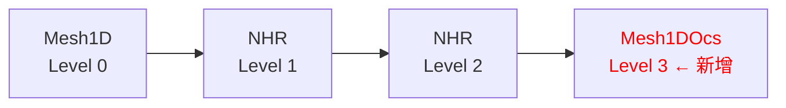
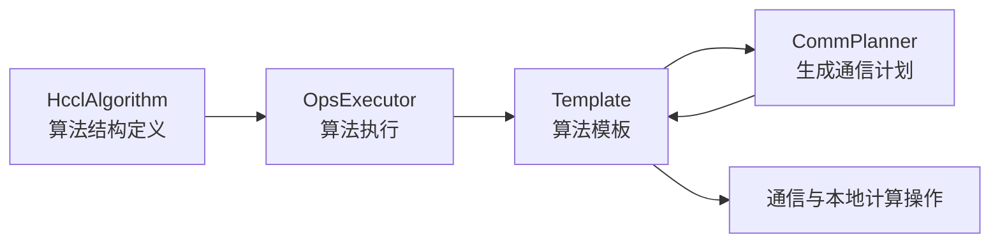
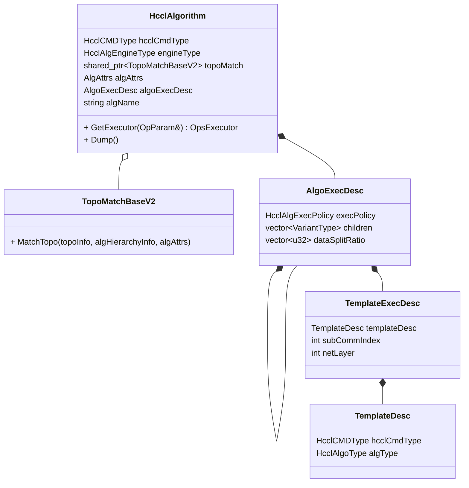
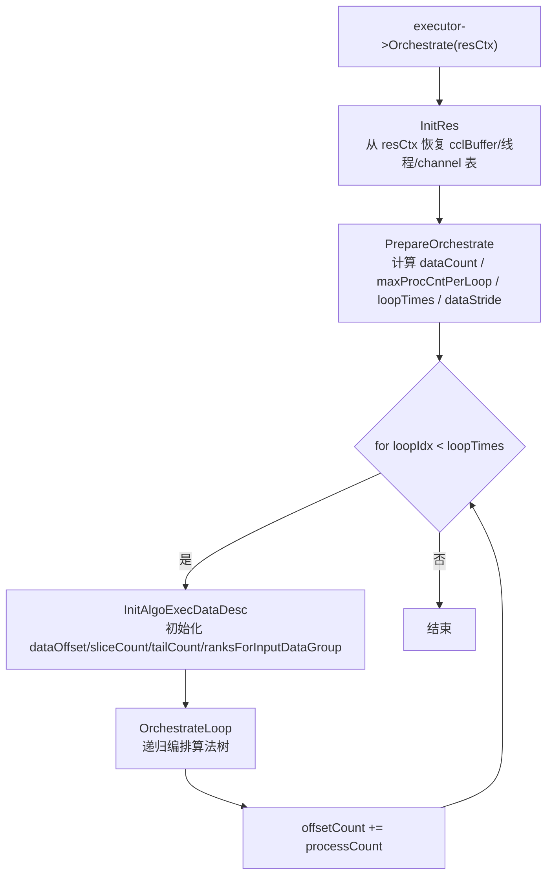
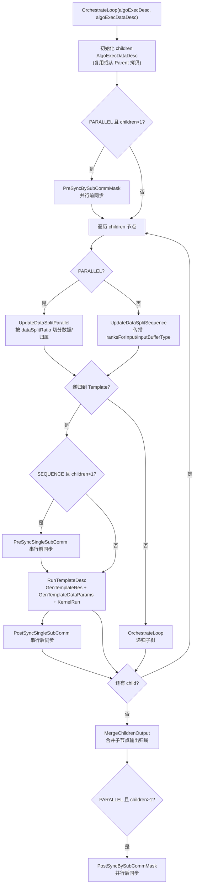
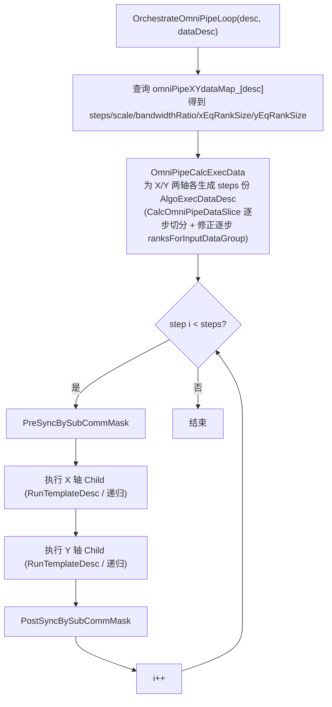
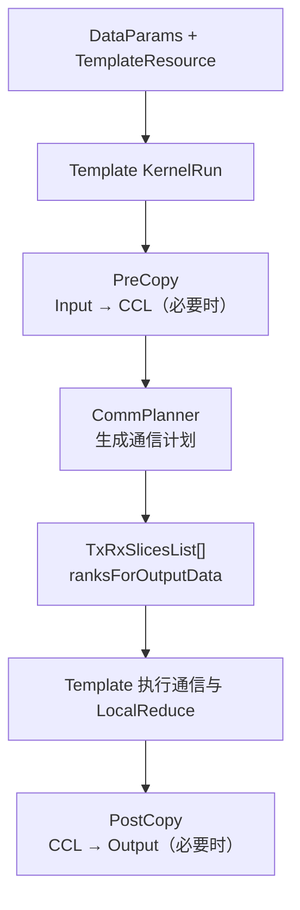
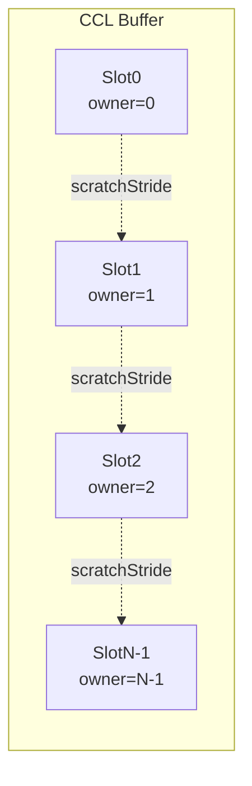
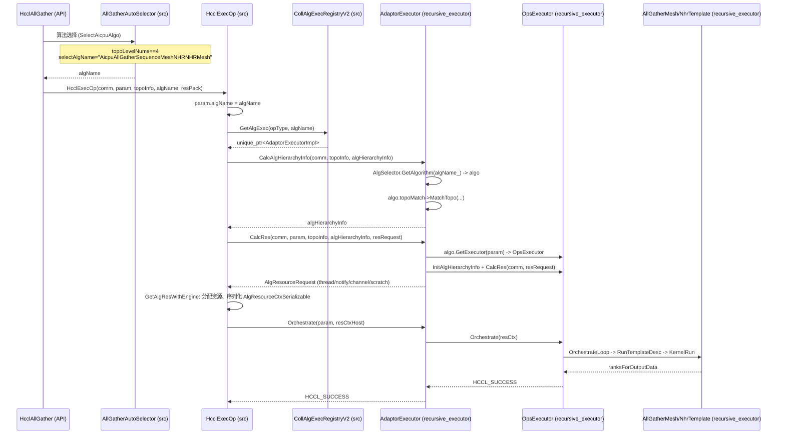

# RFC: 集合通信Executor统一算法结构方案

- 起始日期：2026-08-12
- RFC PR编号：<https://gitcode.com/cann/hccl/pull/2572>
- 相关Issue：<https://gitcode.com/cann/hccl/issues/607>

***

## 概要

本RFC提出一套以 `HcclAlgorithm` 为静态算法描述、以 `OpsExecutor` 为通用解释器、以 Template 为单层执行单元、以 CommPlanner 为通信计划生成器的 HCCL 重构方案。方案通过递归算法树描述 Sequence、Parallel 和 OmniPipe 等组合，通过 `ranksForInputData`/`ranksForOutputData` 传递逻辑数据归属，并建立 `Input → CCL Buffer → ... → CCL Buffer → Output` 的统一内存与数据流模型。

本重构以 `experimental/ops/op_common/recursive_executor/` 为落地目录，采用**插件式零侵入接入**方式对接到 src 原流程：recursive\_executor 代码以 OBJECT 库形式编入 `libhccl.so`，通过 `REGISTER_ALG` 把 `AdaptorExecutor`（继承 src 的 `InsCollAlgBase`）注册进 src 的 `CollAlgExecRegistryV2`；src 的 Selector 对 4 级拓扑选择 recursive\_executor 算法名后，原流程 `Selector → HcclExecOp → GetAlgExec → CalcAlgHierarchyInfo/CalcRes → Orchestrate` 自然调度到 recursive\_executor 执行器，src 侧除 Selector 的 4 级拓扑分支外零改动。

## 背景与动机

### 现状问题

当前HCCL的代码架构随着多层拓扑、并行切分和复合算子增加，同一种 Mesh 或 NHR 通信过程会在多个算法类中重复出现，存在以下问题：

1. 算法使用字符串命名，无法从统一结构直接看出算法由哪些阶段组成及阶段间的串并行关系。
2. Executor 类型同时表达算法结构和执行机制，每增加一种组合都需新增类（全仓 50+ 个执行器类，统计口径见 1.2 节）。
3. Template 同时承担本地拷贝、通信计划生成和执行，Mesh/NHR 通信逻辑难以复用。
4. 多层 Sequence 中，前一阶段产生了哪些 Rank 数据、下一阶段应读取哪些数据缺少显式契约，只能通过 repeatNum 和 repeatStride 推导。
5. 用户 Input/Output 和 CCL Buffer 布局描述需 inputSliceStride、outputSliceStride、inputRepeatStride、outputRepeatStride 等多个字段，逻辑复杂且易出错。
6. AllReduce TwoShot 等复合算法在旧代码中表现为专用大 Template，难以复用 ReduceScatter 和 AllGather 已有实现。

### 直接触发原因：四层组网拓扑适配

上述问题被激化的直接触发因素是**四层组网拓扑**的新增需求。

HCCL 当前支持 2\~3 层网络拓扑：

```text
2 层：server 内 Mesh (layer0) + 跨 server NHR (layer1)
3 层：server 内 Mesh (layer0) + 跨 server NHR (layer1) + 跨 super-pod NHR (layer2)
```

每种拓扑层级组合下，每个算子（AllGather/AllReduce/Broadcast/ReduceScatter/Scatter）都需要对应的 Executor + Template 实现。四层组网拓扑在此基础上新增第 4 层（跨 super-pod 的 OCS 层）：

```text
4 层：server 内 Mesh (layer0) + 跨 server NHR (layer1) + 跨 super-pod NHR (layer2) + **跨 super-pod OCS (layer3) ← 新增**
```

在旧架构下，适配四层拓扑意味着每个算子新增 4 层编排执行器，且与 3 层代码大量重复（4 层的前三阶段与 3 层完全相同，仅多了第 4 层），工作量线性膨胀：6 个算子 ×（Sequence + Parallel + 可能的 OmniPipe 变体）≈ 12-18 个新执行器类，每个 300-500 行。

这正是重构的核心驱动力：**需要一个能抽象描述任意层级组合的统一数据结构，使新增拓扑层级只需在算法表中注册算法执行策略，而非复制整套执行器代码，即可实现新增算法**。

在重构后的架构中，4 层 AllGather 的算法只是在 3 层算法上再追加一层 `AllGather_Mesh1DOcs` ：



### 代码量对比

当前 Executor 有 6 个命令字（AllGather、AllReduce、Broadcast、Reduce、ReduceScatter、Scatter），每个命令字可能有 5 种常见编排方式（Solo、Sequence、Concurrent、Parallel、OmniPipe），随着定制机型扩展和通信维度扩展，算子编排方式会出现倍数增长。以 `broadcast_parallel` 执行器为例，算法需要 4 个 Template 并行在 inter 和 intra 维度计算，由于缺少数据抽象，`OrchestrateLoop` 函数超过 150 行，并生成每个模板的 `TemplateDataParams` 对象。初步设计可将所有 Executor 合并为 1 个通用执行器（约 800 行），大幅降低维护成本。

| 场景                  | 旧架构新增代码量                             | 重构后新增代码量                                      |
| ------------------- | ------------------------------------ | --------------------------------------------- |
| 3 层→4 层拓扑（每算子）      | 新增 2-3 个执行器类 + 对应 Template（\~1000 行） | 算法表追加 1 个叶子节点（\~10 行）                         |
| 新增 Parallel 变体（每算子） | 新增 1 个执行器类（\~300-500 行）              | 修改算法树的 `execPolicy` 和 `dataSplitRatio`（\~5 行） |

### 重构目标与非目标

**目标**：

1. 用 `HcclAlgorithm + AlgoExecDesc + TemplateExecDesc` 描述算法结构。
2. 用通用 Executor 解释 Sequence、Parallel 和嵌套组合，替代 50+ 个特化执行器。
3. 用显式 Rank 归属表连接前后执行阶段。
4. 把可复用的 Mesh/NHR 通信计划从 Template 抽取为 CommPlanner。
5. 使 AllReduce TwoShot 等算法可通过组合已有算法模板快速构造。
6. 以插件方式接入 src 原流程，src 除 Selector 4 级分支外零改动。

**约束**：

- 不修改算法选择策略和选择阈值（仅在 4 级拓扑场景新增一个算法名分支）。
- 不修改 HCCL 公开 API。
- 不违反分层依赖：recursive\_executor 只 include src（HCCL 同层）头文件，跨仓调用 HCOMM 仍走 `src/common/hcomm_dlsym/` 的符号表 + dlsym。

## 术语表

| 术语                                     | 含义                                                                                                                                      |
| -------------------------------------- | --------------------------------------------------------------------------------------------------------------------------------------- |
| HcclAlgorithm                               | 算法描述结构，包含算法树、拓扑匹配器和算法名，是注册进算法表的最小单元                                                                                                     |
| OpsExecutor                            | 通用执行器，递归解释算法树，替代 50+ 个特化执行器                                                                                                             |
| Template                               | 单层执行单元，负责数据准备、通信执行和结果整理                                                                                                                 |
| CommPlanner                            | 通信计划生成器，计算通信对端、数据切片和归属，不执行通信                                                                                                            |
| AlgSelector                            | 算法注册表，按算法名查询 HcclAlgorithm，实现 Selector/Executor/Template 解耦                                                                                  |
| AdaptorExecutor                        | 桥接层，继承 src 的 InsCollAlgBase，把三个接口转发给 OpsExecutor                                                                                        |
| InsCollAlgBase                         | src 所有 V2 执行器的统一抽象基类                                                                                                                    |
| CollAlgExecRegistryV2                  | src 执行器注册表，按算子类型和算法名查找执行器                                                                                                               |
| TopoMatchBaseV2                        | 拓扑匹配器基类，把通信域拓扑拆成逐层子通信域                                                                                                                  |
| SEQUENCE / PARALLEL / OMNIPIPE         | 三种执行策略：串行依赖、数据并行、流水交叉                                                                                                                   |
| ranksForInputData / ranksForOutputData | 某 rank 本地 Buffer 中各逻辑 Slot 的归属 rank 序列（per-rank 视角，不同 rank 内容不同）；表示有哪些有效 Slot 及其 Owner，不表示与哪些 Peer 通信；前后阶段通过 output = next input 连接归属契约 |

## 架构与接口契约

### 整体架构

重构后的核心链路只有四层：



四层分别回答不同问题：

| 层次            | 核心问题                        |
| ------------- | --------------------------- |
| `HcclAlgorithm`    | 算法由哪些算法模板组成，按什么策略组合         |
| `OpsExecutor` | 数据如何切分，算法模板按什么顺序执行，数据如何传递   |
| Template      | 一个算法模板如何准备数据、执行通信、整理结果      |
| CommPlanner   | 对当前 Rank 和子通信域，应与谁通信，搬运哪些切片 |

核心设计思想是把**静态算法结构**和**动态数据状态**分离：`HcclAlgorithm` 在算法选择完成后保持不变；`AlgoExecDataDesc` 随 Loop、Sequence 阶段和 Parallel 子片动态变化。Executor 递归解释算法树时不修改 `HcclAlgorithm`，只为每个 Child 派生一份 `AlgoExecDataDesc`。

### 对外接口

本次重构为**算子开发者**提供以下接口，开发者基于这些接口即可新增算法而无需编写执行器类（详细流程见 4. 新增算法指南）：

#### 1. REGISTER_ALG — 算法与执行器一步注册

```cpp
#define REGISTER_ALG(cmdType, algName, hcclAlgorithm)
```

一步完成算法入 `AlgSelector` 和执行器入 `CollAlgExecRegistryV2`，两表以同一算法名关联。

| 参数         | 类型            | 说明                                                                          |
| ---------- | ------------- | --------------------------------------------------------------------------- |
| `cmdType`  | `HcclCMDType` | 算子类型（如 `HCCL_CMD_ALLGATHER`），决定执行器在 src 注册表中的分类槽位                           |
| `algName`  | `std::string` | 算法唯一标识（如 `"AicpuAllGatherSequenceXxxMesh"`），Selector 返回此名称，Executor 据此查找算法树 |
| `hcclAlgorithm` | `HcclAlgorithm`    | 预构造的算法树，含拓扑匹配器、执行策略、子节点列表和引擎类型（组装方式见 1.1 节）                                 |

#### 2. HcclAlgorithm / AlgoExecDesc / TemplateExecDesc — 算法树描述结构

```cpp
struct TemplateExecDesc {
    TemplateDesc templateDesc;   // 算子类型 + 算法类型
    int subCommIndex;             // 子通信域索引
    int netLayer = -1;            // 网络层索引，-1=遍历所有层取首个匹配
};

struct AlgoExecDesc {
    HcclAlgExecPolicy execPolicy;           // 执行策略：SEQUENCE / PARALLEL / OMNIPIPE
    std::vector<VariantType> children;      // 子节点（叶子=TemplateExecDesc，非叶子=嵌套AlgoExecDesc）
    std::vector<u32> dataSplitRatio;       // 并行数据切分比例，元素个数须与 children 一致
};

// HcclAlgorithm 描述完整算法入口
class HcclAlgorithm {
    HcclCMDType hcclCmdType;                       // 算子类型
    HcclAlgEngineType engineType;                  // 引擎类型
    std::shared_ptr<TopoMatchBase> topoMatch;       // 拓扑匹配器
    AlgoExecDesc algoExecDesc;                      // 执行树
    std::string algName;                            // 算法名
};
```

开发者用这三层数据结构组装算法树：`TemplateExecDesc` 描述单层 Template，`AlgoExecDesc` 描述执行策略与子节点列表，`HcclAlgorithm` 描述完整算法入口。

#### 3. AicpuBaseTemplate — Template 基类

开发者继承 `AicpuBaseTemplate`，按算子语义重写以下方法。`KernelRun` 由基类固定编排 `PreCopy → RunAlgorithm → SendAll → PostCopy`，开发者无需重写。

##### 必须实现

```cpp
// [纯虚] 调用 CommPlanner 生成收发描述列表，由基类 SendAll 统一执行
virtual HcclResult RunAlgorithm(std::vector<TxRxSlicesList> &txRxSlicesLists,
                                std::vector<u32> &ranksForOutputData) = 0;
```

| 参数 | 方向 | 说明 |
|------|------|------|
| `txRxSlicesLists` | 输出 | 收发描述列表，基类据此调 `SendAll` 执行通信 |
| `ranksForOutputData` | 输出 | 通信后本 rank 持有的数据归属 rank 列表 |

> **`DataSlicesList`** 是 `recursive_executor` 扩展类型，基于 `src` 的 `TxRxSlicesList` 结构，增加 `srcRankId_` 和 `dstRankId_` 字段以支持 mesh/nhr 通信中 rank 标识。上述 `RunAlgorithm`/`SendAll` 等接口中的 `TxRxSlicesList` 在实际实现中均使用 `DataSlicesList`。

##### 按需重写

```cpp
// 通信前本地预处理（input → output / ccl buffer）
// 默认：将本 rank 的 input 拷贝到 output 和 ccl buffer[myRank]
virtual HcclResult PreCopy(const std::vector<ThreadHandle> &threads);

// 统一执行 SendRecv
// 默认：走 WRITE 方向（本端写到对端 ccl buffer）
virtual HcclResult SendAll(const std::vector<TxRxSlicesList> &txRxSlicesLists,
                           TemplateResource &templateResource,
                           const std::vector<ThreadHandle> &threads);

// 通信后本地处理（ccl buffer → output）
// 默认：将 ccl buffer 中其它 rank 的数据搬回 output
virtual HcclResult PostCopy(const std::vector<ThreadHandle> &threads);

// 计算所需线程数与 notify 数
// 默认：Mesh threadNum=rankSize-1，NHR threadNum=channelsPerRank，notifyPerThread=1
virtual HcclResult GetRes(AlgResourceRequest &res) const;
```


#### 4. REGISTER_TEMPLATE — Template 工厂注册

```cpp
#define REGISTER_TEMPLATE(cmdType, algType, TemplateClass)
```

将 Template 类注册进全局工厂表，框架内部通过 `GetTemplate()` 按 `TemplateDesc` 查表创建实例。新增 Template 时调用此宏即可，无需修改 `GetTemplate` 本身。

| 参数 | 类型 | 说明 |
|------|------|------|
| `cmdType` | `HcclCMDType` | 算子类型（如 `HCCL_CMD_ALLGATHER`） |
| `algType` | `HcclAlgoType` | 算法类型（如 `HCCL_ALGO_TYPE_FULLMESH`） |
| `TemplateClass` | 类名 | 继承 `AicpuBaseTemplate` 的子类名，工厂据此实例化 |

<br />

### 依赖接口

本重构依赖以下 src / HCOMM 接口，不引入新外部依赖：

| 依赖项 | 来源 | 用途 |
|--------|------|------|
| `InsCollAlgBase` | `src/ops/op_common/algorithm/executor/executor_v2_base.h` | `AdaptorExecutor` 继承此类，实现三个纯虚接口（`CalcAlgHierarchyInfo`/`CalcRes`/`Orchestrate`），桥接 src 执行框架 |
| `OpParam` / `AlgResourceRequest` / `AlgResourceCtxSerializable` | `src/ops/op_common/...` | recursive_executor 与 src 共享同一套类型，天然类型一致，无需包装层 |
| `CollAlgExecRegistryV2` | `src/ops/op_common/executor/registry/coll_alg_v2_exec_registry.h` | 执行器注册表，`REGISTER_ALG` 通过此表将 `AdaptorExecutor` 注册到 src |
| `hcomm_dlsym` 符号表 | `src/common/hcomm_dlsym/` | 跨仓调用 HCOMM 走 dlsym，不引入对 `cann/hcomm` 的编译期硬依赖 |
| `param.algName` 路由机制 | src Selector | src Selector 返回算法名字符串，执行器据名查表，复用原有路由 |

<br />

## 影响分析

- **对性能的影响**：通用执行器 `OpsExecutor` 的递归编排相比特化执行器的 inline 调用引入额外开销，小消息场景敏感；统一的 Slot 布局可能使 Scatter 算子 CCL Buffer 占用上升。设计稳定后需跑 benchmark 对比。
- **对现有功能的作用范围**：53 个特化执行器合并为 1 个通用执行器；src 仅新增 Selector 4 级拓扑分支，其余执行框架、资源管理、构建发布流程零改动。
- **对构建、依赖、发布的影响**：无新外部依赖；recursive\_executor 后续通过算子注册机制（`REGISTER_ALG`）注册到商用代码运行，不改变现有构建和发布流程。

## 兼容性考虑

本次重构不改变算法选择策略、不改变公开 API，也不改变 src 执行框架。迁移只发生在算法被选中之后：已选算法名 → `GetAlgExec` 返回 recursive\_executor 执行器 → `HcclAlgorithm` 树 → 通用 Executor 解释 → 新 Template/CommPlanner 执行。

### 1. 代码合入路径：experimental/ops/op\_common/recursive\_executor/

根据 `experimental/README.md` 规范，重构代码落在 `experimental/ops/op_common/recursive_executor/`（位于 `experimental/ops/op_common/` 下，结构与 `src` 一致，含 `executor/`、`template/`、`topo/`、`inc/`；`algorithm/` 目录待 Phase 1 算法注册补全时创建）。

- **不影响主干**：recursive\_executor 后续通过算子注册机制接入商用代码运行，src 原流程结构零改动（仅 Selector 多一个 4 级拓扑分支），对现有构建和发布影响可控。

### 2. 渐进式接入

灰度接入分三阶段：

1. **Phase 1**：AllGather算子，4 级拓扑 Sequence（Mesh+NHR×2+Mesh），单引擎（Aicpu）。当前 `experimental/ops/op_common/recursive_executor/` 已搭建骨架（`TopoMatchFourLevel` + `AdaptorExecutor` + `OpsExecutor` 骨架 + `AllGatherMesh/NhrTemplate` + `Mesh/NhrCommPlanner`），算法注册（`algorithm/all_gather.cc`）待补全。
2. **Phase 2**：AllGather 单层 Mesh/NHR、多层 Sequence/Parallel/Concurrent，以及 ReduceScatter/AllReduce/Broadcast/Scatter 算子，多引擎。
3. **Phase 3**：全算子覆盖，OmniPipe 流水。

## 详细设计

### 1. 数据结构

#### 1.1 HcclAlgorithm 三层描述结构

`HcclAlgorithm` 由三个层次组成：



- `HcclAlgorithm`：描述一个完整集合通信算法，携带 `topoMatch`（拓扑匹配器）和算法树，通过 `GetExecutor()` 创建通用执行器。**这是注册进算法表的最小单元**。
- `TopoMatchBaseV2`：拓扑匹配器，负责把通信域拓扑拆成逐层子通信域（`AlgHierarchyInfoForAllLevel`），供 Selector/Executor 共用。
- `AlgoExecDesc`：组合节点，描述 Children 采用何种执行策略（SEQUENCE/PARALLEL/OMNIPIPE）。
- `TemplateExecDesc`：算法模板，描述在哪个子通信域（`subCommIndex`）上执行哪种 Template，`netLayer` 用于跨层模板（默认 -1）。
- `TemplateDesc`：描述算子语义与拓扑算法类型。

对应代码（`experimental/ops/op_common/recursive_executor/inc/algo_desc.h`）：

```cpp
enum class HcclAlgExecPolicy { SEQUENCE, PARALLEL, OMNIPIPE };

struct TemplateDesc {
    HcclCMDType hcclCmdType;
    HcclAlgoType algType;
};

enum SubCommIndexType : int {
    SUB_COMM_INDEX_0 = 0, SUB_COMM_INDEX_1 = 1,
    SUB_COMM_INDEX_2 = 2, SUB_COMM_INDEX_3 = 3,
    SUB_COMM_INDEX_4 = 4, SUB_COMM_INDEX_5 = 5,
};

struct TemplateExecDesc {
    TemplateDesc templateDesc;
    int subCommIndex;
    int netLayer = -1;
};

struct AlgoExecDesc;
using VariantType = std::variant<TemplateExecDesc, std::shared_ptr<AlgoExecDesc>>;
struct AlgoExecDesc {
    HcclAlgExecPolicy execPolicy = HcclAlgExecPolicy::SEQUENCE;
    std::vector<VariantType> children;
    std::vector<u32> dataSplitRatio;
};

class HcclAlgorithm {
public:
    std::unique_ptr<OpsExecutor> GetExecutor(OpParam& param);
    void Dump();
    HcclCMDType hcclCmdType;
    HcclAlgEngineType engineType;
    std::shared_ptr<TopoMatchBaseV2> topoMatch;
    AlgAttrs algAttrs;
    AlgoExecDesc algoExecDesc;
    std::string algName;
};
```

`AlgoExecDesc::children` 是递归 Variant：每个 Child 要么是一个算法模板（`TemplateExecDesc`），要么是一棵子树（`shared_ptr<AlgoExecDesc>`）。Executor 遍历时使用 `std::get_if` 区分两种类型：对 `TemplateExecDesc` 走 `RunTemplateDesc`，对 `shared_ptr<AlgoExecDesc>` 递归调用 `OrchestrateLoop`。

#### 1.2 执行策略

##### 现状 Executor 盘点

当前 `src/ops/` 下共有 **53 个 Executor 类**（统计口径：直接继承 `InsCollAlgBase`/`ExecutorBase` 的类共 63 个，剔除 Send/Recv/BatchSendRecv 等 10 个点对点类），按编排方式和算子维度分类如下（下表为主要类别，未穷举 AllGatherV/ReduceScatterV/Aiv 等变体）：

| 编排类型                   | AllGather                          | AllReduce                                      | ReduceScatter                          | Broadcast           | Scatter                  | Reduce         | Barrier         | AllToAllV                                |
| ---------------------- | ---------------------------------- | ---------------------------------------------- | -------------------------------------- | ------------------- | ------------------------ | -------------- | --------------- | ---------------------------------------- |
| **Sole**（单层）           | AllGatherSole                      | AllReduceSole                                  | ReduceScatterSole                      | BroadcastSole       | ScatterSole              | ReduceSole     | BarrierSole     | AllToAllVSole                            |
| **Sequence**（多层串行）     | AllGatherSequence + Aicpu + 3Level | AllReduceSequence + Aicpu + Aicpu3Level + 2Die | ReduceScatterSequence + Aicpu + 3Level | BroadcastSequence   | ScatterSequence + 3Level | ReduceSequence | BarrierSequence | —                                        |
| **Parallel**（数据并行）     | AllGatherParallel                  | AllReduceParallel                              | ReduceScatterParallel                  | BroadcastParallel   | ScatterParallel          | ReduceParallel | —               | —                                        |
| **Concurrent**（并发）     | AllGatherConcurrent                | AllReduceConcurrent                            | ReduceScatterConcurrent                | —                   | —                        | —              | —               | AllToAllVConcurrent + AllToAllConcurrent |
| **OmniPipe**（流水）       | AllGatherOmniPipe + 2D             | AllReduceOmniPipe + 2D                         | ReduceScatterOmniPipe + 2D             | BroadcastOmniPipe2D | ScatterOmniPipe2D        | —              | —               | —                                        |
| **TwoShot**（两阶段）       | —                                  | AllReduceTwoShotSole                           | —                                      | —                   | —                        | —              | —               | —                                        |
| **OrderPreserved**（保序） | —                                  | AllReduceOrderPreserved                        | ReduceScatterOrderPreserved            | —                   | —                        | —              | —               | —                                        |

分析上述 53 个 Executor 的编排方式，可归纳为三种本质不同的 Children 组织模式：

- **串行依赖**：如多层 AllGather 逐层扩散、AllReduce TwoShot 的 ReduceScatter→AllGather，后一阶段的输入数据来自前一阶段的输出，阶段间存在数据依赖。抽象为 `SEQUENCE`。
- **数据并行**：如 Concurrent Mesh1D NHR，数据的不同子片分别沿不同通信域扩散，各 Child 处理互不重叠的数据。抽象为 `PARALLEL`，通过 `dataSplitRatio` 描述切分比例。
- **流水交叉**：如跨层 OmniPipe，两个轴按 Step 交替执行以重叠通信时间。抽象为 `OMNIPIPE`，作为 Parallel 的流水线扩展。

| 策略         | 语义                                                         | 现状对应                                              |
| ---------- | ---------------------------------------------------------- | ------------------------------------------------- |
| `SEQUENCE` | Children 按顺序执行，前一 Child 的输出状态成为后一 Child 的输入状态              | SoleExecutor、SequenceExecutor、TwoShotSoleExecutor |
| `PARALLEL` | Parent 数据按 `dataSplitRatio` 切给多个 Children，各 Child 处理不同数据子片 | ParallelExecutor、ConcurrentExecutor               |
| `OMNIPIPE` | 两个轴按 Step 流水执行，属于 Parallel 的专用流水扩展                         | OmniPipeExecutor、OmniPipe2dExecutor               |

现状中的 Sole、Sequence、TwoShot 三种 Executor 都映射到 `SEQUENCE`：Sole 是单算法模板的 Sequence，TwoShot 是两个算法模板的 Sequence，区别仅在 children 数量和类型。Parallel 和 Concurrent 都映射到 `PARALLEL`：Concurrent 是 Parallel 的特例（各 Child 使用不同子通信域）。OrderPreserved 作为算法语义约束，由 Template 层保证，不影响 Executor 编排策略。

**映射等价性论证**：旧架构中 Parallel 与 Concurrent 在数据流上都属于"按比例切分数据 + 在不同子通信域上并发执行"，差异仅在于切分比例的来源——`InsV2AllGatherParallelExecutor` 在 `CalcCostCoeff` 中使用固定 50/50 比例（`constexpr float ratio = 0.5f`）把数据切给 mesh 与 NHR 两个轴；`InsV2AllGatherConcurrentExecutor` 通过 `GetParallelDataSplit` 按端口数比例（`splitData = portNum0 / (portNum0 + portNum1)`）切分，并在 mesh + CLOS 两个子通信域并发下发。两者都**切分数据**，不存在"同时下发但不切分"的语义。重构用 `dataSplitRatio` 统一表达切分比例——固定比例或端口比例都可在算法构建阶段算好填入，因此合并为 `PARALLEL` 不改变运行行为。

这三种策略是正交的：串行描述时序依赖，并行描述数据切分，流水描述执行重叠。任意复杂算法都可以通过这三种策略的递归组合表达。新增编排模式只需扩展枚举值和 Executor 的 `OrchestrateLoop` 分支，不影响已有策略的执行逻辑。

拓扑层级（`subCommIndex`）和执行顺序（`execPolicy`）是两个独立维度：前者回答"在哪个 Rank 集合上执行"，后者回答"Children 之间如何组织"。

**`subCommIndex`** **到实际通信域的映射**：`subCommIndex` 是逐层子通信域表 `AlgHierarchyInfoForAllLevel::infos[]` 的下标，该表由 `TopoMatchBaseV2::MatchTopo` 在 `CalcAlgHierarchyInfo` 阶段填充（`infos[i]` 为第 i 层子通信域的 Rank 分组）。Template 运行时通过同一下标取本层通信资源：`algHierarchyInfo_.infos[subCommIndex].at(0)` 取本层 Rank 列表，`GenTemplateRes` 以 `channelTable_.at(subCommIndex)`/`subThreads_.at(subCommIndex)` 取本层 channel 与线程（资源由 `CalcRes` 阶段 `CalcTemplateChannelRes` 按 `subCommIndex` 逐层申请、经 `resCtx.channels[level]` 序列化、`InitRes` 时 `RestoreChannelMap` 重建，见 3.7）。约束：`subCommIndex` 必须小于拓扑层数，越界直接报错。

#### 1.3 算法注册表（AlgSelector）

算法注册表是重构架构的核心枢纽——它将"算法"从代码逻辑转化为可查询的数据结构，实现 Selector、Executor 和 Template 三层的彻底解耦。

##### 设计动机

算法注册表的核心思想是**算法即数据**：每个算法用一棵 `HcclAlgorithm` 树完整描述，预构造后注册进全局表。Selector 只负责返回算法名，Executor 只负责解释执行，两者都不包含算法定义本身。新增算法只需在算法文件里追加一个 `REGISTER_ALG` 宏。不修改 src Selector，默认 selector 流程不会选到 4 级算法。当前接入部分（算法注册机制落地）尚有遗留，等selector重构完善后接入，用户可通过 `HCCL_ALGO` 环境变量显式配置 4 级算法名后调用。待算法稳定后再讨论将 4 级算法合入默认 selector 流程。

##### 数据结构

```cpp
class AlgSelector {
public:
    static AlgSelector& Instance();
    HcclResult Register(const std::string& algName, HcclAlgorithm algo);
    bool GetAlgorithm(const std::string& algName, HcclAlgorithm& algo) const;
private:
    AlgSelector() = default;
    std::map<std::string, HcclAlgorithm> algMap_;
    mutable std::mutex mu_;
};
```

`GetAlgorithm` 按名字返回 `HcclAlgorithm` 的拷贝（`topoMatch` 为 `shared_ptr`，共享同一匹配器）。注册表在 Host 库和 Device 内核中各自静态初始化，双端都可通过算法名重建算法定义，**无需序列化算法树**。

##### 算法注册示例（4 级 AllGather）

`experimental/ops/op_common/recursive_executor/algorithm/all_gather.cc`展示了完整注册流程：先组装算法树，再注册算法 + 注册执行器（`REGISTER_ALG` 见第 3 节）：

```cpp
// 4级串行：Mesh(layer3) -> NHR(layer2) -> NHR(layer1) -> Mesh(layer0)
static AlgoExecDesc MakeAllGather4LevelAlgoExecDesc()
{
    TemplateDesc meshDesc{HcclCMDType::HCCL_CMD_ALLGATHER, HcclAlgoType::HCCL_ALGO_TYPE_FULLMESH};
    TemplateDesc nhrDesc{HcclCMDType::HCCL_CMD_ALLGATHER, HcclAlgoType::HCCL_ALGO_TYPE_NHR};
    AlgoExecDesc desc;
    desc.execPolicy = HcclAlgExecPolicy::SEQUENCE;
    desc.children = {
        TemplateExecDesc{meshDesc, SUB_COMM_INDEX_3},
        TemplateExecDesc{nhrDesc,  SUB_COMM_INDEX_2},
        TemplateExecDesc{nhrDesc,  SUB_COMM_INDEX_1},
        TemplateExecDesc{meshDesc, SUB_COMM_INDEX_0},
    };
    desc.dataSplitRatio = {1, 1, 1, 1};
    return desc;
}

static HcclAlgorithm MakeAllGather4LevelAlgo()
{
    HcclAlgorithm algo;
    algo.hcclCmdType = HcclCMDType::HCCL_CMD_ALLGATHER;
    algo.engineType  = HcclAlgEngineType::COMM_ENGINE_AICPU;
    algo.topoMatch   = std::make_shared<TopoMatchFourLevel>();
    algo.algoExecDesc = MakeAllGather4LevelAlgoExecDesc();
    algo.algName     = "AicpuAllGatherSequenceMeshNHRNHRMesh";
    return algo;
}

// 注册算法到 AlgSelector + 注册执行器到 CollAlgExecRegistryV2
REGISTER_ALG(HcclCMDType::HCCL_CMD_ALLGATHER, AicpuAllGatherSequenceMeshNHRNHRMesh, MakeAllGather4LevelAlgo());
```

新增算法只需三步：编写工厂函数（组装 `AlgoExecDesc` 树）、复用或新增 `TopoMatchBaseV2` 匹配器、追加一行 `REGISTER_ALG`。

##### Selector 与算法表的交互

Selector 的职责不变——根据拓扑层级、数据量、Rank 数等条件选择最优算法。变化在于：对 4 级拓扑直接返回 recursive\_executor 算法名字符串（`"AicpuAllGatherSequenceMeshNHRNHRMesh"`）。后续链路完全复用 src 的字符串路由机制（`param.algName`），无需 Selector 直接持有算法对象。

### 2. 关键逻辑

#### 2.1 算法组装示例

快速组装算法的关键不是新增 Executor 类，而是复用三种积木：**算法模板**（`TemplateExecDesc`）、**执行策略**（`SEQUENCE`/`PARALLEL` 节点）、**递归**（把一个 `AlgoExecDesc` 作为另一个节点的 Child）。

**最小算法**——单层 Mesh AllGather，一棵只有一个算法模板的 Sequence 树：

```cpp
AlgoExecDesc root {
    .execPolicy = SEQUENCE,
    .children = { TemplateExecDesc{allGatherMeshDesc, 0} },
    .dataSplitRatio = {1}
};
```

**两层 Sequence**——先 Level 0 执行 Mesh，再 Level 1 执行 NHR：

```cpp
AlgoExecDesc root {
    .execPolicy = SEQUENCE,
    .children = {
        TemplateExecDesc{allGatherMeshDesc, 0},
        TemplateExecDesc{allGatherNhrDesc, 1}
    },
    .dataSplitRatio = {1, 1}
};
```

**Concurrent**——当前重构将 Concurrent 表示为一个 `PARALLEL` 节点，两个算法模板处理不同数据子片、使用不同子通信域并发提交：

```cpp
AlgoExecDesc root {
    .execPolicy = PARALLEL,
    .children = {
        TemplateExecDesc{allGatherMeshDesc, 0},
        TemplateExecDesc{allGatherNhrDesc, 1}
    },
    .dataSplitRatio = {1, 1}
};
```

**嵌套 Parallel**——两个 Parallel 阶段串行执行，第一阶段数据不同子片分别沿两个维度扩散，第二阶段交换维度顺序：

```cpp
auto phase0 = AlgoExecDesc{
    PARALLEL,
    {meshLevel0, nhrLevel1},
    {1, 1}
};
auto phase1 = AlgoExecDesc{
    PARALLEL,
    {nhrLevel1, meshLevel0},
    {1, 1}
};
AlgoExecDesc root{
    SEQUENCE,
    {shared(phase0), shared(phase1)},
    {1, 1}
};
```

**AllReduce TwoShot**——算法语义是 `AllReduce = ReduceScatter → AllGather`，直接组合两个已有算法模板，无需专用大 Template：

```cpp
AlgoExecDesc allReduceTwoShot {
    .execPolicy = SEQUENCE,
    .children = {
        TemplateExecDesc{reduceScatterMeshDesc, 0},
        TemplateExecDesc{allGatherMeshDesc, 0}
    },
    .dataSplitRatio = {1, 1}
};
```

多层 AllReduce 同样只是扩展 Sequence，核心顺序是"沿拓扑逐层 ReduceScatter，再按相反顺序逐层 AllGather"：

```cpp
AlgoExecDesc root {
    .execPolicy = SEQUENCE,
    .children = {
        TemplateExecDesc{reduceScatterMeshDesc, 0},
        TemplateExecDesc{reduceScatterNhrDesc, 1},
        TemplateExecDesc{allGatherNhrDesc, 1},
        TemplateExecDesc{allGatherMeshDesc, 0}
    },
    .dataSplitRatio = {1, 1, 1, 1}
};
```

由此可见，3 层→4 层拓扑只需在算法表追加一个算法模板，Executor 无需任何修改。

#### 2.2 Executor 递归编排

##### 功能流程

Executor 是一个与引擎类型、算法命令、Topo 无关的通用对象。`OpsExecutor::Orchestrate` 实际执行流程如下：



`OpsExecutor` 是 `HcclAlgorithm::GetExecutor()` 创建的通用执行器，构造时从 `OpParam` 采集 input/output/root/dataType 等运行时信息。

##### 静态结构与动态状态

Executor 同时持有两类信息：

| 类型                 | 生命周期          | 内容                                    |
| ------------------ | ------------- | ------------------------------------- |
| `HcclAlgorithm`         | 整次算子执行不变      | 算法树、算法模板类型、子通信域层级、拓扑匹配器               |
| `AlgoExecDataDesc` | 随 Loop 和树节点变化 | Buffer 类型、Offset、Count、Stride、Rank 归属 |

`AlgoExecDataDesc` 是"数据在算法树某个节点入口处的状态快照"，核心字段包括：`inputBufferType`/`outputBufferType`/`cclBufferType`（本阶段输入/输出/CCL Buffer 来源）、`dataOffset`（Loop 在用户内存中的起始偏移）、`sliceOffset`/`sliceCount`（Parallel 子片偏移与数量）、`dataStride`/`scratchStride`（用户内存/CCL Buffer 相邻 Slot 间距）、`ranksForInputDataGroup`/`ranksForOutputDataGroup`（当前 Buffer 中各 Slot 的 Owner）。

##### 递归编排流程

`OrchestrateLoop` 是 Executor 的核心递归函数，统一处理 Sequence、Parallel 和嵌套组合：



##### Sequence 状态传播

Sequence 不仅表示调用顺序，还定义两个状态传递：

```text
next.ranksForInputDataGroup = previous.ranksForOutputDataGroup   // 整体转移，可能为多组
next.inputBufferType        = previous.outputBufferType
```

Executor 决定每个 Child 的输出位置：非最后 Child 输出到 `HCCL_BUFFER`，最后 Child 输出到 Parent 目标 Buffer。因此一个三阶段 Sequence 的数据状态为：

```text
Child 0:  INPUT  → CCL
Child 1:  CCL    → CCL
Child 2:  CCL    → OUTPUT
```

`ranksForOutputData` 不是调试信息，而是 Sequence 正确连接的必要状态。注意 Buffer 推导（INPUT/CCL/OUTPUT）只决定数据放在哪个 Buffer，与归属组数无关；归属组数由下述消费规则决定。

**多组归属的消费规则**：`UpdateDataSplitSequence` 把前一 Child 的**全部**输出归属（可能多组）原样赋给下一 Child，具体如何消费取决于下一 Child 的类型：

- 下一 Child 是 **Template 叶子**：`GenTemplateDataParams` 强制 `ranksForInputDataGroup.size() == 1`——Template 只能消费单组归属。因此多组归属必须先被一个 PARALLEL 节点消化、或合并归为单组，否则执行期报错。
- 下一 Child 是 **PARALLEL 节点**（N 个子节点）：`UpdateDataSplitParallel` 要求输入组数等于子节点数（否则报错），按**下标一一对应**把 N 组归属分给 N 个 PARALLEL 子节点——多组归属必须匹配后续的 PARALLEL 结构。

对应 2.1 节嵌套示例 `root = SEQUENCE[phase0(PARALLEL), phase1(PARALLEL)]`：phase0 的两个 Child（mesh/nhr）若输出归属不同而保留 2 组，phase1 作为 2 子节点的 PARALLEL 节点恰好按下标一一消费这 2 组归属。设计算法树时需保证多组归属的语义顺序与后续 PARALLEL 子节点的通信域排列一致，必要时调整 Child 排列或插入合并节点。

##### Parallel 数据切分与归属传播

`dataSplitRatio` 是**比例**（ratio），不是绝对计数。例如 `{2, 1}` 表示 Child 0 和 Child 1 按 2:1 比例分配 Parent 的 `sliceCount`。具体计算：`childSlice[i] = floor(parentSlice * ratio[i] / sum(ratio))`，最后一个 Child 承接整除余量以保证数据不丢失。以 `{2, 1}` 且 `parentSlice = 10` 为例：Child 0 得 `floor(10 * 2 / 3) = 6`，Child 1 得 `10 - 6 = 4`。

**余量分配的影响**：余量（最多 `childrenSize - 1` 个元素）固定集中到最后一个 Child。数据量远大于 Rank 数时可忽略；但在对称 Concurrent 场景（如 `{1, 1}` 且 `parentSlice` 为奇数）下，最后一个子通信域会比其它子通信域多处理一个 Slot，造成轻微负载不均。该策略当前不可配置；对均衡敏感的场景，建议在算法构建阶段按实际端口/带宽比例设置 `dataSplitRatio`（使切分与各通信域能力匹配），余量影响随数据量增大自然稀释，必要时可评估扩展余量分散策略。

Parallel 的每个 Child 从 Parent 继承大部分状态，但重新计算 `sliceCount` 和 `sliceOffset`：按上述比例切分，Offset 累加前一 Child 覆盖范围。Tail 只传给最后一个 Child。

Parallel 切分改变的是 Slot 内部 Offset 和 Count，**不改变** **`stride`**。

归属传播规则：Parent 只有一组输入归属时，每个 Child 处理同一组 Owner 的不同子片；Parent 有多组归属时，各 Child 取得自己的那一组。Children 执行完成后，`MergeChildrenOutput` 若判定所有 Child 输出归属相同则 Parent 保留一组，否则保留多组供后续消费。

##### OmniPipe 编排（OrchestrateOmniPipeLoop）

OmniPipe（跨层流水）是 2D 网格上"慢轴/快轴按 Step 交替通信以重叠传输时间"的编排方式。旧架构为每个算子维护一个专用执行器（如 `InsV2AllGatherOmniPipeExecutor`/`InsV2AllGatherOmniPipe2dExecutor`），内部硬编码 3 层拓扑、逐轴切片与多线程调度。在重构架构中，**OmniPipe 不再需要专用执行器**：它只是 `AlgoExecDesc` 的一种 `execPolicy`（`HcclAlgExecPolicy::OMNIPIPE`），由通用 `OpsExecutor` 解释，两个轴对应算法树的 2 个 Child，复用同一套 Template/CommPlanner 与同步原语。

###### OmniPipe 算法表达

`OMNIPIPE` 节点与 `PARALLEL` 不同：它要求**恰好 2 个 Child**（`OmniPipeUpdateEqBWAndReorder` 对 `children.size() != 2` 直接报错），两个 Child 分别代表慢轴 X 和快轴 Y，各 Child 既可以是 `TemplateExecDesc` 叶子，也可以是子树（如每个轴各是一棵 Sequence 树）：

```cpp
AlgoExecDesc root {
    .execPolicy = OMNIPIPE,
    .children = {
        // 轴 X（慢轴）：沿某层子通信域的 AllGather 子树
        AlgoExecDesc { SEQUENCE, { meshLevel0, nhrLevel1 }, {1, 1} },
        // 轴 Y（快轴）：沿另一层子通信域的 AllGather 子树
        AlgoExecDesc { SEQUENCE, { nhrLevel1, meshLevel0 }, {1, 1} }
    },
    .dataSplitRatio = {1, 1}
};
```

当前约束：`OMNIPIPE` 策略仅支持 `ALLREDUCE`/`ALLGATHER` 两个命令（`OpsExecutor::Orchestrate` 对其它命令直接报错）。

###### OmniPipe 执行流程

`OMNIPIPE` 顶层走与 `SEQUENCE`/`PARALLEL` 不同的分支（`OpsExecutor::Orchestrate`）：

```text
PreCopy(Input → CCL) → OrchestrateOmniPipeLoop → PostCopy(CCL → Output)
```

其中 `PreCopy` 以 `ranksForInputData = {myRank_}` 把本 Rank 的 Input 拷贝进 CCL Buffer，随后把 `inputBufferType`/`outputBufferType` 置为 `HCCL_BUFFER`，编排结束后 `PostCopy` 以 `ranksForOutputData = [0..rankSize-1]` 把全量结果写回 Output。

`InitRes` 阶段先调用 `OmniPipeUpdateEqBWAndReorder` 做一次**拓扑预处理**，结果按 `AlgoExecDesc*` 缓存进 `omniPipeXYdataMap_`，供后续 `OrchestrateOmniPipeLoop` 查询：

1. **逐轴等效带宽**：递归计算每个轴子树的等效带宽——Mesh 层 `OMIN_MESH_BW=56`，CLOS 层 `OMIN_CLOS_BW/(eqRankSize-1)`（`OMIN_CLOS_BW=112`）。
2. **轴重排**：若 X 轴等效带宽大于 Y 轴，则交换两个 Child，保证慢轴在前（`xEqBw ≤ yEqBw`）。
3. **Step/比例计算**：用 `CalcBandwidth2D(xB, yB, xRankSize, yRankSize, OMIN_MAX_STEP_NUM, steps, scale)` 按带宽比计算流水步数 `steps`（≤ 5）与 `scale` 缩放，连同 `bandwidthRatio = yB/xB`、`xEqRankSize/yEqRankSize` 一起存入 `OmniPipeXYdata`。

`OrchestrateOmniPipeLoop` 的编排骨架：



- **逐步切片**：`OmniPipeUpdateDataSlice` 调 `CalcOmniPipeDataSlice(bandwidthRatio, xRankSize, yRankSize, steps, scale, sliceCount, xSliceCount, ySliceCount)`（`executor/omnipipe_utils.cc`），按"第一步快轴满载、慢轴 `scale/bw` 起步，中间步按 `growth = (xRankSize-1)/bw` 递推，倒数第二步收口，最后一步斜对角切分"的递推公式算出每步 X/Y 轴各自要处理的 `sliceCount` 与 `sliceOffset`，并保证 `xSliceCount` 是 `yRankSize-1` 的倍数、`ySliceCount` 是 `xRankSize-1` 的倍数。
- **逐步归属修正**：最后一步的 X 轴、第 1 步之后的 Y 轴，其 `ranksForInputDataGroup` 由 `CalcPeerAxisRanksForOutput` 用对侧轴的子通信域重算，保证每步通信的 Peer Owner 集合正确。
- **同步复用**：每步前后用 `PreSyncBySubCommMask`/`PostSyncBySubCommMask` 做并行前/后同步，与 `PARALLEL` 复用同一套线程/notify 机制，无需旧的 `ntfIdxCtrlToTempXY_` 等专用通道映射。

###### 与旧 OmniPipe 执行器的对比

| 维度    | 旧架构（src）                                                                                              | 重构后（recursive\_executor）                                     |
| ----- | ----------------------------------------------------------------------------------------------------- | ------------------------------------------------------------ |
| 执行器形态 | 每算子一个专用类（AllGather/AllReduce/ReduceScatter/Broadcast/Scatter × OmniPipe/OmniPipe2D）                   | 无专用类，`OMNIPIPE` 只是 `execPolicy`，通用 `OpsExecutor` 解释          |
| 轴表达   | 模板参数 + `BuildSubCommAndTempMap` 硬编码 3 层（level0/1/2）                                                   | 算法树的两个 Child（可嵌套子树）                                          |
| 逐步切片  | `OmniPipeSliceInfo`（dataSliceLevel0/1/2）+ `CalcAGOmniPipeSliceInfo`/`CalcRSOmniPipeSliceInfo` 等算子专属函数 | 通用 `CalcOmniPipeDataSlice`（2D 精简版），去算子/引擎特化分支                |
| 线程调度  | `tempMainThreadsXY_`/`tempMainThreadsZ_` + 专用 notify 索引                                               | `PreSyncBySubCommMask`/`PostSyncBySubCommMask` 通用同步          |
| 数据归属  | 依赖 `inputOmniPipeSliceStride` 等推导                                                                     | `ranksForInputDataGroup` 显式契约 + `CalcPeerAxisRanksForOutput` |

###### 对 src 的接入

`OMNIPIPE` 的接入与其他 recursive\_executor 算法完全一致，无需额外的 Selector 分支或注册宏：只要在算法表中用 `REGISTER_ALG` 注册一棵 `execPolicy = OMNIPIPE` 的算法树，第 3 节的 `param.algName → GetAlgExec → AdaptorExecutor → OpsExecutor` 链路自动生效。这也正是兼容性考虑第 2 节渐进接入中"Phase 3：全算子覆盖，OmniPipe 流水"这一最后阶段的核心支撑。

#### 2.3 ranksForInputData：数据流的主线

##### 定义

`ranksForInputData` 表示当前 Buffer 中按物理布局顺序存在的逻辑 Slot Owner：

```text
ranksForInputData[i] = 当前第 i 个逻辑 Slot 属于哪个全局 Rank
```

它表达三个信息：当前有多少个有效 Slot、每个 Slot 的 Owner 是谁、这些 Slot 按什么逻辑顺序排列。它**不表示**当前 Template 要与哪些 Peer 通信。

##### CommPlanner 前后变化

CommPlanner 接收 `ranksForInputData` 并计算 `ranksForOutputData`：

| CommPlanner   | 输入归属            | 输出归属                    |
| ------------- | --------------- | ----------------------- |
| AllGather     | 当前已有 Owner 集合   | 当前集合加上 Peer 拥有的 Owner   |
| ReduceScatter | 全部待归约 Owner     | 当前 AlgRank 负责的 Owner 子集 |
| Scatter       | Root 持有全部 Owner | 每个 Rank 保留分配给自己的 Owner  |

##### AllReduce TwoShot 中的归属变化

以 4 Rank 单层 Mesh 为例：

```text
初始：              ranksForInputData = [0,1,2,3]   （每个 Rank 都有本地贡献）
ReduceScatter 后：  rank k 的 ranksForOutputData = [k]  （每个 Rank 只保留归约结果）
AllGather 后：      ranksForOutputData = [0,1,2,3]    （全量归约结果）
```

这正是 `SEQUENCE[ReduceScatter, AllGather]` 能够成立的数据契约。

#### 2.4 Template 与 CommPlanner

##### 功能流程

Template 和 CommPlanner 不是两套算法实现，而是"执行框架"和"通信计划"的关系：



Template 的稳定执行骨架为 `PreCopy → RunAlgorithm(CommPlanner) → SendAll/ReduceAll → PostCopy`。各阶段按 Buffer 状态退化：输入已在 CCL Buffer 时 PreCopy 跳过；输出给下一 Sequence 阶段时 PostCopy 跳过。

##### 分工

| Template 负责                 | CommPlanner 负责        |
| --------------------------- | --------------------- |
| 判断输入来自 Input 还是 CCL Buffer  | 计算通信 Peer             |
| 必要时执行 PreCopy               | 计算 Tx/Rx 四组 DataSlice |
| 调用 CommPlanner              | 计算阶段后的 Rank 归属        |
| 把 Peer 绑定到实际通信资源            | 按 Peer 输出通信描述列表       |
| 执行 Read、Write、Reduce、Notify | **不执行通信、不管理资源**       |
| 必要时执行 PostCopy              | <br />                |

CommPlanner 不感知引擎，只返回通信描述列表。这样可复用同一 CommPlanner，同时保留不同 Template 对拷贝、归约和执行方式的差异。

#### 2.5 内存布局与数据流

##### Slot 排列

CCL Buffer 的内存布局对所有算子类型**一致**——均按 Rank ID 顺序排列为一维 Slot 数组，Slot i 存放 Rank i 的数据，相邻 Slot 间距为 `scratchStride`。


当数据量过大时，Executor 按 `maxProcCntPerLoop` 分批处理（多 Loop 循环），CCL Buffer 每个 Loop 只需容纳分批数据。

##### 统一内存流向


各 CCL 快照通常是**同一块物理 CCL Buffer 在不同时间的逻辑快照**。Sequence 的中间 Child 输出到 CCL Buffer，最后 Child 输出到 Parent 目标 Buffer。`ranksForInputData`/`ranksForOutputData` 是连接前后阶段的契约：前一阶段输出归属 = 后一阶段输入归属，PostCopy 按 Owner 将数据写入 Output 的对应 Slot。

### 3. 对接到 src 原流程

本重构**不修改、不替换** src 的执行框架，而是作为插件挂到 src 已有的算法路由上。核心思路一句话：**recursive\_executor 只是一个实现了** **`InsCollAlgBase`** **接口的"新执行器"，通过注册表混入 src 原流程，src 只多了一条 Selector 分支来选中它**。

接入点在三个层面：**编译期**（OBJECT 库并入）、**选择期**（Selector 返回 recursive\_executor 算法名）、**执行期**（`AdaptorExecutor` 桥接 `InsCollAlgBase` → `OpsExecutor`）。

#### 3.1 编译期接入：RecursiveExecutor OBJECT 库

`experimental/ops/op_common/recursive_executor/CMakeLists.txt` 将 recursive\_executor 编译为 OBJECT 库 `RecursiveExecutor`，链接进 `libhccl.so`：

```cmake
add_library(RecursiveExecutor OBJECT ${RE_CORE_SRC})
set_target_properties(RecursiveExecutor PROPERTIES POSITION_INDEPENDENT_CODE ON)
target_compile_definitions(RecursiveExecutor PRIVATE _GLIBCXX_USE_CXX11_ABI=0)
target_include_directories(RecursiveExecutor PUBLIC ${RE_INCLUDE_LIST})
target_link_libraries(RecursiveExecutor PUBLIC hccl_compat)

if(TARGET hccl)
    target_link_libraries(hccl PRIVATE RecursiveExecutor)
endif()
```

关键点：

- **include 复用 src 内部头**：`RE_INCLUDE_LIST` 直接引用 `src/ops/op_common/...` 等路径，recursive\_executor 与 src 共享同一套 `OpParam`/`AlgResourceRequest`/`AlgResourceCtxSerializable`/`InsCollAlgBase` 类型，天然类型一致，无需包装层。
- **架构约束合规**：recursive\_executor 只 include src（HCCL 同层）头文件；对 HCOMM 的调用继续通过 `src/common/hcomm_dlsym/` 的符号表 + dlsym（`alg_param.h` 引入的 `hccl_res_dl.h` 等即 dlsym 封装），不引入对 `cann/hcomm` 的编译期硬依赖。
- **device 侧同源编译**：存在 `scatter_aicpu_kernel` 目标时，把 `RE_CORE_SRC` 注入该 AICPU 内核，保证 Host/Device 两端都有 recursive\_executor 的注册表与执行器。

#### 3.2 选择期：Selector 的 4 级拓扑分支

src 的 `AllGatherAutoSelector::SelectAicpuAlgo`（`src/ops/all_gather/selector/all_gather_auto_selector.cc`）在多级拓扑分支里新增了 4 级处理：

```cpp
if (topoInfo->topoLevelNums > 1) {
    // recursive_executor 4 级拓扑算法
    if (topoInfo->topoLevelNums == 4) {
        selectAlgName = "AicpuAllGatherSequenceMeshNHRNHRMesh";
        HCCL_INFO("[AllGatherAutoSelector] topoLevelNums=%u, select recursive_executor algorithm [%s]",
            topoInfo->topoLevelNums, selectAlgName.c_str());
        return SelectorStatus::MATCH;
    }
    if (...) {
        // ... 原 3 级逻辑保持不变
```

- 该分支只把**算法名**写进 `selectAlgName`，此后与 src 其它算法走完全相同的路由，不感知 recursive\_executor 存在。

#### 3.3 执行期：AdaptorExecutor 桥接层

`InsCollAlgBase`（`src/ops/op_common/executor/executor_v2_base.h`）是 src 所有 V2 执行器的统一抽象，src 只通过三个纯虚接口驱动执行器：

```cpp
class InsCollAlgBase {
public:
    virtual HcclResult CalcAlgHierarchyInfo(
        HcclComm comm, TopoInfoWithNetLayerDetails* topoInfo, AlgHierarchyInfoForAllLevel& algHierarchyInfo) = 0;
    virtual HcclResult CalcRes(
        HcclComm comm, const OpParam& param, const TopoInfoWithNetLayerDetails* topoInfo,
        const AlgHierarchyInfoForAllLevel& algHierarchyInfo, AlgResourceRequest& resourceRequest) = 0;
    virtual HcclResult Orchestrate(const OpParam& param, const AlgResourceCtxSerializable& resCtx) = 0;
};
```

`AdaptorExecutorBase`（`experimental/ops/op_common/recursive_executor/executor/adaptor_executor.h`）继承该接口，把三个接口全部转发给 recursive\_executor 的 `OpsExecutor`：

```cpp
class AdaptorExecutorBase : public InsCollAlgBase {
public:
    AdaptorExecutorBase() = default;
    ~AdaptorExecutorBase() override = default;

    HcclResult CalcAlgHierarchyInfo(
        HcclComm comm, TopoInfoWithNetLayerDetails* topoInfo, AlgHierarchyInfoForAllLevel& algHierarchyInfo) override;
    HcclResult CalcRes(
        HcclComm comm, const OpParam& param, const TopoInfoWithNetLayerDetails* topoInfo,
        const AlgHierarchyInfoForAllLevel& algHierarchyInfo, AlgResourceRequest& resourceRequest) override;
    HcclResult Orchestrate(const OpParam& param, const AlgResourceCtxSerializable& resCtx) override;
    std::string Describe() const override;

protected:
    std::string algName_;                          // 子类构造时绑定算法名
    std::unique_ptr<OpsExecutor> executor_;        // 延迟构造的通用执行器
};

template <const char *AlgName>
class AdaptorExecutorImpl : public AdaptorExecutorBase {
public:
    AdaptorExecutorImpl() : AdaptorExecutorBase() { algName_ = AlgName; }
    ~AdaptorExecutorImpl() override = default;
};
```

三个接口的转发实现（`experimental/ops/op_common/recursive_executor/executor/adaptor_executor.cc`）：

```cpp
// 1. 拓扑匹配：从 AlgSelector 取算法对象的 topoMatch 完成匹配（传 algAttrs）
HcclResult AdaptorExecutorBase::CalcAlgHierarchyInfo(...)
{
    HcclAlgorithm alg;
    if (!AlgSelector::Instance().GetAlgorithm(algName_, alg)) { ... }
    return alg.topoMatch->MatchTopo(topoInfo, algHierarchyInfo, alg.algAttrs);
}

// 2. 资源计算：按 param.algName 构造 OpsExecutor，并补一次拓扑匹配
HcclResult AdaptorExecutorBase::CalcRes(HcclComm comm, const OpParam& param, ...)
{
    if (!executor_) {
        HcclAlgorithm alg;
        AlgSelector::Instance().GetAlgorithm(param.algName, alg);
        OpParam& mutableParam = const_cast<OpParam&>(param);
        executor_ = alg.GetExecutor(mutableParam);              // new OpsExecutor
        executor_->InitAlgHierarchyInfo(comm, topoInfo, algHierarchyInfo);
    }
    return executor_->CalcRes(comm, resourceRequest);
}

// 3. 执行：复用或重建 OpsExecutor 后编排
HcclResult AdaptorExecutorBase::Orchestrate(const OpParam& param, const AlgResourceCtxSerializable& resCtx)
{
    if (!executor_) {
        HcclAlgorithm algo;
        AlgSelector::Instance().GetAlgorithm(param.algName, algo);
        executor_ = algo.GetExecutor(const_cast<OpParam&>(param));
    }
    return executor_->Orchestrate(const_cast<AlgResourceCtxSerializable&>(resCtx));
}
```

要点：

- **算法名是唯一纽带**：`CalcRes`/`Orchestrate` 均按 `param.algName` 从 `AlgSelector` 取回算法定义，与 src 通过 `param.algName` 路由执行器的机制完全一致，双端（Host 库 / AICPU 内核）都能重建出同一棵算法树。
- **`OpsExecutor`** **生命周期**：一个 `AdaptorExecutor` 实例内 `CalcRes` 创建、`Orchestrate` 复用，避免重复构造开销。

#### 3.4 注册宏：把 recursive\_executor 执行器挂进 src 注册表

`experimental/ops/op_common/recursive_executor/executor/adaptor_executor.h` 提供注册宏 `REGISTER_ALG`：

```cpp
// REGISTER_ALG 宏统一定义见 3.5 节（守卫 lambda 版本），此处不再重复
```

说明：

- `CollAlgExecRegistryV2`（`src/ops/op_common/executor/registry/coll_alg_v2_exec_registry.h`）是 src 所有 V2 执行器的注册表，`DefaultExecCreatorV2<AdaptorExecutorImpl<...>>` 返回 `InsCollAlgBase*`，与 src 既有 `REGISTER_EXECUTOR_IMPL` 等宏走同一 `Register(type, tag, creator)` 通道。
- 由于 `const char*` 模板参数要求变量有外部链接，`REGISTER_ALG` 先定义一个 `static const char` 的 `g_alg_##algName[]` 字符串（编译器扩展，见 3.5 节说明），再以它实例化 `AdaptorExecutorImpl`，使模板在编译期绑定算法名。
- `REGISTER_ALG` 一次完成"算法入 `AlgSelector`"与"执行器入 `CollAlgExecRegistryV2`"，两表以同一算法名关联，是 3.2 中 Selector 返回名字能被路由到 recursive\_executor 执行器的前提。

#### 3.5 运行期开关

根据 `experimental/README.md` 运行期开关规范，recursive\_executor 作为实验性贡献，其算子注册受运行期开关保护，防止实验特性意外生效影响主干。

**开关命名**：环境变量 `HCCL_EXPERIMENTAL_RECURSIVE_EXECUTOR=true`。

**实现**（`experimental/ops/op_common/recursive_executor/executor/adaptor_executor.cc`）：

```cpp
bool IsRecursiveExecutorEnabled()
{
    constexpr bool recursiveExecutorEnabled = false; // 默认 false
    if (!recursiveExecutorEnabled) {
        return false;
    }
    const char* env = getenv("HCCL_EXPERIMENTAL_RECURSIVE_EXECUTOR");
    return env != nullptr && std::string(env) == "true";
}
```

- 编译期常量 `recursiveExecutorEnabled` 默认 `false`，优先级最高：为 `false` 时直接返回 `false`，环境变量不生效。
- 常量为 `true` 时，再判断环境变量 `HCCL_EXPERIMENTAL_RECURSIVE_EXECUTOR` 是否为 `"true"`，是则启用。

**使用**：`REGISTER_ALG` 宏在静态初始化期以 `IsRecursiveExecutorEnabled()` 守卫（`adaptor_executor.h`）：

```cpp
#define REGISTER_ALG(cmdType, algName, algo)                                    \
    namespace ops_hccl {                                                        \
        static const char g_alg_##algName[] = #algName;                             \
        static bool g_reg_##algName = []() {                                    \
            if (!IsRecursiveExecutorEnabled()) {                                \
                return false;                                                   \
            }                                                                   \
            AlgSelector::Instance().Register(#algName, algo);                   \
            CollAlgExecRegistryV2::Instance().Register(                         \
                cmdType, std::string(#algName),                                 \
                DefaultExecCreatorV2<AdaptorExecutorImpl<g_alg_##algName>>);   \
            return true;                                                        \
        }();                                                                     \
    }
```

开关关闭时（当前默认），`REGISTER_ALG` 静态初始化 lambda 直接 `return false`，算法不入 `AlgSelector`、执行器不入 `CollAlgExecRegistryV2`。

> `g_alg_##algName` 声明为 `static const char[]`（内部链接）。C++14 标准要求非类型模板参数（`const char*`）具备外部链接，`static const char[]` 作为模板实参属于编译器扩展；如目标编译器不支持此扩展，则需将 `static` 去除以恢复外部链接。

#### 3.6 完整调用链时序

以 AllGather 4 级拓扑为例，从 API 到 recursive\_executor 执行的完整链路：



分步说明：

1. **算法选择**（src）：`AllGatherAutoSelector::SelectAicpuAlgo` 对 4 级拓扑返回 `"AicpuAllGatherSequenceMeshNHRNHRMesh"`。
2. **执行器路由**（src）：`HcclExecOp`（`src/ops/op_common/op_common.cc`）把算法名写入 `param.algName`，调 `CollAlgExecRegistryV2::Instance().GetAlgExec(param.opType, algName)` 得到 `AdaptorExecutorImpl`（src 侧唯一的一处按名查找，recursive\_executor 复用）。
3. **资源计算**（src 驱动 + recursive\_executor 实现）：`HcclGetAlgRes` 依次调用 `CalcAlgHierarchyInfo`、`CalcRes`。前者由 `AdaptorExecutor` 交给 `TopoMatchFourLevel` 做逐层拓扑匹配；后者构造 `OpsExecutor` 并递归 `CalcRes`，输出 `AlgResourceRequest`。src 据此经 `GetAlgResWithEngine` 分配线程/notify/channel/scratch 并序列化为 `AlgResourceCtxSerializable`。
4. **执行**：`executor->Orchestrate(param, resCtxHost)`（CCU/默认引擎在 Host 直接调；AICPU\_TS 引擎在 `HcclAicpuKernelEntranceLaunch` 下发后，AICPU 内核里同样经 `CollAlgExecRegistryV2::GetAlgExec` + `Orchestrate` 执行）。`OpsExecutor::InitRes` 从 `resCtx` 恢复 CCL Buffer/线程/channel 表后，进入 `PrepareOrchestrate → OrchestrateLoop` 递归编排。

#### 3.7 资源复用与 Host/Device 传递

- **资源复用**：`HcclGetAlgRes` 先尝试 `TryReuseResource`——若该 `algTag` 的资源已创建，直接返回序列化 ctx（`isResourceReused=true`），Host 侧反序列化后即可 `Orchestrate`，跳过 `CalcAlgHierarchyInfo`/`CalcRes`。recursive\_executor 执行器无需感知该机制，复用判断完全发生在 src。
- **Channel 恢复**：`OpsExecutor::InitRes` 调用 `RestoreChannelMap`，把 `resCtx.channels`（按层展开）重组为 `rankId → ChannelInfo` 映射，供 Template 的 `GenTemplateRes` 绑定实际通信资源，与 src 执行器的 `InsCollAlgBase::RestoreChannelMap` 语义对齐。

### 4. 新增算法指南

基于本方案的 Executor/Template/CommPlanner 三层分离架构，新增一个算法只需按积木组装，无需编写新的执行器类。根据是否需要引入新的通信计划器，分为两个场景，但最终都需完成统一的注册与接入步骤。

#### 场景判断

| 场景                  | 适用条件                                  | 交付件                                                                 |
| ------------------- | ------------------------------------- | ------------------------------------------------------------------- |
| **A：复用已有 Template** | 新算法只是将已有 Mesh/NHR 等原语按不同树形或层级组合       | 算法注册 + CMakeLists + Selector 分支                                     |
| **B：新增 Template**   | 新算法底层需要新的通信模式（如 Recursive Doubling 等） | CommPlanner（按需） + Template + 工厂注册 + 算法注册 + CMakeLists + Selector 分支 |

#### 场景 B：新增 Template

场景 A 无需额外开发，直接进入[流程统一](#流程统一)。

**1. 新增 Template**

文件：`experimental/ops/op_common/recursive_executor/template/aicpu/xxx_template.h` + `.cc`

继承 `AicpuBaseTemplate`，实现 `RunAlgorithm()` 调用通信计划器生成 `TxRxSlicesList`，按需重写 `SendAll()`/`PostCopy()`/`GetRes()`。Template 的执行骨架（`PreCopy → RunAlgorithm → SendAll → PostCopy`）见 2.4 节。若已有 CommPlanner（如 `RunMeshAllGather`/`RunNhrAllGather` 等）不满足需求，需配套新增对应 CommPlanner 函数（文件置于 `template/comm_planners/xxx_comm_planner.h` + `.cc`），负责计算通信对端、数据切片和传输方向，输出 `TxRxSlicesList`，不执行通信、不管理资源（分工见 2.4 节）。

```cpp
// xxx_template.h
class XxxTemplate : public AicpuBaseTemplate {
public:
    XxxTemplate(u32 myRank, std::vector<u32> ranks, TemplateDesc templateDesc)
        : AicpuBaseTemplate(myRank, std::move(ranks), templateDesc)
    {
        syncAtCopyBoundary_ = false;
    }

protected:
    HcclResult RunAlgorithm(std::vector<TxRxSlicesList>& txRxSlicesLists,
                            std::vector<u32>& ranksForOutputData) override
    {
        return RunXxxCommPlanner(tempAlgParams_, ranks_, myRank_,
                               ranksForOutputData, txRxSlicesLists);
    }
};
```

**2. 在 Template 工厂中注册**

文件：`experimental/ops/op_common/recursive_executor/template/aicpu/xxx_template.cc`

```cpp
#include "aicpu/xxx_template.h"

// 注册 Template 类到工厂表
REGISTER_TEMPLATE(HCCL_CMD_ALLGATHER, HCCL_ALGO_TYPE_XXX, XxxTemplate);
```

#### 流程统一

无论是否新增 Template，以下步骤均需执行：

**1. 组装算法树并注册**

文件：`experimental/ops/op_common/recursive_executor/algorithm/<op>.cc`（如 `all_gather.cc`）

按 1.1 节的 `HcclAlgorithm` 三层描述结构和 2.1 节的组装方式编写工厂函数，再用 `REGISTER_ALG` 一步完成算法入 `AlgSelector` 和执行器入 `CollAlgExecRegistryV2`（注册机制见 1.3 节与 3.4 节）：

```cpp
static HcclAlgorithm MakeAicpuAllGatherSequenceXxxMesh()
{
    TemplateDesc xxxDesc{HcclCMDType::HCCL_CMD_ALLGATHER, HcclAlgoType::HCCL_ALGO_TYPE_XXX};
    TemplateDesc meshDesc{HcclCMDType::HCCL_CMD_ALLGATHER, HcclAlgoType::HCCL_ALGO_TYPE_FULLMESH};

    AlgoExecDesc desc;
    desc.execPolicy = HcclAlgExecPolicy::SEQUENCE;
    desc.children = {
        TemplateExecDesc{xxxDesc, SUB_COMM_INDEX_1},
        TemplateExecDesc{meshDesc, SUB_COMM_INDEX_0},
    };
    desc.dataSplitRatio = {1, 1};

    HcclAlgorithm algo;
    algo.hcclCmdType  = HcclCMDType::HCCL_CMD_ALLGATHER;
    algo.engineType   = HcclAlgEngineType::COMM_ENGINE_AICPU;
    algo.topoMatch    = std::make_shared<TopoMatchFourLevel>();
    algo.algoExecDesc = desc;
    algo.algName      = "AicpuAllGatherSequenceXxxMesh";
    return algo;
}

REGISTER_ALG(
    HcclCMDType::HCCL_CMD_ALLGATHER, AicpuAllGatherSequenceXxxMesh,
    MakeAicpuAllGatherSequenceXxxMesh());
```

> 若拓扑层级数不同，需配套新增 `TopoMatchXxxLevel`（继承 `TopoMatchBaseV2`，见 1.2 节）。

**2. 更新 CMakeLists.txt（仅新增了源文件时）**

文件：`experimental/ops/op_common/recursive_executor/CMakeLists.txt`

```cmake
set(RE_CORE_SRC
    # ... 已有文件 ...
    template/aicpu/xxx_template.cc
    template/comm_planners/xxx_comm_planner.cc
)
```

**3. 更新 src 侧 Selector**

文件：`src/ops/<op>/selector/<op>_auto_selector.cc`（如 `all_gather_auto_selector.cc`）

新增算法选择分支（接入机制见 3.2 节）：

```cpp
    if (topoInfo->topoLevelNums == TOPO_LEVEL_NUM_4) {
        selectAlgName = "AicpuAllGatherSequenceXxxMesh";
        return SelectorStatus::MATCH;
    }
```

#### 交付件清单

| 步骤             | 场景 A | 场景 B | 交付件                                                   |
| -------------- | ---- | ---- | ----------------------------------------------------- |
| 新增 CommPlanner | —    | 按需   | `template/comm_planners/xxx_comm_planner.h` + `.cc`  |
| 新增 Template    | —    | 是    | `template/aicpu/xxx_template.h` + `.cc`               |
| Template 工厂注册  | —    | 是    | `template/template_factory.h` 中新增分支                   |
| 算法树组装与注册       | 是    | 是    | `algorithm/<op>.cc` 中新增工厂函数 + `REGISTER_ALG`          |
| CMakeLists.txt | 是    | 是    | 新增源文件条目                                               |
| Selector 分支    | 是    | 是    | `src/ops/<op>/selector/<op>_auto_selector.cc` 中新增拓扑分支 |

场景 A 下最快只需修改 3 个文件（算法注册 + CMakeLists + Selector），新增一个叶子节点级别的算法即可生效。这正是 2.1 节"3 层→4 层拓扑只需追加一个算法模板"的具体体现。

## 测试方案

端到端算法测试覆盖以下场景：

- **单算子单层**：AllGather/AllReduce/Broadcast/ReduceScatter/Scatter 的 Mesh 和 NHR，Rank 数覆盖 1/2/3/4/8。
- **多层 Sequence**：2 层、3 层、4 层拓扑下的 Sequence 编排。
- **Parallel/Concurrent**：数据按比例切分，多组归属合并。
- **SEQUENCE 嵌套 PARALLEL 多组归属**：覆盖 2.1 嵌套示例（`SEQUENCE[PARALLEL, PARALLEL]`）的端到端正确性——前一 PARALLEL 输出多组归属时，后一 PARALLEL 按下标一一消费；同时覆盖"多组归属直接后接 Template 叶子应报错"的边界。
- **dataSplitRatio 不整除**：`ratio={1,1,1}`、`parentSlice` 不整除（如 10）等余量集中末位场景，验证数据不丢失与结果正确。
- **4 层拓扑嵌套组合**：4 层拓扑下 Sequence+Parallel 嵌套组合的端到端正确性（四层组网核心场景）。
- **AllReduce TwoShot**：`RS → AG` 组合，多层 AllReduce。
- **数据量覆盖**：Count 整除和不整除 Rank 数，单 Loop 和多 Loop。
- **拓扑覆盖**：连续 Rank 和 Stride 型子通信域 Rank。
- **src 回归**：`bash build.sh -u` 跑 UT，确保 src 既有用例不受影响。recursive\_executor 自身 UT 覆盖 `omnipipe_utils`、`data_ops`、`comm_planner`、`algo_desc` 四组（`test/ut/recursive_executor/`）。

## 风险评估

| 风险                             | 影响                                                                                                       | 应对                                                             |
| ------------------------------ | -------------------------------------------------------------------------------------------------------- | -------------------------------------------------------------- |
| 通用 Executor 递归开销               | 相比特化执行器的 inline 调用引入额外开销，小消息场景敏感                                                                         | 设计稳定后跑 benchmark 对比；热路径做特化优化                                   |
| Scatter算子 CCL Buffer 占用上升      | 通用化 Slot 布局可能比旧实现占用更高                                                                                    | 校核 Scratch 容量；按算子评估并在必要时复用同一物理 Scratch                         |
| recursive\_executor 与 src 接口漂移 | `InsCollAlgBase`/`OpParam` 等结构演进导致 recursive\_executor 编译失败                                              | recursive\_executor include 直接指向 src 头，接口变化即编译期报错，风险前置可发现      |
| **集中爆炸半径**                     | 53 个特化执行器合并为 1 个通用执行器，单点 bug 影响所有算子与编排方式；回退需在 Selector 中移除 recursive\_executor 算法分支，无法单算子回退              | 核心执行路径补齐 UT/ST；按 Phase 1→2→3 渐进灰度；异常时关键算子可继续走 src 旧执行器做 A/B 对照 |
| **Device 侧动态内存分配**             | recursive\_executor 的 `std::vector`/`std::map`/`std::shared_ptr` 依赖堆分配；AICPU 内核一般允许堆分配，但 CCU 等受限引擎可能限制   | 接入受限引擎前校核其内存约束；热路径复用预分配容器，避免循环内反复分配                            |
| **递归栈深度**                      | `OrchestrateLoop`/`OrchestrateOmniPipeLoop` 按算法树深度递归，深度受"拓扑层数 × 嵌套组合"约束（4 级 + 嵌套约个位数层）                   | 深度上界小、Device 栈风险低；可在注册表构建期校验算法树深度上限                            |
| **static 初始化顺序**               | `REGISTER_ALG` 在静态初始化期把算法登记进 `AlgSelector`（Meyers 单例，惰性初始化、本身无顺序问题）；若算法工厂依赖其它跨翻译单元的 static 全局对象，初始化顺序未定义 | 算法工厂只依赖函数内局部对象与 src 常量，不引用其它 static 全局；如后续需要，改为显式注册函数          |

## 替代方案

### 1. 局部重构：只统一 Sequence/Parallel，保留特化 TwoShot/OrderPreserved

只将 Sole/Sequence/Parallel/Concurrent 四种执行器统一为通用执行器，TwoShot 和 OrderPreserved 保留为特化类。

- 优点：改动范围小，TwoShot/OrderPreserved 的特殊逻辑不受影响，风险低。
- 缺点：TwoShot 本质是 `SEQUENCE[ReduceScatter, AllGather]`，OrderPreserved 的保序逻辑由 Template 层保证而非 Executor 编排，保留特化类反而引入不必要的维护负担。且四层拓扑新增时仍需为 TwoShot 新增层级变体类。**否决**。

### 2. 代码生成方案：用模板元编程或宏生成执行器类

编写代码生成器，根据编排模式 × 算子矩阵自动生成 53 个执行器类。

- 优点：保持现有执行器架构不变，生成代码可 inline 优化，无递归开销。
- 缺点：生成代码可读性差、调试困难；未解决编排与算法耦合问题——四层拓扑仍需修改生成器并重新生成全部类。本质上是自动化复制，而非消除重复。**否决**。

### 3. 在 src/ 原地重构

直接在 `src/ops/` 下改造现有执行器，不引入新目录。

- 优点：无迁移成本，直接替换。
- 缺点：重构期间无法保证旧代码可用，回退困难；且 `src/` 代码为生产级，合入前需完整验证。采用 `experimental/ops/op_common/recursive_executor/` 平行开发、成熟后合入的策略风险更低。**否决**。

## 开放问题

1. **性能回归验证**：统一执行器的递归开销是否引入可测量的性能回退？需在设计稳定后跑 benchmark 对比。
2. **Phase 2+ 覆盖度**：`experimental/ops/op_common/recursive_executor/` 目前只实现了4 级 AllGather 算法注册路径，后续多算子、多引擎接入时 `Template`/`CommPlanner` 的复用边界仍需进一步验证。

***

## 评审记录

评审过程在PR评论区进行，详细评审意见请参阅对应的PR评论。
