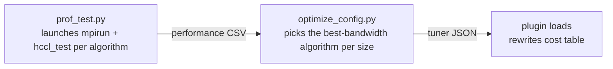

# HCCL Tuner Plugin Example

## Overview

This directory provides a reference implementation of the HCCL Tuner Plugin, demonstrating how to modify the cost table via an external `.so` plugin that reads a JSON configuration, thereby influencing the Selector's algorithm choice.

## Build

```bash
source /usr/local/Ascend/cann/set_env.sh
make
```

Artifact: `hccl_tuner_example.so`

The first build automatically downloads nlohmann/json (header-only) to `third_party/`. For offline environments, manually place `third_party/nlohmann/json.hpp` beforehand; `make` will skip the download if detected.

## Usage

```bash
export HCCL_TUNER_PLUGIN=/path/to/hccl_tuner_example.so
export HCCL_TUNER_CONFIG_FILE=/path/to/hccl_tuner_config.json
```

The plugin searches for the configuration file in the following order, loading the first readable one:

1. `$HCCL_TUNER_CONFIG_FILE` (skipped if not set)
2. `./hccl_tuner_config.json`
3. `/etc/hccl/hccl_tuner_config.json`

## Data Collection and Configuration Generation

Hand-writing JSON configuration makes it hard to guess the optimal algorithm for each topology. Two scripts in this directory turn it into a three-step workflow:



### Step 1: Collect Performance Data (prof_test.py)

prof_test.py launches `mpirun + hccl_test` for each algorithm in turn, parses the output tables, and writes the bandwidth and latency of each algorithm at each data size into a CSV.

Prerequisites:

- Python >= 3.8
- `mpirun` in PATH (MPICH or Open MPI; the script adapts to both command formats)
- CANN environment sourced (`$ASCEND_HOME_PATH` set), with hccl_test executables at
  `$ASCEND_HOME_PATH/tools/hccl_test/bin/` (or specify another location via `--bin-dir`)
- Run the script outside an mpirun session (a normal login shell). If it detects that
  it is running inside an MPI session, it exits with an error to avoid nested launches
  multiplying the collection processes

Typical command:

```bash
python3 prof_test.py --op-types allreduce,allgather --engines aicpu --np-total 16 --npus 8 \
    --hostfile hostfile --minbytes 1K --maxbytes 2G --stepfactor 2 \
    --data-types fp32 --output hccl_prof.csv
```

#### Parameters

| Parameter | Default | Description |
|-----------|---------|-------------|
| `--op-types` | (required) | Operators to collect, comma-separated, `all` supported (8-value whitelist) |
| `--np-total` | (required) | Total rank count, i.e., the value of `mpirun -n` |
| `--npus` | unset | NPUs per server, passed to hccl_test `-p` |
| `--hostfile` | unset | Hostfile for multi-node, not needed on a single node. One `IP:NPU` entry per line (e.g., `10.10.130.22:8`); lines starting with `#` and blank lines are ignored; server count = number of valid lines |
| `--minbytes` / `--maxbytes` | unset | Data size range, mapped to `-b` / `-e`; both must be given. Units: plain numbers are bytes; `K`/`M`/`G` suffixes are 1024-based (1K=1024B, 1M=1024K); decimals supported (e.g., `1.5K`) |
| `--stepbytes` | unset | Linear step (bytes), positive integer, mapped to `-i`; mutually exclusive with `--stepfactor`; if neither is given, hccl_test sweeps its default sequence |
| `--stepfactor` | unset | Geometric step factor, mapped to `-f`, float (typically 2, i.e., 1K→2K→4K…); mutually exclusive with `--stepbytes` |
| `--data-types` | `fp32` | Data types, comma-separated (16 values), mapped to `-d` |
| `--reduce-op` | `sum` | Reduce operation type, `-o` is passed only for reduce-type operators |
| `--engines` | `all` | Collection engine, supports `aicpu` / `aiv` / `dpu`; `all` expands to all of them (see notes below) |
| `--algos` | all | Explicit algorithm string (`HCCL_ALGO` semantics, e.g., `sole{mesh};parallel{mesh,nhr}`) |
| `--executors` / `--templates` | all | Expand combinations by executor × template (ignored when `--algos` is present) |
| `--warmup-iters` | 10 | Warmup iterations, mapped to `-w` |
| `--iters` | 20 | Iterations, mapped to `-n` |
| `--run-timeout` | 600 | Per-round timeout in seconds; the process tree is killed on timeout and the round is recorded as failed |
| `--pods` | 0 | Pod count; 0 means unspecified and the generated config does not constrain this dimension |
| `--super-pods` | 0 | Super pod count; same as above |
| `--output` | `hccl_prof.csv` | CSV output path |
| `--bin-dir` | `tools/hccl_test/bin` | hccl_test directory, relative to `$ASCEND_HOME_PATH` or absolute |

#### Collection Behavior Notes

**Engine scope**: `aicpu` / `aiv` / `dpu` are currently supported (`all` expands to
all three). `dpu` receives no `-a` argument; the engine is bound by topology.
`ccums` / `ccusched` are not supported yet and fail immediately: hccl currently
provides no ccu_sched_only / ccu_ms_only mode, so a configured ccu algorithm may
silently fall back to an aicpu algorithm — the measured latency does not represent
the algorithm itself and would pollute the optimization result. ccums / ccusched
will be enabled later.

**Algorithm blacklist**: algorithms whose executor contains concur or whose template
contains multilink / meshconcurrent are not collected (meshconcurrent is exclusive
to the meshclos square-matrix topology while its executor is still sole, so it is
blacklisted separately). Their selection conditions in the legacy
selector are very restrictive (specific models, topologies, and data sizes); in
common environments the fallback algorithm actually runs even when they are
configured — the measured latency does not represent the algorithm itself, and
writing it into the config would pollute the optimization result.

**Topology-level pruning**: the script estimates the topology level from the
`--hostfile` line count, `--pods`, and `--super-pods` (single node = 1 level,
multi-server/multi-Pod = 2 levels, multi-super-pod = 3 levels) and only collects
algorithms whose level matches — e.g., 2-level-only algorithms are skipped on a
single node since they can never be selected at runtime. Note this is only a lower
bound: pass `--super-pods` explicitly in multi-super-pod environments and `--pods`
in multi-Pod environments, otherwise level-specific algorithms are pruned by
mistake. With `--algos` specified, level-mismatched algorithms are skipped and
reported.

**Timeout tolerance**: each round times out after 600 seconds by default; the whole
process tree is killed, the round is recorded as failed, and collection continues —
a single hung round never blocks the run. Failed rounds or rounds without parseable
data are recorded in the CSV as `check_result=failed` / `noresult` audit rows, and
the raw output is appended to `<output>.raw` for troubleshooting (missing .so,
dlopen failures, etc. can all be found there).

**Incremental collection**: the CSV is append-only. If the file exists with a
matching header, new rows are appended; a header mismatch rejects appending to keep
mixed formats out of one file. So you can run collection multiple times into the
same file; config generation deduplicates by timestamp and keeps only the latest
round per point.

### Step 2: Generate the Best Configuration (optimize_config.py)

```bash
python3 optimize_config.py --input hccl_prof.csv --output hccl_tuner_config.json
```

The script reads the CSV, groups by operator, data type, reduce type, and topology
dimensions, picks the highest-bandwidth algorithm at each data-size point (latency
as tiebreaker), merges adjacent points with the same algorithm into intervals, and
assigns gaps between intervals to the right-hand interval. The output is the
plugin-format JSON.

Two unit conversions to be aware of:

- **Allgather-family per-rank conversion**: the size collected by hccl_test is the
  total each rank receives, while the plugin matches on what each rank sends at
  runtime. The value is divided by the rank count before rule generation; the raw
  CSV values are untouched
- **scatter total-send conversion**: the size collected by hccl_test is what each
  rank receives, while the plugin matches on the total the root sends at runtime.
  The value is multiplied by the rank count before rule generation; the raw CSV
  values are untouched
- **dpu rules enforce `min_servers>=2`**: see the "engine Available Values" section below

Rows failing validation (e.g., executors not supported by the plugin) are dropped
with counts and reasons logged, so one bad row never invalidates the whole config.

### Step 3: Load and Activate

```bash
export HCCL_TUNER_PLUGIN=/path/to/hccl_tuner_example.so
export HCCL_TUNER_CONFIG_FILE=/path/to/hccl_tuner_config.json
```

Then run your business workload as usual; the plugin rewrites the cost table
according to the config. See the next section for the config format.

### Other Files in This Directory

`tuner_common.py` holds the constant tables shared by the two scripts (CSV fields,
algorithm registry, blacklist, etc.). It is imported by both and is not meant to
be run directly. Two maintenance notes:

- **The algorithm registry is manually maintained**: the valid-algorithm table and
  the topology-level constraint table are derived from HCCL source registration
  macros and do not update automatically with HCCL versions. After upgrading HCCL,
  sync these two tables by hand if new algorithms were added; otherwise the new
  algorithms cannot be collected (skipped as unregistered combinations)
- **The blacklist can be lifted**: the exclusion lives in `is_blacklisted` in
  `tuner_common.py` (the concur check is hard-coded in the function; multilink
  goes through the keyword list). Modify it there to collect these algorithms

## JSON Configuration Format

```json
{
  "version": 1,
  "op_types": {
    "allreduce": {
      "rules": [
        {
          "match": {
            "min_ranks": 8, "max_ranks": 8,
            "min_bytes": 0, "max_bytes": 65536,
            "data_type": "fp16"
          },
          "engine": "aicpu",
          "executor": "sole",
          "template": "nhr",
          "cost": 0.0
        }
      ]
    }
  }
}
```

### Top-level Fields

| Field | Type | Required | Description |
|-------|------|----------|-------------|
| `version` | int | Yes | Configuration format version, currently must be `1` |
| `op_types` | object | Yes | Rule set organized by operator type |

### Match Conditions (all AND, first-match-wins)

| Field | Type | Required | Description |
|-------|------|----------|-------------|
| `min_ranks` / `max_ranks` | uint32 | Yes | Communication domain rank count range |
| `min_bytes` / `max_bytes` | size_t | Yes | Data size range (bytes) |
| `data_type` | string | No | Data type (`int8`/`int16`/`int32`/`int64`/`uint8`/`uint16`/`uint32`/`uint64`/`fp16`/`float16`/`fp32`/`float32`/`fp64`/`float64`/`bfp16`/`bfloat16`) |
| `comm_name` | string | No | Communication domain name (substring match) |
| `min_npus_per_server` / `max_npus_per_server` | uint32 | No | NPUs per server range |
| `min_servers` / `max_servers` | uint32 | No | Server count range |
| `min_pods` / `max_pods` | uint32 | No | Pod count range |
| `min_super_pods` / `max_super_pods` | uint32 | No | Super pod count range |
| `buffer_size` | uint64 | No | Communication domain buffer size (exact match) |

### Match Behavior

- `engine` / `executor` / `template` (required) specify the target position in the cost table
- `template` for single-level algorithms is a single template name (e.g., `mesh`); for multi-level algorithms it is the lowercased concatenation of the remaining string after the executor in algName (e.g., `meshconcurnhrnhr`)
- `cost` (required) sets the cost value at that position; `0.0` means optimal
- The Selector chooses the minimum cost from the cost table to determine the algorithm

### engine Available Values

`aicpu` / `ccums` / `ccusched` / `aiv` / `dpu`

Note: `dpu` is **topology-exclusive and does not compete** with the other 4 device
engines. dpu algorithms register `isHostDpuOnly=true` and are selectable only on
hostdpu topologies (multi-server with a fully connected CLOS at the last level, see
`CheckHostDPUOnly`); in common environments all dpu algorithms are filtered out by
topology, and on hostdpu environments all device algorithms are filtered out.
Therefore optimize_config enforces `min_servers>=2` for dpu rules: dpu data
collected on a single node measures the silently-fallen-back algorithm, which is
invalid data.

### executor Available Values

`sole` / `sequence` / `parallel` / `pipeline` / `concur` / `strictordered`

### template Available Values

template is not enum-validated: single-level is a single template name, multi-level is a lowercased concatenation of the remaining string after the executor; whether a rule takes effect is determined by matching the cost-table templateName (derived from algName via Enrich). Typos match no entry and are caught at runtime via warning.

Single-level:

`mesh` / `mesh2die` / `meshoneshot` / `meshtwoshot` / `meshconcur` / `meshmultilink` / `meshchunk` / `meshchunktwoshot` / `nhr` / `nhrmultilink` / `nhraicpureduce` / `nhrsinglechannel` / `meshconcurrent`

Multi-level (concatenation string):

Take the lowercased remaining string after the executor in algName, e.g., `AicpuAllReduceSequenceMeshConcurNHRNHR` → `meshconcurnhrnhr`.

```json
{ "engine": "aicpu", "executor": "sequence", "template": "meshconcurnhrnhr", "cost": 0.0 }
```

### Supported op_type

`allreduce` / `allgather` / `broadcast` / `reduce` / `reduce_scatter` / `scatter` / `alltoall` / `alltoallv`

> The available values for engine / executor / template / op_type above are consistent with the dimension definitions of the HCCL algorithm selector.

### CSV Column Format

Each row of `hccl_prof.csv` is one collection point with fixed columns (for your
own post-processing reference):

| Column | Description |
|--------|-------------|
| `op_type` / `data_type` / `reduce_type` | Collection dimensions (`reduce_type` is `NA` for non-reduce operators) |
| `size_bytes` | Data size (bytes) |
| `engine` | Collection engine (currently fixed to `aicpu`) |
| `algorithm.executor_type` / `algorithm.template_type` | Algorithm (multi-level templates are comma-separated, e.g., `meshconcur,nhr,nhr`) |
| `HCCL_BUFFSIZE` | Value of the `HCCL_BUFFSIZE` environment variable during collection |
| `ranks.ranks` / `ranks.npus_per_server` / `ranks.servers` / `ranks.pods` / `ranks.super_pods` | 5 topology fields (unspecified pods/super_pods are recorded as 0) |
| `check_result` | Result check status: `success` means the algorithm result comparison passed; `failed` / `noresult` means the round failed or produced no data — for reference only, excluded from optimization |
| `alg_bandwidth(GB/s)` / `alg_latency(us)` | Performance data (optimize_config picks by bandwidth) |
| `timestamp(ms)` | Millisecond timestamp (dedup basis for incremental collection) |

## Test

Python unit tests (covering all pure functions of the two scripts):

```bash
python3 test_l0.py
```

C++ plugin test:

```bash
cd test
make
./test_plugin
```

## Plugin Interface

The plugin must export the symbol `hcclTunerPlugin_v1` (type `hcclTunerFuncs_v1_t`), containing two function pointers: `init` and `getCollInfo`. The HCCL core loads the plugin via `dlsym` to obtain this symbol.

See `include/hccl_tuner_plugin.h` for details.

## Runtime Examples

The following are typical outputs from `./test_plugin`, demonstrating the plugin's behaviors.

### Rule Hit and Cost Override

AllReduce with 8 ranks, 4096B, fp32 matches a rule. The target algorithm's cost is changed from 100.0 to 0.0 (optimal preference). The Selector will pick this algorithm:

```
[TunerDFX] rule hit: opType=2 nBytes=4096 dataType=3 ruleIdx=0/2
  engine=aicpu executor=sole template=meshoneshot cost=0.000000
[TunerDFX] modify: algName=AicpuAllReduceSoleMeshOneShot
  cost 100.000000 -> 0.000000
```

Multi-level algorithms are also supported. The `template` field is the lowercased remainder string after the executor in the algorithm name:

```
[TunerDFX] rule hit: opType=2 nBytes=4096 dataType=3 ruleIdx=0/1
  engine=aicpu executor=sequence template=meshconcurnhrnhr cost=0.000000
[TunerDFX] modify: algName=AicpuAllReduceSequenceMeshConcurNHRNHR
  cost 5.000000 -> 0.000000
```

### No Match — No Intervention

4 ranks is outside the required 8–16 range. No rule matches, the cost table retains CostModel values:

```
[TunerDFX] no rule matched: opType=2 nBytes=4096 dataType=3
```

### Target Algorithm Disabled (cost<0) — Skip

The target entry has cost=-1 (already disabled). The plugin does not modify it. In `SelectMinCost`, cost<0 is treated as filtered and excluded from selection:

```
[TunerDFX] rule hit: opType=2 nBytes=4096 dataType=3 ruleIdx=0/2
  engine=aicpu executor=sole template=meshoneshot cost=0.000000
[TunerDFX] skip disabled: algName=AicpuAllReduceSoleMeshOneShot cost=-1.000000
[TunerDFX] rule matched but no entry modified
```

### Schema Validation Failed — No Intervention

When the config contains typos, missing required fields, invalid enums, or any other schema errors, the plugin does not intervene at all (safe degradation):

```
Schema: unknown field 'mtach' in rule, skipping
Schema: rule missing required field 'match'
Schema: invalid engine 'invalid_engine'
Schema: min_ranks(16) > max_ranks(8)
tuner config loaded, schemaErrors=4
Schema validation failed (4 errors), plugin will not intervene
```
