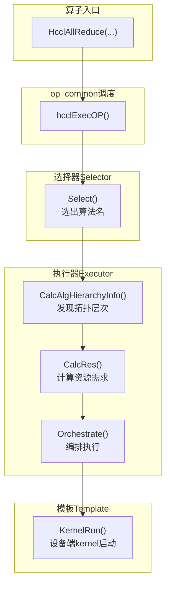

# example/ —— experimental 目录下 A5 注册方式的可用性验证

本目录是 HCCL 社区实验空间（`experimental/ops/`）下的一个最小样例工程，目的是验证 **A5 注册方式
（`REGISTER_EXEC_V2` + `REGISTER_ALG_ATTRS`）在 `experimental/` 目录下是否可用**：experimental 中新增
的算法能否走与 `src/ops/` 完全相同的注册/选择/执行链路，并跑通「编包 → 注册 → 被选中 → 执行 →
HCCL-VM checker 校验」全流程。

样例算法为 AllReduce 的 mesh-1D CCU 实现，算法名 `CcuMSAllReduceExperimentalSoleMesh`，基于
`InsCollAlgBase`，通过 `REGISTER_EXEC_V2` 注册执行器、`REGISTER_ALG_ATTRS` 声明算法属性。它只是验证
A5 注册方式时选用的载体，本身不是本目录的产出目标。

除本算法自身外，第 2.5 节附上了 `experimental/README.md` 中「实现自定义算法」的通用说明（模块关系、
最小改动范围、需继承的核心函数、`REGISTER_EXEC_V2`/`REGISTER_ALG_ATTRS` 宏参数），作为阅读本目录
设计时的背景参考。

> 在当前仓库下，本算法同时满足两个开关（编译开关 `ENABLE_EXPERIMENTAL=ON`、新 selector 开关
> `HCCL_USE_NEW_SELECTOR=1`，见第 4 节）且拓扑为单机两卡（`userRankSize == 2`）时，
> `CcuMSAllReduceExperimentalSoleMesh` 会被 `opPriorityCheck` 优先选中；
> 不开启两个开关中任意一个时，不会被任何 selector 选择分支意外选中。
>
> 定位说明：`experimental/` 目录代码为原型级，不保证 API/ABI 稳定，不编入商用版本。本 README 覆盖
> 动机、设计、用法、现状、限制五个方面，与 `experimental/README.md` 的贡献模板要求一致。

---

## 1. 动机

- **验证 A5 注册方式在 experimental 下的可用性（主动机）**：主链路算法（如
  `src/ops/all_reduce/executor/ins_v2_all_reduce_sole_executor.cc` 的 `CcuMSAllReduceSoleMesh`）通过
  `REGISTER_EXEC_V2` 宏注册进 `CollAlgExecRegistryV2`，运行时由 `GetAlgExec` 按算法名查找执行器。
  本目录在experimental/ 下新增一个同样走 A5 注册的算法，以测试 A5 注册方式是否可用。
- **以最小样例验证全链路**：不修改主链路算法，而是在experimental 下复制同构的 executor/template/kernel 三层
  结构作为载体，验证从编包到 checker 的每一环都可用。

---

## 2. 目录结构与设计

下图为以 `hccl/` 仓库根为起点的完整结构，省略的无关文件/目录统一用 `...` 标注。本目录结构与主链路
`src/ops/all_reduce/`（`executor/` + `template/ccu/kernel/`）同构，证明相同的 A5 注册代码在
experimental 目录下可以原样工作；图中同时标注了与本目录直接相关的关键上下文（注册表、主链路
对照样例、父级 CMakeLists）。

```plaintext
hccl/                                                      # 仓库根
├── CMakeLists.txt                                         # 顶层：option(ENABLE_EXPERIMENTAL)；条件 add_subdirectory(experimental/ops/)
├── build.sh                                               # 编包入口：--experimental → -DENABLE_EXPERIMENTAL=ON
├── src/                                                   # 主链路（商用代码，位于 experimental 之外）
│   ├── ops/op_common/executor/registry/
│   │   └── coll_alg_v2_exec_registry.*                    # 执行器注册表：REGISTER_EXEC_V2 写入 / GetAlgExec 查找
│   ├── ops/all_reduce/
│   │   ├── executor/ins_v2_all_reduce_sole_executor.cc    # 主链路对照样例（注册 
│   │   └── ...                                            # 其余 executor/template/kernel 文件
│   └── ...                                                # 其余 src 子模块
├── include/                                               # 对外头文件（hccl.h / hccl_mc2.h 等）
│   └── ...
├── experimental/                                          # 实验空间（仅 ENABLE_EXPERIMENTAL=ON 时编入）
│   ├── README.md                                          # experimental 贡献约定
│   └── ops/
│       ├── CMakeLists.txt                                 # 父级：add_subdirectory(all_reduce/example)；EXPERIMENTAL_INCLUDE_LIST
│       ├── op_common/                                     # 实验公共组件（模板/拓扑基类）
│       │   └── ...
│       ├── reduce_scatter/                                # 同层其他实验算子（birs/）
│       │   └── ...
│       └── all_reduce/
│           └── example/                          # 本目录（A5 注册方式可用性样例）
│               ├── CMakeLists.txt                         # 入口：add_subdirectory(template / executor)
│               ├── executor/                              # 执行器层（算法编排）
│               │   ├── CMakeLists.txt                     # if(TARGET hccl) 挂入 hccl 目标
│               │   ├── ins_v2_all_reduce_experimental_sole_executor.h
│               │   └── ins_v2_all_reduce_experimental_sole_executor.cc   # 末尾 REGISTER_EXEC_V2 注册、REGISTER_ALG_ATTRS 声明属性
│               └── template/                              # 模板层（资源计算 + 内核下发）
│                   ├── CMakeLists.txt                     # add_subdirectory(ccu)
│                   └── ccu/
│                       ├── CMakeLists.txt                 # add_subdirectory(kernel)；挂 ccu_temp_*.cc
│                       ├── ccu_temp_all_reduce_experimental_mesh_1D.h
│                       ├── ccu_temp_all_reduce_experimental_mesh_1D.cc   # CalcSliceInfo / KernelRun / FastLaunch
│                       └── kernel/
│                           ├── CMakeLists.txt             # 挂 ccu_kernel_*.cc
│                           ├── ccu_kernel_all_reduce_experimental_mesh1d.h
│                           └── ccu_kernel_all_reduce_experimental_mesh1d.cc # CCU 变量级内核（reduce + 同步）
└── ...                                                    # 其余根目录内容（docs/ test/ 等）
```

### 2.1 三层职责

| 层 | 文件 | 基类 | 职责 |
|---|---|---|---|
| executor | `executor/ins_v2_all_reduce_experimental_sole_executor.*` | `ops_hccl::InsCollAlgBase`（模板类 `InsV2AllReduceExperimentalSoleExecutor<AlgTopoMatch, InsAlgTemplate>`） | A5 注册框架接入点：拓扑匹配（`TopoMatch1D`）、成本建模 `CalcCostCoeff`/`GetAlgNetMeta`、资源计算 `CalcRes`、按 loop 编排 `Orchestrate/OrchestrateLoop`、快速下发 `FastLaunchSaveCtx/FastLaunch` |
| template | `template/ccu/ccu_temp_all_reduce_experimental_mesh_1D.*` | `ops_hccl::CcuAlgTemplateBase` | 切片计算 `CalcSliceInfo`、资源/数据校验、`KernelRun` 组装 taskArgs 并调用 `HcommCcuKernelLaunch`、`FastLaunch` 改写地址后直发 |
| kernel | `template/ccu/kernel/ccu_kernel_all_reduce_experimental_mesh1d.*` | `CcuKernelArgBase` / `CcuKernelCtxBase` | CCU 变量级内核：`InitResource` 按 `rankSize-1` 条 channel 建立全互联输入/输出/token，`LoadArgs`/`RunKernel`/`PostSync` 完成 reduce 与同步 |

### 2.2 A5 注册方式（本目录的核心验证点）

- **注册（`REGISTER_EXEC_V2`）**：`ins_v2_all_reduce_experimental_sole_executor.cc` 末尾通过
  `REGISTER_EXEC_V2(HcclCMDType::HCCL_CMD_ALLREDUCE, CcuMSAllReduceExperimentalSoleMesh,
  InsV2AllReduceExperimentalSoleExecutor, TopoMatch1D, CcuTempAllReduceExperimentalMesh1D)`
  把算法名绑定到 executor/模板并写入 `CollAlgExecRegistryV2`（与主链路同宏、同注册表），
  受 `CANN_VERSION_NUM >= CANN_VERSION(9, 0, 0)` 编译保护。
- **算法属性（`REGISTER_ALG_ATTRS`）**：通过
  `REGISTER_ALG_ATTRS(CcuMSAllReduceExperimentalSoleMesh, ...)` 声明算法在拓扑、数据类型、就地运算、优先级
  等方面的属性，供注册表/选择器做前置校验与优先级判断：
  - 拓扑：`topo.maxTopoLevelNum = 1`，
    `topo.supportLevel0Topos = LEVEL0_TOPO_MESH_1D | LEVEL0_TOPO_MESH_1D_CLOS`；
  - 数据类型：不支持 PROD（`op.isSupportProd = false`），
    `op.unsupportedDataTypes = {INT8, INT64, UINT64, FP64}`；
  - 就地运算：不支持 in place（`op.isSupportInplace = false`）；
  - 优先级：`op.opPriorityCheck` 回调在 `userRankSize == 2`（单机两卡）且满足第 4 节两个开关（编译 + 新 selector）
    时优先选中本算法（详见第 4 节）。
- **运行时查找**：执行时按 selector 选出的算法名调用 `CollAlgExecRegistryV2::GetAlgExec` 取执行器；
  注册成功则返回非空执行器，注册缺失则返回 `nullptr`。
- **选择方式**：编译进包（`ENABLE_EXPERIMENTAL=ON`）、走新 selector（`HCCL_USE_NEW_SELECTOR=1`）时，
  本算法在单机两卡场景下会被优先选择（详见第 4 节）。

### 2.3 构建集成

- 各层 `CMakeLists.txt` 均以 `if(NOT ENABLE_EXPERIMENTAL) return()` 守卫，源码在 `if(TARGET hccl)` 下
  `target_sources(hccl ...)` 挂入 host 库。
- 父目录 `experimental/ops/CMakeLists.txt` 通过 `add_subdirectory(all_reduce/example)` 引入，
  `EXPERIMENTAL_INCLUDE_LIST` 已同步为 `example/` 下的新路径。

### 2.4 与主链路样例的差异

实验样例框架结构与 `CcuMSAllReduceSoleMesh`（`ins_v2_all_reduce_sole_executor.cc` /
`ccu_temp_all_reduce_mesh_1D.cc`）一致，差异主要是为验证过程新增的防御性校验与日志：

- executor：`dataTypeSize_ == 0`、`dataCount_ * dataTypeSize_` 溢出、`maxDataCountPerLoop == 0` 检查；
- template：`unitAllignSize == 0`、`templateRankSize_` 范围 `[1, CCU_MAX_RANK_SIZE]`、
  `myRank_` 越界、`threads` 为空等检查；
- 主链路 `CcuTempAllReduceMesh1D::FastLaunch` 无入参校验，实验版增加了 `ccuKernelSubmitInfos` 为空、
  `threads` 为空的保护。

### 2.5 实现自定义算法参考

实现一个自定义算法需创建 executor、template（CCU/AIV 引擎还需 kernel）等文件，分别承担算法编排、资源计算与内核下发、变量级内核职责，可参考 `src/ops` 分层组织。自定义集合通信算法在 executor 经 `REGISTER_EXEC_V2` 宏写入注册表，运行时由 src 中的 selector 选出算法名后执行。

#### 模块关系

这里展示的是 CCU 引擎的算法的例子。AIV 和 AICPU 引擎的算法模块关系类似，但继承的基类与需要实现的函数存在一些区别，同时，AICPU 引擎的算法无需创建 kernel 文件。



#### 最小改动范围

实现一个自定义算法时，只需在 `experimental/ops/<category>/<project_name>/` 下创建以下文件：

| 文件 | 必须/可选 | 说明 |
|---|---|---|
| `ins_v2_<op>_<variant>_executor.h` | 必须 | Executor 类模板，继承 `InsCollAlgBase`，实现 `CalcAlgHierarchyInfo` / `CalcRes` / `Orchestrate` |
| `ins_v2_<op>_<variant>_executor.cc` | 必须 | 注册宏 `REGISTER_EXEC_V2`/`REGISTER_ALG_ATTRS` 放置处 |
| `<engine>_temp_<op>_<variant>.h` | 必须 | Template 派生类，继承引擎模板基类，实现 `CalcRes` / `KernelRun` / `GetThreadNum` 等 |
| `<engine>_temp_<op>_<variant>.cc` | 必须 | Template 实现 |
| `<engine>_kernel_<op>_<variant>.h` | 引擎为 CCU/AIV 时必须 | Kernel 参数/上下文结构体，继承 `CcuKernelArgBase` / `CcuKernelCtxBase` |
| `<engine>_kernel_<op>_<variant>.cc` | 引擎为 CCU/AIV 时必须 | Kernel 实现 |

- `<op>`：算子名（`all_reduce`/`all_gather`/`broadcast`/`reduce_scatter` 等），与 `HcclCMDType` 对应。
- `<variant>`：算法变体，描述拓扑或模式（如 `sole_mesh_1D`、`omnipipe`、`sequence_executor_aicpu_3level`）。
- `<engine>`：执行引擎，取值 `ccu`/`aiv`/`aicpu`。
- 新算法通过 `REGISTER_EXEC_V2` 注册 exec 链路，再用 `REGISTER_ALG_ATTRS` 声明其拓扑/算子属性，两个算法名须一致；注册后自动进入 selector 查找表，selector 侧无需改动。

本目录的三层实现即上表的最小改动范围，`REGISTER_EXEC_V2`/`REGISTER_ALG_ATTRS` 的具体用法见本目录第 2.2 节。

#### 需继承的核心函数

executor 继承自 `InsCollAlgBase`，须实现以下纯虚/关键虚函数：

| 函数 | 作用 | 参数 |
|---|---|---|
| `CalcAlgHierarchyInfo` | 拓扑匹配入口：实例化 `AlgTopoMatch` 并调用其 `MatchTopo`，计算各通信层级的算法层次信息 | `comm` 通信域句柄；`topoInfo` 拓扑详情（userRank/rankSize/网络层级，出参）；`algHierarchyInfo` 算法层次信息（出参） |
| `CalcRes` | 资源计算入口：按 topo 层级构造 template 实例并委托其 `CalcRes` 计算所需 channel/thread/buffer | `comm` 通信域；`param` 算子参数；`topoInfo` 拓扑详情；`algHierarchyInfo` 由 `CalcAlgHierarchyInfo` 产出；`resourceRequest` 资源请求（出参） |
| `CalcCostCoeff` | 成本建模入口：构造 `CalcCostCoeffParam`（`rankSize`/`dataRatio`/`netType` 等）委托模板 `CalcCostCoeff` 计算带宽、时延成本系数 A/B/C/D，供 selection cost 竞争 | `comm` 通信域；`topoInfo` 拓扑详情；`algName` 算法名；`param` 算子参数 |
| `GetAlgNetMeta` | 组网元信息：返回 `AlgNetMeta`（`netTypes`/`intraGroupMode`/`groupSizes`），描述各 template 的网络类型与 cost 组内聚合方式 | `topoInfo` 拓扑详情 |
| `Orchestrate` | 数据面执行入口：设置 maxTmpMemSize_/channels_/threads_ 等基类成员，校验数据类型与溢出，按 loop 编排下发 | `param` 算子参数；`resCtx` 序列化资源上下文 |
| `FastLaunch` | 快速下发：从预存上下文取 thread/kernel 改写地址后直发，避免重复编排 | `param` 算子参数；`resCtx` 由 `FastLaunchSaveCtx` 预存的 `CcuFastLaunchCtx` |

template 继承自引擎模板基类（以 `CcuAlgTemplateBase` 为例），须实现：

| 函数 | 作用 | 参数 |
|---|---|---|
| `Describe` | 返回模板描述字符串，用于日志/调试 | 无参（`const`） |
| `CalcRes` | 计算本模板所需资源（channel 划分、token、scratch）并填入请求 | `comm`；`param`；`topoInfo`；`resourceRequest`（出参） |
| `CalcCostCoeff` | （静态）CCU 成本建模：估算 `portNum`/`taskNum`，经 `CostModelManager` 计算带宽/时延系数 A/B/C/D 并返回；超出支持规模（如 `rankSize` 超限）时返回空表示不参与评估 | `CalcCostCoeffParam` 参数结构体 |
| `KernelRun` | 核心下发：切片计算，组装 `TemplateDataParams`，调用 `HcommCcuKernelLaunch` 下发内核 | `param`；`templateDataParams` 本 loop 的 buff/计数/偏移/stride；`templateResource` channel/threads/累积 submitInfos（出参） |
| `GetThreadNum` | 返回模板所需线程数 | 无参（`const`），返回 `u64` |
| `CalcScratchMultiple` | 返回 scratch 倍率，供 executor 计算单 loop 数据上界 | `inBuffType`/`outBuffType` 输入输出 buffer 类型 |
| `FastLaunch` | 快速下发：用预存 `submitInfos` 改写地址后直发内核 | `param`；`tempFastLaunchCtx` threads/ccuKernelSubmitInfos/buffInfo |

`CalcCostCoeff`（executor 与 template）对应基类 `CalcCostCoeffParam` 字段的完整说明可见 `src/ops/op_common/template/` 下模板头文件注释。

#### REGISTER_EXEC_V2 宏参数

宏定义见 `src/ops/op_common/executor/registry/coll_alg_v2_exec_registry.h`，签名：

```cpp
REGISTER_EXEC_V2(type, name, insCollAlgBase, AlgTopoMatch, InsAlgTemplate)
```

| 参数 | 含义 | 使用要求 |
|---|---|---|
| `type` | 算子命令类型，`HcclCMDType` 枚举值 | 与算子对应（AllReduce 用 `HcclCMDType::HCCL_CMD_ALLREDUCE`）；selector 按此查表 |
| `name` | 算法名标识（token） | 宏内部 `#name` 字符串化为注册 tag；须与 selector 选出的算法名一致才会被 `GetAlgExec` 命中 |
| `insCollAlgBase` | executor 类模板名 | 须为形参 `<AlgTopoMatch, InsAlgTemplate>` 的类模板，且 `std::is_base_of<InsCollAlgBase>` 成立 |
| `AlgTopoMatch` | 拓扑匹配类 | 须继承 `TopoMatchBase` 并实现 `MatchTopo`；executor 经它计算层次信息；或使用已有拓扑 |
| `InsAlgTemplate` | 算法模板类 | 须继承对应引擎模板基类（`CcuAlgTemplateBase`/`AivAlgTemplateBase`）；字符串化后写入算法模板表 |

#### REGISTER_ALG_ATTRS 宏参数（算法属性声明）

宏定义见 `src/ops/op_common/selector/alg_attrs_registry.h`，与 `REGISTER_EXEC_V2` 配套使用：在 executor `.cc` 末尾用它声明算法的拓扑与算子属性并写入 `AlgAttrsRegistry`，selector/costmodel 在选路前据此做前置过滤与优先级判断。签名：

```cpp
REGISTER_ALG_ATTRS(algoName, ...)
```

- `algoName`：算法名，须与 `REGISTER_EXEC_V2` 的 `name` 一致。
- `...`：属性赋值语句，形如 `topo.xxx = ...; op.xxx = ...;`，作用对象见下表各字段。

`#ifndef AICPU_COMPILE` 时注册生效，AICPU 编译下宏为空、不注册。宏内通过 `ParseAlgName` 将 `algoName` 解析为 `opType`/`engine`/`algoTypes`，其余字段即下表所列（默认值即为不赋值时的取值）。

| 属性（`topo`） | 含义 | 默认值 |
|---|---|---|
| `minTopoLevelNum` | 支持的最少拓扑层数 | `1` |
| `maxTopoLevelNum` | 支持的最多拓扑层数 | `3` |
| `supportLevel0Topos` | Level0 拓扑位掩码（`LEVEL0_TOPO_MESH_1D`/`CLOS`/`MESH_1D_CLOS`/`ANY`） | `LEVEL0_TOPO_MESH_1D` |
| `supportLevel0MeshTypes` | Level0 mesh 类型位掩码（`NOT_MESH`/`SINGLE_DIE`/`TWO_DIE_REGULAR`/`TWO_DIE_NOT_REGULAR`/`ANY`） | `NOT_MESH \| SINGLE_DIE` |
| `isSupportLevel1Nhr` | 是否支持 Level1 NHR 拓扑 | `false` |
| `isSupport2DieFullMesh` | 是否支持双 die 全 mesh | `false` |
| `isSupportLevel0PcieMix` | 是否支持 Level0 PCIe 混插 | `false` |
| `requireAllMeshConnected` | 是否要求 mesh 全连接 | `false` |
| `supportDevTypes` | 支持的设备类型集合；空表示全部，非空仅限集合内 | `{}` |
| `isHostDpuOnly` | 是否仅主机侧 DPU 场景生效 | `false` |
| `topoCustomCheck` | 定制拓扑过滤回调，返回 `true` 保留参与选择 | `nullptr` |
| `topoPriorityCheck` | 定制拓扑优先级回调，返回 `true` 表示优先选中 | `nullptr` |
| 属性（`op`） | 含义 | 默认值 |
| `isSupportProd` | 是否支持 PROD 归约 | `true` |
| `unsupportedDataTypes` | 不支持的数据类型集合（可引用 `alg_attrs.h` 的预设集合，如 `UNSUPPORTED_INT8_AND_64BIT`/`UNSUPPORTED_64BIT`） | `{}` |
| `isSupportInplace` | 是否支持 in place | `true` |
| `isSupportFloatOrderPreserved` | 是否支持浮点保序 | `false` |
| `opCustomCheck` | 定制算子过滤回调，返回 `true` 保留参与 cost 竞争 | `nullptr` |
| `opPriorityCheck` | 定制算子优先级回调，返回 `true` 表示优先选中 | `nullptr` |

---

## 3. 构建

仅改动 `hccl` 仓（本目录 + 本地临时的 selector 修改）时，用 `hccl_vm` 的编包链路，但注意 `build_pkg.sh`
内部有无条件 `sudo`（清除 python 的 `EXTERNALLY-MANAGED` 锁），无免密 `sudo` 的环境需手动分步：

```bash
cd /home/workspace/hccl
source /home/workspace/Ascend/cann-9.2.0/set_env.sh
export LD_LIBRARY_PATH="$ASCEND_HOME_PATH/lib64:$ASCEND_HOME_PATH/devlib:${LD_LIBRARY_PATH:-}"

# 1. 编包（必须带 --experimental，否则 ENABLE_EXPERIMENTAL=OFF，本目录不会被编译）
bash build.sh --full --experimental

# 2. 安装 .run 包到 CANN（用户目录可免 root）
yes y | bash build_out/cann-hccl_9.2.0_linux-x86_64.run --full --install-path=/home/workspace/Ascend

```

---

## 4. 用法

本算法涉及两个开关，全部满足后才会参与算法选择：

**① 编译开关 `--experimental`**（对应 `ENABLE_EXPERIMENTAL=ON`，统一控制 `experimental/` 文件夹是否参与
编译；关闭时本目录不被编译、算法不注册）。

**② 新 selector 开关 `HCCL_USE_NEW_SELECTOR=1`**：当前处于新 selector 与旧 selector 共存态，
`HCCL_USE_NEW_SELECTOR=0`（默认）走旧 selector 路径，本算法不会被选中；需置为 `1` 走新 selector
测试路径、`REGISTER_ALG_ATTRS`/`opPriorityCheck` 才会生效，从而用到该算法。

参与算法选择时，单机两卡（`userRankSize == 2`）拓扑下，`REGISTER_ALG_ATTRS` 中为 `CcuMSAllReduceExperimentalSoleMesh`
配置的 `opPriorityCheck` 会优先选中本算法，无需额外改动，直接可测。

---

## 5. 现状

- **A5 注册方式可用性已通过 `hccl-vm` 与真机验证**：
  - `build.sh --full --experimental` 编译通过，.run 包安装、aicpu 包部署完成；
  - CCU_MS + 单机双卡 + 2MB int32 场景下 runner 双 rank 均选中 `CcuMSAllReduceExperimentalSoleMesh`，
    `check_result: success` —— 证明注册/查找命中、执行链路完整；
  - executor `Orchestrate Start`、模板 `KernelRun`（rank0 offSet=0 / rank1 offSet=262144，切片正确）、
    `FastLaunch Start` 均打点；
  - checker（CheckerV3）GenGraph/SingleTaskCheck/SyncConflict/MemConflict/SemanticCheck 全部 success，
    `[CHECKER_RUN_SUMMARY] All Success (Total Op: 2, Total SyncIter: 2)`。

---

## 6. 限制

1. **影响所有 `experimental/` 算法的选择（重要警告）**：本算法经 `REGISTER_EXEC_V2`/`REGISTER_ALG_ATTRS` 接入与主链路相同的注册表与选择器。在 `ENABLE_EXPERIMENTAL=ON` + `HCCL_USE_NEW_SELECTOR=1` 下，其 `REGISTER_ALG_ATTRS` 声明的 `opPriorityCheck` 会在选择器扫描算法时**全局生效**，单机两卡场景优先选中本算法，从而可抢占/扰动 `experimental/` 下所有其他实验算法的选择结果、挤占其验证空间。验证其他 `experimental/` 算法时，必须置 `HCCL_USE_NEW_SELECTOR=0`（或裁剪本目录的编译/注册）以确保本算法不被选中。
2. **不可上线**：本算法目的为测试当前最新算法注册方式及选择方式在experimental文件夹的可用性。不应作为线上算法 使用。
3. **类型/拓扑约束**：不支持 in place、保序（DETERMINISTIC_STRICT）、int8、PROD、INT64/UINT64/FP64
   （由 `SelectCcuMsAlgo`/`SelectMeshAlgo` 前置判断回退）；模板依赖 `TopoMatch1D` 与 mesh-1D 全互联
   假设，kernel 要求 `channelCount >= rankSize-1`，`CalcRes` 校验 `templateRankSize_` 上限
   `CCU_MAX_RANK_SIZE`（128）。
4. **版本依赖**：`REGISTER_EXEC_V2` / `REGISTER_ALG_ATTRS` 注册仅在
   `CANN_VERSION_NUM >= CANN_VERSION(9, 0, 0)`（CANN 9.0+）时生效，低版本 CANN 下本算法不会注册。
5. **原型级质量**：属 `experimental/` 实验代码，不承诺 API/ABI 稳定、不编入商用版本；代码风格与
   防御性检查以本次验证为目的，未做完整性能优化。
