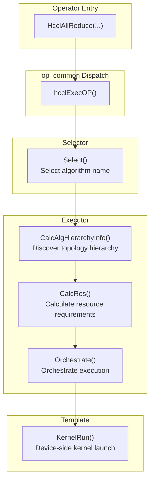

# example/ — Usability Verification of the A5 Registration Approach Under the experimental Directory

This directory is a minimal sample project under the HCCL community experimental space (`experimental/ops/`), aimed at verifying **whether the A5 registration approach (`REGISTER_EXEC_V2` + `REGISTER_ALG_ATTRS`) is usable under `experimental/`**: whether algorithms newly added under experimental/ can go through exactly the same registration/selection/execution pathway as `src/ops/`, and run through the full flow of "build → register → selected → execute → HCCL-VM checker verification".

The sample algorithm is the mesh-1D CCU implementation of AllReduce, with algorithm name `CcuMSAllReduceExperimentalSoleMesh`, based on `InsCollAlgBase`. It registers the executor via `REGISTER_EXEC_V2` and declares algorithm attributes via `REGISTER_ALG_ATTRS`. It is only a carrier chosen to verify the A5 registration approach, and is not itself the deliverable goal of this directory.

Besides this algorithm itself, Section 2.5 provides the general guide on "implementing custom algorithms" from `experimental/README.md` (module relationships, minimum scope of changes, core functions to inherit, and the `REGISTER_EXEC_V2`/`REGISTER_ALG_ATTRS` macro parameters), as background reference when reading this directory's design.

> In the current repository, `CcuMSAllReduceExperimentalSoleMesh` is preferentially selected by `opPriorityCheck` only when the two switches are satisfied simultaneously (compile switch `ENABLE_EXPERIMENTAL=ON`, new selector switch `HCCL_USE_NEW_SELECTOR=1`; see Section 4) and the topology is single-machine two-card (`userRankSize == 2`); when any one of the two switches is not enabled, it will not be selected inadvertently by any selector branch.
>
> Positioning note: Code in the `experimental/` directory is prototype-level, does not guarantee API/ABI stability, and is not compiled into the commercial version. This README covers five aspects — motivation, design, usage, current status, and limitations — consistent with the contribution template requirements in `experimental/README.md`.

---

## 1. Motivation

- **Verify the usability of the A5 registration approach under experimental (primary motivation)**: Main-pathway algorithms (e.g., `CcuMSAllReduceSoleMesh` in `src/ops/all_reduce/executor/ins_v2_all_reduce_sole_executor.cc`) register into `CollAlgExecRegistryV2` via the `REGISTER_EXEC_V2` macro, and are looked up at runtime by `GetAlgExec` based on the algorithm name. This directory adds an algorithm under experimental/ that also follows A5 registration, to test whether the A5 registration approach is usable.
- **Verify the full pathway with a minimal sample**: Without modifying main-pathway algorithms, replicate the isomorphic executor/template/kernel three-layer structure under experimental/ as a carrier, verifying that every step from build to checker is usable.

---

## 2. Directory Structure and Design

The diagram below shows the complete structure starting from the `hccl/` repository root; unrelated files/directories are uniformly marked with `...`. This directory's structure is isomorphic to the main pathway `src/ops/all_reduce/` (`executor/` + `template/ccu/kernel/`), demonstrating that the same A5 registration code works unchanged under the experimental directory; the diagram also annotates key context directly related to this directory (the registry, the main-pathway reference sample, and the parent CMakeLists).

```plaintext
hccl/                                                      # Repository root
├── CMakeLists.txt                                         # Top-level: option(ENABLE_EXPERIMENTAL); conditional add_subdirectory(experimental/ops/)
├── build.sh                                               # Build entry: --experimental → -DENABLE_EXPERIMENTAL=ON
├── src/                                                   # Main pathway (commercial code, outside experimental)
│   ├── ops/op_common/executor/registry/
│   │   └── coll_alg_v2_exec_registry.*                    # Executor registry: REGISTER_EXEC_V2 writes / GetAlgExec looks up
│   ├── ops/all_reduce/
│   │   ├── executor/ins_v2_all_reduce_sole_executor.cc    # Main-pathway reference sample (registers CcuMSAllReduceSoleMesh)
│   │   └── ...                                            # Other executor/template/kernel files
│   └── ...                                                # Other src submodules
├── include/                                               # Public headers (hccl.h / hccl_mc2.h, etc.)
│   └── ...
├── experimental/                                          # Experimental space (only compiled when ENABLE_EXPERIMENTAL=ON)
│   ├── README.md                                          # experimental contribution conventions
│   └── ops/
│       ├── CMakeLists.txt                                 # Parent: add_subdirectory(all_reduce/example); EXPERIMENTAL_INCLUDE_LIST
│       ├── op_common/                                     # Experimental common components (template/topology base classes)
│       │   └── ...
│       ├── reduce_scatter/                                # Other experimental operators at the same level (birs/)
│       │   └── ...
│       └── all_reduce/
│           └── example/                          # This directory (A5 registration approach usability sample)
│               ├── CMakeLists.txt                         # Entry: add_subdirectory(template / executor)
│               ├── executor/                              # Executor layer (algorithm orchestration)
│               │   ├── CMakeLists.txt                     # if(TARGET hccl) attached to hccl target
│               │   ├── ins_v2_all_reduce_experimental_sole_executor.h
│               │   └── ins_v2_all_reduce_experimental_sole_executor.cc   # REGISTER_EXEC_V2 registration and REGISTER_ALG_ATTRS attribute declaration at the end
│               └── template/                              # Template layer (resource calculation + kernel dispatch)
│                   ├── CMakeLists.txt                     # add_subdirectory(ccu)
│                   └── ccu/
│                       ├── CMakeLists.txt                 # add_subdirectory(kernel); attach ccu_temp_*.cc
│                       ├── ccu_temp_all_reduce_experimental_mesh_1D.h
│                       ├── ccu_temp_all_reduce_experimental_mesh_1D.cc   # CalcSliceInfo / KernelRun / FastLaunch
│                       └── kernel/
│                           ├── CMakeLists.txt             # Attach ccu_kernel_*.cc
│                           ├── ccu_kernel_all_reduce_experimental_mesh1d.h
│                           └── ccu_kernel_all_reduce_experimental_mesh1d.cc # CCU variable-level kernel (reduce + sync)
└── ...                                                    # Other root-level content (docs/ test/, etc.)
```

### 2.1 Three-Layer Responsibilities

| Layer | File | Base Class | Responsibilities |
|---|---|---|---|
| executor | `executor/ins_v2_all_reduce_experimental_sole_executor.*` | `ops_hccl::InsCollAlgBase` (template class `InsV2AllReduceExperimentalSoleExecutor<AlgTopoMatch, InsAlgTemplate>`) | A5 registration framework entry point: topology matching (`TopoMatch1D`), cost modeling `CalcCostCoeff`/`GetAlgNetMeta`, resource calculation `CalcRes`, per-loop orchestration `Orchestrate/OrchestrateLoop`, fast dispatch `FastLaunchSaveCtx/FastLaunch` |
| template | `template/ccu/ccu_temp_all_reduce_experimental_mesh_1D.*` | `ops_hccl::CcuAlgTemplateBase` | Slice calculation `CalcSliceInfo`, resource/data validation, `KernelRun` assembles taskArgs and calls `HcommCcuKernelLaunch`, `FastLaunch` rewrites addresses and dispatches directly |
| kernel | `template/ccu/kernel/ccu_kernel_all_reduce_experimental_mesh1d.*` | `CcuKernelArgBase` / `CcuKernelCtxBase` | CCU variable-level kernel: `InitResource` establishes full-mesh input/output/token over `rankSize-1` channels, `LoadArgs`/`RunKernel`/`PostSync` complete reduce and synchronization |

### 2.2 A5 Registration Approach (Core Verification Point of This Directory)

- **Registration (`REGISTER_EXEC_V2`)**: At the end of `ins_v2_all_reduce_experimental_sole_executor.cc`, via
  `REGISTER_EXEC_V2(HcclCMDType::HCCL_CMD_ALLREDUCE, CcuMSAllReduceExperimentalSoleMesh,
  InsV2AllReduceExperimentalSoleExecutor, TopoMatch1D, CcuTempAllReduceExperimentalMesh1D)`
  binds the algorithm name to the executor/template and writes it into `CollAlgExecRegistryV2` (same macro, same registry as the main pathway),
  protected by the `CANN_VERSION_NUM >= CANN_VERSION(9, 0, 0)` compile guard.
- **Algorithm attributes (`REGISTER_ALG_ATTRS`)**: Via
  `REGISTER_ALG_ATTRS(CcuMSAllReduceExperimentalSoleMesh, ...)`, declares the algorithm's attributes in terms of
  topology, data types, in-place support, and priority, which are used by the registry/selector for pre-checks and priority decisions:
  - Topology: `topo.maxTopoLevelNum = 1`,
    `topo.supportLevel0Topos = LEVEL0_TOPO_MESH_1D | LEVEL0_TOPO_MESH_1D_CLOS`;
  - Data types: PROD not supported (`op.isSupportProd = false`),
    `op.unsupportedDataTypes = {INT8, INT64, UINT64, FP64}`;
  - In-place: in place not supported (`op.isSupportInplace = false`);
  - Priority: the `op.opPriorityCheck` callback preferentially selects this algorithm when `userRankSize == 2`
    (single-machine two-card) and the two switches in Section 4 are satisfied (compile + new selector)
    (see Section 4).
- **Runtime lookup**: At execution time, the executor is retrieved by calling `CollAlgExecRegistryV2::GetAlgExec` with the algorithm name selected by the selector;
  if registration succeeds, a non-null executor is returned; if registration is missing, `nullptr` is returned.
- **Selection method**: When compiled into the package (`ENABLE_EXPERIMENTAL=ON`) and using the new selector
  (`HCCL_USE_NEW_SELECTOR=1`), this algorithm is preferentially selected under the single-machine two-card
  scenario (see Section 4).

### 2.3 Build Integration

- All layer-level `CMakeLists.txt` files are guarded by `if(NOT ENABLE_EXPERIMENTAL) return()`, and source files are attached to the host library via `target_sources(hccl ...)` under `if(TARGET hccl)`.
- The parent directory `experimental/ops/CMakeLists.txt` introduces this directory via `add_subdirectory(all_reduce/example)`,
  and `EXPERIMENTAL_INCLUDE_LIST` has been updated with the new paths under `example/`.

### 2.4 Differences from the Main-Pathway Sample

The framework structure of the experimental sample is consistent with `CcuMSAllReduceSoleMesh` (`ins_v2_all_reduce_sole_executor.cc` /
`ccu_temp_all_reduce_mesh_1D.cc`); the differences are mainly defensive checks and logs added for the verification process:

- executor: `dataTypeSize_ == 0`, `dataCount_ * dataTypeSize_` overflow, `maxDataCountPerLoop == 0` checks;
- template: `unitAllignSize == 0`, `templateRankSize_` range `[1, CCU_MAX_RANK_SIZE]`,
  `myRank_` out of bounds, `threads` empty, etc. checks;
- The main-pathway `CcuTempAllReduceMesh1D::FastLaunch` has no input parameter validation; the experimental version adds protections for empty `ccuKernelSubmitInfos` and empty `threads`.

### 2.5 Implementing Custom Algorithms (Reference)

Implementing a custom algorithm requires creating executor, template (and kernel for CCU/AIV engines) files, which respectively handle algorithm orchestration, resource calculation and kernel dispatch, and variable-level kernel responsibilities. Refer to `src/ops` for the layered organization. Custom collective communication algorithms are written to the registry via the `REGISTER_EXEC_V2` macro in the executor, and at runtime are executed after the selector picks the algorithm name.

#### Module Relationships

The example here illustrates a CCU-engine algorithm. The AIV- and AICPU-engine algorithm module relationships are similar, but there are some differences in the base classes to inherit and the functions to implement. Additionally, AICPU-engine algorithms do not require creating kernel files.



#### Minimum Scope of Changes

To implement a custom algorithm, you only need to create the following files under `experimental/ops/<category>/<project_name>/`:

| File | Required/Optional | Description |
|---|---|---|
| `ins_v2_<op>_<variant>_executor.h` | Required | Executor class template, inherits `InsCollAlgBase`, implements `CalcAlgHierarchyInfo` / `CalcRes` / `Orchestrate` |
| `ins_v2_<op>_<variant>_executor.cc` | Required | Where the registration macros `REGISTER_EXEC_V2`/`REGISTER_ALG_ATTRS` are placed |
| `<engine>_temp_<op>_<variant>.h` | Required | Template derived class, inherits the engine template base class, implements `CalcRes` / `KernelRun` / `GetThreadNum`, etc. |
| `<engine>_temp_<op>_<variant>.cc` | Required | Template implementation |
| `<engine>_kernel_<op>_<variant>.h` | Required for CCU/AIV engines | Kernel parameter/context structures, inherits `CcuKernelArgBase` / `CcuKernelCtxBase` |
| `<engine>_kernel_<op>_<variant>.cc` | Required for CCU/AIV engines | Kernel implementation |

- `<op>`: Operator name (`all_reduce`/`all_gather`/`broadcast`/`reduce_scatter`, etc.), corresponding to `HcclCMDType`.
- `<variant>`: Algorithm variant, describing topology or pattern (e.g., `sole_mesh_1D`, `omnipipe`, `sequence_executor_aicpu_3level`).
- `<engine>`: Execution engine, values `ccu`/`aiv`/`aicpu`.
- New algorithms register the exec pathway via `REGISTER_EXEC_V2`, then declare their topology/operator attributes via `REGISTER_ALG_ATTRS`; the two algorithm names must match. After registration they automatically enter the selector lookup table; no selector-side changes are needed.

This directory's three-layer implementation is exactly the minimum scope of changes above; the specific usage of `REGISTER_EXEC_V2`/`REGISTER_ALG_ATTRS` is covered in Section 2.2 of this directory.

#### Core Functions to Inherit

The executor inherits from `InsCollAlgBase` and must implement the following pure/key virtual functions:

| Function | Purpose | Parameters |
|---|---|---|
| `CalcAlgHierarchyInfo` | Topology matching entry: instantiates `AlgTopoMatch` and calls its `MatchTopo` to compute algorithm hierarchy info for each communication layer | `comm` communicator handle; `topoInfo` topology details (userRank/rankSize/network layers, output); `algHierarchyInfo` algorithm hierarchy info (output) |
| `CalcRes` | Resource calculation entry: constructs template instances per topo layer and delegates to their `CalcRes` to compute required channel/thread/buffer | `comm` communicator; `param` operator parameters; `topoInfo` topology details; `algHierarchyInfo` produced by `CalcAlgHierarchyInfo`; `resourceRequest` resource request (output) |
| `CalcCostCoeff` | Cost-modeling entry: constructs a `CalcCostCoeffParam` (`rankSize`/`dataRatio`/`netType`, etc.) and delegates to the template `CalcCostCoeff` to compute bandwidth/latency cost coefficients A/B/C/D for selection cost competition | `comm` communicator; `topoInfo` topology details; `algName` algorithm name; `param` op parameter |
| `GetAlgNetMeta` | Returns the network metadata `AlgNetMeta` (`netTypes`/`intraGroupMode`/`groupSizes`), describing each template's network type and in-group cost aggregation mode | `topoInfo` topology details |
| `Orchestrate` | Data-plane execution entry: sets base class members such as maxTmpMemSize_/channels_/threads_, validates data types and overflow, and orchestrates dispatch per loop | `param` operator parameters; `resCtx` serialized resource context |
| `FastLaunch` | Fast dispatch: takes thread/kernel from pre-stored context, rewrites addresses and dispatches directly, avoiding repeated orchestration | `param` operator parameters; `resCtx` `CcuFastLaunchCtx` pre-stored by `FastLaunchSaveCtx` |

The template inherits from the engine template base class (using `CcuAlgTemplateBase` as an example) and must implement:

| Function | Purpose | Parameters |
|---|---|---|
| `Describe` | Returns a template description string for logging/debugging | No parameters (`const`) |
| `CalcRes` | Computes resources required by this template (channel partitioning, token, scratch) and fills the request | `comm`; `param`; `topoInfo`; `resourceRequest` (output) |
| `CalcCostCoeff` | (Static) CCU cost modeling: estimates `portNum`/`taskNum` and computes bandwidth/latency coefficients A/B/C/D via `CostModelManager`, returning them; returns empty when beyond supported scale (e.g., `rankSize` exceeds limit), meaning it does not take part in evaluation | `CalcCostCoeffParam` parameter structure |
| `KernelRun` | Core dispatch: slice calculation, assembles `TemplateDataParams`, calls `HcommCcuKernelLaunch` to dispatch the kernel | `param`; `templateDataParams` this loop's buff/count/offset/stride; `templateResource` channel/threads/accumulated submitInfos (output) |
| `GetThreadNum` | Returns the number of threads required by the template | No parameters (`const`), returns `u64` |
| `CalcScratchMultiple` | Returns the scratch multiplier for the executor to compute the per-loop data upper bound | `inBuffType`/`outBuffType` input/output buffer types |
| `FastLaunch` | Fast dispatch: rewrites addresses using pre-stored `submitInfos` and dispatches the kernel directly | `param`; `tempFastLaunchCtx` threads/ccuKernelSubmitInfos/buffInfo |

For the full description of the `CalcCostCoeffParam` fields of the base class used by `CalcCostCoeff` (both executor and template), see the template header file comments under `src/ops/op_common/template/`.

#### REGISTER_EXEC_V2 Macro Parameters

The macro is defined in `src/ops/op_common/executor/registry/coll_alg_v2_exec_registry.h`, signature:

```cpp
REGISTER_EXEC_V2(type, name, insCollAlgBase, AlgTopoMatch, InsAlgTemplate)
```

| Parameter | Meaning | Usage Requirements |
|---|---|---|
| `type` | Operator command type, an `HcclCMDType` enum value | Must correspond to the operator (AllReduce uses `HcclCMDType::HCCL_CMD_ALLREDUCE`); the selector looks up by this |
| `name` | Algorithm name identifier (token) | The macro stringifies via `#name` to form the registration tag; must match the algorithm name selected by the selector to be hit by `GetAlgExec` |
| `insCollAlgBase` | Executor class template name | Must be a class template parameterized by `<AlgTopoMatch, InsAlgTemplate>`, and `std::is_base_of<InsCollAlgBase>` must hold |
| `AlgTopoMatch` | Topology matching class | Must inherit `TopoMatchBase` and implement `MatchTopo`; the executor computes hierarchy info via it; or use an existing topology |
| `InsAlgTemplate` | Algorithm template class | Must inherit the corresponding engine template base class (`CcuAlgTemplateBase`/`AivAlgTemplateBase`); stringified and written to the algorithm template table |

#### REGISTER_ALG_ATTRS Macro Parameters (Algorithm Attribute Declaration)

The macro is defined in `src/ops/op_common/selector/alg_attrs_registry.h` and is used together with `REGISTER_EXEC_V2`: at the end of the executor `.cc`, it declares the algorithm's topology and operator attributes and writes them into `AlgAttrsRegistry`; the selector/costmodel uses them for pre-filtering and priority judgment before path selection. Signature:

```cpp
REGISTER_ALG_ATTRS(algoName, ...)
```

- `algoName`: algorithm name, which must match the `name` of `REGISTER_EXEC_V2`.
- `...`: attribute assignment statements of the form `topo.xxx = ...; op.xxx = ...;`, acting on the fields listed in the tables below.

It takes effect under `#ifndef AICPU_COMPILE`; under AICPU compilation the macro is empty and does not register. Inside, `ParseAlgName` parses `algoName` into `opType`/`engine`/`algoTypes`, and the remaining fields are those listed below (the default value is used when not assigned).

| Attribute (`topo`) | Meaning | Default |
|---|---|---|
| `minTopoLevelNum` | Minimum supported topological level count | `1` |
| `maxTopoLevelNum` | Maximum supported topological level count | `3` |
| `supportLevel0Topos` | Level0 topology bitmask (`LEVEL0_TOPO_MESH_1D`/`CLOS`/`MESH_1D_CLOS`/`ANY`) | `LEVEL0_TOPO_MESH_1D` |
| `supportLevel0MeshTypes` | Level0 mesh type bitmask (`NOT_MESH`/`SINGLE_DIE`/`TWO_DIE_REGULAR`/`TWO_DIE_NOT_REGULAR`/`ANY`) | `NOT_MESH \| SINGLE_DIE` |
| `isSupportLevel1Nhr` | Whether Level1 NHR topology is supported | `false` |
| `isSupport2DieFullMesh` | Whether two-die full mesh is supported | `false` |
| `isSupportLevel0PcieMix` | Whether Level0 PCIe mixing is supported | `false` |
| `requireAllMeshConnected` | Whether full mesh connectivity is required | `false` |
| `supportDevTypes` | Supported device type set; empty means all, non-empty restricts to the set | `{}` |
| `isHostDpuOnly` | Whether valid only in host-side DPU scenarios | `false` |
| `topoCustomCheck` | Custom topology filter callback; returning `true` keeps it for selection | `nullptr` |
| `topoPriorityCheck` | Custom topology priority callback; returning `true` means prioritized | `nullptr` |
| Attribute (`op`) | Meaning | Default |
| `isSupportProd` | Whether PROD reduction is supported | `true` |
| `unsupportedDataTypes` | Set of unsupported data types (can reference preset sets in `alg_attrs.h`, e.g. `UNSUPPORTED_INT8_AND_64BIT`/`UNSUPPORTED_64BIT`) | `{}` |
| `isSupportInplace` | Whether in place is supported | `true` |
| `isSupportFloatOrderPreserved` | Whether float order preservation is supported | `false` |
| `opCustomCheck` | Custom operator filter callback; returning `true` keeps it for cost competition | `nullptr` |
| `opPriorityCheck` | Custom operator priority callback; returning `true` means prioritized | `nullptr` |

---

## 3. Build

When only the `hccl` repository is modified (this directory + local temporary selector modifications), use the `hccl_vm` build pipeline, but note that `build_pkg.sh` contains an unconditional `sudo` (to clear Python's `EXTERNALLY-MANAGED` lock); environments without passwordless `sudo` require manual step-by-step execution:

```bash
cd /home/workspace/hccl
source /home/workspace/Ascend/cann-9.2.0/set_env.sh
export LD_LIBRARY_PATH="$ASCEND_HOME_PATH/lib64:$ASCEND_HOME_PATH/devlib:${LD_LIBRARY_PATH:-}"

# 1. Build (must include --experimental, otherwise ENABLE_EXPERIMENTAL=OFF and this directory will not be compiled)
bash build.sh --full --experimental

# 2. Install the .run package to CANN (user directory, no root required)
yes y | bash build_out/cann-hccl_9.2.0_linux-x86_64.run --full --install-path=/home/workspace/Ascend

```

---

## 4. Usage

This algorithm involves two switches, and participates in algorithm selection only when all of them are satisfied:

**① Compile switch `--experimental`** (corresponding to `ENABLE_EXPERIMENTAL=ON`, uniformly controls whether the
`experimental/` folder is compiled; when disabled, this directory is not compiled and the algorithm is not registered).

**② New selector switch `HCCL_USE_NEW_SELECTOR=1`**: The current repository is in a coexistence state of the new
selector and the old selector. With `HCCL_USE_NEW_SELECTOR=0` (default), the old selector path is used and this
algorithm will not be selected; it must be set to `1` to take the new selector test path, where
`REGISTER_ALG_ATTRS`/`opPriorityCheck` take effect and the algorithm can be used.

When participating in algorithm selection, under the single-machine two-card (`userRankSize == 2`) topology, the
`opPriorityCheck` configured for `CcuMSAllReduceExperimentalSoleMesh` in `REGISTER_ALG_ATTRS` preferentially selects
this algorithm, so no extra modification is needed and it can be tested directly.

---

## 5. Current Status

- **A5 registration approach usability has been verified through both the `hccl-vm` full pipeline and real hardware**:
  - `build.sh --full --experimental` compiles successfully; .run package installation and aicpu package deployment completed;
  - In the CCU_MS + single-machine dual-card + 2MB int32 scenario, the runner selects `CcuMSAllReduceExperimentalSoleMesh`
    on both ranks, `check_result: success` — proving that registration/lookup hits and the execution pathway is complete;
  - executor `Orchestrate Start`, template `KernelRun` (rank0 offSet=0 / rank1 offSet=262144, correct slicing),
    `FastLaunch Start` all logged;
  - checker (CheckerV3) GenGraph/SingleTaskCheck/SyncConflict/MemConflict/SemanticCheck all success,
    `[CHECKER_RUN_SUMMARY] All Success (Total Op: 2, Total SyncIter: 2)`.

---

## 6. Limitations

1. **Affects the selection of all `experimental/` algorithms (important warning)**: This algorithm is registered via `REGISTER_EXEC_V2`/`REGISTER_ALG_ATTRS` into the same registry and selector as the main pathway. Under `ENABLE_EXPERIMENTAL=ON` + `HCCL_USE_NEW_SELECTOR=1`, the `opPriorityCheck` declared in its `REGISTER_ALG_ATTRS` takes effect **globally** while the selector scans algorithms, and preferentially selects this algorithm under the single-machine dual-card scenario, potentially preempting or perturbing the selection results of all other `experimental/` algorithms and encroaching on their verification space. When verifying other `experimental/` algorithms, you must set `HCCL_USE_NEW_SELECTOR=0` (or trim out this directory's compilation/registration) to ensure this algorithm is not selected.
2. **Not for production**: This algorithm is intended to test the usability of the latest algorithm registration and selection approaches under the experimental folder, and should not be used as a production algorithm.
3. **Type/topology constraints**: Does not support in place, ordering (DETERMINISTIC_STRICT), int8, PROD, INT64/UINT64/FP64
   (falls back via `SelectCcuMsAlgo`/`SelectMeshAlgo` pre-checks); template depends on `TopoMatch1D` and the mesh-1D full-mesh
   assumption, kernel requires `channelCount >= rankSize-1`, `CalcRes` validates `templateRankSize_` upper bound
   `CCU_MAX_RANK_SIZE` (128).
4. **Version dependency**: `REGISTER_EXEC_V2` / `REGISTER_ALG_ATTRS` registration only takes effect when
   `CANN_VERSION_NUM >= CANN_VERSION(9, 0, 0)` (CANN 9.0+); under lower CANN versions, this algorithm will not be registered.
5. **Prototype-level quality**: This is `experimental/` experimental code, with no guarantee of API/ABI stability, and is not compiled into the commercial version; code style and defensive checks are aimed at this verification, without full performance optimization.
