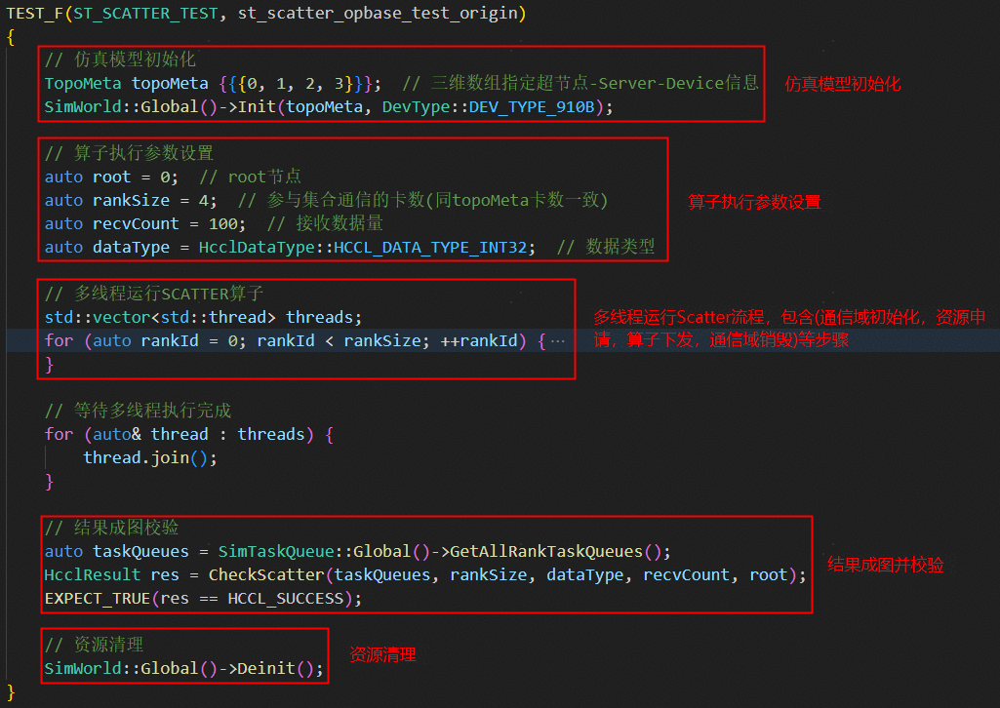
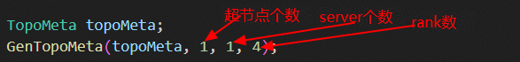
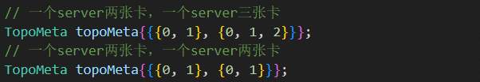
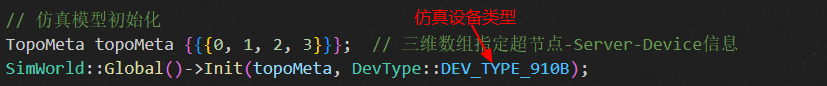
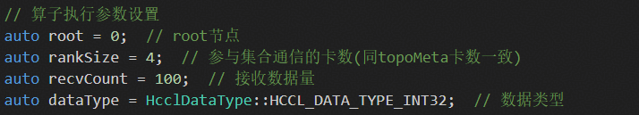
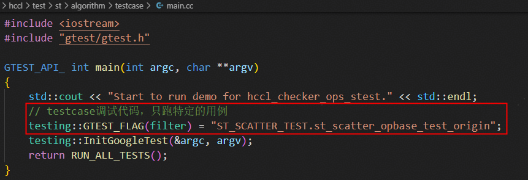
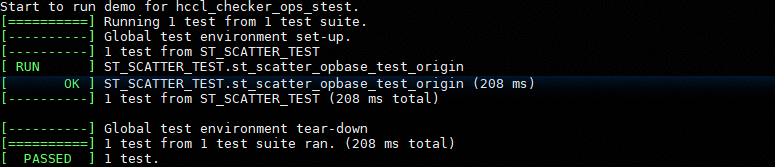

# 算法分析器使用指导

## 工具简介

HCCL算法分析器用于在离线环境中模拟HCCL算法的运行，验证算法逻辑及内存操作等功能，高效、快捷地执行测试任务，满足开发者的运行诉求。

## 原理介绍


**几个关键点：**

1. 算法分析器通过对运行HCCL单算子流程的依赖(hcomm和runtime接口)进行打桩，在算法执行的过程可以获取到所有rank的Task序列。
2. 将所有rank的Task信息组成一张**有向无环图**。
3. 基于**图算法**做一些校验，比如内存读写冲突校验，语义校验。
   - 内存冲突校验会基于图中的同步情况分析是否存在可能的读写冲突。
   - 语义校验通过模拟执行Task图，记录**数据的搬运信息**，模拟执行完成后检查UserOutput内存中**数据搬运信息**是否符合算子的要求。

## 环境准备

参照[源码构建](../../../docs/build.md)中的环境准备、源码下载、编译、安装，进行算法分析器编译前的准备工作。

## 用例编写

### LLT用例一览

一个算法checker用例分为5个步骤，如下图所示。接下来依次介绍每个步骤的写法，以适应不同的算子需求。最后介绍出现问题之后，如何借助checker工具进行问题定位。



### LLT用例各步骤详解

#### 仿真模型初始化

   - **TopoMeta结构体介绍**

     

     checker使用TopoMeta来表示一个拓扑结构，TopoMeta是一个三层vector结构。

     - PhyDeviceId表示一个NPU的物理Id。

     - ServerMeta由PhyDeviceId组成，表示一个服务器的卡数及对应的PhyDeviceId。

     - SuperPodMeta由ServerMeta组成，表示组成超节点的服务器情况。

     - TopoMeta表示集群的整体拓扑情况。

   - **TopoMeta生成方式**

     TopoMeta生成有两种方式：

     1. 指定超节点个数、服务器个数、每个服务器的卡数，然后利用提供的GenTopoMeta函数来生成，适用于对称拓扑场景。

        

     2. 对超节点、服务器、卡数等完全定制，适用对称和非对称拓扑场景，如下图所示。

        

   - **模型初始化**

     传入生成的TopoMeta并指定仿真的设备类型

     

#### 算子参数设置

- 算子执行参数

     以Scatter为例，需要设置执行HcclScatter算子和校验所需的部分入参，具体参数如下：
    - root：设置root节点，Scatter操作将通信域内root节点的数据均分并散布至其他Rank。
    - rankSzie：本通信域内参与集合通信的Rank数(需与topoMeta中包含的卡数一致)。
    - recvCount：每张Rank从root节点接收的数据量
    - dataType：对应recvCount数量的数据类型

    如果是其他算子或用户自定义算子场景，需要根据算子所需参数进行设置。
    

- 设置环境变量

  环境变量会影响代码中的判断逻辑，通过setenv函数可以在用例执行前设置好用例需要的条件。

- 注意事项

  - 支持算子：目前仅支持scatter算子。
  - 支持模式：目前仅支持OPBASE单算子模式。
  - 支持机型：目前仅支持DEV_TYPE_910B、DEV_TYPE_91093(表示DEV_TYPE_910C)

#### 算子执行流程

如下图所示，以多线程的方式运行单算子的流程


1. 构造算子入参。
   
   构造单算子运行所需的参数，包含如下内容：
   - SetDevice：用以将线程与Rank绑定，使得每个线程模拟一张对应的Rank。
   - 主流资源创建：调用aclrtCreateStream接口，打桩实现模拟流资源的创建。
   - 通信域初始化：调用HcclCommInitClusterInfo，打桩实现模拟通信域的创建。
   - 输入输出内存申请，调用aclrtMalloc，打桩实现模拟内存的创建并标记内存类型，用户需根据算子类型、数量和数据类型计算出所需的内存的字节数。

2. 算子下发。

   调用HcclScatter算子，将上述构造的参数传入。用户自定义算子场景，此处替换为用户自定义算子的API即可，对应上面的算子参数需修改为用户自定义算子所需的参数。

3. 通信域销毁。

   调用HcclCommDestroy接口销毁通信域。

#### 结果成图校验

获取所有Rank的Task队列，并调用对应算子的校验函数，以Scatter算子为例，调用CheckScatter并将Task队列和执行Scatter算子校验所需的参数传入，gtest测试框架根据校验结果的返回值进行打印。

#### 资源清理

单个用例执行的最后步骤需要清理仿真模型资源，避免对下一个用例执行的干扰。

### 用例过滤调试

用例较多，仅需执行某个用例时，修改main.cc中用例名称即可。



## 用例编译、执行

编译并执行算法分析器用例：

```bash
# 进入算法分析器目录 /hccl/test/st/algorithm
cd ./hccl/test/st/algorithm

# 编译测试用例，并自动执行
bash build.sh
```

## 结果示例

用例执行结果如下所示：



各字段含义如下：

[run]：表示执行验证的用例

\[OK\]：表示执行成功，验证通过

\[FAIL\]：表示执行失败，具体原因根据打屏日志进行分析。

## 问题定位

### 内存冲突校验定位方法

#### 问题现象<a name="zh-cn_topic_0000002306628476_section158963105533"></a>

当两个同步信号之间的某片内存被多个task并发写入，或者在被读取的同时被写入，就会发生内存冲突。这种情况下，在实际运行环境中通常会表现为随机出现的精度问题。

当前Mesh结构下，若存在Reduce算子，可能存在误报的情况。原因是Mesh结构下，可能会出现某块内存在一个同步之间被其他卡同时写入的情况。此时硬件可以确保Reduce操作的原子性，在实际运行中不会出现精度问题，但从checker的角度来看，确实是两个同步之间对同一内存进行了多次读写操作，因为会被认为错误。

除上述场景以外，出现如下报错则认为task编排中有内存冲突的风险：

```
[1]there is memory use confilict in two SliceMemoryStatus
[2]one is startAddr is 0, size  is 3200, status is WRITE.
[3]another is startAddr is 0, size  is 3200, status is WRITE.
[4]failed to check memory BufferType::OUTPUT_CCL
[5]memory conflict between node [rankId:1, queueId:0, index:1] and node [rankId:2, queueId:0, index:1]
[6]check rank memory conflict failed for rank 0
```

-   第2、3句表示冲突的两个内存块的起始地址（startAddr）、大小（size）以及读写状态（status）。

    status有READ和WRITE两个状态，READ表示该内存块正在被读，WRITE表示该内存块正在被写。被读和被写是抽象的内存操作语义，不仅仅是write task和read task。

    可能是READ状态的内存块包括localcopy任务的src，read任务的src，write任务的src；可能是WRITE状态的内存块包括localcopy任务的dst，read任务的dst，write任务的dst。

-   第4句表示冲突内存块的类型。
-   第5句说明了是哪两个task造成的内存冲突。
-   第6句说明了产生内存冲突的rank号。

上述错误日志说明同时有两个task在往OUTPUT\_CCL类型的0\~3200的范围内执行写入操作。

#### 定位方法<a name="zh-cn_topic_0000002306628476_section4483726165314"></a>

  根据报错日志找到造成内存冲突的两个task，排查这两个task前后同步的编排。

  [问题现象](#zh-cn_topic_0000002306628476_section158963105533)中的错误日志说明同时有两个task在往OUTPUT\_CCL类型的0\~3200的范围内执行写入操作。

### 语义校验失败定位方法<a name="ZH-CN_TOPIC_0000002359685061"></a>

#### 语义校验基础概念<a name="zh-cn_topic_0000002306468780_section1118514685412"></a>

算法分析器中内存使用相对地址进行表示，由三个字段组成：内存类型、偏移地址offset、大小size，用结构体DataSlice表示：

```
class DataSlice {
public:
    //  一些方法函数

private:
    BufferType type;
    u64        offset;
    u64        size;
}
```

内存支持Input、Output、CCL等类型。

集合通信算法在运行过程中会涉及复杂的数据搬运、规约操作，算法分析器用**BufferSemantic（语义）**记录**数据搬运关系**，其中有目的内存表达和多个源内存表达。目的内存通过成员变量startAddr和Size表示；源内存用结构体SrcBufDes表示，结构体定义如下：

```
struct BufferSemantic {
    u64                         startAddr;
    mutable u64                 size;       // 大小，源内存和目的内存共享相同的大小
    mutable bool                isReduce;   // 是否做了reduce操作，srcBufs有多个的时候必定是reduce场景
    mutable HcclReduce0p        reduceType; // reduce操作的类型
    mutable std::set<SrcBufDes> srcBufs;    //这块数据来自哪个或哪些rank
};

struct SrcBufDes {
    RankId      rankId;   // 数据源的rankId
    BufferType  bufType;   // 数据源的内存类型
    mutable u64 srcAddr;  // 相对于数据源内存类型的偏移地址
};
```

#### 语义计算举例<a name="zh-cn_topic_0000002306468780_section821014556581"></a>

下面已具体例子介绍什么是语义计算。

1.  初始状态，有Rank0与Rank1两个Rank，有Input，Output两种内存类型。

    

2.  状态一动作：将rank0的Input，偏移地址20，大小为30的数据块搬运到rank0的Output，偏移地址为35结果：在rank0的Output上产生了一个语义块，记录了本次搬运的信息。

    

3.  状态二动作：将rank1的Input，偏移地址70，大小为15的数据块搬运到rank0的Output，偏移地址为50结果：目的内存与现有的语义块有重叠，需要对现有的语义块进行拆分，产生两条语义块。

    

#### 结果校验<a name="zh-cn_topic_0000002306468780_section1791912221916"></a>

语义分析执行的过程中产生很多语义块（即记录了很多数据搬运关系）。执行完成后，校验Output内存中的语义块是否符合预期。

接下来以2 rank做AllGather举例，说明Rank0的Output内存中语义块的正常场景和异常场景。假设输入数据大小是100字节。

-   **正确场景：**

    

-   **错误场景：**

    

#### 定位思路<a name="zh-cn_topic_0000002306468780_section193706117214"></a>

语义校验阶段可以发现两种类型的错误：

-   数据缺失。
-   数据来源错误。

扩展到规约场景，也有类似的问题，比如参与规约的rank数量缺失、参与规约的数据偏移地址不一样等。通常情况下，语义报错的时候会给出一定的提示信息。需要借助提示信息，并结合算法分析器打印的task序列进行具体分析。
