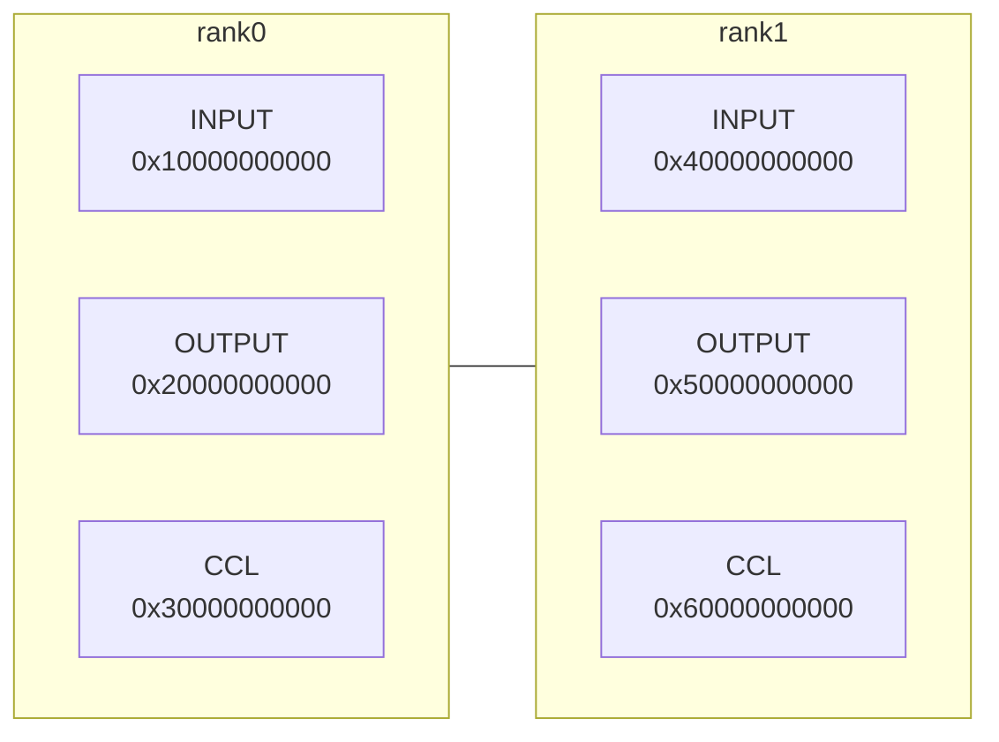

# Algorithm Analyzer Guide

## 1. Tool Overview

The HCCL algorithm analyzer is used to simulate the execution of HCCL algorithms in an offline environment, verifying algorithm logic and memory operation functions. It efficiently and quickly executes test tasks to meet developer requirements. The following figure shows the execution flow:


## 2. Prerequisites

The software dependencies required for compiling the ST project are the same as those for hccl. For details, see [hccl Source Code Build - Prerequisites](../../../docs/en/build/build.md).

Install the latest version of the CANN Toolkit development kit package from the [download link](https://ascend.devcloud.huaweicloud.com/artifactory/cann-run-mirror/software/master/).

```bash
./Ascend-cann-toolkit_9.1.0_linux-x86_64.run --install --install-path=/home/Ascend
```

## 3. Quick Start

### 3.1 Compile and Install the Operator Package

```bash
# Run in the repository root directory
# 1. Set environment variables
source /home/Ascend/cann/set_env.sh
# 2. Compile the cann-hccl sub-package
bash build.sh
# 3. Install the cann-hccl sub-package (the installation path must match the CANN Toolkit package path)
./build_out/cann-hccl_9.1.0_linux-x86_64.run --full --install-path=/home/Ascend
```

### 3.2 Compile and Run ST Test Cases

```bash
# Run in the repository root directory
# 1. Compile and execute ST test cases
bash build.sh --st
```

### 3.3 View Test Results

After the ST test case program based on the Google Test framework finishes execution, you can see results similar to the following in the terminal or the redirected log file:

```bash
[----------] Global test environment tear-down
[==========] xxx tests from xx test suites ran. (xxxx ms total)
[  PASSED  ] xxx tests.
```

### 3.4 Retesting After Code Modifications

- If you modify code outside the test directory, rerun the steps in **3.1** and **3.2** after making changes.
- If you modify code in `test/st/algorithm`, only the steps in **3.2** are required.

## 4. Advanced Guide

### 4.1 Filtering Test Case Execution

Using the Google Test framework, you can filter the test cases to execute in the ST project entry `main` function (`hccl/test/st/algorithm/testcase/main.cc`). By default, all test cases are executed.

```cpp
GTEST_API_ int main(int argc, char **argv)
{
    std::cout << "Start to run demo for hccl_checker_ops_stest." << std::endl;
    // Case 1: Execute only the st_all_reduce_1shot_boundary_dataCount case in the ST_ALL_REDUCE_TEST test suite
    // testing::GTEST_FLAG(filter) = "ST_ALL_REDUCE_TEST.st_all_reduce_1shot_boundary_dataCount";

    // Case 2: Execute all cases in the ST_ALL_REDUCE_TEST test suite
    // testing::GTEST_FLAG(filter) = "ST_ALL_REDUCE_TEST.*";
    testing::InitGoogleTest(&argc, argv);
    return RUN_ALL_TESTS();
}
```

### 4.2 TopoMeta Structure

TopoMeta uses a three-layer vector to describe the cluster specification under test, including the number of super nodes, the number of servers in each super node, and the number of NPU devices in each server. The initialization methods are as follows:

- Method 1:

```cpp
// Single server with two cards
TopoMeta topoMeta{{{0, 1}}};
// Two servers, each with two cards
TopoMeta topoMeta{{{0, 1}, {0, 1}}};
```

- Method 2:

```cpp
TopoMeta topoMeta;
// Single server with two cards
GenTopoMeta(topoMeta, 1, 1, 2);
// Two servers, each with two cards
GenTopoMeta(topoMeta, 1, 2, 2);
```

### 4.3 GDB Debugging Configuration

To debug the executable program `hccl_checker_ops_stest` generated by the ST project, follow these steps:

```bash
# Run in the repository root directory
# 1. Set environment variables (no need to repeat if already set)
source /home/Ascend/cann/set_env.sh
# 2. Configure the LD_LIBRARY_PATH (replace your_hccl_path with the actual local path)
export LD_LIBRARY_PATH=/your_hccl_path/hccl/test/st/algorithm/build/utils/src/hccl_depends_stub:${ASCEND_HOME_PATH}/x86_64-linux/lib64
# 3. Start GDB debugging
gdb ./test/st/algorithm/build/testcase/hccl_checker_ops_stest
```

### 4.4 Log Level Control

The ST project implements stubs for HCCL logs. The log level is controlled by the `logLevel` variable in `hccl/test/st/algorithm/utils/src/hccl_proxy/log_stub.cc`. The default value of 0x03 only prints ERROR-level logs.

### 4.5 Memory Model

The memory for each rank is virtually allocated (direct memory address operations are not supported). Memory is allocated by rank traversal. The following diagram shows the memory allocation for different ranks. When locating address errors, you can check the log to verify whether the address being operated on meets expectations.



## 5. Troubleshooting

### 5.1 Semantics Check Failure Troubleshooting

#### 5.1.1 Basic Concepts of Semantics Check

In the algorithm analyzer, memory is represented using relative addresses, consisting of three fields: memory type, offset address, and size. The `DataSlice` structure is used:

```cpp
class DataSlice {
private:
    BufferType type;
    u64        offset;
    u64        size;
}
```

Memory supports Input, Output, and CCL types.

During the execution of a collective communication algorithm, complex data movement and reduction operations are involved. The algorithm analyzer uses **BufferSemantic** to record **data movement relationships**, including a destination memory expression and multiple source memory expressions. The destination memory is represented by the member variables `startAddr` and `Size`. The source memory is represented by the `SrcBufDes` structure, which is defined as follows:

```cpp
struct BufferSemantic {
    u64                         startAddr;
    mutable u64                 size;       // Size, shared between source and destination memory
    mutable bool                isReduce;   // Whether a reduce operation is performed. When srcBufs contains multiple entries, it must be a reduce scenario.
    mutable HcclReduce0p        reduceType; // Type of reduce operation
    mutable std::set<SrcBufDes> srcBufs;    // Which rank or ranks this data comes from
};

struct SrcBufDes {
    RankId      rankId;   // Rank ID of the data source
    BufferType  bufType;   // Memory type of the data source
    mutable u64 srcAddr;  // Offset address relative to the data source memory type
};
```

#### 5.1.2 Semantics Calculation Example

The following example illustrates what semantics calculation is.

1. Initial state: There are two ranks, Rank0 and Rank1, with Input and Output memory types.

   

2. Action state 1: Move a data block from rank0 Input with offset 20 and size 30 to rank0 Output with offset 35. Result: A semantic block is generated on rank0 Output, recording the movement information.

   

3. Action state 2: Move a data block from rank1 Input with offset 70 and size 15 to rank0 Output with offset 50. Result: The destination memory overlaps with the existing semantic block. The existing semantic block must be split, generating two semantic blocks.

   

#### 5.1.3 Semantics Result Validation

During the semantics analysis execution, many semantic blocks are generated (recording many data movement relationships). After execution, verify whether the semantic blocks in the Output memory meet expectations.

The following example uses AllGather with 2 ranks to illustrate normal and abnormal scenarios of semantic blocks in the Output memory of Rank0. Assume the input data size is 100 bytes.

- **Correct scenario:**


- **Incorrect scenario:**


#### 5.1.4 Troubleshooting Approach

The semantics check phase can detect two types of errors:

- Missing data.
- Incorrect data source.

For reduction scenarios, similar issues may occur, such as missing ranks participating in the reduction or different offset addresses of data involved in the reduction. Typically, when a semantics error occurs, certain hint information is provided. Use this hint information along with the Task sequence printed by the algorithm analyzer for detailed analysis.
